## 操作系统及计算机组成原理 (三) - 内存管理 
### 内存（RAM）地址

内存地址分为：`物理地址`、`虚拟地址`。

#### 物理地址

物理地址（Physical Address）是计算机系统中用于访问物理内存（RAM）或内存映射 I/O（MMIO）设备的唯一标识符。

物理地址通常是一个`二进制值`，由多个字段组成。这些字段用于定位内存条中的具体存储单元或硬件设备的寄存器。以下是物理地址的主要构成部分：

* **行地址**（Row Address）：用于选择内存条中的特定行。`内存条`内部是一个`二维矩阵结构`，行地址用于选择矩阵中的一行。
* **列地址**（Column Address）：用于选择内存条中的特定列。列地址与行地址结合，可以定位到内存条中的一个特定存储单元。
* **Bank 地址**（Bank Address）：用于选择内存条中的特定 Bank。内存条内部通常分为多个 Bank，每个 Bank 是一个独立的内存区域。
* **芯片选择**（Chip Select）：用于选择特定的内存芯片。如果系统中有`多个内存条`，芯片选择信号用于确定访问哪个内存条。
* **通道选择**（Channel Select）在多通道内存架构中，用于选择特定的内存通道。例如，`双通道内存`系统有两个独立的通道，通道选择信号用于确定访问哪个通道。

**物理地址示例**

假设我们有一个 32 位的物理地址：`0x3A7B2C1D`（二进制表示为 `00111010 01111011 00101100 00011101`），并且内存系统的层次结构如下：

* 双通道内存（2 个通道）
* 每个通道有 2 个内存条（DIMM）
* 每个内存条有 8 个 Bank
* 每个 Bank 有 4096 行
* 每行有 1024 列

我们可以将其分解为各个字段：

| 位范围       | 二进制值         | 字段名称         | 描述                     |
|--------------|------------------|------------------|--------------------------|
| 31:30        | `00`             | 通道选择         | 通道 0。                 |
| 29:28        | `11`             | 芯片选择         | 内存条 3（假设 2 位可以表示 4 个内存条）。 |
| 27:25        | `101`            | Bank 地址        | Bank 5。                 |
| 24:12        | `1100111101100`  | 行地址           | 行 3324。                |
| 11:0         | `00011101`       | 列地址           | 列 29。                  |

#### 虚拟地址

虚拟地址 (Virtual Memory) 由操作系统管理，实际的物理地址需要通过`处理器` (CPU) 中的`内存管理单元` (MMU, Memory Management Unit) 使用`页表` (Page Table) 将`虚拟地址`转换为`物理地址`。



虚拟地址是虚拟内存是一种抽象机制，它使得`每个进程`都认为自己拥有`独立的`(隔离性)、`连续的`**完整虚拟地址空间**，但这种“独占全部内存”的假象是虚拟化的结果，实际上物理内存是被多个进程共享的，并且可能被`分页` (Swap) 到磁盘上。



**为什么使用虚拟地址？**

虚拟地址的引入是为了解决直接使用物理地址时的诸多问题，包括`内存隔离`、`简化内存管理`、`支持更大的地址空间`、实现`内存共享`等。虚拟内存机制是现代操作系统的核心特性之一，极大地提高了计算机系统的安全性、灵活性和性能。

**虚拟地址 vs 物理地址**

| **特性**               | **虚拟地址**                                      | **物理地址**                                      |
|------------------------|--------------------------------------------------|--------------------------------------------------|
| **地址空间**            | 每个进程有独立的虚拟地址空间，可以大于物理内存。   | 直接对应物理内存，受限于实际内存大小。           |
| **内存隔离**            | 进程之间彼此隔离，无法直接访问其他进程的内存。     | 进程可以直接访问物理内存，可能导致数据混乱。     |
| **内存管理**            | 由操作系统自动管理，简化程序开发。                 | 需要程序员手动管理，容易出错。                   |
| **内存共享**            | 支持多个进程`共享`同一块物理内存(如`共享库`)。                   | 难以实现高效的内存共享。                         |
| **程序加载**            | 程序可以假设从固定虚拟地址开始运行，灵活性高。     | 程序需要知道加载的具体物理地址，灵活性差。       |
| **多任务处理**          | 支持`多个进程同时运行`，互不干扰。                   | 多个进程竞争同一块物理内存，难以实现多任务。     |
| **高级功能支持**        | 支持写时复制、内存映射文件等高级功能。             | 无法支持这些高级功能。

#### 页表 (Page Table)

操作系统和内存管理单元（MMU）用来管理虚拟内存与物理内存之间映射关系的`数据结构`。MMU 通过`页表`来查找实际的物理地址。

##### 分页机制的作用

* 操作系统将内存划分为固定大小的页(通常为 `4KB`).`小页更适合分配小块内存`，浪费较少。。
* 虚拟地址空间和物理地址空间都按页对齐。
* 页表记录了虚拟页到物理页的映射关系。
* 这种机制使得`物理内存`可以`非连续分配`，而应用程序看到的`虚拟地址空间`仍然是`连续的`。

##### 页表的结构

* 页表通常是一个多级索引结构（如四级页表），每一级索引对应虚拟地址的一部分。
* `页表项`（Page Table Entry, `PTE`）包含以下信息：
  * **物理页帧号（PFN）**：虚拟页对应的物理内存页的起始地址。
  * **有效位（Valid Bit）**：指示该页表项是否有效。
  * **访问权限**：如读、写、执行权限。
  * **其他标志位**：如是否在内存中（Present Bit）、是否可缓存等。

##### 操作系统如何建立页表？

（1）**初始化阶段**

* 在系统启动时，操作系统会初始化页表。
* 操作系统需要知道物理内存的布局（如哪些内存可用，哪些内存被硬件保留）。
* 物理内存的布局通常由 BIOS 或 UEFI 提供，操作系统通过读取 ACPI（Advanced Configuration and Power Interface）表获取这些信息。

（2）**页表的创建**

* 当创建一个`新进程`时，操作系统会为该进程分配页表。

* 操作系统将进程的代码、数据、堆栈等映射到虚拟地址空间，并在页表中记录虚拟页到物理页的映射关系。
* 如果物理内存不足，操作系统会将部分数据交换到磁盘（如交换空间），并在页表中标记为不在内存中。

（3）**缺页异常处理**

* 当进程访问一个未映射的虚拟地址时，会触发缺页异常（Page Fault）。

* 操作系统会处理缺页异常，将所需的数据从磁盘加载到内存，并更新页表。

##### 页表的建立流程示例

假设操作系统为一个新进程分配内存：

1. **分配虚拟地址空间**：操作系统为进程`分配虚拟地址空间`，如`代码段`、`数据段`、`堆栈`等。
2. **分配物理内存**：操作系统从物理内存映射表中查找可用的物理页。
3. **建立页表映射**：操作系统在页表中记录虚拟页到物理页的映射关系。
4. **设置访问权限**：操作系统设置页表项的访问权限（如`代码段只读`，`数据段可读写`）。
5. **缺页异常处理**：如果进程访问一个未映射的虚拟地址，操作系统会处理缺页异常，加载数据并更新页表。

##### 操作系统的页表

* **创建时机**：**操作系统启动时**。
* **作用**：操作系统内核需要页表来管理物理内存和虚拟内存。在操作系统启动时，内核会初始化自己的页表，用于映射内核代码、数据结构和硬件资源。
* **特点**：
  * 操作系统的页表是全局的，用于管理整个系统的内存。
  * 内核页表通常映射了所有的物理内存，以便内核可以`访问任何物理地址`。
  * 内核页表在系统启动时创建，并在整个系统运行期间存在。
  * 内核页表的`基址`存储在特定的`寄存器`中（如 x86 架构的 CR3 寄存器）。

##### 用户程序的页表

* **创建时机**：**程序启动时**。
* **作用**：每个用户程序都有自己的虚拟地址空间，操作系统会为每个程序创建独立的页表，用于映射程序的代码、数据、堆和栈等。
* **特点**：
  * 用户程序的页表是进程私有的，每个进程都有自己的页表。
  * 用户程序的页表在进程创建时（即程序启动时）初始化。
  * 用户程序的页表在进程退出时销毁。
  * 进程的页表基址会存储在进程的上下文（如 task_struct）中，并在进程调度时加载到 CR3 寄存器。

#### 多级页表

在早期的操作系统中，使用`单页表`管理虚拟内存。

例如，`32 位系统`中(最大内存 4GB)，4KB 的大小的分页，页表需要 $2^{20}$ 个条目（每个条目 4 字节），占用 `4MB` 内存。对于每个进程来说，这种开销是不可接受的。



为了解决这个问题，现代操作系统采用了**多级页表**。



将页表划分为多个层级，这种设计的好处是：

* **节省内存**：只有实际使用的页表才会分配内存。
* **快速查找**：通过分层索引，减少每次地址转换的内存访问次数。

##### 计算物理地址

在 32 位系统中，虚拟地址通常是 **4GB（$2^{32}$）** 的地址空间，并且常见的 **分页大小为 4KB（$2^{12}$）**。  
如果采用 **二级分页**，则虚拟地址通常拆分为：  

| 级别 | 名称 | 位数 | 作用 |
|------|--------------|------|--------------------------|
| **目录索引** | 页目录索引（Page Directory Index, PDI） | 10 位 | 查找页目录（PD） |
| **页表索引** | 页表索引（Page Table Index, PTI） | 10 位 | 查找页表（PT） |
| **页内偏移** | Page Offset | 12 位 | 在物理页框内的偏移 |  

> 10 位的 **PDI** + 10 位的 **PTI** + 12 位的 **页内偏移** = **32 位虚拟地址**。

---

假设：

* 虚拟地址（VA） = `0x12345678`
* CR3 寄存器存放页目录（PD）的**物理地址** = `0x0002F000`
* 页表项存储 4KB 页大小的物理页框
* 查找到的最终物理页框地址 = `0x001AB000`

**步骤 1：拆分虚拟地址**

虚拟地址 `0x12345678`（32 位）拆分如下：

* PDI（10 位） = `0x048`（从 `0x12345678` 取出高 10 位）
* PTI（10 位） = `0xD1`（中间 10 位）
* 页内偏移（12 位） = `0x678`（低 12 位）

**步骤 2：查找页表**

1. 查找页目录 (PD)，获取**页目录项 (PDE) 地址**。
   * 页目录基地址（从 CR3 取出）= `0x0002F000`
   * 目录索引 `0x048` 对应的 **页目录项（PDE）** 地址：**页目录基址 + (页目录索引 × 4)**
     $$ 0x0002F000 + (0x048 \times 4) = 0x0002F000 + 0x120 = 0x0002F120 $$
     > 每条 PDE 使用 4 个字节存储。
   * 读取 `0x0002F120` 处的 PDE，假设它存放的 **页表基地址** = `0x00356000`

2. 查找页表（PT），获取**物理页框号 (PFN)**。
   * 页表基地址 = `0x00356000`
   * 页表索引 `0xD1` 对应的 **页表项 (PTE)** 地址：
     $0x00356000 + (0xD1 \times 4) = 0x00356000 + 0x0344 = 0x00356344$
   * 读取 `0x00356344` 处的 PTE，假设它存放的 **物理页框号 (PFN)** = `0x001AB`

**步骤 3：计算最终物理地址**

最终物理地址的计算公式：$\text{物理地址} = \text{PFN} \times \text{页大小} + \text{页内偏移}$
$$物理地址 = (0x001AB \times 0x1000) + 0x678 = 0x001AB000 + 0x678 = 0x001AB678$$

> 0x1000（十六进制）= 4096（十进制）= $2^{12}$，它表示 4KB 的页大小。

这样，CPU 通过 **两次查表** 成功将虚拟地址转换为物理地址，并得到物理页帧号！

### 虚拟内存地址布局

计算机程序在运行时，虚拟内存布局一般分为几个主要的区域，每个区域有特定的用途和特点。

以下是`典型`的内存布局：

#### 1. 代码段（Text Segment）

* **存储内容**：存放程序的`可执行代码`，即`机器指令`。
* **特性**：通常是`只读`的，以防止程序意外修改自身的指令。某些系统中，这一段也包括`只读常量`。
* **示例**：函数的机器代码。

#### 2. 数据段（Data Segment）

数据段又细分为两个部分：`已初始化`数据段和`未初始化`数据段（`BSS 段`）。

已初始化数据段 (Initialized Data Segment)：

* **存储内容**：存放已初始化的`全局变量`和`静态变量`。
* **特性**：程序启动时由操作系统负责加载到内存中。
* **示例**：`int globalVar = 10;`

未初始化数据段 (BSS Segment)：

* **存储内容**：存放未初始化的`全局变量`和`静态变量`，默认初始化为 0。
* **特性**：在程序加载时自动初始化为 0。
* **示例**：`int uninitializedVar;`

#### 3. 堆（Heap）

* **存储内容**：动态分配的内存，由程序在运行时`显式分配`和`释放`(如 `malloc`、`free`)。
* **特性**：内存大小和生命周期由程序员管理。
* **示例**：`int *p = (int *) malloc(sizeof(int));`

#### 4. 栈（Stack）

* **存储内容**：函数调用过程中分配的内存，包括局部变量、函数参数、返回地址等。
* **特性**：`后进先出 (LIFO)`，由编译器自动管理，`函数调用时分配`，函数`返回时释放`。
* **示例**：`局部变量`和`函数参数`。

#### 5. 内存映射段（Memory Mapped Segment）

* **存储内容**：用于存储内存映射文件 (如`动态链接库`、`共享内存`等)。
* **特性**：使用`mmap`系统调用映射到内存，提供文件I/O的高效访问。
* **示例**：动态库、内存映射文件。

#### 虚拟内存布局图示

下图展示了典型的内存布局：

``` diff
高地址 0xFFFFFFFF (32-bit) / 0xFFFFFFFFFFFFFFFF (64-bit)
+-----------------------+ 
|       栈 (Stack)      |  向下增长  (函数的局部变量、函数调用帧)
+-----------------------+
|  未初始化数据 (BSS)     |  
+-----------------------+
|  初始化数据 (Data)      |  
+-----------------------+
|       代码 (Text)      |          (程序的机器指令)
+-----------------------+
|  内存映射区 (Mmap)      |  
+-----------------------+
|         堆 (Heap)     |  向上增长  (动态分配的内存) （全局变量）
+-----------------------+
|      操作系统保留       |  
+-----------------------+
低地址 0x00000000
```

#### 详细解释

1. **栈（Stack）**：栈在内存的`高地址区域`，由操作系统`分配固定大小`。每次函数调用都会在栈上分配一个`栈帧`，包含函数的`局部变量`和`调用信息`。栈的大小有限，过深的递归或过大的局部变量会导致`栈溢出` (stack overflow)。
2. **堆（Heap）**：堆在内存的低地址区域，由程序在运行时通过系统调用 (如 `malloc`) 请求分配。堆的大小仅受系统内存限制。堆内存需要程序员手动管理，使用完后需要释放(如 `free`)。
3. **代码段（Text Segment）**：存储程序的`机器指令`和`常量数据`，通常为**只读**区域。
4. **数据段（Data Segment）**：
   * **已初始化数据段**：存储已初始化的全局和静态变量。
   * **未初始化数据段（BSS）**：存储未初始化的全局和静态变量。
5. **内存映射段（Memory Mapped Segment）**：用于映射文件和共享内存的区域，提供与文件 I/O 相关的高效操作。

#### 具体应用示例

以下是一个具体的C程序及其内存布局分析：

```c
#include <stdio.h>
#include <stdlib.h>

int globalVar = 10;          // 已初始化的全局变量

int main() {
    static int staticVar = 20; // 已初始化的静态变量
    int localVar = 30;         // 局部变量
    int *dynamicVar = (int *)malloc(sizeof(int) * 100); // 动态分配的变量

    if (dynamicVar == NULL) {
        printf("Memory allocation failed\n");
        return 1;
    }

    // 使用动态分配的内存
    dynamicVar[0] = 40;
    printf("Dynamic Var: %d\n", dynamicVar[0]);

    free(dynamicVar); // 释放动态分配的内存

    return 0;
}
```

在这个示例中：

* `globalVar` 存储在已初始化数据段。
* `staticVar` 存储在已初始化数据段。
* `localVar` 存储在栈上。
* `dynamicVar` 指向的内存块分配在堆上。

通过理解内存布局，开发者可以更好地管理内存，提高程序的性能和稳定性，避免内存泄漏、栈溢出等问题。

参考资料：

\> [https://www.bilibili.com/video/BV1Htr8YhELV/?vd_source=af39da37b48042b538f2e6f4b7b2e7c8](https://www.bilibili.com/video/BV1Htr8YhELV/?vd_source=af39da37b48042b538f2e6f4b7b2e7c8)

\> [https://www.bilibili.com/video/BV1Fb4y1y7wr?spm_id_from=333.788.videopod.sections&vd_source=af39da37b48042b538f2e6f4b7b2e7c8](https://www.bilibili.com/video/BV1Fb4y1y7wr?spm_id_from=333.788.videopod.sections&vd_source=af39da37b48042b538f2e6f4b7b2e7c8)

\> [https://www.douyin.com/user/self?from_tab_name=main&modal_id=7260068960337415482&showSubTab=video&showTab=record](https://www.douyin.com/user/self?from_tab_name=main&modal_id=7260068960337415482&showSubTab=video&showTab=record)
