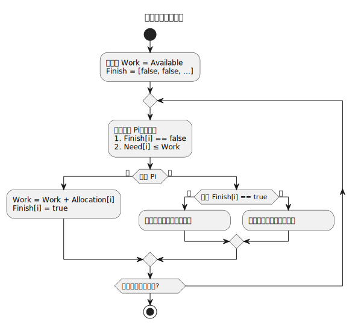

## 操作系统及计算机组成原理 (三) - 死锁 
### 资源

计算机资源按是否可抢占可分为以下几类：

**1. 可抢占资源（Preemptible Resources）**

- **定义**：资源在使用过程中可`被操作系统强制中断`并重新分配。
- **典型示例**：
  - **CPU 时间**：现代操作系统普遍采用**抢占式调度**，高优先级任务可中断当前任务。
  - **内存（间接抢占）**：通过虚拟内存机制（如页面置换），内存页可被换出以腾出空间。
  - **网络带宽**：通过 QoS 策略动态调整优先级，高优先级流量可抢占低优先级流量。
- **特点**：
  - 提高系统响应速度，适合交互式场景。
  - 可能导致上下文切换开销，需权衡效率。

**2. 不可抢占资源（Non-preemptible Resources）**

- **定义**：资源一旦分配，必须等待`持有者主动释放`，无法被强制中断。
- **典型示例**：
  - **I/O 设备（如打印机）**：打印任务一旦开始，无法中途停止供其他任务使用。
  - **文件锁（独占模式）**：某进程写入文件时，其他进程需等待锁释放。
  - **硬实时任务**：某些实时系统中，任务必须连续执行至完成（如火箭控制系统）。
- **特点**：
  - 避免资源状态不一致（如打印到一半被中断）。
  - 可能引发**优先级反转**或**死锁**，需谨慎设计。

**3. 半抢占资源（Semi-preemptible Resources）**

- **定义**：资源在特定条件下可部分抢占，需结合上下文状态管理。
- **示例**：
  - **GPU 计算**：支持任务切换，但需保存/恢复显存和计算状态。
  - **数据库事务**：事务提交前可回滚（软抢占），但提交后不可逆。
- **应用场景**：
  - 高性能计算（HPC）中的任务迁移。
  - 云计算中虚拟机（VM）的实时迁移。

#### 资源实例

资源实例（Resource Instance）是计算机系统中对某一类资源的`具体可用单位`，代表该资源的独立个体或实体。每个资源实例可被单独分配、占用或释放，是资源管理的`基本单元`。

**1. 资源类型 vs 资源实例**

- **资源类型**：资源的种类或类别（如打印机、内存块、数据库连接）。  
- **资源实例**：某一资源类型的具体可用单位（如 3 台打印机中的每一台）。  

**示例**：

- 资源类型：打印机（Printer）  
- 资源实例：Printer-1、Printer-2、Printer-3  

**2. 资源实例的特性**

- **独立性**：每个实例可被单独分配或释放。  
- **互斥性**：某些资源实例需独占使用（如打印机）。  
- **可计数性**：实例数量决定资源的并发能力（如系统最多支持 3 个进程同时打印）。  

#### 实际应用场景

**1. 操作系统中的资源实例**

- **物理资源**：  
  - `CPU 核心`（如 4 核 CPU → 4 个 CPU 实例）。  
  - `内存页框`（每个页框为一个实例）。  
  - `磁盘块`（如硬盘分区的扇区）。  
- **逻辑资源**：  
  - `文件句柄`（每个打开的文件占用一个实例）。  
  - `网络端口`（如 TCP 端口号 80、443 等）。  

**示例**：

系统有 `3 个 USB 端口`，每个端口是一个资源实例。当进程请求 USB 设备时，需分配一个空闲实例。

**2. 数据库中的资源实例**

- **数据库连接池**：每个连接是一个实例，限制并发访问数。  
- **锁资源**：行锁、表锁等，每个锁占用一个实例。  

**示例**：

若数据库连接池配置为 10 个实例，则最多允许 10 个线程同时操作数据库。

### 概念

**死锁** (Deadlock) 是指两个或多个进程（或线程）在等待彼此释放资源，导致所有进程永久阻塞的状态。  
**核心问题**：资源竞争 + 循环依赖。

### 4 个必要条件

必须`同时满足`以下条件才会发生死锁：

1. **互斥（Mutual Exclusion）**  
   - 资源一次只能被一个进程独占使用（如打印机、文件锁）。
   - 无法破坏的场景：某些资源天然需要互斥（如硬件设备）。

2. **持有并等待（Hold and Wait）**  
   - 进程已持有至少一个资源，`同时`请求其他被其他进程占用的资源。

3. **不可抢占（No Preemption）**  
   - 资源不能被强制从持有它的进程中剥夺，只能由进程主动释放。

4. **循环等待（Circular Wait）**  
   - 存在一组进程，每个进程都在等待下一个进程所占有的资源，形成环路。

### 处理策略

#### 死锁预防（Prevention）

**核心**：破坏死锁的 **至少一个必要条件**。

- **破坏互斥**  
  - 适用场景：`资源可共享`（如`只读文件`）。  
  - 局限性：无法用于必须互斥的资源（如打印机）。

- **破坏持有并等待**
  - **方法**：进程在运行前必须`一次性申请`所有所需资源。  
  - 缺点：资源利用率低，可能引发饥饿。

- **破坏不可抢占**  
  - **方法**：若进程申请资源失败，需`释放已占有的资源`，稍后重试。  
  - 缺点：实现复杂，适用于易保存/恢复的资源（如 CPU 寄存器）。

- **破坏循环等待**  
  - **方法**：对资源类型`全局排序`，`进程必须按顺序`申请资源。  
  - 示例：若资源顺序为 `R1 < R2 < R3`，进程必须先申请 `R1` 才能申请 `R2`。

#### 死锁避免（Avoidance）

**核心**：动态检查资源分配是否会导致系统进入不安全状态。

- **安全状态**：存在一个进程执行序列，使得所有进程都能顺利完成。
- **银行家算法（Banker's Algorithm）**  
  - 检查每次资源请求后系统是否仍处于安全状态。  
  - 数据结构：  
    - **Max**：进程最大需求资源数。  
    - **Allocation**：已分配给进程的资源数。  
    - **Available**：当前可用资源数。  
    - **Need** = Max – Allocation（进程还需的资源）。  
  - **安全性检查步骤**：  
    1. 查找是否存在一个进程，其 `Need ≤ Available`。  
    2. 假设分配资源并模拟运行完成，释放资源。  
    3. 重复直到所有进程完成（安全）或无法继续（不安全）。

#### 死锁检测与恢复

**适用场景**：允许死锁发生，但定期检测并恢复。

- **资源分配图（Resource Allocation Graph）**  
  - 节点：进程（圆形）和资源（方形）。
  - 边：请求边（进程 → 资源）和分配边（资源 → 进程）。  
  - **死锁判定**：图中存在环且资源实例不可共享。
    

- **恢复方法**  
  - **进程终止**  
    - 终止所有死锁进程（简单粗暴，代价高）。  
    - 逐个终止进程直到死锁解除（需计算代价最小化）。  
  - **资源抢占**  
    - 强制回收资源分配给其他进程，需处理：  
      - 选择牺牲进程。  
      - 避免饥饿（限制同一进程被抢占的次数）。

#### 死锁忽略（Ostrich Algorithm）

- **策略**：假设死锁不会发生或影响可接受。  
- **适用场景**：死锁极少出现，或解决成本过高（如某些嵌入式系统）。

### 实际应用中的策略

- **组合方法**：混合使用`预防`、`避免`、`检测`。  
  - 示例：数据库系统常用`超时机制`（检测） + `事务回滚`（恢复）。  
- **不同系统的选择**：  
  - `嵌入式系统`：死锁预防（如`资源静态分配`）。  
  - `通用操作系统`：死锁避免（`银行家算法`）或忽略（如 Linux/Windows 通常不主动处理死锁）。  

### 比较

| **策略**       | **核心思想**                     | **优点**                  | **缺点**                     |
|----------------|--------------------------------|--------------------------|-----------------------------|
| 预防           | 破坏必要条件                   | 彻底避免死锁              | 资源利用率低，灵活性差        |
| 避免（银行家） | 动态检查安全状态               | 资源利用率较高            | 需预知资源需求，计算开销大     |
| 检测与恢复     | 允许死锁，事后处理             | 灵活，资源利用率高        | 恢复过程复杂，可能丢失数据     |
| 忽略           | 不做处理                       | 实现简单                 | 风险高，仅适用于特定场景       |

### 银行家算法

`银行家算法` (Banker's Algorithm) 的灵感来源于银行系统的贷款策略。银行家需要在满足客户贷款需求的同时，确保自身资金的安全，避免出现无法满足所有客户需求的情况。

在计算机系统中，资源就如同银行的资金，进程对资源的请求就像客户的贷款请求，银行家算法就是要以一种安全的方式分配资源，防止系统进入死锁状态。

#### 核心目的

- **死锁避免**：动态检查资源分配请求是否会引发系统进入不安全状态。
- **核心思想**：每次资源分配前，模拟分配后的系统状态是否仍能找到一个 **安全序列**，使得所有进程都能顺利完成。若存在安全序列，则分配资源；否则拒绝请求。

`安全序列` (Safe sequences) 是系统分配资源后，存在一个排队完成的顺序，只要按这个顺序执行所有进程，每个进程都能顺利拿到所需资源，不会卡死。

#### 关键数据结构

假设系统有 `n` 个进程和 `m` 种资源类型：

| 数据结构          | 描述                                                                 |
|-------------------|----------------------------------------------------------------------|
| **Available[m]**  | 当前系统`可用的各类资源数量`（如 `Available[0] = 3` 表示资源 R0 有 3 个可用） |
| **Max[n][m]**     | 每个进程对各类资源的**最大需求**（如 `Max[1][2] = 5` 表示进程 P1 最多需要 5 个 R2） |
| **Allocation[n][m]** | 每个进程当前`已分配`的各类`资源数量`（已占用的资源数）                     |
| **Need[n][m]**    | 每个进程**还需**的各类资源数量（`Need[i][j] = Max[i][j] – Allocation[i][j]`） |

#### 算法操作步骤

##### 1. 安全性检查（判断系统是否安全）

**目标**：找到一个安全序列 `<P1, P2, ..., Pn>`，使得按该顺序执行所有进程时，每个进程的 `Need` 均可被当前 `Available` 满足。

**步骤**：

1. 初始化 `Work = Available`（临时记录可用资源），`Finish[n] = false`（标记进程是否完成）。
2. 遍历所有进程，找到满足以下条件的进程 `Pi`：
   - `Finish[i] == false`
   - `Need[i] ≤ Work`（即进程 `Pi` 所需的每类资源均小于等于当前可用资源）
3. 若找到这样的进程 `Pi`：
   - 假设 `Pi` 执行完成并释放资源：  
     `Work = Work + Allocation[i]`  
     `Finish[i] = true`
   - 重复步骤 2，直到所有进程标记为完成（存在安全序列）。
4. 若遍历后仍有未完成的进程，则系统处于 **不安全状态**。

##### 2. 处理资源请求

当进程 `Pi` 请求资源时（用 `Request[i]` 表示其请求向量）：

1. **检查合法性**：  
   - 若 `Request[i] > Need[i]` → 拒绝请求（进程请求超出其声明的最大需求）。
   - 若 `Request[i] > Available` → 拒绝请求（系统资源不足）。

2. **模拟分配**：  
   - 假设分配资源：  
     `Available = Available – Request[i]`  
     `Allocation[i] = Allocation[i] + Request[i]`  
     `Need[i] = Need[i] – Request[i]`  

3. **执行安全性检查**：  
   - 若安全性检查通过 → 实际分配资源。  
   - 若未通过 → 回滚模拟分配（恢复原状态），拒绝请求。

#### 示例分析

假设系统有 **3 个进程（P0, P1, P2）** 和 **3 种资源（R0, R1, R2）**，初始状态如下：

| 进程 | Allocation (已分配)   R1 R2 R3 | Max (最大需求)   R1 R2 R3 | Need (还需)   R1 R2 R3| Available (可用资源) |
|------|:---------------------:|:----------------:|:-------------:|-----------------------|
| P0   | 0 1 0               | 7 5 3          | 7 4 3       | **3 3 2**            |
| P1   | 3 0 2               | 3 2 2          | 0 2 0       |                      |
| P2   | 3 0 2               | 9 0 2          | 6 0 0       |                      |

**步骤 1：计算 Need 矩阵**

- `Need = Max – Allocation`  
  - P0: `7-0,5-1,3-0 = 7 4 3`  
  - P1: `3-3,2-0,2-2 = 0 2 0`  
  - P2: `9-3,0-0,2-2 = 6 0 0`

**步骤 2：安全性检查**

1. 初始 `Work = Available = (3,3,2)`，`Finish = [false, false, false]`  
2. 查找满足 `Need ≤ Work` 的进程：  
   - P1 的 `Need[1] = (0,2,0) ≤ (3,3,2)` → 选中 P1  
3. P1 完成后释放资源：  
   `Work = (3,3,2) + (3,0,2) = (6,3,4)`  
   `Finish[1] = true`  
4. 下一轮查找：  
   - P0 的 `Need[0] = (7,4,3) > (6,3,4)` → 不满足  
   - P2 的 `Need[2] = (6,0,0) ≤ (6,3,4)` → 选中 P2  
5. P2 完成后释放资源：  
   `Work = (6,3,4) + (3,0,2) = (9,3,6)`  
   `Finish[2] = true`  
6. 最后一轮查找：  
   - P0 的 `Need[0] = (7,4,3) ≤ (9,3,6)` → 选中 P0  
7. P0 完成后释放资源：  
   `Work = (9,3,6) + (0,1,0) = (9,4,6)`  
   `Finish[0] = true`  

**安全序列**：`<P1, P2, P0>`，系统处于安全状态。

#### 优缺点

| **优点**                     | **缺点**                              |
|------------------------------|---------------------------------------|
| 避免死锁，资源利用率较高      | 需预先知道进程的 **最大资源需求**       |
| 动态检查，灵活性较强          | 频繁的安全性检查可能导致 **性能开销**    |
| 适用于资源类型固定的系统      | 不适用于资源数量动态变化的场景         |

#### 实际应用

- **适用场景**：  
  - `数据库事务管理`、`嵌入式系统`等对资源需求可预测的场景。  
- **不适用场景**：  
  - 通用操作系统（如 Windows、Linux）通常`不直接使用`银行家算法，因进程需求难以预知且计算开销大。  
  - 替代方案：超时机制 + 死锁检测恢复（如数据库的事务回滚）。

#### 总结

银行家算法通过模拟资源分配后的系统状态，确保始终存在至少一个 **安全序列**，从而避免死锁。尽管有局限性，但它在特定场景下是解决资源竞争问题的有效工具。
