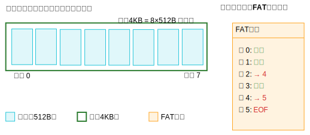

## 操作系统及计算机组成原理 (五) - 设备 
### 机械硬盘

<image src="processed_image.png" style="max-width:600px" />

目前，你可以使用图片编辑软件（如 Photoshop、GIMP 或在线工具如 Canva）手动添加标注。以下是推荐的标注内容：  

这张图展示了机械硬盘（HDD）的内部结构，并用标注标明了各个关键部件。以下是对各部分的详细解释：  

1. **Spindle（主轴）**：负责驱动磁盘（disk）高速旋转，使读写磁头（read/write head）能够访问不同的磁道。  
2. **Disk（磁盘盘片）**：机械硬盘的数据存储介质，通常由多张磁盘组成，每张磁盘涂有磁性材料，数据以二进制形式存储在磁道上。  
3. **Saved file（已保存的文件）**：这是示意性的标注，表示文件数据存储在磁盘的特定区域（以蓝色块表示）。在实际硬盘中，数据以磁性信息存储，看不到这种可视化的“文件块”。  
4. **Read/Write Head（读写磁头）**：负责读取和写入数据。它悬浮在磁盘表面上，利用磁场改变或读取存储在磁盘上的数据。  
5. **Arm（磁头臂）**：连接执行器（actuator）和读写磁头，使磁头能够在磁盘的不同轨道之间移动，以访问不同的数据区域。  
6. **Actuator（执行器）**：控制磁头臂的精确移动，使磁头能够对准特定的磁道，确保数据访问的准确性。  
7. **Circuit board（电路板）**：机械硬盘的控制电路，负责管理数据的读写、硬盘运作，以及与计算机主板进行通信。  
8. **Power port（电源接口）**：供电接口，通常是 SATA 或 Molex 连接器，向硬盘提供所需的工作电力。  
9. **Data cable port（数据线接口）**：机械硬盘与计算机主板通信的接口，常见的接口类型有 SATA、IDE（较旧的标准）或 SAS（企业级）。  
10. **Drive configuration port（驱动器配置接口）**：主要用于特定型号的硬盘设置或故障排查，某些硬盘可能会有额外的跳线或配置接口来调整模式（如主从设置）。  

#### 扇区和磁道

<image src="harddisk-tracks-sector.jpg" style="max-width:800px" />

硬盘的第一个扇区指的是 **0 号扇区**，也被称为`引导扇区`（Boot Sector）。

在硬盘的逻辑结构中，扇区是最小的可寻址单位，从 0 开始编号，所以第一个扇区就是 0 号扇区。它位于硬盘的最开始位置，是硬盘访问的起始点。

##### MBR
- **含义**：MBR 即主引导记录（Master Boot Record），是 IBM 公司早年间提出的，是对 IBM 兼容机的硬盘或者可移动磁盘分区时，在驱动器最前端的一段引导扇区。
- **结构组成**
    - **主引导程序**：占 446 字节，负责从活动分区中装载，并运行系统引导程序。
    - **分区表（DPT）**：占 64 字节，含4个分区项，每个分区表项长 16 字节，记录着硬盘中分区的数量以及每一分区的大小等信息。
    - **结束标志字**：占 2 字节，固定为 0xAA55 或 0x55AA，若标志错误系统无法启动。
- **特点**
    - **容量限制**：支持的最大磁盘容量为 2TB，因为它使用 32 位地址来表示分区大小和位置。
    - **分区数量**：最多支持四个主分区或三个主分区加一个扩展分区，在扩展分区内可创建多个逻辑分区。
    - **兼容性**：与许多旧的操作系统`和 BIOS 固件兼容`。
- **工作原理**：计算机启动时，BIOS 会读取 MBR 并执行其中的引导代码，加载操作系统。

##### GPT
- **含义**：GPT 即全局唯一标识磁盘分区表（GUID Partition Table），是一种使用`UEFI 启动`的先进磁盘组织方式。
- **结构组成**
    - **保护MBR**：GPT 磁盘的第一个扇区包含一个保护 MBR（PMBR），用于识别磁盘为GPT格式，并防止误操作。
    - **GPT分区表**：在磁盘的开头和结尾各存储一份分区表，确保冗余和可靠性，还包含校验和（CRC32）以保证数据完整性。
- **特点**
    - **容量限制**：支持的最大磁盘容量高达 18EB，使用64位地址来表示分区大小和位置。
    - **分区数量**：理论上支持无限数量的分区，常见实现通常限制为128个分区。
    - **兼容性**：与现代操作系统和 UEFI 固件兼容，但可能不支持一些旧的 BIOS 和操作系统。
    - **数据完整性**：包含冗余的分区表和校验和，能确保数据的完整性和可靠性。
- **工作原理**：依赖于 UEFI 的引导过程，可以直接从 GPT 分区启动操作系统。

##### 两者区别

- **容量支持**：MBR最大支持 2TB 磁盘；GPT 理论上支持高达 18EB 的磁盘。
- **分区数量**：MBR最多4个主分区或 3 个主分区加 1 个扩展分区；GPT 理论上无限制，常见实现限制为 128 个。
- **数据安全**：MBR 无冗余和校验机制，单点故障可能导致分区信息丢失；GPT 有冗余分区表和 CRC32 校验。
- **兼容性**：MBR 与旧的 BIOS 和操作系统（如 Windows XP 及之前版本）兼容；GPT 与现代操作系统和UEFI固件兼容。
- **引导方式**：MBR 依赖 BIOS 引导，使用引导加载程序从MBR启动操作系统；GPT 依赖 UEFI 引导，可直接从GPT分区启动操作系统。

#### 簇

**簇（Cluster）**是文件系统中管理存储空间的基本单位，由**多个连续的扇区**（Sector）组成。它是操作系统与物理磁盘之间的逻辑抽象层，目的是**提高存储效率并简化管理**。

多个扇区合并为一个簇时，扇区不一定需要物理上连续，但在很多情况下，文件系统会尽量分配连续的扇区，以提高数据访问效率。

* `传统机械硬盘`（HDD）：簇内扇区`通常是物理连续`以保障性能，簇是`逻辑连续单元`，物理分布由底层硬件和固件透明处理。
* `固态硬盘`（SSD）：物理连续性要求降低，但文件系统仍默认连续分配。
* 设计权衡：物理连续牺牲灵活性换取性能，非连续增加管理复杂度。

**1. 为什么需要簇？**

- **硬件基础**：
  磁盘的最小物理存储单元是**扇区**（通常为 512B 或 4KB）。直接以扇区为单位管理文件会导致两个问题：
  1. **元数据开销过大**：若每个小文件占用一个扇区，记录文件位置所需的元数据量会急剧增加。
  2. **寻址效率低**：频繁读写单个扇区会增加磁头移动次数，降低性能。
- **解决方案**：  
  文件系统将多个扇区合并为一个**簇**（逻辑块），以簇为单位分配存储空间，从而减少管理开销并提升吞吐量。

**2. 簇的核心特性**

- **大小可配置**：  
  簇的大小在格式化时确定，常见值为 **4KB、8KB、16KB** 等（不同文件系统支持的范围不同）。
- **分配粒度**：  
  文件占用的空间按簇的整数倍分配。例如：
  - 若簇大小为 4KB，一个 500B 的文件仍会占用**1个簇（4KB）**，导致**内部碎片**（浪费3.5KB）。
  - 大文件（如1GB）会被拆分为多个簇，可能分散在磁盘的不同位置（产生**外部碎片**）。
- **与文件系统的关系**：  
  - **FAT32**：簇大小影响最大分区容量（例如，32KB簇支持最大2TB分区）。  
  - **NTFS**：默认簇大小与分区容量相关（如2TB分区默认4KB簇）。  
  - **exFAT**：支持更大簇（如128 MB），适合超大文件存储。

**3. 簇的运作机制**

- **文件写入流程**：  
  1. 文件系统将文件拆分为与簇大小匹配的逻辑块。  
  2. 从空闲簇列表中分配足够的簇。  
  3. 更新元数据（如FAT表、inode）以记录簇的分配关系。  
- **文件读取流程**：  
  1. 根据元数据定位文件占用的簇链。  
  2. 按簇顺序读取数据（可能需要跨多个簇寻址）。

**4. 簇大小的影响**

| **场景**               | **小簇（如 4KB）**                | **大簇（如 64 KB）**               |
|------------------------|----------------------------------|----------------------------------|
| **存储小文件**         | 空间浪费较少，但元数据管理开销大 | 空间浪费严重（如 1KB 文件占用 64 KB） |
| **存储大文件**         | 外部碎片风险高，读写次数多       | 减少碎片，提升连续读写速度       |
| **兼容性**             | 广泛支持                         | 某些旧系统可能不支持大簇         |
| **适用场景**           | 文档、代码等小文件               | 视频、数据库等大文件             |

**簇的优化与挑战**

- **空间浪费**：  
  小文件导致内部碎片，可通过以下方式缓解：  
  - **尾部合并**：将多个小文件末尾的碎片空间合并使用（如ReFS）。  
  - **块子分配**：允许一个簇内存储多个文件片段（某些高级文件系统支持）。
- **碎片化**：  
  文件分散在不连续的簇中，降低读取效率。解决方案包括：  
  - **预分配连续簇**（如 NTFS 的连续文件标记）。  
  - **定期碎片整理**（Windows 的 `defrag` 工具）。
- **SSD优化**：  
  SSD 无需磁头寻道，但需考虑**磨损均衡**。现代文件系统（如F2FS）会优化簇分配策略以减少写入放大。

**实际应用示例**

- **格式化 U 盘时的选择**：  
  - 若存储大量小文件（如文档），选择**4KB 簇**以减少空间浪费。  
  - 若存储大型视频文件，选择 **64KB 簇**以提升读写速度。
- **数据库存储**：
  数据库文件（如 MySQL 的`.ibd`）通常配置为 大簇（如16KB），匹配数据库页大小以提高性能。

