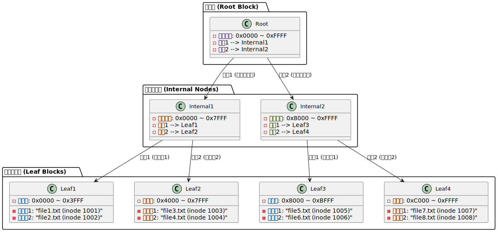

## 操作系统及计算机组成原理 (四) - 文件系统 
### 简介

管理存储设备上的文件和数据，提供存储、检索、更新及元数据管理。

- **核心功能**：
  - 文件组织（命名、目录结构）。
  - 数据持久化与访问控制（权限、加密）。
  - 元数据管理（创建时间、大小等）。
  - 空闲空间管理与数据保护（备份、恢复）。

### 目录项元数据

目录项**元数据** (Metadata) 是`关于数据的数据`，是对数据及数据之间关系的描述，它不包含文件的实际数据内容，而是用于描述文件和目录的属性、特征和状态等，以便文件系统进行管理和操作。

#### 包含的信息

- **文件基本信息**
  - **文件名**：用于标识文件的名称，是用户访问文件的主要标识之一。
  - **文件类型**：如普通文件、目录、链接文件、设备文件等，不同类型的文件在系统中有不同的处理方式。
  - **文件大小**：记录文件所占用的磁盘空间大小，通常以`字节为单位`。
  - **文件创建时间**：指文件在文件系统中被创建的具体时间。
  - **文件修改时间**：每当文件的内容被修改，系统会更新这个时间戳，反映文件最后一次被修改的时间。
  - **文件访问时间**：记录文件最后一次被访问（读取或写入）的时间。
- **文件权限信息**
  - **所有者权限**：定义了文件所有者对文件的读、写、执行权限。
  - **组权限**：针对文件所属的用户组，设置该组用户对文件的读、写、执行权限。
  - **其他用户权限**：规定了除文件所有者和所属组之外的其他用户对文件的访问权限。
- **文件存储信息**
  - **磁盘块分配情况**：记录文件数据在磁盘上具体`存储的位置`，即文件占用了哪些磁盘块。
  - **索引节点号**：在许多文件系统中，每个文件都有一个唯一的`索引节点（inode）编号`，通过 `inode` 可以找到文件的`元数据`和`数据存储位置`等信息。

#### 作用

- **文件管理与组织**：文件系统利用元数据来管理文件和目录的层次结构，快速定位和访问文件。当用户请求打开一个文件时，系统通过文件名在目录结构中查找对应的元数据，从而获取文件的存储位置等信息，进而读取文件内容。
- **权限控制与安全**：元数据中的权限信息决定了哪些用户可以对文件进行何种操作，从而保障系统的安全性和数据的完整性。
- **文件系统维护与优化**：文件系统可以根据元数据中的信息，如文件的访问频率、修改时间等，进行磁盘空间的分配优化、数据缓存策略的调整等，以提高文件系统的性能和效率。

#### 存储方式

- **inode 方式**：如 Unix 和类 Unix 系统采用 inode (index node) 来存储文件的元数据。每个文件都有一个对应的 inode，其中包含了文件的各种元数据信息，如文件权限、文件大小、创建时间等。目录则是一种特殊的文件，它的内容是文件名和 inode 编号的映射关系。
  - 实际应用：ext 系列文件系统、UFS 文件系统。
- **MFT 方式**：NTFS 文件系统使用`主文件表`（MFT）来存储元数据。MFT 中的每个记录对应一个文件或目录，记录了文件的各种属性和数据存储信息等。

### 文件系统结构

- **逻辑结构**：
  - **层次结构**：树形目录（根目录 → 子目录 → 文件）。
  - **路径类型**：绝对路径（`/home/user/file.txt`）和相对路径（`../doc`）。
  - **特殊目录**：`.`（当前目录）、`..`（上级目录）。

- **物理结构**：
  - **存储单元**：磁盘块/扇区（通常 512B-4KB）。
  - **分区与挂载**：文件系统挂载到目录树（如将分区挂载到`/mnt`）。

#### 文件的组成

- **文件属性**：
  - 文件名、扩展名、大小、权限（rwx）、时间戳（创建/修改/访问）。
  - 所有者、所属组、扩展属性（xattr）。
- **文件类型**：
  - 普通文件（文本、二进制）、目录、`符号链接`、`设备文件`（块设备/字符设备）、`管道`等。

#### 实现

- **存储管理**：
  - **空闲空间管理**：位图（bitmap）、链表、空闲列表。
  - **文件分配策略**：
    - **连续分配**：文件占用连续块（易产生碎片）。
    - **链式分配**：块间通过指针链接（适合动态增长）。
    - **索引分配**：索引块存储所有块指针（如 Unix 的 inode）。
- **元数据管理**：
  - **inode 结构**：存储文件属性及数据块指针（直接、间接、双重间接）。
  - **目录实现**：目录文件存储（文件名 → inode 编号）映射。

### 硬盘分区


**分区类型**

1. **主分区（Primary Partition）**  
   - **作用**：直接用于安装操作系统或存储数据。  
   - **限制**：`MBR 磁盘`最多支持 4 个主分区；GPT 磁盘无数量限制。  
   - **示例**：Windows 系统通常安装在主分区（如C盘）。

2. **扩展分区（Extended Partition）**  
   - **作用**：作为容器，内部可划分多个逻辑分区。  
   - **特点**：MBR 磁盘中，扩展分区不直接存储数据，仅用于管理逻辑分区。

3. **逻辑分区（Logical Partition）**  
   - **作用**：在扩展分区内创建的分区，用于存储数据。  
   - **示例**：D、E、F 等盘符通常为逻辑分区。

**多系统引导**：双系统（如Windows + Linux）需将`引导管理器`（如 GRUB）安装到 MBR 或 EFI 分区。

### 文件系统类型

- **常见类型**：
  - **FAT32**：简单、兼容性强，但无权限控制，最大文件 4GB。
  - **NTFS**：支持日志、加密、压缩（Windows 默认）。
  - **ext4**：日志功能、大文件支持（Linux 主流）。
  - **ZFS**：集成卷管理、快照、数据完整性校验（Solaris/FreeBSD）。
  - **APFS**：优化 SSD、支持克隆与快照（macOS）。
- **日志文件系统**：记录操作日志，崩溃后快速恢复（如ext3、NTFS）。
- **网络/分布式文件系统**：NFS（Unix）、CIFS（Windows）、HDFS（大数据）。

**基础概念**

``` text
物理层：最小物理单元，由硬件固定划分。
┌──────────────────────┐
│ 扇区 (512B 旧/4KB 新) 
└──────────────────────┘
       ↓
操作系统层：操作系统对存储的逻辑抽象单元，用于 I/O 操作。（与扇区对齐）
┌──────────────────┐
│ 磁盘块 (4KB/64KB) 
└──────────────────┘
       ↓
文件系统层：文件系统的管理单元
┌─────────────────────────────────────┐
│ 簇（NTFS/FAT32） 或 数据块（ext4/XFS） 
└─────────────────────────────────────┘
```

#### FAT 系列

`FAT` (File Allocation Table) 文件系统结构：FAT 文件系统主要由`引导扇区`、`文件分配表`、`根目录区`和`数据区`组成。

FAT 是较早的文件系统，比如 FAT16、FAT32，常用于早期的 `DOS` 和 `Windows` 系统。

|FAT|发布日期|发布对应的操作系统|
|--|--|--|
|FAT12|1977年 |最初用于软盘，在早期的 86-DOS、MS-DOS2.0 及以前版本等操作系统中使用|
|FAT16|1983年 |MS-DOS2.0 引入层次目录结构为 FAT16 奠定基础，1984 年 MS-DOS3.0 使簇集地址增加至 16 位，在 MS-DOS3.0 及后续版本、Windows 95/98/ME/NT/2000/XP、Unix、Linux、DOS 等操作系统中使用|
|FAT32|1996年 |Windows 95 OSR2、Windows 98、Windows ME、Windows 2000、Windows XP、Windows Vista、Windows 7/8/10/11 等|
|exFAT|2006年 |最初从 Windows Embedded CE 6.0 引入，后延伸到 Windows Vista Service Pack 1，还支持 Windows XP（需 KB955704 补丁）、Windows Server 2003 SP2 或更高版本、Windows 7 及后续 Windows 系统；Mac OS X 10.6.5 及以上版本；Linux Kernel 5.4 及以上内核版本等|


> 簇内扇区`通常是物理连续`以保障性能，簇是`逻辑连续单元`，物理分布由底层硬件和固件透明处理。

##### 存储布局



- **引导扇区**：位于第一个扇区 (LBA0)，包含了操作系统的基本信息，如`引导程序` (Bootloader)、`分区表`、`簇扇区信息`、`FAT 表`的份数等。信息较为固定，`分配一个扇区`空间即可，通常 **512 字节**。包含以下关键字段（通过 **BIOS Parameter Block, BPB** 定义）：

    | **字段名**                 | **偏移量** | **长度（字节）** | **内容**                                                                 |
    |---------------------------|------------|------------------|--------------------------------------------------------------------------|
    | `Jump Code`               | 0x00       | 3                | 跳转指令（用于引导）。                                                   |
    | `OEM Name`                | 0x03       | 8                | 格式化该分区的操作系统名称（如 "MSDOS5.0"）。                            |
    | **BPB 核心字段**          |            |                  |                                                                          |
    | `Bytes per Sector`        | 0x0B       | 2                | 每扇区字节数（如 512）。                                                 |
    | `Sectors per Cluster`     | 0x0D       | 1                | 每簇扇区数（如 1、4、8）。                                               |
    | `Reserved Sectors`        | 0x0E       | 2                | 保留扇区数（包括引导扇区本身）。                                         |
    | `Number of FATs`          | 0x10       | 1                | FAT 表的副本数（通常为 2）。                                             |
    | `Root Entries`            | 0x11       | 2                | 根目录项数（FAT12/16 固定为 512 项，每项 32 字节）。                     |
    | `Total Sectors (16-bit)`  | 0x13       | 2                | 分区的总扇区数（若 ≤ 65535）。                                           |
    | `Media Descriptor`        | 0x15       | 1                | 介质类型（如 0xF8 表示硬盘）。                                           |
    | `Sectors per FAT`         | 0x16       | 2                | 每个 FAT 表占用的扇区数。                                                |
    | **扩展字段（FAT16）**     |            |                  |                                                                          |
    | `Sectors per Track`       | 0x18       | 2                | 每磁道扇区数（历史遗留，现代系统忽略）。                                 |
    | `Number of Heads`         | 0x1A       | 2                | 磁头数（历史遗留）。                                                     |
    | `Hidden Sectors`          | 0x1C       | 4                | 分区前的隐藏扇区数（用于多分区磁盘）。                                   |
    | `Total Sectors (32-bit)`  | 0x20       | 4                | 分区的总扇区数（若 > 65535）。                                           |

    FAT32 对元数据区进行了扩展，支持更大的磁盘容量和动态根目录：

    | **字段名**                 | **偏移量** | **长度（字节）** | **内容**                                                                 |
    |---------------------------|------------|------------------|--------------------------------------------------------------------------|
    | `Sectors per FAT`         | 0x24       | 4                | 每个 FAT 表占用的扇区数（FAT32 支持更大的 FAT 表）。                    |
    | `Flags`                   | 0x28       | 2                | 标志位（如 FAT 镜像是否启用）。                                         |
    | `FAT Version`             | 0x2A       | 2                | FAT32 版本号（通常为 0x0B00）。                                        |
    | `Root Directory Cluster`  | 0x2C       | 4                | 根目录的起始簇号（FAT32 根目录动态分配，不再固定位置）。               |
    | `FSInfo Sector`           | 0x30       | 2                | FSInfo 结构所在的扇区号（记录空闲簇数和下一可用簇）。                  |
    | `Backup Boot Sector`      | 0x32       | 2                | 备份引导扇区的位置（通常为扇区 6）。                                   |

- **文件分配表**：记录磁盘上各个`簇的分配状态`，以及文件占用的`簇链`。每个文件在 FAT 中通过一个`链式结构`来记录，每个簇的 FAT 条目(`表项`)指向下一个簇的`簇号`，这样文件的所有簇就被串联起来了。FAT 的**表项**大小是`预分配`的。表项的大小决定了最大可用簇数量（可编码数），即 $2^{表项位数} = 簇总数$。
  - FAT12：单个簇大小一般为 `512 字节`，那么理论管理的最大存储: $2^{12} \times 512B  = 2MB$
  - FAT16：单个簇大小一般为 `1 KB`，那么理论管理的最大存储: $2^{16} \times 1KB  = 64MB$
  - FAT32：单个簇大小一般为 `4 KB`，那么理论管理的最大存储: $2^{32} \times 4KB  = 16TB$。实际 FAT32 设计簇号位数时`保留了 4 位`，所以实际计算是：$2^{28} \times 4KB = 1TB$
- **根目录区**：则存储了根目录下的文件和子目录的**目录项**，每个目录项包含了`文件名`、`文件属性`、`文件起始簇号`等信息。
  - FAT12：根目录区通常占用 `14 个扇区`，每个扇区 512 字节，每个目录项占用 `32 字节`，所以根目录区能容纳的最大`目录项`为 `224` 个。
  - FAT16：通常占用 `32 个扇区`，每个扇区 512 字节，每个目录项占用 `32 字节`，所以 512×32÷32=512 个`目录项`。
  - FAT32：FAT32 将根目录当作普通的子目录来处理，`存储在数据区`中。这就使得根目录可以像其他目录一样动态地分配空间，理论上不再受固定数量目录项的限制，只要磁盘还有可用空间，根目录就可以不断扩展以容纳更多的文件和文件夹。
- **数据区**：用于实际存储文件的数据。

##### 寻址方式

FAT 文件系统中文件的`寻址方式`使用的是一个全局的 `FAT 表`。`表项`由`簇号`序列组成。单个文件会被划分到多个簇中去，每个簇里保存下一个簇的地址，从而组成`簇链`来记录文件的完整的数据。

**特殊簇号**：

- **结束簇标识**：如 FAT32 中用 `0x0FFFFFFF` 表示`文件结束`。
- **坏簇标识**：如 `0xFFFFFFF7` 标记`损坏的簇`。
- **空闲簇标识**：如 `0x00000000` 表示`未使用的簇`。

##### 目录项

`目录`是特殊文件：其本身是一个**文件**，其内容为**目录项列表**（每个目录项 32 字节）。**目录项** (Directory Entry) 它用于存储文件的元数据。

###### 搜索复杂度

当目录结构较为复杂，有多层子目录时，搜索一个文件需要遍历各级目录。

假设目录的深度为 $d$，每个目录下平均有 $n$ 个文件和目录。那么搜索复杂度在最好情况下为 $O(d)$，平均和最坏情况下可能达到 $O(d\times n)$。

实际应用中，FAT 文件系统的搜索速度还会受到存储设备的读写速度、缓存机制等因素的影响。例如，如果系统具有有效的缓存机制，已经访问过的目录和文件信息被缓存起来，那么后续搜索相同文件时的速度会大大加快，搜索复杂度也会相应降低。

###### 标准结构（32 字节）

无论 FAT12/16/32，每个目录项均遵循以下布局（偏移量以十六进制表示）：

| **偏移量** | **长度（字节）** | **字段名**          | **内容与编码规则**                                                                 |
|------------|------------------|---------------------|----------------------------------------------------------------------------------|
| `0x00`     | 8                | **文件名（Name）**  | 短文件名（8字节），不足补空格（`0x20`），首字节特殊值：<br>- `0x00`: 未使用项<br>- `0xE5`: 已删除项 |
| `0x08`     | 3                | **扩展名（Ext）**   | 文件扩展名（3字节），不足补空格。                                                |
| `0x0B`     | 1                | **属性（Attr）**    | 文件属性（位掩码），具体见下文。                                                 |
| `0x0C`     | 1                | **保留（NT位）**    | 保留字段，通常用于兼容 NT 系统（如大小写敏感标志）。                             |
| `0x0D`     | 1                | **创建时间（精细）**| 文件创建时间的 10 毫秒精度（0-199，单位 10ms）。                                 |
| `0x0E`     | 2                | **创建时间（Time）**| DOS 格式时间（时:分:秒，具体编码见下文）。                                       |
| `0x10`     | 2                | **创建日期（Date）**| DOS 格式日期（年:月:日）。                                                      |
| `0x12`     | 2                | **最后访问日期**    | 最后访问日期（无时间）。                                                        |
| `0x14`     | 2                | **起始簇号高16位**  | （仅 FAT32）起始簇号的高 16 位。                                                 |
| `0x16`     | 2                | **最后修改时间**    | 最后修改时间（DOS 格式）。                                                      |
| `0x18`     | 2                | **最后修改日期**    | 最后修改日期（DOS 格式）。                                                      |
| `0x1A`     | 2                | **起始簇号低16位**  | 文件起始簇号的低 16 位（FAT12/16 直接使用，FAT32 需结合高 16 位）。              |
| `0x1C`     | 4                | **文件大小**        | 文件大小（字节），32 位无符号整数，最大 4GB-1。                                  |

###### 关键字段

**(1) 文件名与扩展名（8+3 字节）**

- **短文件名规则**：
  - 文件名：最多 8 字符，大写字母、数字和特定符号（如 `$%'-_@~`）。
  - 扩展名：最多 3 字符。
  - 示例：`README.TXT` → 文件名=`README␣␣␣`，扩展名=`TXT`。
- **特殊字符**：
  - 文件名首字节为 `0xE5` 表示文件已删除（实际文件名首字符替换为 `0xE5`）。
  - 文件名首字节为 `0x00` 表示目录项未使用。

**(2) 文件属性（Attr，1 字节）**

属性字节通过位掩码表示，各比特位定义如下：

| **位** | **掩码（Hex）** | **属性**          | **说明**                                      |
|--------|-----------------|-------------------|----------------------------------------------|
| 0      | `0x01`          | 只读（Read-Only） | 文件不可修改或删除。                          |
| 1      | `0x02`          | 隐藏（Hidden）    | 文件在普通目录列表中不可见。                  |
| 2      | `0x04`          | 系统（System）    | 标记为系统文件（如启动文件）。                |
| 3      | `0x08`          | 卷标（Volume ID） | 该项为卷标（仅根目录存在，无数据）。          |
| 4      | `0x10`          | 子目录（Directory）| 该项为子目录。                               |
| 5      | `0x20`          | 归档（Archive）   | 文件已被修改，需备份（用于增量备份）。        |
| 6-7    | `0x40-0x80`     | 保留              | 未使用。                                      |

**(3) 时间与日期的编码**

- **DOS 时间格式（16 位）**：
  - **时间**：`0xHHHHHMMMMMMSSSS`（二进制）
    - 时（HHHHH）：5 位（0-23）
    - 分（MMMMMM）：6 位（0-59）
    - 秒/2（SSSS）：5 位（0-29，实际秒数为值×2）。
  - 示例：`0x4D3B` → 二进制 `0100 1101 0011 1011` → 分解为 `01001`（9h）、`101001`（41m）、`11011`（27×2=54s） → **09:41:54**。

- **DOS 日期格式（16 位）**：
  - **日期**：`0xYYYYYYYMMMMDDDDD`（二进制）
    - 年（YYYYYYY）：7 位（0-127，表示 1980+年）
    - 月（MMMM）：4 位（1-12）
    - 日（DDDDD）：5 位（1-31）。
  - 示例：`0x37AF` → 二进制 `0011011110101111` → 分解为 `0011011`（27+1980=2007）、`1110`（14月？非法，实际应为 1-12，可能表示错误）。

**(4) 起始簇号**

- **FAT12/16**：直接使用 `0x1A-0x1B` 的 16 位值。
- **FAT32**：需结合 `0x14-0x15`（高 16 位）和 `0x1A-0x1B`（低 16 位），组成 32 位簇号。

**(5) 文件大小（4 字节）**

- 32 位无符号整数，单位字节。
- **最大限制**：`0xFFFFFFFF`（4,294,967,295 字节 ≈ 4GB-1）。

###### 长文件名（VFAT 扩展）

FAT32 及部分 FAT16 实现支持 **VFAT 长文件名**，通过多个连续的目录项存储 Unicode 长文件名：

**(1) 长文件名目录项结构**

- **属性字节**：`0x0F`，标记为长文件名项。
- **顺序与校验**：
  - 每个长文件名项包含文件名的一部分（最多 13 个 Unicode 字符）。
  - 首个项的序列号包含结束标志（如 `0x41` 表示第 1 项且是最后一项）。
  - 短文件名自动生成（如 `LONGNAM~1.TXT`）。

**(2) 长文件名项布局**

| **偏移量** | **长度** | **内容**                          |
|------------|----------|-----------------------------------|
| `0x00`     | 1        | 序列号（含是否最后一项的标志位）。 |
| `0x01`     | 10       | Unicode 字符 1-5（UTF-16LE）。    |
| `0x0B`     | 1        | 属性（固定 `0x0F`）。             |
| `0x0C`     | 1        | 保留。                            |
| `0x0D`     | 1        | 校验和（短文件名生成）。          |
| `0x0E`     | 12       | Unicode 字符 6-11（UTF-16LE）。   |
| `0x1A`     | 2        | 起始簇号（固定 `0x0000`）。       |
| `0x1C`     | 4        | Unicode 字符 12-13（UTF-16LE）。  |

###### 示例解析

**(1) 短文件名目录项（HEX 数据）**
假设目录项的十六进制数据为：

``` text
52 45 41 44 4D 45 20 20 │ 54 58 54 20 00 00 00 00
00 00 00 00 00 00 6A 6E │ 85 4D 00 00 00 00 00 00
```

解析结果：

- **文件名**：`52 45 41 44 4D 45 20 20` → `README␣␣`。
- **扩展名**：`54 58 54` → `TXT`。
- **属性**：`0x20` → 归档位（`0x20`）置 1。
- **起始簇号**：`0x0000`（无效，可能为目录项占位符）。
- **文件大小**：`0x00000000`（目录项本身为子目录时大小为 0）。

**(2) 长文件名目录项（HEX 数据）**

假设长文件名项数据为：

``` text
41 4C 00 4F 00 4E 00 47 │ 00 4E 00 00 0F 00 7A 00
41 00 4D 00 45 00 2E 00 │ 54 00 58 00 54 00 00 00
```

解析结果：

- **序列号**：`0x41` → 第 1 项且是最后一项。
- **Unicode 字符**：`LONGNAME.TXT` 的 UTF-16LE 编码。

**总结**

- **目录项是 FAT 文件系统的“户口本”**，记录文件/目录的元数据。
- **短文件名**：8.3 格式，兼容性高但限制严格。
- **长文件名**：通过 VFAT 扩展实现，需多个目录项协作存储。
- **关键工具**：
  - **WinHex** 或 **HxD**：直接查看磁盘目录项原始数据。
  - **Python 脚本**：解析目录项字段（示例代码见附录）。

##### 单文件限制

由于 FAT 在设计元数据`文件大小`字段 (File Size Field) 分配了 `4 个字节` (32位) 存储，该字段表示的文件大小`单位是字节`。所以单文件限制为 $2^{32} = 4GB - 1$。

FAT12 /16 由于上面提到的`表项位数`和`单簇大小`相关，实际 FAT12 单文件大小限制约 `32MB` (8KB簇)，而 FAT16 单文件大小限制约 `2GB` (32KB 簇) 或 4GB-1 (64KB簇)。

#### EXT 系列

EXT 使用 inode 索引方式来管理元数据的。

##### 存储布局

inode 是 Unix-like 系统中文件管理的数据结构，存储文件的元信息。整个文件系统的组织依赖于多个关键组件，包括 **超级块（Superblock）**、**块组描述符（Block Group Descriptor）**、**数据块位图（Data Block Bitmap）**、**inode 位图（inode Bitmap）** 和 **inode 表（inode Table）**。



###### 超级块

**超级块**（Superblock）超级块是文件系统的全局控制中心，保存整个文件系统的元数据，用于描述文件系统的整体状态和配置。

**关键信息**：

- 文件系统的总大小（块数、块大小）。
- inode 的总数和空闲数。
- 块组（Block Group）的数量。
- 文件系统的类型（如 ext4）、挂载状态、最后一次检查时间等。

**重要性**：

- 文件系统挂载时，`内核首先读取超级块`以验证文件系统合法性。
- **冗余备份**：为防止超级块损坏导致文件系统不可用，文件系统会在多个块组中备份超级块。

**示例命令**：查看超级块信息可使用 `dumpe2fs /dev/vda2` 或 `tune2fs -l /dev/vda2`。

``` bash
dumpe2fs /dev/vda2 | grep -i "superblock"
```

``` bash
dumpe2fs 1.45.5 (07-Jan-2020)
  Primary superblock at 0, Group descriptors at 1-7
  Backup superblock at 32768, Group descriptors at 32769-32775
  Backup superblock at 98304, Group descriptors at 98305-98311
  Backup superblock at 163840, Group descriptors at 163841-163847
  ...
```

```bash
tune2fs -l /dev/vda2
```

```bash
tune2fs 1.45.5 (07-Jan-2020)
Filesystem volume name:   <none>
Last mounted on:          /
Filesystem UUID:          b986dc3b-6b82-44d5-acb8-6cbad5e357d5
Filesystem magic number:  0xEF53
Filesystem revision #:    1 (dynamic)
Filesystem features:      has_journal ext_attr resize_inode dir_index filetype needs_recovery extent 64bit flex_bg sparse_super large_file huge_file dir_nlink extra_isize metadata_csum
Filesystem flags:         signed_directory_hash
Default mount options:    user_xattr acl
Filesystem state:         clean
Errors behavior:          Continue
Filesystem OS type:       Linux
Inode count:              3251200
Block count:              13106683
Reserved block count:     543910
Free blocks:              5513194
Free inodes:              2646602
First block:              0
Block size:               4096
Fragment size:            4096
Group descriptor size:    64
Reserved GDT blocks:      992
Blocks per group:         32768
Fragments per group:      32768
Inodes per group:         8128  # 每个块组内的 inode 总数
Inode blocks per group:   508   # 这些 inode 占用了 508 个磁盘块
Flex block group size:    16
# more ...
```

###### 块组描述符表

**块组描述符表**（Block Group Descriptor Table）描述`全局`每个块组（Block Group）的详细信息，紧随超级块之后，文件系统被划分为多个块组以提高性能和管理效率。类似于超级块，块组描述符表也会被备份到多个块组中。

- **关键信息**：
  - 数据块位图、inode 位图、inode 表在`块组内的位置`（块号）。
  - 块组中空闲数据块和空闲 inode 的数量。

``` bash
Group 0: (Blocks 0-32767) csum 0xcf08 [ITABLE_ZEROED]
  Primary superblock at 0, Group descriptors at 1-7
  Reserved GDT blocks at 8-999
  Block bitmap at 1000 (+1000), csum 0x5c48fe41
  Inode bitmap at 1016 (+1016), csum 0x885709cc
  Inode table at 1032-1539 (+1032)
  16788 free blocks, 0 free inodes, 2865 directories
  Free blocks: 10833, 10838-10840, 10864-11263, 16384-32767
  Free inodes:
Group 1: (Blocks 32768-65535) csum 0x81df [ITABLE_ZEROED]
  Backup superblock at 32768, Group descriptors at 32769-32775
  Reserved GDT blocks at 32776-33767
  Block bitmap at 1001 (bg #0 + 1001), csum 0x765d6158
  Inode bitmap at 1017 (bg #0 + 1017), csum 0x885709cc
  Inode table at 1540-2047 (bg #0 + 1540)
  7 free blocks, 0 free inodes, 1033 directories
  Free blocks: 34162-34163, 35331-35333, 35348, 35357
  Free inodes:
# more ...
```

1. **超级块和组描述符**：主超级块位于块号 0，组描述符位于块号 1-7。
2. **预留的 GDT 块**：块号 8-999 被预留用于未来的扩展。
3. **块位图和 inode 位图**：分别位于块号 1000 和 1016，用于管理空闲块和空闲 inode。
4. **inode 表**：位于块号 1032-1539，存储了块组中所有 inode 的详细信息。
5. **空闲资源统计**：块组 0 中有 16788 个空闲块，但没有空闲的 inode。

###### 数据块位图

**数据块位图**（Data Block Bitmap）用于追踪块组内数据块（Data Block）的使用情况，每个比特（bit）对应一个数据块。

- **规则**：
  - `1` 表示数据块已被占用，`0` 表示空闲。
  - 位图的大小与块组内的数据块数量相关（例如，一个 4KB 的块可以追踪 32768 个数据块）。
- **应用场景**：当创建新文件时，文件系统通过扫描位图快速找到空闲数据块。

**inode 位图**（Inode Bitmap）类似数据块位图，但用于追踪块组内 inode 的使用情况。

- **规则**：`1` 表示 inode 已被占用，`0` 表示空闲。
- **与 inode 表的关系**：inode 位图中的每个比特对应 inode 表中的一个 inode 条目。

**inode 表**（inode Table）存储文件系统中所有 inode 的元数据，每个 inode 对应一个文件或目录。

在 Linux 文件系统（如 Ext2/Ext3/Ext4）中，**inode（索引节点）** 结构保存了文件的元数据。下面是 inode 结构包含的信息：  

| **字段**            | **描述** |
|--------------------|---------|
| **文件模式** (`mode`) | 存储文件类型（如普通文件、目录、符号链接）和权限（rwx）。 |
| **文件大小** (`size`) | 以字节为单位存储文件的大小（对于目录，则是目录项大小）。 |
| **文件系统标志** (`flags`) | 记录文件的特殊属性，例如 `immutable`（不可更改）。 |
| **所有者 UID** (`uid`) | 记录文件的所有者 ID。 |
| **组 GID** (`gid`) | 记录文件所属的组 ID。 |
| **链接计数** (`link count`) | 记录有多少个硬链接指向此 inode。 |
| **访问时间** (`atime`) | 记录文件最近被访问的时间（Access Time）。 |
| **修改时间** (`mtime`) | 记录文件最近被修改的时间（Modify Time）。 |
| **状态更改时间** (`ctime`) | 记录 inode 元数据最后被修改的时间（Change Time）。 |
| **块指针** (`block pointers`) | 指向存储文件数据的磁盘块的指针，包括`直接`、`间接`、`双重间接`和`三重间接指针`。 |
| **块数** (`blocks`) | 记录文件占用了多少个块（通常以 512 字节为单位）。 |
| **设备 ID** (`device ID`) | 如果 inode 指向的是特殊设备文件，则存储设备的 ID。 |
| **软限制与硬限制** | 存储配额相关信息，限制用户或组的存储使用。 |

> **注意**：inode 结构本身不存储 **文件名**，文件名存储在目录项（directory entry）中，并与 inode 号关联。

通过 `ls -i demo.txt` 查看 inode 号。

``` bash
ls -i demo.txt
```

```bash
522600 demo.txt # inode 号为 522600
```

通过 `stat` 查看基本元数据

``` bash
stat demo.txt
```

``` bash
  File: demo.txt
  Size: 16         Blocks: 8          IO Block: 4096   regular file
Device: fc02h/64514d Inode: 522600      Links: 1
Access: (0644/-rw-r--r--)  Uid: ( 1000/  ubuntu)   Gid: ( 1000/  ubuntu)
Access: 2022-07-28 09:57:53.399396511 +0800
Modify: 2022-07-28 09:57:52.595392875 +0800
Change: 2022-07-28 09:57:52.595392875 +0800
 Birth: -
```

通过 `debugfs /dev/vda2 -R "stat <522600>"` 查看更底层数据，需 root 权限。

``` bash
debugfs /dev/vda2 -R "stat <522600>"
```

```bash
Inode: 522600   Type: regular    Mode:  0644   Flags: 0x80000
Generation: 754474500    Version: 0x00000000:00000001
User:  1000   Group:  1000   Project:     0   Size: 16
File ACL: 0
Links: 1   Blockcount: 8
Fragment:  Address: 0    Number: 0    Size: 0
 ctime: 0x62e1ed20:8df3e5ac -- Thu Jul 28 09:57:52 2022
 atime: 0x67b856be:97e13444 -- Fri Feb 21 18:34:38 2025
 mtime: 0x62e1ed20:8df3e5ac -- Thu Jul 28 09:57:52 2022
crtime: 0x62e1ed20:855e9f20 -- Thu Jul 28 09:57:52 2022
Size of extra inode fields: 32
Inode checksum: 0x9a4e1a26
EXTENTS:
(0):2129928
```

##### Inode 的数据存储结构



##### Inode 号的分配

每个 inode 编号在当前分区都是`唯一的`全局标识，每个块组都有各自独立的 inode 表，超级块定义每个块组的 inode 数量。

**1. 触发文件创建**

当用户或应用程序发起文件创建（如 `touch newfile.txt`）时，文件系统会：

1. **检查权限**：确认用户对父目录有写入权限。
2. **分配 inode**：选择一个空闲的 inode，初始化其元数据（如权限、时间戳等）。
3. **分配数据块**：根据文件内容的大小，按需分配数据块。

**2. 块分配的核心流程**

(1) 确定块组（Block Group）

文件系统通过以下策略选择目标块组：

- **父目录优先**：优先选择父目录所在的块组（提升局部性，减少寻道时间）。
- **负载均衡**：选择空闲块最多的块组（通过块组描述符的 `bg_free_blocks_count` 判断）。

(2) 查找空闲块

在目标块组中，文件系统通过 **块位图（Block Bitmap）** 查找空闲块：

- **块位图位置**：每个块组的块位图占用 **1 个块**，记录该块组内所有块的使用状态（0=空闲，1=已用）。
- **扫描位图**：  
  - 文件系统将块位图加载到内存，扫描寻找连续的 `0`（空闲块）。  
  - 支持优化策略（如预读、缓存位图）以加速查找。

(3) 分配块编号

- **直接块分配**：  
  - 文件系统优先使用 inode 的 **直接指针**（前 12 个指针）存储块编号。  
  - 例如，若文件需要 5 个块，直接分配块号 `1000, 1001, 1002, 1003, 1004`，并将这些编号写入 inode 的 `i_block[0]` 至 `i_block[4]`。
- **间接块分配**（大文件）：  
  - 当文件大小超过直接指针容量（如 12×4KB=48KB），文件系统分配 **间接指针块**，并在其中存储后续块编号。  
  - 例如，通过一级间接指针块存储 `1024` 个块编号（块大小 4KB，32 位系统）。

(4) 区段分配（ext4 优化）

ext4 使用`区段`（Extent） 取代传统指针，提升大文件性能：

- **区段结构**：存储连续块的**起始块号**和**长度**（如 起始块号=1000, 长度=10 表示占用块 1000-1009）。
- **区段树**：通过多层级区段描述符管理超大文件，减少元数据开销。

(5) 更新元数据

- 标记块位图的对应比特位为 `1`（已用）。  
- 更新块组描述符的 `bg_free_blocks_count` 和超级块的 `s_free_blocks_count`。  
- 若启用日志（ext3/ext4），将操作记录到日志中。  

``` text
块组号 = (inode 号 - 1) / 每个块组的 inode 数量
```

**特殊编号**

- inode 号 0: 一般用于表示`未使用的 inode`。
- inode 号 1 通常用于表示`坏块表`等特殊用途，所以`根目录`常从 2 开始。

##### 目录项

在 FAT 中文件的元数据存储目录项中，而在 inode 文件系统中文件的目录项主要存储`文件名`以及找到该文件的 inode 的 `inode 号`，即维护`文件名 -> inode 号`映射，文件元数据存在 inode 中。

目录项的设计影响文件系统的性能，包括**查找速度、扩展性和存储效率**。ext2、ext3 和 ext4 在目录项存储方式上有所演进，ext4 引入了 **HTree 索引** 以提高大目录的性能。

目录项结构如下：

| 字段 | 大小（字节） | 说明 |
|------|------------|------|
| **inode 号** | 4 | 指向该目录下的文件/子目录的 inode |
| **目录项长度** | 2 | 该目录项的字节数，决定了下一个目录项的起始位置 |
| **文件名长度** | 1 | 文件名的字节数（最大 255） |
| **文件类型（ext3+）** | 1 | 0=未知, 1=普通文件, 2=目录, 3=字符设备, 4=块设备, 5=FIFO, 6=Socket, 7=符号链接 |
| **文件名** | 可变 | 实际存储的文件名（不包含 `\0` 结尾） |

**目录项的特殊条目**

- **`.`（当前目录）** → 指向 **该目录的 inode**
- **`..`（上级目录）** → 指向 **父目录的 inode**（根目录的 `..` 指向自身）

##### HTree 目录索引

HTree 是 ext4 文件系统为高效管理大目录（包含成千上万个文件）设计的索引结构，其核心思想是通过 **类 B 树的多级哈希索引**，将目录项的线性查找时间复杂度从 $O(n)$ 优化到 $O(\log n)$。以下是其查找过程的详细步骤：

流程：

1. 计算文件名哈希值。
2. 通过根节点 → 中间节点 → 叶子节点，定位目标块。
3. 在叶子块内二分查找目录项。

受哈希冲突影响，可能浪费空间。



HTree 由多级索引节点构成，分为 **根节点**、**内部节点** 和 **叶子节点**，每个节点存储在一个 **4KB 的数据块** 中（默认块大小）。关键数据结构如下：

- **根节点**（Root Node）：位于目录文件的 **第一个数据块**，包含初始的索引条目（`dx_entry`），直接指向下一层节点或叶子块。
- **内部节点**（Internal Node）：存储多个 `dx_entry`，每个条目包含 **哈希值范围** 和对应的 **子节点块号**。
- **叶子节点**（Leaf Node）：存储实际的目录项（`ext4_dir_entry_2`）或指向目录项块的指针（间接块）。

当目录的 **总大小超过约 2KB**（或目录项数量达到数百个），ext4 会自动将目录结构从 **线性排列** 转换为 **HTree 索引**。此阈值由内核参数 `EXT4_HTREE_LEVEL` 控制，通常不可动态调整。

###### 查找流程

详述假设需在目录 `/home/user` 中查找文件 `example.txt`，其过程如下：
  
1. **计算文件名的哈希值**：使用 **Half MD4** 算法（截断为 32 位），将文件名 `example.txt` 转换为哈希值 `H`。  
    ```c
    // 示例哈希计算（伪代码）
    u32 hash = half_md4("example.txt");
    ```
2. **访问根节点块**：从目录 inode 的 `i_block` 字段（区段树）找到第一个数据块（根节点所在块）。
3. **遍历根节点条目**：每个 `dx_entry` 包含一个**哈希值范围**（`hash_low` 和 `hash_high`）及**子块号**。查找满足 `hash_low ≤ H ≤ hash_high` 的条目，确定下一层节点块号。
4. **遍历内部节点(若存在)**：若目录较大，可能存在多级内部节点：重复上述过程，逐层比较哈希值范围，直至抵达叶子节点。
5. **访问叶子节点**
   1. **读取叶子节点块**：根据最终 `dx_entry` 指向的块号，加载叶子节点。
   2. **线性搜索目录项**：在叶子节点中，按 **哈希值排序** 的目录项中线性查找 `example.txt`：  
      - 每个目录项包含自身哈希值（存储在 `ext4_dir_entry_2` 的 `hash` 字段）。  
      - 若哈希匹配，进一步比较文件名（防止哈希冲突）。  
      - 找到匹配项后返回其 **inode 号**。

###### 关键数据结构

索引条目（dx_entry）

```c
struct dx_entry {
    u32 hash;      // 当前条目哈希值上限（高位）
    u32 block;     // 子节点/叶子块号
};
```

索引节点（dx_node）

```c
struct dx_node {
    struct dx_entry entries[0]; // 动态数组，存储多个dx_entry
};
```

目录项（ext4_dir_entry_2）

```c
struct ext4_dir_entry_2 {
    u32  inode;      // 关联的inode号
    u16  rec_len;    // 目录项总长度（含填充）
    u8   name_len;   // 文件名长度
    u8   file_type;  // 文件类型（普通、目录等）
    u32  hash;       // 文件名的哈希值（用于快速比较）
    char name[];     // 变长文件名（UTF-8）
};
```

###### 哈希冲突处理

- **哈希冲突可能性**：32 位哈希值理论上可能重复，但概率极低。  
- **二次验证**：即使哈希值匹配，仍需逐字节比较文件名，确保准确性。  
- **冲突处理策略**：同一哈希值的多个目录项在叶子节点中按插入顺序排列，查找时需遍历所有同名哈希条目。

###### 性能优化机制

- **哈希剪枝**：通过比较哈希值快速跳过不匹配的目录项，减少字符串比较次数。  
- **区段（Extent）存储**：目录块通过区段树管理，支持连续磁盘读取，减少寻址开销。  
- **缓存加速**：内核维护 **目录项缓存（dcache）**，近期访问的目录项可直接命中缓存。  
- **预读策略**：按需预取相邻目录块，减少磁盘 I/O 延迟。

HTree 通过多级哈希索引将大目录的查找复杂度降至对数级别，其核心在于 **哈希分层导航** 和 **叶子节点线性验证**。结合 ext4 的区段存储、日志校验和缓存机制，HTree 在保证数据一致性的同时，显著提升了大规模目录的访问性能。理解其细节有助于优化文件系统布局及诊断性能问题。

### 文件操作与系统调用

- **基本操作**：
  - `open()`/`close()`：打开/关闭文件描述符。
  - `read()`/`write()`：读写数据。
  - `mkdir()`/`rmdir()`：创建/删除目录。
  - `chmod()`/`chown()`：修改权限/所有者。
- **高级操作**：
  - 文件锁（`flock()`）：共享锁（读）、排他锁（写）。
  - 内存映射（`mmap()`）：文件映射到内存，加速访问。

### 高级功能

- **日志（Journaling）**：记录元数据或数据变更，确保崩溃一致性。
- **快照（Snapshot）**：瞬时备份文件系统状态（如`ZFS`、`Btrfs`）。
- **数据去重（Deduplication）**：消除重复数据块，节省空间。
- **加密与压缩**：透明加密（如 eCryptfs）、按需压缩（NTFS、ZFS）。

### 安全与权限

- **访问控制**：
  - **Unix 权限模型**：用户/组/其他（rwx）。
  - **ACL（访问控制列表）**：精细控制（如 Windows NTFS）。
- **加密技术**：文件级（如 AES）或文件系统级加密（LUKS）。
- **备份与恢复**：RAID冗余、快照回滚、日志重放。

### 性能优化

- **缓存策略**：缓冲区缓存（减少磁盘 I/O）、页缓存。
- **预读取（Read-ahead）**：提前加载连续数据块。
- **碎片整理**：重组文件块（FAT32需定期整理，ext4/NTFS 自动优化）。

### 常见问题与解决方案

- **碎片化**：连续分配易外碎片，链式/索引分配更优。
- **数据损坏**：使用fsck/`chkdsk`修复，或依赖日志恢复。
- **磁盘空间不足**：配额限制（如`quota`）、日志清理。
- **权限错误**：检查ACL或`chmod`设置。

### 现代文件系统趋势

- **SSD优化**：TRIM 指令、磨损均衡（如F2FS）。
- **分布式一致性**：CAP 权衡（如 Ceph 的 CRUSH 算法）。
- **容器存储**：联合文件系统（OverlayFS）、快照隔离。

### **示例：文件读取流程**

1. 用户调用`read("file.txt")`。
2. 内核通过VFS查找文件inode，检查权限。
3. 若数据在页缓存中，直接返回；否则从磁盘读取。
4. 磁盘驱动定位数据块，返回给用户进程。

参考资料：

\> [https://www.bilibili.com/video/BV1vw411s7YV/?spm_id_from=333.337.search-card.all.click&vd_source=af39da37b48042b538f2e6f4b7b2e7c8](https://www.bilibili.com/video/BV1vw411s7YV/?spm_id_from=333.337.search-card.all.click&vd_source=af39da37b48042b538f2e6f4b7b2e7c8)
