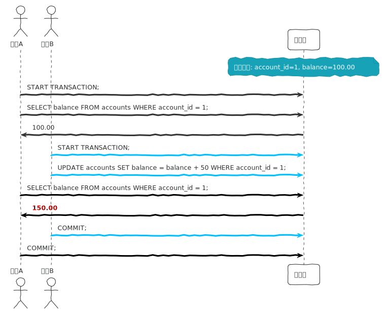
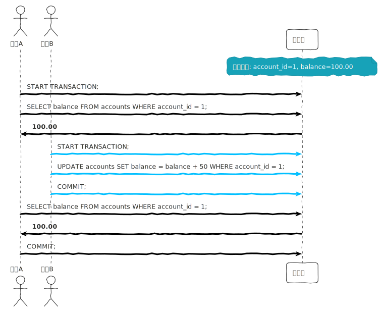

## 数据库事务 (Transaction) 及隔离级别 
### 事务特性

数据库系统维护事务的以下性质 (ACID 特性)。

* **原子性** (atomicity)：事务的所有操作在数据库中要么全部正确反映出来，要么完全不反映。
* **一致性** (consistency)：隔离执行事务时(换言之，在没有其他事务并发执行的情况下)保持数据库的一致性。
* **隔离性** (isolation)：尽管多个事务可能并发执行，但系统保证，对于任何一对事务 $T_i$ 和 $T_j$，在 $T_i$ 看来，$T_j$ 或者在 $T_i$ 开始之前已经完成执行，或者在 $T_i$ 完成之后开始执行。因此，每个事务都感觉不到系统中有其他事务在并发地执行。
* **持久性** (durability)：一个事务成功完成后，它对数据库的改变必须是永久的，即使出现系统故障。

### 事务隔离目的

* **提高吞吐量和资源利用率**。
  * 当一个事务在一张磁盘上进行读写时，另一个事务可在CPU上运行，第三个事务又可在另一张磁盘上进行读写。所有这些技术增加了系统的`吞吐量` (throughput)：即给定时间内执行的事务数增加。相应地，CPU 与磁盘利用率 (utilization) 也提高;换句话说，处理器与磁盘空闲或者没有做有用的工作的时间较少。
* **减少等待时间。**
  * 系统中可能运行着各种各样的事务，一些较短，一些较长。如果事务申行地技 行，短事务可能得等待它前面的长事务完成，这可能导致难以预测的延迟。
  * 并发执行可以减少执行事务时不可预测的延迟。此外，也可减少`平均响应时间`(average response time)：即一个事务从提交到完成所需的平均时间。

### 隔离级别

事务隔离级别决定了一个事务在多大程度上能够看见其他事务对数据库所做的更改。事务隔离级别影响数据库的一致性、并发性和性能。

SQL 标准定义了四种主要的事务隔离级别：

#### 读未提交（Read Uncommitted, RU）

* 允许一个事务读取另一个事务尚未提交的更改。
* 存在`脏读（Dirty Read）问题`。
* 提供最低的隔离级别和最高的并发性。



#### 读已提交（Read Committed, RC）

* 仅允许一个事务读取另一个事务已经提交的更改。
* 避免了脏读问题，但仍存在`不可重复读（Non-repeatable Read）问题`。
* 是许多数据库的默认隔离级别（如 Oracle）。


#### 可重复读（Repeatable Read, RR）

* 确保在同一事务中多次读取同一数据行时，会返回相同的结果，即使其他事务对该数据行进行了更新。
* 避免了脏读和不可重复读问题，但可能仍存在`幻读（Phantom Read）问题`。
* MySQL 的 `InnoDB` 存储引擎的`默认隔离级别`。



#### 可串行化（Serializable）

* 最高的隔离级别，确保事务按顺序执行，完全隔离。
* 通过锁定读取的行来防止其他事务进行插入、更新或删除操作。
* 避免了脏读、不可重复读和幻读问题，但可能会显著降低并发性和性能。

### 问题

**1.脏读（Dirty Read）**：一个事务读取了另一个未提交事务的数据。

事务 A 未提交：

```sql
UPDATE accounts SET balance = balance - 100 WHERE account_id = 1;
```

事务 B 读取未提交的数据：

```sql
SELECT balance FROM accounts WHERE account_id = 1;
```

**2.不可重复读（Non-repeatable Read）**：一个事务在多次读取过程中，读取到了不同的结果，通常是因为其他事务修改并提交了数据。

事务 A：

```sql
SELECT balance FROM accounts WHERE account_id = 1;
```

事务 B：

```sql
UPDATE accounts SET balance = balance - 100 WHERE account_id = 1;
COMMIT;
```

事务 A 再次读取：

```sql
SELECT balance FROM accounts WHERE account_id = 1;
```

**3.幻读（Phantom Read）**：一个事务在执行相同查询时，发现其他事务插入或删除了符合条件的行，导致前后两次读取结果集不同。

事务 A：

```sql
SELECT COUNT(*) FROM accounts WHERE balance > 1000;
```

事务 B 插入一行：

```sql
INSERT INTO accounts (account_id, balance) VALUES (2, 1500);
COMMIT;
```

事务 A 再次查询：

```sql
SELECT COUNT(*) FROM accounts WHERE balance > 1000;
```

### MySQL 设置事务隔离级别

在 MySQL 中，可以通过以下方式设置事务隔离级别：

1. **全局设置**（在 MySQL 配置文件中或运行时设置）：

   ```sql
   SET GLOBAL TRANSACTION ISOLATION LEVEL REPEATABLE READ;
   ```

2. **会话设置**（仅对当前会话有效）：

   ```sql
   SET SESSION TRANSACTION ISOLATION LEVEL READ COMMITTED;
   ```

3. **直接在事务中指定**：

   ```sql
   SET TRANSACTION ISOLATION LEVEL SERIALIZABLE;
   START TRANSACTION;
   -- 事务操作
   COMMIT;
   ```

### 示例

假设我们有一个 `accounts` 表，如下：

```sql
CREATE TABLE accounts (
    account_id INT PRIMARY KEY,
    balance DECIMAL(10,2)
);
```

#### 读未提交（Read Uncommitted）

```sql
SET SESSION TRANSACTION ISOLATION LEVEL READ UNCOMMITTED;
START TRANSACTION;
-- 读取其他事务未提交的更改
SELECT balance FROM accounts WHERE account_id = 1;
COMMIT;
```

#### 读已提交（Read Committed）

```sql
SET SESSION TRANSACTION ISOLATION LEVEL READ COMMITTED;
START TRANSACTION;
-- 读取已提交的更改
SELECT balance FROM accounts WHERE account_id = 1;
COMMIT;
```

#### 可重复读（Repeatable Read）

```sql
SET SESSION TRANSACTION ISOLATION LEVEL REPEATABLE READ;
START TRANSACTION;
-- 确保同一事务中多次读取结果相同
SELECT balance FROM accounts WHERE account_id = 1;
COMMIT;
```

#### 可序列化（Serializable）

```sql
SET SESSION TRANSACTION ISOLATION LEVEL SERIALIZABLE;
START TRANSACTION;
-- 完全隔离，防止其他事务并发操作
SELECT balance FROM accounts WHERE account_id = 1;
COMMIT;
```

### 总结

- **读未提交（Read Uncommitted）**：允许脏读，最低的隔离级别。
- **读已提交（Read Committed）**：防止脏读，但允许不可重复读。
- **可重复读（Repeatable Read）**：防止脏读和不可重复读，但允许幻读。
- **可序列化（Serializable）**：最高的隔离级别，防止所有并发问题，但性能最差。