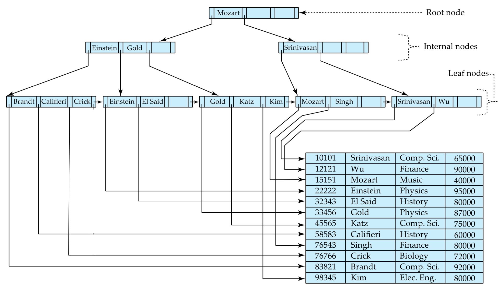

## 数据库的各类索引 
### 基本概念

一个索引文件由`索引条目` (index entries) 组成，如下形式：

索引一般包含两个主要部分：

* 索引键：这是用于快速查找的列或列的组合。
* 行指针：这是指向实际数据行的指针，通常是行的物理地址或行标识符。

### B+ 树索引

参考资料：

\> [https://cs186berkeley.net/notes/note4/](https://cs186berkeley.net/notes/note4/)

\> [https://db-book.com/slides-dir/PDF-dir/ch14.pdf](https://db-book.com/slides-dir/PDF-dir/ch14.pdf)