## 数据库的并发控制 (Concurrency Control) 
数据库并发控制是保证多个事务能够并发执行而不产生冲突的重要机制。

并发控制的目标是确保数据的一致性和完整性，同时最大限度地提高系统的吞吐量和响应速度。常见的并发控制方法包括`锁机制`、`时间戳排序`、`乐观并发控制`等。

### 锁机制

给数据项加锁的方式有多种，在这一节中，我们只考虑两种:

1. **共享的** (shared)：如果事务 $T_i$，获得了数据项 $Q$ 上的`共享型锁` (shared-mode lock)(记为 `S`)，则 $T_i$ 可读但不能写 $Q$。
   * **共享锁**（Exclusive Lock, S 锁）：也称为`读锁`。可读，不能写。
2. **排他的** (exclusive)：如果事务 $T_i$，获得了数据项 $Q$ 上的`排他型锁` (exclusive-mode lock)(记为 `X`)， 则 $T_i$ 既可读又可写 $Q$。
   * **排他锁**（Shared Lock, X 锁）：也称为`写锁`，不能读写，直到该锁被释放。

每个事务都要根据自己将对数据项 Q 进行的操作类型`申请` (request) 适当的锁。

该事务将请求发送给`并发控制管理器`。事务只有在并发控制管理器`授予` (grant) 所需锁后才能继续其操作。

这两种锁类型的使用可以让`多个事务读`，一个数据项但是限制同时`只能有一个事务`进行`写操作`。

#### 锁相容性矩阵

`锁相容性矩阵`（Lock Compatibility Matrix）是用于表示不同类型锁之间是否可以共存的矩阵。

`共享锁`（S锁）、`排他锁`（X锁）、`意向共享锁`（IS锁）、`意向排他锁`（IX锁），下面是一个扩展的锁相容性矩阵示例：

|        | S  | X  | IS | IX |
|:--------:|:----:|:----:|:----:|:----:|
| S      | ✔  | ✘  | ✔  | ✘  |
| X      | ✘  | ✘  | ✘  | ✘  |
| IS     | ✔  | ✘  | ✔  | ✔  |
| IX     | ✘  | ✘  | ✔  | ✔  |

#### 锁的授予

当一个事务申请对某个数据项加某种类型的锁时，如果没有其他事务在该数据项上持有与此类型锁相冲突的锁，则可以授予锁。例如：

* 如果一个事务申请共享锁 (S锁)，而当前数据项上没有持有排他锁（X锁）的事务，则可以授予共享锁。
* 如果一个事务申请排他锁 (X锁)，而当前数据项上没有持有任何锁（S锁或X锁）的事务，则可以授予排他锁。

##### 饿死（Starvation）

1. **事务 T1 持有共享锁（S锁）**：事务 T2 申请在同一个数据项上加排他锁（X锁）。由于 S锁和 X锁 不兼容，T2 必须等待 T1 释放共享锁。
2. **事务 T3 申请共享锁（S锁）**：此时，T3 的请求与 T1 持有的共享锁相容，因此可以授予 T3 共享锁。
3. **T1 释放锁后**：虽然 T1 释放了锁，但 T2 依然必须等待 T3 完成。
4. **另一个新的事务 T4 申请共享锁**：在 T3 完成之前，T4 申请并被授予共享锁。

这种情况可能会持续发生，即不断有新的事务申请并获得共享锁，导致 T2 永远无法获得排他锁（X锁）。这就是饿死现象。

为了解决这个问题，数据库管理系统（DBMS）通常采用以下策略：

1. **优先级调度**：为每个锁请求分配一个优先级。通常，等待时间越长的事务优先级越高。
2. **公平队列**：维护一个队列，确保锁请求按照它们到达的顺序被处理。这种方法确保先到的请求先被处理，防止新的请求一直插队。
3. **年龄提升**：逐渐提高等待时间较长的事务的优先级，确保它们最终能够获得所需的锁。

#### 两阶段锁协议（Two-Phase Locking, 2PL）

这是确保可串行化的一种锁协议，包括两个阶段：

* **扩展阶段 (Growing Phase)**：事务`可以获得锁`（Acquire Locks）但`不能释放锁`。
* **收缩阶段 (Shrinking Phase)**：事务可以`释放锁`（Release Locks）但`不能获得新的锁`。

2PL 确保了事务之间的相互排他性，从而防止并发冲突，并保证事务的可串行化。 ​

#### 锁的粒度

锁的粒度可以是`表级锁`、`行级锁`甚至是`字段级锁`。粒度越细，并发度越高，但锁管理的开销也越大。

### 时间戳排序

时间戳排序算法为每个事务分配一个唯一的时间戳，根据时间戳来排序事务，以确保它们按某个全局的顺序执行。

* **读时间戳（Read Timestamp, RTS）：** 记录数据项被读的最新时间戳。
* **写时间戳（Write Timestamp, WTS）：** 记录数据项被写的最新时间戳。

事务按照时间戳顺序执行，如果某个事务的操作违反了时间戳顺序，该操作会被拒绝并重启。

### 乐观并发控制

乐观并发控制假设冲突很少，通过三个阶段来控制并发：

* **读取阶段：** 事务从数据库中读取数据并执行计算，不进行任何锁定。
* **验证阶段：** 事务在提交之前，检查是否与其他并发事务发生冲突。
* **写入阶段：** 如果没有冲突，事务将其结果写入数据库。

如果在验证阶段发现冲突，事务将被中止并重试。

### 多版本并发控制（MVCC）

MVCC通过维护数据项的多个版本来实现并发控制，每个事务看到的数据版本与其开始时间一致。

* **读取：** 读取事务将读取数据项的最新版本，该版本在事务开始之前已经提交。
* **写入：** 写入事务会创建数据项的新版本，并在事务提交时将其作为最新版本。

MVCC可以提高读性能，因为读操作不会阻塞写操作，但会增加存储开销。

### 实际应用中的考虑

在实际应用中，选择哪种并发控制方法取决于具体的业务场景和需求。例如：

* **高并发读多写少：** 适合使用 MVCC。
* **高写并发：** 可能需要`细粒度锁`或`乐观并发控制`。
* **数据一致性要求高：** 可以采用`两阶段锁协议`确保可串行化。

一个事务向数据库系统请求各种服务，从进入一个服务器进程开始，在执行过程中需要读磁盘，需要 CPU 周期，以及并发控制所需要的锁。

