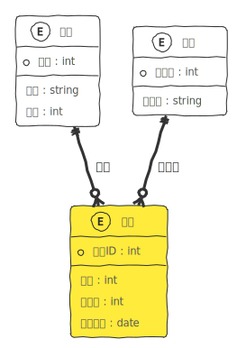
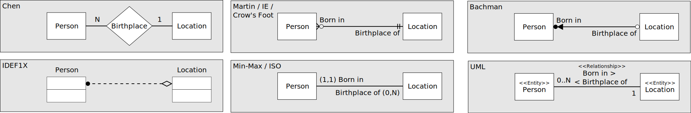
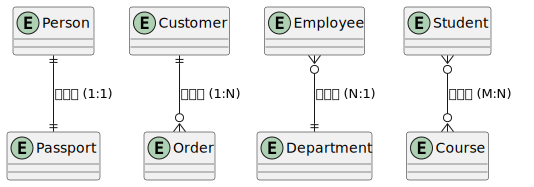

## 数据库规范化设计 
### 术语

* **域** (domain)：每个`属性`的`取值集合`就叫该属性的域。
* **元组** (tuple)：数学术语中，元组就是一组值的序列。
* **超级键** (super key)：`一个`或`多个`属性的集合。 这些属性的组合可以使我们在一个关系中`唯一标识`一个元组。

在关系模型术语中，有以下对应指代：

``` shell
关系 (relation) -> 表
元组 (tuple) -> 行
属性 (attribute) -> 列
```

### 设计过程

设计阶段：数据库设计通常分为三个阶段：

* **需求分析**：确定数据库系统需要存储和管理的信息。
* **概念设计**：使用高层次的`数据模型`（如E-R 模型）来描述数据库的结构。
* **逻辑设计**：将`概念模型`转换为`逻辑模型`（如`关系模式`）。

### E-R 模型



* `实体集` (Entity Set)：实体是现实世界中的对象，实体集是同类实体的集合。
  * 示例：学生（实体），学生集（实体集）。
* `关系集` (Relational Set)：联系描述了实体集之间的关系。
  * 示例：学生选课（学生和课程之间的联系）。
* `属性` (Attribute)：属性是实体或联系的特征。
  *示例：学生的属性包括学号、姓名、年龄等。

#### 关系类型

`一对一` (one to one)、`一对多` (one to many)、`多对一` (many to one)、`多对多`(many to many)。

不同的关系表示法：



1. **Chen（陈氏表示法）**：陈氏表示法是 ER 模型的经典表示法，用`椭圆形`表示`属性`，用`矩形`表示`实体`，用`菱形`表示`关系`。
2. **Martin / IE / Crow's Foot（乌鸦爪表示法）**：乌鸦爪表示法是`现代 ER 图`的`标准表示法`，用不同的`箭头`和`线条`表示实体间的关系。
3. **Bachman**：一种`早期`的 ER 模型表示法，使用箭头和矩形表示实体和关系。
4. **IDEF1X**：是一种数据建模方法，用于描述`企业信息`的结构。
5. **Min-Max / ISO**：通过表示关系中的`最小`和`最大值`来描述实体间的关系。
6. **UML（统一建模语言）**：`标准化`的`建模语言`，用于`软件工程`，广泛应用于`面向对象分析和设计`。

不严格限制使用哪种，但乌鸦爪表示法比较直观：



### 明确约束

在关系数据库管理系统 (RDBMS) 中，约束 (Constraint) 用于`限制数据类型`，以确保数据的准确性和可靠性。

1. **主键约束（PRIMARY KEY）**：`唯一`且`非空`，用于唯一标识表中的记录。
2. **唯一约束（UNIQUE）**：唯一，但允许一个 `NULL` 值，用于确保列中的所有值都是唯一的。
3. **外键约束（FOREIGN KEY）**：确保一个表中的值存在于另一个表中，用于维护表之间的引用完整性。
4. **检查约束（CHECK）**：确保列中的值符合指定的条件。
5. **非空约束（NOT NULL）**：确保列中的值`非空`。
6. **默认值约束（DEFAULT）**：为`列提供默认值`，如果插入数据时没有提供该列的值，则使用默认值。

```sql
-- 创建部门表，包含主键约束和非空约束
CREATE TABLE departments (
    department_id INT PRIMARY KEY,           -- 主键约束
    department_name VARCHAR(100) NOT NULL    -- 非空约束
);

-- 创建员工表，包含多种约束
CREATE TABLE employees (
    employee_id INT PRIMARY KEY,             -- 主键约束
    name VARCHAR(100) NOT NULL,              -- 非空约束
    email VARCHAR(100) UNIQUE,               -- 唯一约束
    age INT CHECK (age >= 18 AND age <= 65), -- 检查约束
    hire_date DATE DEFAULT CURRENT_DATE,     -- 默认值约束
    department_id INT,
    FOREIGN KEY (department_id) REFERENCES departments(department_id) -- 外键约束
);
```

#### 主键类型

在关系数据库中，主键（Primary Key）用于唯一标识表中的每一行记录。主键必须是唯一的，并且不能为空。根据使用场景和设计需求，主键可以有不同的类型。

以下是几种常见的主键类型及其详细说明：

##### 自然主键

自然主键 (Natural Key) 是指直接使用现实世界中具有唯一性的属性作为表的主键。例如，使用`社会保障号码`（SSN）、`电子邮件地址`或`身份证号码`作为主键。

优点：

* 自然主键通常具有业务意义，易于理解和识别。
* 不需要额外的字段，节省存储空间。

缺点：

* 自然主键的值可能会发生变化，导致`更新复杂`。
* 如果属性值`太长`或包含`敏感信息`，可能不适合作为主键。

##### 代理主键

代理主键 (Surrogate Key) 是数据库系统自动生成的唯一标识符，通常是`整数`或 `UUID`（通用唯一标识符）。代理主键不具有业务意义，仅用于唯一标识记录。

优点：

* 值固定且不易变更，便于管理。
* 独立于业务逻辑，适应性强。

缺点：

* 代理主键`没有业务意义`，可能需要额外的查询来获取有用信息。
* `增加了一个字段`，消耗额外的存储空间。

##### 复合主键

复合主键 (Composite Key) 由两个或多个列组合而成，联合起来唯一标识表中的每一行记录。

优点：

* 可以通过多个字段的组合确保唯一性，避免增加额外的字段。
* 有时可以更好地反映业务逻辑和需求。

缺点：

* 复合主键的组合可能导致键的长度增加，影响`查询性能`。
* 需要维护多个字段的组合，复杂性增加。

考虑一个订单明细表 `OrderDetails`：

| OrderID | ProductID | Quantity |
|---------|-----------|----------|
| 1       | 101       | 2        |
| 1       | 102       | 5        |
| 2       | 101       | 1        |

```sql
CREATE TABLE OrderDetails (
    OrderID INT,
    ProductID INT,
    Quantity INT,
    PRIMARY KEY (OrderID, ProductID)
);
```

在这种情况下，`OrderID` 和 `ProductID` 组合在一起唯一标识每一行数据。

##### 候选键

候选键 (Candidate Key) 是一个或多个列的组合，可以唯一标识表中的每一行记录。一个表中可以有多个候选键，其中一个被选作主键，其余的可以用作唯一键。

```sql
CREATE TABLE employees (
    employee_id SERIAL PRIMARY KEY, -- 代理主键
    ssn VARCHAR(11) UNIQUE,         -- 候选键
    email VARCHAR(100) UNIQUE,      -- 候选键
    name VARCHAR(100),
    hire_date DATE
);
```

如何设置主键？

建议在任何你所创建的表中，保持默认以 `id 命名`的`自增长`的`整数类型`字段作为通用主键，这是目前大家通用做法。

这样做以下一些理由：

* 数字可以更有效地进行索引和查询。
* 独立于业务，稳定不变。例：以用户邮件作为主键，如果用户修改了邮箱地址，那么表数据就会受到极大影响。

### 如何设置数据类型？

#### 数值类型

| 数据类型    | 存储大小（字节） | 有符号范围                                      | 无符号范围                               | 精度                  |
|-------------|------------------|----------------------------------------------|----------------------------------------|-----------------------|
| TINYINT     | 1                | -2^7 到 2^7-1                                | 0 到 2^8-1                             | -                     |
| SMALLINT    | 2                | -2^15 到 2^15-1                              | 0 到 2^16-1                            | -                     |
| MEDIUMINT   | 3                | -2^23 到 2^23-1                              | 0 到 2^24-1                            | -                     |
| INT         | 4                | -2^31 到 2^31-1                              | 0 到 2^32-1                            | -                     |
| BIGINT      | 8                | -2^63 到 2^63-1                              | 0 到 2^64-1                            | -                     |
| FLOAT       | 4                | 大约 -3.4E+38 到 3.4E+38                     | 大约 0 到 3.4E+38                      | 大约 7 位有效数字     |
| DOUBLE      | 8                | 大约 -1.7E+308 到 1.7E+308                   | 大约 0 到 1.7E+308                     | 大约 15 位有效数字    |
| DECIMAL     | 定长             | 取决于定义的精度和小数位数                   | 取决于定义的精度和小数位数             | 用户定义，最高可达 65 位数字 |

存储格式：`DECIMAL(M,D)` 类型中的 M 表示总位数，D 表示小数位数。整数部分的位数为 M-D。

`DECIMAL` 与浮点类型的比较

| 特性                | `DECIMAL`                       | `FLOAT` / `DOUBLE`                |
|---------------------|---------------------------------|-----------------------------------|
| **精确度**          | 高，适用于需要精确计算的场景       | 低，存在舍入误差                  |
| **存储方式**        | 定点数，精度固定                 | 浮点数，精度有限                  |
| **性能**            | 存储和计算开销稍高，但提供精确计算  | 性能较好，但精度不足               |
| **适用场景**        | 金融、会计、货币金额等需要精确度的场景 | 科学计算、统计分析等对精度要求不高的场景 |

#### 字符类型

这个表格展示了每种字符串类型所使用的长度字节数以及最大字符数。

| Data Type   | Length Bytes Used | Max Characters           |
|-------------|-------------------|--------------------------|
| CHAR        | 0                 | 0 to 255                 |
| VARCHAR     | 1 or 2            | 0 to 65535               |
| TINYTEXT    | 1                 | 2^8 - 1 (255)            |
| TEXT        | 2                 | 2^16 - 1 (65535)         |
| MEDIUMTEXT  | 3                 | 2^24 - 1 (16777215)      |
| LONGTEXT    | 4                 | 2^32 - 1 (4294967295)    |

* **CHAR** 类型是定长的字符串，不使用额外的字节存储长度信息，最大字符数为 0 到 255。
* **VARCHAR** 类型是变长的字符串，使用 1 个或 2 个字节存储长度信息，最大字符数为 0 到 65535（当字符数大于 255 时，使用 2 个字节存储长度信息）。

#### 时间类型

**1.标准格式** (ISO 8601)

ISO 8601 是国际标准化组织（ISO）定义的日期和时间的表示方法，格式为 `YYYY-MM-DD`。

**2.时间戳** (Unix Timestamp)

时间戳是自 1970年1月1日（UTC）以来经过的`秒数`。这种格式便于进行日期和时间的计算操作，如日期加减，但对于人类阅读则不直观。

* **跨时区处理**：时间戳以 UTC 为基准，可以轻松处理跨时区的日期和时间问题。
* **精确到秒**：大多数系统中的时间戳精确到秒，对于需要记录具体时间的应用非常适用。

**3.日期和时间类型**

大多数数据库管理系统（如 MySQL、PostgreSQL、SQL Server）提供了专门的日期和时间数据类型，例如 `DATE`、`TIME`、`DATETIME`、`TIMESTAMP` 等。

|类型|格式|存储大小|包含小数秒大小|表示范围|
|--|--|--|--|--|
|DATE|YYYY-MM-DD |3 bytes||1000-01-01 至 9999-12-31 |
|DATETIME|YYYY-MM-DD hh:mm:ss|5 bytes|<= 8 bytes|1000-01-01 00:00:00 至 9999-12-31 23:59:59|
|TIMESTAMP|YYYY-MM-DD hh:mm:ss.ffffff|4 bytes|<= 7 bytes|1970-01-01 00:00:01 UTC 至 `2038`-01-19 03:14:07 UTC|

DATETIME 和 TIMESTAMP 可以包含`小数秒`部分，精度可达微秒（6位）。

> 默认情况下，TIMESTAMP 值在存储时从`当前时区转换为 UTC`，并在检索时从 UTC 转换回当前时区。

##### 时区设置

在 MySQL 中，时区设置的优先级按照以下顺序进行：

1. **会话级别（Session Level）**

    当你在会话中设置时区时，该设置优先于其他级别的设置。这意味着会话级别的时区将覆盖全局级别和服务器默认时区（操作系统级别）的设置。这允许每个用户或会话自定义其时间处理，独立于服务器的其他操作。

    ``` sql
    SET SESSION time_zone = '+08:00';  -- 例如，设置为北京时间
    -- 或者使用时区名称
    SET SESSION time_zone = 'America/New_York';
    ```

2. **全局级别（Global Level）**

    如果会话级别的时区没有被设置，那么 MySQL 会使用全局级别的时区设置。这个设置影响所有没有指定会话级别时区的新会话。全局设置是`管理员设置`的，用来定义服务器操作的默认行为。

    ``` sql
    SET GLOBAL time_zone = '+00:00';  -- 设置为 UTC
    -- 或者使用具体的时区名称
    SET GLOBAL time_zone = 'Europe/London';

    ```

3. **系统级别（System Level）**

    如果全局级别的时区也没有被设置，MySQL 服务器将使用宿主操作系统的时区作为默认时区。这通常在 MySQL 服务器启动时确定，除非之后通过全局或会话设置进行了覆盖。

##### 总结

DATETIME 不包含时区信息，存什么获取的就是什么。(无时区信息)

TIMESTAMP 存储时会根据数据库服务器时区转换 UTC 时间，读取时又回根据时区转换成 UTC 时间。(需转换，且数据库时区相关，有 [38 年问题](https://en.wikipedia.org/wiki/Year_2038_problem))

因此，可以考虑 `int`(32 位) 类型或 `bigint`(64 位) 来存储时间，就是 DBA 看数据累一些。

### 如何建索引？

常见的索引类型有下面这些：

| 索引类别           | 索引类型               | 特点和应用场景                                                    |
|--------------------|------------------------|-----------------------------------------------------------------|
| 顺序索引           | B-Tree 索引            | 最常见的索引类型，适用于`精确匹配`和`范围查询`                      |
|                    | B⁺-Tree 索引            | B-Tree 的变种，所有`数据在叶节点上`，适用于数据库系统             |
|                    | 聚簇索引（Clustered Index）| 数据行按`索引键顺序物理存储`，适用于`范围查询`                     |
| 哈希索引           | 哈希索引               | 基于哈希表实现，适用于`精确匹配`查询，`不支持范围`查询              |
| 全文索引           | 全文索引（Full-Text Index）| 用于对文本字段进行全文检索，适用于大段文本的搜索               |
| 空间索引           | 空间索引（Spatial Index）| 用于空间数据的索引，适用于地理信息系统（GIS）应用              |

MySQL 自动创建的索引：`主键索引`、`唯一键索引`、`外键索引`。

#### 创建与删除

**创建索引**：

```sql
CREATE INDEX 索引名 ON 表名 (列名);
```

**创建符合索引**：

```sql
CREATE INDEX idx_name_age ON example (name, age);
```

**删除索引**：

```sql
DROP INDEX 索引名;
```

#### 最佳实践

1. **选择性高的列**：在选择性高（即列中唯一值多）的列上创建索引，效果最好。
2. **频繁使用的列**：在 `WHERE 子句`、`JOIN 子句`和 `ORDER BY 子句`中频繁使用的列上创建索引。
3. **避免过多索引**：不要在表上创建过多的索引，以免增加维护成本。

### 好的关系设计特点

* 设计选择：更大的模式 (schema)：包括更多属性的表。
  * 减少连接（JOIN）操作，简化查询，提高查询性能。
* 设计选择：更小的模式：分解表以减少冗余和依赖。
  * 减少数据冗余；
  * 更新操作简单；

#### 函数依赖理论

在数据库设计和关系数据库理论中，函数依赖（Functional Dependency，FD）是描述一种约束关系的概念，它表示在一个关系（表）中，一组属性的值能够唯一确定另一组属性的值。

通过函数依赖分析`识别和消除数据冗余`，决策一个关系模式是否应该进行`分解`。

##### 基本定义

假设有一个关系 $R$，其中 $X$ 和 $Y$ 是 $R$ 的属性集合。

如果对于 $R$ 中的每一行的 $X$ 的值，都有`唯一确定`的 $Y$ 的值，则称 $Y$ 函数`依赖于` $X$，记作：$ X \rightarrow Y$。

##### 解释

函数的特性是任何值 X，都有一个与之对应的唯一值 Y。也就是说相同的 X 值，不可能出现两个不同的 Y 值。所以可以说 Y 对 X 有函数性得依赖关系。

反过来说，如果出现相同的 X 值映射了不同的 Y 值，那就说明 Y 无法函数依赖于 X。

##### 例子

考虑一个学生表 `Students`，其属性包括 `StudentID`、`Name` 和 `Major`：

| StudentID | Name    | Major     |
|-----------|---------|-----------|
| 1         | Alice   | Computer Science |
| 2         | Bob     | Mathematics |
| 3         | Charlie | Physics |
| 1         | Alice   | Computer Science |

在这个表中，有如下函数依赖：

* `StudentID → Name, Major`：因为每个学生的 `StudentID` 唯一确定了学生的 `Name` 和 `Major`。
* `Name → Major`：假设学生的名字是唯一的，则名字也唯一确定了专业。

##### 类型

1. **完全函数依赖** (Full Functional Dependency)：
   * $Y$ 完全依赖于 $X$ 中的`所有属性`，而不是其中某个子集。
   * 例如，假设一个订单表 `Orders` 中，`(OrderID, ProductID) → Quantity`，表示订单 ID 和产品 ID 一起唯一确定了数量。
  
2. **部分函数依赖** (Partial Functional Dependency)：
   * $Y$ 依赖于 $X$ 的`一个子集`。
   * 例如，如果 `Orders` 表中 `OrderID → CustomerID` 和 `ProductID → ProductName`，则 `Quantity` 对于 `OrderID` 是部分依赖的，因为 `OrderID` 本身不能唯一确定 `Quantity`。

3. **传递函数依赖** (Transitive Dependency)：
   * 如果  $X \rightarrow Y$ 且  $Y \rightarrow Z$，则存在传递函数依赖  $X \rightarrow Z$。
   * 例如，`StudentID → Name` 且 `Name → Major`，则有 `StudentID → Major`。

##### 用途

规范化过程通常包括以下几个步骤：

1. **第一范式（1NF）**：消除`重复的组`，确保每个字段只包含原子的值。
2. **第二范式（2NF）**：消除非主属性对主键的`部分依赖`。
3. **第三范式（3NF）**：消除`传递函数依赖`。
4. **BCNF（Boyce-Codd Normal Form）**：进一步分解以消除任何依赖。

#### 三范式

规范化是数据库设计中的一种原则，目的是`减少冗余`和`提高数据完整性`。不过有时候为了优化性能和简化查询，也会反范式。

范式分为不同级别，通常有三个主要的范式，分别是第一范式（1NF）、第二范式（2NF）和第三范式（3NF）。

##### 第一范式 (1NF)

数据表中的所有列的数据都是`原子值`(不可再分)。

**示例**:

假设我们有一个学生选课的数据库，反 1NF 的表 `students_courses` 设计可能如下：

| 学生ID | 学生名称 | 课程名                      |
|------------|--------------|------------------------------|
| 1          | Alice        | Math, Science, History       |
| 2          | Bob          | Math, English                |
| 3          | Charlie      | Science, History             |

在这个示例中，`courses` 列包含了学生所选课程的列表，违反了 1NF 的要求，因为它包含了`非原子值`（即多值）。

**解决方法**：

我们可以将上述反 1NF 的表转换为符合 1NF 要求的表，通过将课程信息拆分到另一个关联表中。

表 `students`

| 学生ID | 学生名称 |
|------------|--------------|
| 1          | Alice        |
| 2          | Bob          |
| 3          | Charlie      |

表 `students_courses`

| 学生ID | 课程名   |
|------------|----------|
| 1          | Math     |
| 1          | Science  |
| 1          | History  |
| 2          | Math     |
| 2          | English  |
| 3          | Science  |
| 3          | History  |

##### 第二范式 (2NF)

1. 必须满足第一范式 (1NF)。
2. 所有`非主键列`必须`完全依赖于主键`，而不是部分依赖。

**示例**：订单关系

现实约束：

1. 每个订单都有一个唯一的订单ID。
2. 每个产品都有一个唯一的产品ID和产品名称。
3. 每个客户都有一个唯一的客户ID和客户名称。
4. 每个订单可以包含多个产品。

| 订单ID | 产品ID | 产品名称 | 客户ID | 客户名称 | 数量 |
|--------|--------|----------|--------|----------|------|
| 1      | 2001   | Laptop   | 100    | Alice    | 2    |
| 1      | 2002   | Mouse    | 100    | Alice    | 5    |
| 2      | 2001   | Laptop   | 101    | Bob      | 1    |
| 3      | 2003   | Keyboard | 102    | Charlie  | 3    |

函数依赖分析：

1. `(订单ID, 产品ID) → 产品名称, 客户ID, 客户名称, 数量`：复合主键。
2. `客户ID → 客户名称`：部分依赖。
3. `产品ID → 产品名称`：部分依赖。

违反2NF的原因：`客户名称`部分依赖于`客户ID`，`产品名称`部分依赖于`产品ID`，而不是整个复合主键`(订单ID, 产品ID)`。

**解决方法**：将 `Orders` 表分解为三个表。

`OrderDetails` 表：

| 订单ID | 产品ID | 数量 |
|--------|--------|------|
| 1      | 2001   | 2    |
| 1      | 2002   | 5    |
| 2      | 2001   | 1    |
| 3      | 2003   | 3    |

`Customers` 表：

| 客户ID | 客户名称 |
|--------|----------|
| 100    | Alice    |
| 101    | Bob      |
| 102    | Charlie  |

`Products` 表：

| 产品ID | 产品名称 |
|--------|----------|
| 2001   | Laptop   |
| 2002   | Mouse    |
| 2003   | Keyboard |

通过这种分解，我们消除了部分依赖，确保每个关系中的非主属性都完全依赖于其主键。

##### 第三范式 (3NF)

* 数据表已经满足了第二范式；
* `非主键列`之间`不存在传递依赖`。

**示例**：员工部门关系

| 员工ID | 员工姓名 | 部门ID | 部门名称 | 经理ID | 经理姓名 |
|--------|----------|--------|----------|--------|----------|
| 1      | 张三     | 10     | 销售部   | 100    | 李四     |
| 2      | 王五     | 20     | 工程部   | 101    | 赵六     |
| 3      | 赵七     | 10     | 销售部   | 100    | 李四     |
| 4      | 钱八     | 20     | 工程部   | 101    | 赵六     |

函数依赖分析：

1. `员工ID → 员工姓名, 部门ID, 部门名称, 经理ID, 经理姓名`
2. `部门ID → 部门名称, 经理ID`
3. `经理ID → 经理姓名`

传递依赖：

1. `员工ID → 部门ID → 部门名称, 经理ID`
2. `经理ID → 经理姓名`

**解决方法**：将原始表分解为三个表。

员工表：

| 员工ID | 员工姓名 | 部门ID |
|--------|----------|--------|
| 1      | 张三     | 10     |
| 2      | 王五     | 20     |
| 3      | 赵七     | 10     |
| 4      | 钱八     | 20     |

部门表：

| 部门ID | 部门名称 | 经理ID |
|--------|----------|--------|
| 10     | 销售部   | 100    |
| 20     | 工程部   | 101    |

经理表：

| 经理ID | 经理姓名 |
|--------|----------|
| 100    | 李四     |
| 101    | 赵六     |

**分解后的 ER 图**：


### 规约及风格指南

* [阿里巴巴 Mysql 指南](https://github.com/alibaba/Alibaba-Java-Coding-Guidelines?tab=readme-ov-file#3-mysql-rules)
* [SQL Style Guide](https://www.sqlstyle.guide/zh/)
* [Gitlab SQL Style Guide](https://handbook.gitlab.com/handbook/business-technology/data-team/platform/sql-style-guide/)

详情参考 [数据库设计规约与规范](/articles/database-design-guide)。
