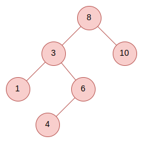
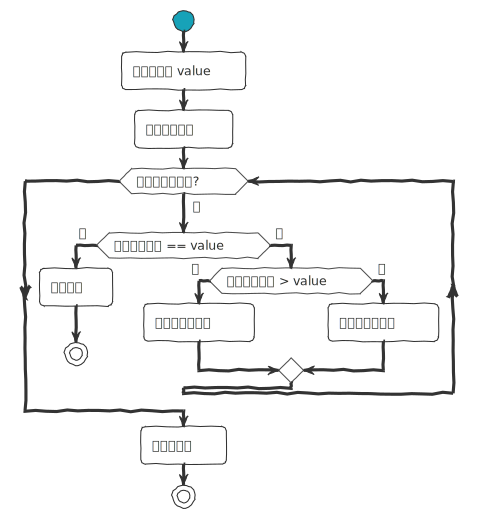
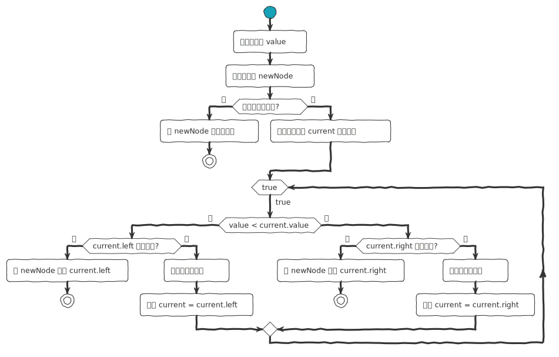
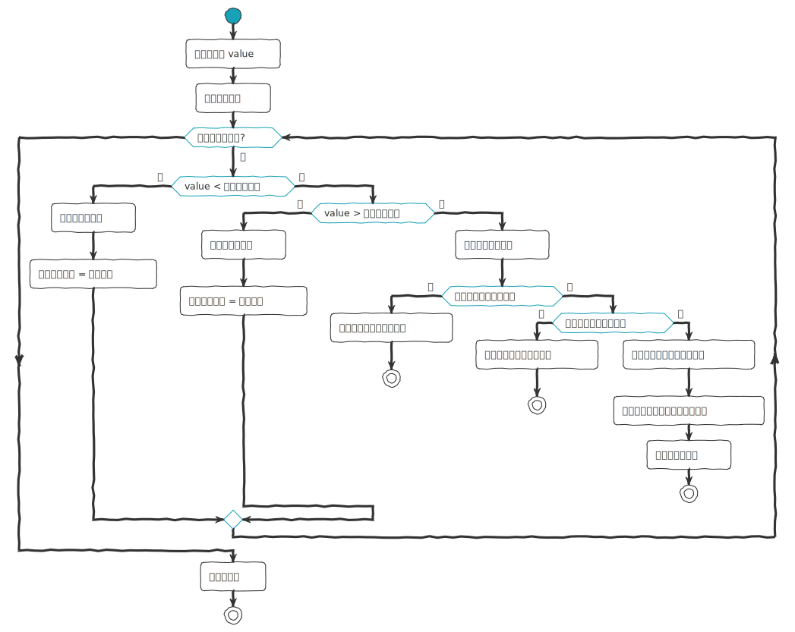

## 数据结构 (三) - 二叉搜索树 (Binary Search Tree) 
### 简介

二叉搜索树 (binary search tree) ，简称 BST。也有叫做**二叉查找树**、**有序二叉树**或**排序二叉树**。之所以叫搜索树，因为二叉搜索树能够快速得执行`删除`、`插入`、`查找`等操作。

二叉搜索树的存储结构通常采用二叉链表，是`基础性`数据结构，用于构建更为抽象的数据结构。在构建时，是有固定排序规则，它是一个`有序树`。



二叉搜索树的性质：

1. 若任意`左子树` $\neq \varnothing$，则`左子树`所有节点值 $<$ 根节点值；
2. 若任意`右子树` $\neq \varnothing$，则`右子树`所有节点值 $>$ 根节点值；
3. 任意节点的左、右子树也分别为二叉查找树。

### 实现

#### 节点结构

```ts
class Node {
  value: number;
  left: Node | null;
  right: Node | null;

  constructor(value: number) {
    this.value = value;
    this.left = null;
    this.right = null;
  }
}
```

在二叉查找树 $b$ 中查找 $x$ 的过程为：

1. 若 $b = \varnothing$，则搜索失败。
2. 若 $x = $ `b.data.value`，则查找成功；
3. 若 $x < $ `b.data.value`，则搜索`左子树`；
4. 若 $x > $ `b.data.value`，则搜索`右子树`；

#### 查找

``` ts
find(value: number): Node | null {
  if (this.root === null) return null;
  let current = this.root;
  while (current) {
    if (value === current.value) return current;
    if (value < current.value) {
      current = current.left;
    } else {
      current = current.right;
    }
  }
  return null;
}
```



#### 插入

```ts
insert(value: number): this {
  const newNode = new Node(value);
  if (this.root === null) {
    this.root = newNode;
    return this;
  }
  let current = this.root;
  while (true) {
    if (value < current.value) {
      if (current.left === null) {
        current.left = newNode;
        return this;
      }
      current = current.left;
    } else {
      if (current.right === null) {
        current.right = newNode;
        return this;
      }
      current = current.right;
    }
  }
}
```



### 删除

```ts
deleteNode(root: Node | null, value: number): Node | null {
  if (root === null) {
      return root;
  }

  if (value < root.value) {
      root.left = this.deleteNode(root.left, value);
  } else if (value > root.value) {
      root.right = this.deleteNode(root.right, value);
  } else {
      // Node to be deleted found

      // Node with only one child or no child
      if (root.left === null) {
          return root.right;
      } else if (root.right === null) {
          return root.left;
      }

      // Node with two children: Get the inorder successor (smallest in the right subtree)
      root.value = this.minValue(root.right);

      // Delete the inorder successor
      root.right = this.deleteNode(root.right, root.value);
  }
  return root;
}
```



### 遍历

#### 中序遍历

```text
inorder(root)
  Pre: root is the root node of the BST
  Post: the nodes in the BST have been visited in inorder
  if root != ø
    inorder(root.left)
    yield root.value
    inorder(root.right)
  end if
end inorder
```

#### 先序遍历

```text
preorder(root)
  Pre: root is the root node of the BST
  Post: the nodes in the BST have been visited in preorder
  if root != ø
    yield root.value
    preorder(root.left)
    preorder(root.right)
  end if
end preorder
```

#### 后序遍历

```text
postorder(root)
  Pre: root is the root node of the BST
  Post: the nodes in the BST have been visited in postorder
  if root != ø
    postorder(root.left)
    postorder(root.right)
    yield root.value
  end if
end postorder
```

### 算法复杂度

它的算法`时间复杂度`如下：

| 算法 | 平均     | 最差 |
| ---- | -------- | ---- |
| 空间 | O(n)     | O(n) |
| 搜索 | O(log n) | O(n) |
| 插入 | O(log n) | O(n) |
| 删除 | O(log n) | O(n) |
