## 数据结构 (三) - 堆 (Heap)  
### 介绍

`堆` (heap) 是是一个`完全二叉树`，并满足`堆属性`。

堆属性两种，对于给定完全二叉树中的`任意`节点：

1. 该节点的 key 值总是 $>$ 它的子节点的 key 值，这种属性被叫做`最大堆` (max heap) 属性。
2. 该节点的 key 值总是 $<$ 它的子节点的 key 值，这种属性被叫做`最小堆` (min heap) 属性。



堆通常使用`数组`来实现。

### 特性

* 堆`不关注`左右兄弟节点的 key 值的大小，即兄弟和表兄弟没有隐含的排序，它通常`不认为`是排序结构。
* 堆保证`第一个元素`的 Key 值在整棵树中是`最大`或`最小`的。

### 操作

#### 堆化 (Heapify)

它们确保在插入或删除元素后，堆仍然保持其属性，需要对其进行重新调整，该过程就叫`堆化`。

堆化有两个方向：一个从叶子节点向树的根节点进行遍历的叫`向上堆化` (Heapify Up) ，另一个从根节点向叶子节点进行遍历的叫`向下堆化` (Heapify Down)。

##### 向上堆化 (Heapify Up)

该过程用于在`添加末尾节点`或`重新调整堆`时恢复`最小堆`的属性。有时也叫`上滤` (Shit Up)、`上浮` (Bubble Up) 或`渗透上升` (Percolate Up)。

它的流程图如下：


JavaScript 的实现：

``` ts
function heapifyUp(heap, index) {
  let currentIndex = index; // 当前节点的索引
  let parentIndex = Math.floor((currentIndex - 1) / 2); // 当前节点父节点的索引

  // 当当前节点不是根节点，并且当前节点的值小于父节点的值时，进行循环
  while (currentIndex > 0 && heap[currentIndex] < heap[parentIndex]) {
    // 交换当前节点与父节点的值
    [heap[currentIndex], heap[parentIndex]] = [heap[parentIndex], heap[currentIndex]];
    // 更新当前索引为父节点索引，为下一次循环做准备
    currentIndex = parentIndex;
    // 重新计算父节点索引
    parentIndex = Math.floor((currentIndex - 1) / 2);
  }
}

// 示例使用：
let heap = [10, 12, 15, 30, 40, 50, 60]; // 一个有效的最小堆
let newValue = 5; // 要插入堆末尾的新值
heap.push(newValue); // 新值现在在堆的末尾
heapifyUp(heap, heap.length - 1); // 从新值开始调整堆

console.log(heap); // 堆现在是一个包含新值的有效最小堆

```

这段代码定义了一个 heapifyUp 函数，它接受一个数组 heap 和一个需要上浮以恢复堆性质的元素的索引 index。这个函数会将元素与其父元素进行比较，并在必要时进行交换，直到该元素`到达堆顶`或`不再小于`于其父元素。

这个示例假设数组是一个最小堆，如果你要在`最大堆`中使用它，你需`要改变比较的条件`。

##### 向下堆化 (Heapify Down)

过程用于在`删除堆顶元素`或是`重新调整堆`时恢复`最小堆`的属性。有时也叫`下滤` (Shit Down)、`下浮` (Bubble Down) 或`渗透下降` (Percolate Down)。

它的流程图如下：


JavaScript 的实现：

``` ts
function heapifyDown(heap, currentIndex, heapSize) {
  let smallest = currentIndex;
  let leftChildIndex = 2 * currentIndex + 1;
  let rightChildIndex = 2 * currentIndex + 2;

  // 如果左子节点的值小于当前节点的值，则更新最小值的索引
  if (leftChildIndex < heapSize && heap[leftChildIndex] < heap[smallest]) {
    smallest = leftChildIndex;
  }

  // 如果右子节点的值小于当前最小值的节点，则更新最小值的索引
  if (rightChildIndex < heapSize && heap[rightChildIndex] < heap[smallest]) {
    smallest = rightChildIndex;
  }

  // 如果最小值的索引不是当前索引，说明需要交换来维持最小堆的性质
  if (smallest !== currentIndex) {
    // 交换当前节点与最小值节点的值
    [heap[currentIndex], heap[smallest]] = [heap[smallest], heap[currentIndex]];

    // 递归地对交换后的子树执行向下堆化
    heapifyDown(heap, smallest, heapSize);
  }
}

// 示例使用
const minHeap = [10, 12, 20, 32, 19, 21, 100, 41, 42, 24];
heapifyDown(minHeap, 0, minHeap.length);

console.log(minHeap);
```

在示例中，我们对最小堆的根节点 (索引为 0) 调用 heapifyDown 函数。由于根节点可能是由于某种操作（比如删除或替换堆顶元素）而变得不再是最小值，这个函数将其下移，直到它移动到它不再比其孩子大的位置，从而恢复了最小堆的属性。

如果改成对于最大堆的向下堆化 (Heapify Down)，我们需要确保父节点始终大于其子节点。这意味着在比较和交换节点时，我们关注的是找到最大的节点，而不是最小的节点。要将 heapifyDown 函数从最小堆调整为最大堆，你需要进行以下更改：

1. **变量命名**：将变量 `smallest` 改为 `largest`，以反映我们正在寻找最大值。

2. **比较逻辑**：在与左右子节点进行比较时，需要检查当前节点的值是否小于其子节点的值，如果是，则更新 `largest`。

3. **交换条件**：当 `largest` 不等于 `currentIndex` 时，交换当前节点与 `largest` 索引节点的值，因为我们希望父节点大于子节点。

#### 插入元素

``` javascript
function insert(heap, element) {
  // 将元素添加到堆的末尾
  heap.push(element);

  // 执行向上堆化过程
  heapifyUp(heap, heap.length - 1);
}

// 示例使用
let minHeap = [10, 12, 15, 30, 40, 50, 60];
insert(minHeap, 5);
console.log(minHeap); // 输出: [5, 12, 10, 30, 40, 50, 60, 15]
```

#### 删除元素

在最小堆中删除一个元素通常指的是`删除根节点`，因为最小堆是为了快速访问最小元素而设计的。要删除根节点并保持最小堆的特性，你需要执行以下步骤：

1. 将堆的最后一个元素移动到根节点位置。
2. 从堆中移除最后一个元素。
3. 对新的根节点执行向下堆化（Heapify Down）过程，以维护最小堆的性质。

``` javascript
function deleteRoot(heap) {
  // 将最后一个元素替换到根节点
  heap[0] = heap[heap.length - 1];
  // 移除最后一个元素
  heap.pop();
  // 对根节点进行向下堆化
  heapifyDown(heap, 0);
}

// 示例使用
let minHeap = [5, 12, 10, 30, 40, 50, 60];
deleteRoot(minHeap);
console.log(minHeap); // 输出: [10, 12, 50, 30, 40, 60]
```

### 堆结构的应用

#### 优先级队列

* 实现优先队列
* Dijkstra 算法
* 堆排序
