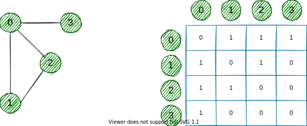

## 数据结构 (四) - 图 (Graph)  
### 简介

图 (Graph) 是由顶点的`有穷非空集合`和顶点之间`边集合`组成，通常表示为：`G (V，E)` 。其中，G 表示一个图，**V (vertex)** 是顶点集合，**E (edge)** 是边集合。


对于上面的图可以这么去描述：

``` text
V = {0, 1, 2, 3}
E = {(0,1), (0,2), (0,3), (1,2)}
G = {V, E}
```

图可以分为`无向图` (undirected graph) 和`有向图` (directed graph) ：


### 术语

* `邻接 (Adjacency)`：一个顶点与另一个顶点直接相连，那么可以说这两个顶点相邻；
* `路径 (Path)`：表示一个顶点到另一个顶点所有的边序列；

### 图的表示

图的表示通常有`邻接矩阵` (Adjacency Matrix) 和`邻接表` (Adjacency List) 表示。

#### 邻接矩阵

一个相邻矩阵是一个 `VxV` 的二维数组，每一`行`和每一`列`表示顶点。

若任意一个矩阵元素 `a[i][j]` 的值为`1`，则表示一条边连接顶点 `i` 和顶点 `j` 。

下面是一个邻接矩阵的表示：



因为上面的图是一个无向图，对于边 (0,2) 的位置，我们同样能够用边 (2,0) 表示，所以可以看到一个无向图的矩阵是`对角线对称`的。

在一个邻接矩阵表示里，边的查找是极为快速的，但是需要对每个可能的相连顶点预留边的空间，所以这种表示方式要求更多的存储空间。

#### 邻接表

一个邻接表是由链表作为元素的一个数组。

数组的`索引`表示一个顶点，每个数组元素中`链表`表示其它顶点与当前索引顶点的构成的边集。


对于有限存储空间情况下，采用一个邻接表是非常有效的数据结构，因为我们只需要存储边界值。对于包含百万级顶点的图来说，它能节省更多空间。

#### 边缘列表

存储所有边的列表，每个边以 (起点, 终点) 的形式表示。

* **适用场景**：Bellman-Ford 最短路径算法
* **示例**：对于上述图，边缘列表为 [(0,1), (0,2), (1,2)]。

### 稀疏图和稠密图

* **稀疏图**：通常指边的数量相对较少的图。一般来说，如果图中边的数量远远小于顶点数量的平方，即 $E \ll V^2$（其中 $E$ 是边的数量，$V$ 是顶点的数量），则可认为是稀疏图。
  
  例如，在一个有 $n$ 个顶点的图中，边的数量可能只有 $O(n)$ 或 $O(n \log n)$ 级别，这样的图就是稀疏图。如树这种特殊的图结构，它的边数为 $n - 1$（$n$ 为顶点数），是典型的稀疏图。
* **稠密图**：与稀疏图相反，是指边的数量相对较多的图。当图中边的数量接近顶点数量的平方，即 $E \approx V^2$ 时，通常被认为是稠密图。
  
  比如完全图，它的每两个顶点之间都有一条边相连，边的数量为 $n(n - 1)/2$（$n$ 为顶点数），是一种极端的稠密图。

#### 特点

* **稀疏图**
  * **存储方面**：由于边少，使用`邻接矩阵`存储会`浪费大量空间`，因为邻接矩阵中大部分元素都是表示不存在边的 0。而采用邻接表存储方式更为合适，它可以只存储存在的边，大大节省存储空间。
  * **算法复杂度方面**：在一些图算法中，如`深度优先搜索`、`广度优先搜索`等，时间复杂度通常与边的数量 $E$ 和顶点数量 $V$ 相关，对于稀疏图，算法的时间复杂度往往较低，例如 **Prim 算法**用于求最小生成树时，在稀疏图上的`时间复杂度`可以优化到 $O(E + V\log V)$。
* **稠密图**
  * **存储方面**：使用`邻接矩阵`存储稠密图`较为合适`，虽然会占用 $V^2$ 的空间，但访问和修改边的信息非常高效，可以在 $O(1)$ 的时间内判断两个顶点之间是否有边相连。
  * **算法复杂度方面**：在稠密图中，一些算法的时间复杂度可能会相对较高。例如 **Dijkstra 算法**用于求单源最短路径时，在稠密图上的`时间复杂度`为 $O(V^2)$。

应用场景

* **稀疏图**
  * **社交网络**：在大型社交网络中，虽然用户数量众多，但每个用户的好友数量相对整个用户群体来说是较少的，所以可以用稀疏图来表示用户之间的关系。
  * **电路设计**：在集成电路设计中，各个元件之间的连接关系通常是稀疏的，因为每个元件不会与其他所有元件都有连接，用稀疏图来建模可以更高效地进行电路分析和设计。
* **稠密图**
  * **交通网络规划**：在城市的交通网络中，如果考虑所有路口之间的直接连接关系，可能会形成一个相对稠密的图，因为很多路口之间都有道路直接相连，便于分析交通流量和规划路线等。
  * **任务调度**：在某些任务调度问题中，如果任务之间的依赖关系非常复杂，几乎每个任务都与其他很多任务有依赖关系，就可以用稠密图来表示任务之间的关系，以便进行合理的调度安排。

#### 比较与选择

以下表格总结了三种方法的复杂性对比：

| 方法          | 空间复杂度 | 检查是否含边时间复杂度 | 遍历邻居时间复杂度 | 适用场景       |
|---------------|------------|------------------|--------------------|----------------|
| 邻接矩阵      | O(V²)      | O(1)             | O(V)              | 稠密图         |
| 邻接列表      | O(V + E)   | O(节点的度数)    | O(节点的度数)     | 稀疏图         |
| 边缘列表      | O(E)       | O(E)             | O(E)              | 边数少，简单操作 |

### 图的操作

大部分通用的图包含以下几个操作：

* 检测其元素是否在图中；
* 图的遍历；
* 添加元素 (边和顶点) ；
* 找出一个顶点到另一个顶点的路径。

### 生成树

#### 无向图和连通图

在理解生成树 (Spanning tree) 之前，我们需要知道下面两种图：`无向图` (undirected graph) 和`连通图` (connected graph) ，上面的例子都是无向图。


* 一个无向图的边没有任何方向信息，换句话说它的边是双向的；
* 一个连通图任意一个顶点到另一个顶点的总能找到一条路径。

#### 生成树的例子

一个生成树是一个无向连通图的子图，该图的`所有顶点都有最小化边的个数`，若一个顶点消失，就不再是一个生成树。


#### 最小生成树

一个最小生成树是所有边的权重总和最小。

#### 生成树的应用

* 计算机网络路由协议；
* 集群分析；
* 民用电网规划。

#### 最小生成树的应用

* 地图上寻找最短路径；
* 设计网络 (例如：电话网络、水供给网络、电网等等) 。
