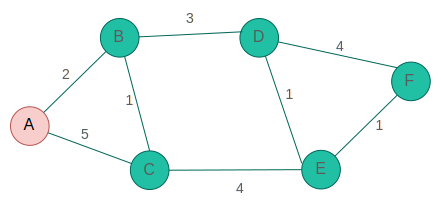
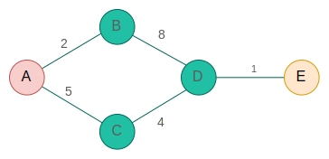

## 最短路径问题 (一) - Dijkstra 算法 
### **Dijkstra 算法**

[Dijkstra](https://en.wikipedia.org/wiki/Edsger_W._Dijkstra) 算法 (/ˈdaɪkstrəz/, 1930-2002)

- **设计目标**：通过一个固定`源点`找到`所有顶点`最短的路径。
- **算法范式**：贪心策略
- **图的存储结构**：邻接表
- **原理**：通过贪心策略逐步逼近全局最优解。每次选择当前距离**起点**最近的顶点，更新其邻居到起点的距离。使用优先队列优化。
- **适用条件**：边权非负。
- **时间复杂度**：使用优先队列时，O((V+E) log V)。
- **特点**：
  - 无法处理负权边，因已处理的顶点不再更新，可能导致错误。
  - 适合单源最短路径，如`网络路由`（OSPF 协议）。

### 算法逻辑



**步骤0：初始化字典**

- **初始最短距离字典**（起点A为0，其他为无穷大）：

  ```python
  distance = {
      'A': 0, 
      'B': ∞, 
      'C': ∞, 
      'D': ∞, 
      'E': ∞, 
      'F': ∞
  }
  ```

- **候选顶点列表（最小堆）**：仅包含起点 `A(0)`，其他顶点因距离为∞暂不加入。

**步骤1：处理起点A**

- **从A出发，走邻居B和C**：
  - `A→B` 的距离是2，比当前B的∞更小，更新字典：`B: 2`，路径为 `A→B`。
  - `A→C` 的距离是5，比当前C的∞更小，更新字典：`C: 5`，路径为 `A→C`。
- **更新后字典**：

  ```python
  distance = {'A':0, 'B':2, 'C':5, 'D':∞, 'E':∞, 'F':∞}
  ```

- **候选列表更新**：将B(2)和C(5)加入最小堆，按距离排序 → `[B(2), C(5)]`。

**步骤2：选择B（当前最小候选）**

- **从B出发，走邻居C和D**：
  - **B→C**：`A→B→C` 的总距离是 `2+1=3`，比当前C的5更小，**优化字典**：

    ```python
    'C': 3 （路径更新为 A→B→C）
    ```

  - **B→D**：`A→B→D` 的总距离是 `2+3=5`，比当前D的∞更小，**新增路径**：

    ```python
    'D': 5 （路径为 A→B→D）
    ```

- **更新后字典**：

  ```python
  distance = {'A':0, 'B':2, 'C':3, 'D':5, 'E':∞, 'F':∞}
  ```

- **候选列表更新**：
  - C的距离从5优化为3，需重新加入堆（覆盖旧值）。
  - D首次被更新为5，加入堆。
  - 新候选列表排序 → `[C(3), D(5)]`。

**步骤3：选择C（当前最小候选）**

- **从C出发，走邻居E**：
  - **C→E**：`A→B→C→E` 的总距离是 `3+4=7`，比当前E的∞更小，**新增路径**：

    ```python
    'E': 7 （路径为 A→B→C→E）
    ```

- **更新后字典**：

  ```python
  distance = {'A':0, 'B':2, 'C':3, 'D':5, 'E':7, 'F':∞}
  ```

- **候选列表更新**：E(7)加入堆，当前候选列表 → `[D(5), E(7)]`。

**步骤4：选择D（当前最小候选）**

- **从D出发，走邻居E和F**：
  - **D→E**：`A→B→D→E` 的总距离是 `5+1=6`，比当前E的7更小，**优化字典**：

    ```python
    'E': 6 （路径更新为 A→B→D→E）
    ```

  - **D→F**：`A→B→D→F` 的总距离是 `5+4=9`，比当前F的∞更小，**新增路径**：

    ```python
    'F': 9 （路径为 A→B→D→F）
    ```

- **更新后字典**：

  ```python
  distance = {'A':0, 'B':2, 'C':3, 'D':5, 'E':6, 'F':9}
  ```

- **候选列表更新**：
  - E的距离从7优化为6，需重新加入堆。
  - F首次被更新为9，加入堆。
  - 新候选列表排序 → `[E(6), F(9)]`。

**步骤5：选择E（当前最小候选）**

- **从E出发，走邻居F**：
  - **E→F**：`A→B→D→E→F` 的总距离是 `6+1=7`，比当前F的9更小，**优化字典**：

    ```python
    'F': 7 （路径更新为 A→B→D→E→F）
    ```

- **更新后字典**：

  ```python
  distance = {'A':0, 'B':2, 'C':3, 'D':5, 'E':6, 'F':7}
  ```

- **候选列表更新**：F的距离从9优化为7，重新加入堆 → `[F(7)]`。

**步骤6：选择F（最后顶点）**

- **从F出发**：无未处理的邻居，算法结束。
- **最终字典**：

  ```python
  distance = {'A':0, 'B':2, 'C':3, 'D':5, 'E':6, 'F':7}
  ```

遍历顶点的选择策略（贪心策略）：选择距离起始点 A 最短的顶点。

| 顶点（dict） | 步骤0<br>（初始） | 步骤1<br>（处理**A**） | 步骤2<br>（处理**B**） | 步骤3<br>（处理**C**） | 步骤4<br>（处理**D**） | 步骤5<br>（处理**E**） | 步骤6<br>（处理**F**） |
|------|-------------------|-------------------------|-------------------------|-------------------------|-------------------------|-------------------------|-------------------------|
| **A** | 0 ✅              | 0 ✅                    | 0 ✅                    | 0 ✅                    | 0 ✅                    | 0 ✅                    | 0 ✅                    |
| **B** | ∞                 | **A+2=2**              | 2 ✅                    | 2 ✅                    | 2 ✅                    | 2 ✅                    | 2 ✅                    |
| **C** | ∞                 | **A+5=5**              | **B+1=3**              | 3 ✅                    | 3 ✅                    | 3 ✅                    | 3 ✅                    |
| **D** | ∞                 | ∞                      | **B+3=5**              | 5                      | 5 ✅                    | 5 ✅                    | 5 ✅                    |
| **E** | ∞                 | ∞                      | ∞                      | **C+4=7**              | **D+1=6**              | 6 ✅                    | 6 ✅                    |
| **F** | ∞                 | ∞                      | ∞                      | ∞                      | **D+4=9**              | **E+1=7**              | 7 ✅                    |

每一步骤的可选顶点与选择逻辑：

| 步骤 | 当前处理顶点 | 候选列表（最小堆） | 更新操作与结果                                                                 | 更新后候选列表（按距离排序） |
|------|--------------|--------------------|------------------------------------------------------------------------------|----------------------------|
| 0    | -            | **A(0)**           | 初始化，仅A加入候选列表。                                                     | A(0)                      |
| 1    | **A**        | A(0) → 处理完成（A）     | 更新邻居：<br>- B: 0+2=2（加入候选列表）<br>- C: 0+5=5（加入候选列表）         | B(2), C(5)                |
| 2    | **B**        | B(2) → 处理完成（A,B）     | 更新邻居：<br>- C: 原5 → 2+1=3（更新并重新加入候选列表）<br>- D: 2+3=5（加入候选列表） | **C(3)**, D(5)            |
| 3    | **C**        | C(3) → 处理完成（A,B,C）     | 更新邻居：<br>- E: 3+4=7（加入候选列表）                                      | D(5), E(7)                |
| 4    | **D**        | D(5) → 处理完成（A,B,C,D）     | 更新邻居：<br>- E: 原7 → 5+1=6（更新并重新加入候选列表）<br>- F: 5+4=9（加入候选列表） | **E(6)**, F(9)            |
| 5    | **E**        | E(6) → 处理完成（A,B,C,D,E）     | 更新邻居：<br>- F: 原9 → 6+1=7（更新并重新加入候选列表）                      | F(7)                      |
| 6    | **F**        | F(7) → 处理完成（A,B,C,D,E,F）     | 无未处理顶点，算法结束。                                                     | 空                        |

核心逻辑总结：

1. **候选顶点**：每一步仅包含**未被处理且距离非 ∞**的顶点。
2. **选择规则**：从候选顶点中选择**当前距离最小**的顶点进行处理。
3. **不可逆性**：顶点一旦处理，其距离值**不再更新**。

展示每一步处理后各目标顶点的最短路径更新过程：

| 步骤 | 当前处理顶点 | 距离更新操作（关键顶点）                          | **路径变化**                                                                 | 候选列表（最小堆）       |
|------|--------------|--------------------------------------------------|--------------------------------------------------------------------------------------|--------------------------|
| 0    | -            | 初始化：A(0)                                     | **A**: 路径未变化（起点）                                                            | [A(0)]                   |
| 1    | **A**        | B: 0→2, C: 0→5                                   | **B**: A→B（新增）<br>**C**: A→C（新增）                                              | [B(2), C(5)]             |
| 2    | **B**        | C: 5→3（B→C更优）<br>D: ∞→5（B→D）               | **C**: A→B→C（优化路径）<br>**D**: A→B→D（新增）                                      | [C(3), D(5)]             |
| 3    | **C**        | E: ∞→7（C→E）                                    | **E**: A→B→C→E（新增）                                                               | [D(5), E(7)]             |
| 4    | **D**        | E: 7→6（D→E更优）<br>F: ∞→9（D→F）               | **E**: A→B→D→E（优化路径）<br>**F**: A→B→D→F（新增）                                  | [E(6), F(9)]             |
| 5    | **E**        | F: 9→7（E→F更优）                                | **F**: A→B→D→E→F（优化路径）                                                         | [F(7)]                   |
| 6    | **F**        | 无更新                                           | 所有路径已确定                                                                        | 空                       |

**路径变化详解**：

1. **步骤0**（初始化）：  
   - 仅起点 **A** 存在路径（自身），其他顶点无路径。
2. **步骤1**（处理A）：  
   - **B**：通过A直接到达，路径为 `A→B`。  
   - **C**：通过A直接到达，路径为 `A→C`。
3. **步骤2**（处理B）：  
   - **C**：原路径 `A→C`（距离5）被优化为 `A→B→C`（距离3）。  
   - **D**：新增路径 `A→B→D`（距离5）。
4. **步骤3**（处理C）：  
   - **E**：新增路径 `A→B→C→E`（距离7）。
5. **步骤4**（处理D）：  
   - **E**：原路径 `A→B→C→E`（距离7）被优化为 `A→B→D→E`（距离6）。  
   - **F**：新增路径 `A→B→D→F`（距离9）。
6. **步骤5**（处理E）：  
   - **F**：原路径 `A→B→D→F`（距离9）被优化为 `A→B→D→E→F`（距离7）。
7. **步骤6**（处理F）：  
   - 所有路径已确定，无进一步更新。

核心特点：

1. **路径动态优化**：  
   - 每个顶点的路径会随着新顶点的处理被逐步优化（如：C 的路径从 `A→C` 优化为 `A→B→C`）。
   - 优化条件：发现更短的路径时更新（例：步骤4中 D→E 比 C→E 更优）。
2. **路径依赖前驱顶点**：  
   - 路径更新基于当前处理顶点的邻居关系（如：处理 D 时，更新 E 和 F 的路径）。

最终最短路径结果：

| 目标顶点 | 最短路径               | 总距离 |
|----------|------------------------|--------|
| B        | A → B                 | 2      |
| C        | A → B → C             | 3      |
| D        | A → B → D             | 5      |
| E        | A → B → D → E         | 6      |
| F        | A → B → D → E → F     | 7      |

### 算法限制

边权不能为负，否则 Dijkstra 算法就会存在失效。



- **贪心策略的正确性保证**
  - Dijkstra 算法采用了贪心策略，在每一步都选择当前距离源点最短的顶点，并将其加入到已确定最短路径的集合中。当`边权非负`时，这种贪心选择是`安全的`。因为不会出现通过其他未被考虑的顶点和边，能够使已经确定的最短路径长度变得更短的情况。
  - 例如，源点为 A，当前已经确定了到顶点 B 的最短路径长度为 2，且所有边权都非负。那么，不可能存在从其他顶点绕到 B，使得从 A 到 B 的路径长 < 2 的情况。

### 实现

``` py {hl_lines="36-38"}
import heapq

def dijkstra(graph, start):
    """
    使用 Dijkstra 算法计算从起点到所有顶点的最短路径及路径详情
    :param graph: 邻接表表示的图，格式为 {顶点: [(邻居, 边权重), ...]}
    :param start: 起始顶点
    :return: (最短距离字典, 最短路径字典)
    """
    # 初始化最短距离字典：所有节点初始为无穷大，起点为0
    dist = {node: float('inf') for node in graph}
    dist[start] = 0  # 起点到自身的距离为0

    # 初始化前驱节点字典：记录每个节点的最短路径前驱，用于回溯路径
    prev = {node: None for node in graph}

    # 使用优先队列（最小堆）优化节点访问顺序，堆中元素为 (当前已知最短距离, 节点)
    heap = []
    heapq.heappush(heap, (0, start))  # 初始时将起点加入堆

    # 记录已处理的节点，避免重复计算
    visited = set()

    while heap:
        # 弹出堆顶元素：当前距离最小的节点
        current_dist, u = heapq.heappop(heap)

        # 如果节点已被处理过，跳过（堆中可能残留旧数据）
        if u in visited:
            continue
        visited.add(u)  # 标记为已处理

        # 遍历当前节点u的所有邻居
        for v, weight in graph[u]:
            # 松弛操作（Relaxation）：尝试通过u到v找到更短路径
            if dist[v] > dist[u] + weight:
                # 发现更优路径：更新 v 的最短距离
                dist[v] = dist[u] + weight
                # 记录v的前驱节点为u（关键：用于后续路径回溯）
                prev[v] = u
                # 将v及其新距离加入堆中（可能已存在旧值，但新值更小会被优先处理）
                heapq.heappush(heap, (dist[v], v))

    # 构建路径字典：通过前驱字典prev回溯生成路径字符串
    paths = {}
    for node in graph:
        if dist[node] == float('inf'):
            paths[node] = "不可达"  # 处理不可达节点
        else:
            path = []
            current = node
            # 从目标节点回溯到起点
            while current is not None:
                path.append(current)
                current = prev[current]  # 根据前驱逐步向上追溯
            path.reverse()  # 逆序得到从起点到目标的路径
            paths[node] = " → ".join(path)

    return dist, paths  # 返回最短距离和路径字典


# ------------------- 示例测试 ------------------- 
graph = {
    'A': [('B', 2), ('C', 5)],
    'B': [('C', 1), ('D', 3)],
    'C': [('A', 5), ('B', 1), ('E', 4)],
    'D': [('B', 3), ('C', 3), ('E', 1), ('F', 4)],
    'E': [('C', 4), ('D', 1), ('F', 1)],
    'F': [('D', 4), ('C', 1), ('E', 1)],
}

# 计算最短距离和路径
shortest_distances, shortest_paths = dijkstra(graph, start='A')

# 打印结果
print("【最短距离】")
for node, distance in shortest_distances.items():
    print(f"{node}: {distance}")

print("\n【最短路径】")
for node, path in shortest_paths.items():
    print(f"{node}: {path}")
```

``` bash
最短距离：
A: 0
B: 2
C: 3
D: 5
E: 6
F: 7

最短路径：
A: A
B: A → B
C: A → B → C
D: A → B → D
E: A → B → D → E
F: A → B → D → E → F
```

### 边松弛

`边松弛`（Edge Relaxation）这一术语源于对最短路径估计值逐步优化的物理隐喻。其核心思想是通过`逐步放松`路径长度的限制，允许路径被更短的估计值替代，直到收敛到最优解。



从起点 A 开始，目标是 E。

按照 Dijkstra 算法，首先从 A -> B。在 B 点我们可以看到从 A->B->D 的距离总共为 **10**。

但由于 Dijkstra 总是`沿着尚未遍历的最短边走` (B->D = 8 || A->C = 5)，所以取从 A->C 的路径。在 C 点，我们可以看到路径 A->D 的距离仅为 **9**，这使得路径 A->C->D 比 A->B->D 更短。

所以我们将路径更新为 D 并为其分配更低的距离 9。更新图中路径的过程称为`边松弛`。

在代码里操作体现：

```python
# 松弛操作（Relaxation）：尝试通过 u 到 v 找到更短路径
if dist[v] > dist[u] + weight:
    # 发现更优路径：更新 v 的最短距离
    dist[v] = dist[u] + weight
```

#### 公式化



操作 $d[v] \leftarrow \min\left(d[v],\ d[u] + w(u, v)\right)$ 称为松弛，其目的是通过检查边 $(u, v)$ 是否存在更短的路径。

- $s$: 表示**源点** (source)。
- $d[v]$：表示从 s 到 v 的到达成本(距离)。
- $d[u]$：表示从 s 到 u 的到达成本(距离)。
- $v$：表示更新的顶点。
- $w(u, v)$：表示从 $u \rightarrow v$ 的权重(距离)。


##### 声明

若松弛操作前满足：$\delta(s, u) \leq d[u]\ \text{且}\ \delta(s, v) \leq d[v]$，则松弛操作后仍有：$\delta(s, v) \leq d[v]$。

##### 证明

由于每次松弛操作取 $ \min(d[v], d[u] + w(u, v)) $，因此 $ d[v] $ 不会增加。

下界保持性的证明：

- **三角不等式**：对于实际最短路径 $ \delta(s, v) $，都有：$\delta(s, v) \leq \delta(s, u) + w(u, v)$。



- **结合前提条件**：
  - 已知 $ \delta(s, u) \leq d[u] $，代入三角不等式得：$\delta(s, v) \leq d[u] + w(u, v)$。
  - 同时，原前提条件给出 $ \delta(s, v) \leq d[v] $。
- **松弛操作的影响**：
  - 松弛后的 $d[v]$ 新为：$d[v]_{\text{new}} = \min((d[v], \ d[u] + w(u, v)))$
  - 无论选择哪一个值，均有：$\delta(s, v) \leq d[v]_{\text{new}}$

若所有顶点的初始估计值满足：$\delta(s, v) \leq d[v]$，则通过任意次数的松弛操作后，该不等式仍然成立。
