## 最短路径问题 (三) - A* 算法 
### A* 算法

A*（A-Star）是一种**启发式 (heuristic) 搜索算法**，用于在加权图或网格中找到从起点到目标点的**最优路径**。

- **算法范式**：启发式搜索，结合了`最佳优先搜索`与 Dijkstra 算法的特点，利用启发式函数指导搜索方向。
- **存储结构**  
  - **优先队列（开放列表）**：按总代价 $ f(n) = g(n) + h(n) $ 排序，常用二叉堆实现。  
  - **哈希表或集合（关闭列表）**：记录已访问节点，避免重复扩展。
- **时间复杂度**
  - **理论最坏情况**：$ O(b^d) $，其中 $ b $ 为分支因子，$ d $ 为解的深度（与 Dijkstra 相同）。
  - **实际效率**：依赖启发式函数质量，良好启发式可显著减少搜索空间，接近 $ O(d \log d) $。
- **适用条件**  
  - **可采纳的启发式函数**：$ h(n) \leq $ 实际到目标的代价，确保最优解。  
  - **一致的启发式（可选）**：满足 $ h(n) \leq c(n, n') + h(n') $，提升效率。  
  - **明确目标状态**：需预先定义目标并计算启发式估计。
- **算法原理**  
  - **评估函数**：$ f(n) = g(n) + h(n) $，权衡实际代价 $ g(n) $（起点到 n）与启发式估计 $ h(n) $（n 到目标）。  
- **特点**
  - 高效用于路径规划（如：地图导航）。
  - Dijkstra 是 A* 在 h(n)=0 时的特例。
- **优缺点**
  - **优点**：  
    - 保证最优解（可采纳启发式下）。  
    - 比 Dijkstra 更快，尤其在大规模图中。  
    - 灵活适应不同场景（通过调整 $ h(n) $）。  
  - **缺点**：  
    - **空间复杂度高**：需存储开放和关闭列表，$ O(n) $ 内存。  
    - **启发式依赖**：差启发式可能导致效率低下。  
    - **无法处理动态权重**：边变化需重新计算。  
- **示例对比**：
  - **Dijkstra**：无启发式（$ h(n) = 0 $），盲搜索，保证最优但效率低。  
  - **贪心最佳优先**：仅用 $ h(n) $，快但未必最优。  
  - **A***：平衡二者，效率与最优性兼得。  

**应用场景**：游戏路径规划、机器人导航、地图应用（如 Google Maps）、拼图问题等需最短路径的领域。  
**改进方向**：`迭代加深 A*` (IDA*)、`动态加权 A*` 等变体优化内存或效率。

**权重和代价**

| **概念**          | **权重（Weight）**                     | **代价（Cost）**                     |
|-------------------|---------------------------------------|-------------------------------------|
| **定义**          | 图中边的固有属性，表示两个节点间的“距离”或“成本” | A* 中节点的评估值，由实际路径成本（`g(n)`）和启发式估计（`h(n)`）共同构成 |
| **作用范围**       | 静态的、固定的（边的属性）               | 动态的、路径相关的（依赖路径选择和启发式估计） |
| **计算方式**       | 直接取自图的边属性                      | `f(n) = g(n) + h(n)`，其中 `g(n)` 是从起点到当前节点的累积权重之和 |

### 如何选择搜索节点？

遍历`相邻`节点，评估出离终点**更近**的一个节点进行搜索。



从 `n` 到`终点`的路径选择中，评估出走 `g` 节点更接近终点。

**核心公式**：$f(n) = g(n) + h(n)$

- **$ g(n) $**: 从`起点`到当前节点 $n$ 的**实际累积代价**(权重之和)。
- **$ h(n) $**: 从当前节点 $n$ 到`终点`的**启发式估计代价**（通过`启发函数` (heuristic) 计算）。
- **$ f(n) $**: $n$ 的节点的`综合优先级评估值`(评估出来的总代价)，用于决定下一步扩展的节点。



### 启发函数

每一次选择下一个搜索节点，都需要进行下个节点的启发式计算。相比 Dijkstra 算法，每一步只需要选择代价(权重)最小的节点即可。

若启发式函数 `h(n) = 0`，则 A* 便退化为 Dijkstra 算法，此时代价 f(n) = g(n)，仅由权重累积决定。

#### 要求

- **可采纳性（Admissibility）**：$ h(n) $ **必须**是**乐观估计**。即要求启发函数计算的距离**必须** ≤ `n -> 终点`的最短路径。
  - 保证算法能找到最短路径。  
- **一致性（Consistency）**：对`任意相邻节点` $ n $ 和 $ m $，总是满足 $ \text{cost}(n \to m) + h(m) \ge h(n)$。  
  - 保证路径代价单调递增，搜索过程中无需重新处理节点（类似 Dijkstra）。

在满足以上两条要求之后，可以考虑启发函数的`计算效率`。例如在实际应用中，网格图可以采用`曼哈顿距离`来实现，因为它的计算更简单。

#### 常见启发式距离

**欧几里得距离**（Euclidean Distance）

- **数学定义**：两点在平面或空间中的**直线距离**。 
- **公式**（二维）：$d_{\text{euclidean}} = \sqrt{(x_2 - x_1)^2 + (y_2 - y_1)^2}$
- **代码**：
  ```python
  def heuristic(a, b):
      """欧几里得距离（适用于八方向或自由移动）"""
      dx = abs(a[0] - b[0])
      dy = abs(a[1] - b[1])
      return (dx**2 + dy**2)**0.5  # 或近似计算提高效率
  ```

**曼哈顿距离**（Manhattan Distance）

- **数学定义**：两点在网格状路径上沿轴对齐方向移动的总步数。
- **公式**（二维）：$d_{\text{manhattan}} = |x_2 - x_1| + |y_2 - y_1|$
- **代码**：
  ``` python
  def heuristic(a: Tuple[int, int], b: Tuple[int, int]) -> float:
    """曼哈顿距离（适用于四方向移动）"""
    return abs(a[0] - b[0]) + abs(a[1] - b[1])
  ```

**其他距离度量**

- **切比雪夫距离（Chebyshev Distance）**
  - **公式**：$d_{\text{chebyshev}} = \max(|x_2 - x_1|, |y_2 - y_1|)$
  - **适用场景**：允许八方向移动（对角线+四方向），每步代价为1。  
- **对角距离（Octile Distance）**
  - **公式**：$d_{\text{octile}} = \max(dx, dy) + (\sqrt{2} - 1) \cdot \min(dx, dy)$
  - **适用场景**：允许八方向移动，对角线步代价为 $\sqrt{2}$（更贴近实际）。  

#### 如何选择？

1. **移动方式**：  
   - 四方向 → 曼哈顿距离  
   - 八方向 → 对角距离或切比雪夫距离  
   - 自由移动 → 欧几里得距离  
2. **效率与最优性权衡**：
   - 曼哈顿距离保守但保证最优，欧几里得距离高效但需验证`可采纳性`。  
3. **动态调整**：  
   - 在复杂环境中可混合使用多种启发函数（如加权平均）。  

### 算法逻辑

1. **初始化**：将起点加入开放列表（Open List），优先级由 $ f(n) $ 决定。  
2. **循环**：  
   - 从开放列表中取出 $ f(n) $ 最小的节点 $ n $。  
   - 若 $ n $ 是目标点，回溯路径并结束。  
   - 否则，将 $ n $ 移入关闭列表（Closed List），并扩展其相邻节点。  
   - 对每个相邻节点 $ m $：  
     - 计算新的 $ g(m) = g(n) + \text{cost}(n \to m) $。  
     - 若 $ m $ 未被访问过，或新 $ g(m) $ 更优，则更新 $ m $ 的优先级并加入开放列表。  

#### 1. 初始化

- **创建数据结构**：
  - **开放列表（Open List）**：存储`待探索`的节点，按优先级排序（通常用最小堆实现，按 `f(n)` 升序排列）。
  - **关闭列表（Closed List）**：存储`已探索`的节点，避免重复处理。
  - **父节点记录（Came From）**：字典或哈希表，记录每个节点的前驱节点，用于路径回溯。
  - **代价记录（g-values）**：记录从`起点`到`每个节点`的实际代价 `g(n)`。
  
- **起点加入开放列表**：
  ```python
  start_node = Node(start_pos, g=0, h=heuristic(start_pos, end_pos))
  heapq.heappush(open_list, start_node)
  ```

#### 2. 主循环处理节点

**重复以下步骤，直到找到目标或开放列表为空**：
- **从开放列表中取出 `f(n)` 最小的节点**：
  ```python
  current_node = heapq.heappop(open_list)
  ```
  - 选择 `f(n) = g(n) + h(n)` 最小的节点，保证优先探索最有希望的路径。

- **检查是否到达终点**：
  ```python
  if current_node.pos == end_pos:
      return reconstruct_path(came_from, current_node)
  ```
  - 若到达终点，通过 `came_from` 回溯路径。

- **将当前节点移入关闭列表**：
  ```python
  closed_list.add(current_node.pos)
  ```
  - 标记该节点已处理，避免重复探索。

- **扩展当前节点的相邻节点**：
  - 遍历所有可能的移动方向（如四方向或八方向）。
  ```python
  for dx, dy in directions:
      x, y = current_node.x + dx, current_node.y + dy
      next_pos = (x, y)
  ```

- **处理每个相邻节点**：
  1. **跳过非法节点**：
     ```python
     if 超出边界 or 障碍物:
         continue
     ```
  2. **计算新 `g(n)` 值**：
     ```python
     new_g = current_node.g + cost(current_node.pos, next_pos)
     ```
     - `cost` 是移动代价（如平地为1，沼泽为2）。
  3. **检查是否已探索过该节点**：
     - **若节点已在关闭列表**：跳过（除非发现更优路径）。
     - **若节点不在开放列表或 `new_g` 更小**：
       ```python
       if next_pos not in g_values or new_g < g_values[next_pos]:
           update g_values[next_pos] = new_g
           new_h = heuristic(next_pos, end_pos)
           new_node = Node(next_pos, new_g, new_h)
           heapq.heappush(open_list, new_node)
           came_from[next_pos] = current_node.pos
       ```
       - 更新或添加节点到开放列表，并记录父节点。

#### 3. 路径回溯

- **从终点反向追踪到起点**：
  ```python
  def reconstruct_path(came_from, current_node):
      path = []
      while current_node in came_from:
          path.append(current_node.pos)
          current_node = came_from[current_node]
      path.append(start_pos)
      return path[::-1]  # 反转得到正向路径
  ```

#### 4. 无路径处理

- **开放列表为空且未找到终点**：
  ```python
  return []  # 表示起点到终点不可达
  ```

**关键概念解释**

**1. 为什么使用开放列表和关闭列表？**

- **开放列表**：动态维护`待探索`的节点，确保优先处理`最有希望`的路径（`f(n)` 最小）。
- **关闭列表**：避免重复处理已确定最优路径的节点，提高效率。

**2. 启发函数 `h(n)` 的作用**

- **引导搜索方向**：通过估计当前节点到终点的代价，优先探索靠近目标的区域。
- **可采纳性（Admissibility）**：必须满足 `h(n) ≤ 实际代价`，否则可能错过最优路径。
- **一致性（Consistency）**：保证 `h(n) ≤ cost(n→m) + h(m)`，避免路径代价波动。

**3. 为什么 A\* 能保证找到最短路径？**

- 当 `h(n)` 可采纳时，A* 在扩展节点时优先处理真实代价更低的路径，确保不会遗漏更优解。
- 与贪心算法不同，A* 通过 `g(n)` 保证已探索路径的实际代价准确性。

### 与其他算法的对比

| **算法**         | **核心策略**                 | **优点**                     | **缺点**                     |
|------------------|-----------------------------|-----------------------------|-----------------------------|
| **A***           | `f(n) = g(n) + h(n)`        | 高效且保证最优（h(n)可采纳）| 依赖启发函数设计             |
| **Dijkstra**     | `g(n)` 最小优先              | 保证最短路径                 | 搜索范围大，效率低           |
| **贪心最佳优先** | `h(n)` 最小优先              | 搜索速度快                   | 不保证最优路径               |

### 实现优化建议

1. **优先队列优化**：使用斐波那契堆降低插入和提取操作的时间复杂度。
2. **启发函数选择**：
   - 四方向移动 → 曼哈顿距离。
   - 八方向移动 → 对角距离或切比雪夫距离。
3. **动态权重**：调整 `f(n) = g(n) + w*h(n)`（`w>1` 加快搜索，但可能牺牲最优性）。

### 实现

``` py
import heapq
from typing import List, Tuple, Dict

class Node:
    def __init__(self, pos: Tuple[int, int], g: float = 0, h: float = 0):
        self.pos = pos      # 节点坐标 (x, y)
        self.g = g          # 起点到当前节点的实际代价
        self.h = h          # 启发式估计代价
        self.f = g + h      # 综合优先级
    
    def __lt__(self, other) -> bool:
        return self.f < other.f  # 优先队列按 f 值排序

def heuristic(a: Tuple[int, int], b: Tuple[int, int]) -> float:
    """曼哈顿距离（适用于四方向移动）"""
    return abs(a[0] - b[0]) + abs(a[1] - b[1])

def a_star(grid: List[List[int]], start: Tuple[int, int], end: Tuple[int, int]) -> List[Tuple[int, int]]:
    """
    A* 算法实现
    :param grid: 二维数组，0 表示可通行，1 表示障碍物
    :param start: 起点坐标 (x, y)
    :param end: 终点坐标 (x, y)
    :return: 最短路径的坐标列表，若无路径则返回空列表
    """
    rows, cols = len(grid), len(grid[0])
    directions = [(-1, 0), (1, 0), (0, -1), (0, 1)]  # 上下左右四方向
    
    open_heap = []          # 优先队列（按 f 值排序）
    heapq.heappush(open_heap, Node(start, 0, heuristic(start, end)))
    
    came_from: Dict[Tuple[int, int], Tuple[int, int]] = {}  # 记录父节点
    g_values = {start: 0}   # 记录每个节点的最小 g 值
    
    while open_heap:
        # 获取当前节点
        current_node = heapq.heappop(open_heap)
        
        # 若到达终点，则回溯路径
        if current_node.pos == end:
            path = []
            current = current_node.pos
            while current in came_from:
                path.append(current)
                current = came_from[current]
            path.append(start)
            return path[::-1]  # 反转得到从起点到终点的路径
        
        # 探索当前节点的 4 个方向
        for dx, dy in directions:
            # 对其中 1 个节点（next_pos）方向进行探索
            x, y = current_node.pos[0] + dx, current_node.pos[1] + dy
            next_pos = (x, y)
            
            # 确保 next 节点在图内、剔除障碍物节点
            if 0 <= x < rows and 0 <= y < cols and grid[x][y] == 0:
                # 计算 next g(m) = g(n) + cost(n -> m)
                new_g = current_node.g + 1  # 假设每步代价为 1
                
                # 如果新路径更优，则更新
                if next_pos not in g_values or new_g < g_values[next_pos]:
                    g_values[next_pos] = new_g
                    new_h = heuristic(next_pos, end)
                    new_node = Node(next_pos, new_g, new_h)
                    heapq.heappush(open_heap, new_node)
                    came_from[next_pos] = current_node.pos
    
    return []  # 无路径

# 示例用法
if __name__ == "__main__":
    # 0=可通行, 1=障碍物
    grid = [
        [0, 0, 0, 0, 0],
        [0, 1, 1, 1, 0],
        [0, 1, 0, 0, 0],
        [0, 1, 0, 1, 0],
        [0, 0, 0, 1, 0]
    ]
    
    start = (0, 0)
    end = (4, 4)
    
    path = a_star(grid, start, end)
    print("路径坐标:", path)  # 输出: [(0,0), (0,1), (0,2), (1,3), (2,4), (3,4), (4,4)]
```