## 最短路径问题 (二) - Bellman Ford 算法 
### 简介

Bellman-Ford 算法得名于两位杰出的数学家：[理查德·贝尔曼](https://en.wikipedia.org/wiki/Richard_E._Bellman)（Richard Bellman，1920–1984）和[莱斯特·福特](https://en.wikipedia.org/wiki/L._R._Ford_Jr.)（Lester Ford Jr.，1927–2017）。

> Richard Ernest Bellman: /ˈrɪtʃərd ˈɜːrnɪst ˈbelmən/; Lester Ford Jr.: /ˈlestər fɔːrd dʒuːniər/

贝尔曼是应用数学领域的先驱，以**动态规划** (Dynamic Programming) 的发明者闻名。他在优化问题、控制理论和微分方程领域有深远影响。贝尔曼方程（Bellman Equation）是强化学习的基础。

> “动态规划的名称，是为了掩盖我在为数学研究申请军事经费时，避免使用‘数学’这个词的尴尬。” -- 贝尔曼

Bellman-Ford 算法相比 Dijkstra 算法能够处理`负权边`的图，并检测负权环的存在。

贝尔曼提供了理论框架（动态规划），福特完善了算法实现（迭代与检测机制），而摩尔贡献了优化思路。

贝尔曼的动态规划框架天然支持对负权边的分析，而福特则从图论角度证明了算法的收敛性。

### Bellman Ford 算法

- **算法范式**：动态规划。通过逐步优化路径估计值，V-1 次松弛所有边确保最短路径，最后检测负权环。
- **图的存储结构**：边缘列表
- **时间复杂度**：O(V·E)，其中 V 为顶点数，E 为边数。
- **适用条件**：允许负权边，能检测负权环（如套汇问题）。
- **算法原理**：
  - **松弛操作**：通过逐步逼近最短路径，每次迭代至少修正一个顶点的最短距离。
  - **迭代次数**：最短路径最多含 |V|-1 条边，故需 |V|-1 次迭代确保收敛。
  - **负权环检测**：若第|V|次迭代仍可松弛，说明存在无限缩短路径的负权环。
- **特点**：
  - 可报告从源点可达的负权环。
  - 适用于分布式系统（如RIP协议）。

### 最短路径的结构特性



在图中，任意两顶点之间的**简单路径**（不重复经过顶点的路径）最多包含 $ |V|-1 $ 条边。

- **原因**：如果一条路径有 $|V|$ 条边，则它必须经过 $|V| + 1$ 个顶点，但图中只有 $|V|$ 个顶点，因此必然存在重复的顶点，形成**环**。  
- **结论**：若图中不存在负权环，最短路径一定是简单路径，其边数不超过 $ |V|-1 $。

> $|V|$：表示顶点集合的大小，计算机科学中的标准写法，与数学绝对值无关。

Bellman-Ford 算法需要进行 $ |V|-1 $ 次迭代（$ V $ 为顶点数），这一设计的核心原因与**最短路径的结构特性**和**算法的松弛机制**密切相关。

### 松弛操作的逐步传播

Bellman-Ford 通过松弛 $d[v] \leftarrow \min\left(d[v],\ d[u] + w(u, v)\right)$ 所有边来逐步修正最短距离。每次迭代至少能确定一层顶点的最短路径：  
- **第 1 次迭代**：找到从源点出发经过 **1 条边**可达的最短路径。  
- **第 2 次迭代**：找到经过 **2 条边**可达的最短路径。  
- **...**  
- **第 $ |V|-1 $ 次迭代**：找到经过最多 $ |V|-1 $ 条边的最短路径。  

**最坏情况示例**：  
若最短路径是一条链式结构（如 $ A \to B \to C \to D $），每次迭代只能松弛一条边，因此需要 $ |V|-1 $ 次迭代才能覆盖最长路径。

### 负权环的检测逻辑
在第 $ |V| $ 次迭代中，如果仍能松弛某条边，则说明存在**从源点可达的负权环**：  
- 负权环的路径权值和可以无限降低（如 $ -2 \to -1 \to -3 \to ... $），导致最短路径无界。  
- $ |V|-1 $ 次迭代已足够确保所有简单路径的松弛完成，因此第 $ |V| $ 次松弛成功即表明存在负权环。

### 对比 Dijkstra 算法
Dijkstra 算法假设边权非负，每次选择当前最短距离的顶点，通过贪心策略只需 $ O(|E| + |V|\log|V|) $ 时间。而 Bellman-Ford 必须处理负权边，因此需要更保守的 $ |V|-1 $ 次全局松弛，确保覆盖所有可能情况。

### 算法逻辑

1. **初始化**：`源点`距离设为 `0`，其他顶点设为`无穷大`（∞）。
2. **松弛迭代**：进行|V| -1 次迭代（V 为顶点数），每次遍历所有边，对每条边 (u, v) 进行松弛操作：
   - 若 `d[v] > d[u] + w(u, v)`，则更新 `d[v] = d[u] + w(u, v)`。
3. **负权环检测**：再遍历所有边一次，若仍存在可松弛的边，则存在从源点可达的负权环。

### 实现

``` py {hl_lines="21-22"}
def bellman_ford(graph_edges, num_vertices, source):
    """
    Bellman-Ford算法实现：计算单源最短路径，并检测负权环
    :param graph_edges: 图的边列表，格式为 [(u, v, w), ...]，u为起点，v为终点，w为边权
    :param num_vertices: 图的顶点总数（顶点编号需从0开始连续）
    :param source: 源点编号
    :return: 
        - 若存在负权环：返回 (None, None, "存在从源点可达的负权环")
        - 若正常：返回 (distance数组, predecessor数组, "无负权环")
    """
    # 初始化距离数组和前驱顶点数组
    distance = [float('inf')] * num_vertices  # 距离初始化为无穷大
    predecessor = [None] * num_vertices      # 前驱顶点初始化为 None
    distance[source] = 0                     # 源点到自身的距离为 0

    # 松弛所有边，进行 V-1 轮迭代（V 为顶点数）
    for _ in range(num_vertices - 1):
        updated = False  # 标记本轮是否更新了距离
        for u, v, w in graph_edges:
            # 如果发现更短的路径，则更新 distance 和 predecessor
            if distance[u] + w < distance[v]:
                distance[v] = distance[u] + w
                predecessor[v] = u
                updated = True
        # 如果本轮未更新，提前终止以优化性能
        if not updated:
            break

    # 检测负权环：再进行一次全边松弛
    has_negative_cycle = False
    for u, v, w in graph_edges:
        if distance[u] + w < distance[v]:
            # 如果仍能松弛，说明存在从源点可达的负权环
            has_negative_cycle = True
            break

    if has_negative_cycle:
        return None, None, "存在从源点可达的负权环"
    else:
        return distance, predecessor, "无负权环"


def print_shortest_path(predecessor, distance, source):
    """
    打印从源点到各顶点的最短路径和距离
    """
    print(f"源点: {source}")
    for i in range(len(distance)):
        if i == source:
            continue
        path = []
        current = i
        # 从终点回溯前驱顶点，直到源点
        while current is not None:
            path.append(current)
            current = predecessor[current]
        path.reverse()  # 反转路径，得到从源点到终点的顺序
        if distance[i] == float('inf'):
            print(f"顶点 {i}: 不可达")
        else:
            print(f"顶点 {i}: 距离 = {distance[i]}, 路径: {' -> '.join(map(str, path))}")

# ------------------- 示例测试 -------------------
if __name__ == "__main__":
    # 示例1：无负权环的图
    edges_1 = [
        (0, 1, 4), (0, 2, 5),
        (1, 3, 7), (2, 1, -2),
        (2, 3, 1), (3, 4, 3)
    ]
    num_vertices_1 = 5
    source_1 = 0

    # 执行算法
    dist, pred, msg = bellman_ford(edges_1, num_vertices_1, source_1)
    print("----- 示例1结果 -----")
    print(msg)
    if dist is not None:
        print_shortest_path(pred, dist, source_1)

    # 示例2：含负权环的图
    edges_2 = [
        (0, 1, 1), (1, 2, -1),
        (2, 3, -1), (3, 1, -1)  # 环 1->2->3->1，总权值为-3
    ]
    num_vertices_2 = 4
    source_2 = 0

    # 执行算法
    dist, pred, msg = bellman_ford(edges_2, num_vertices_2, source_2)
    print("\n----- 示例2结果 -----")
    print(msg)
```
