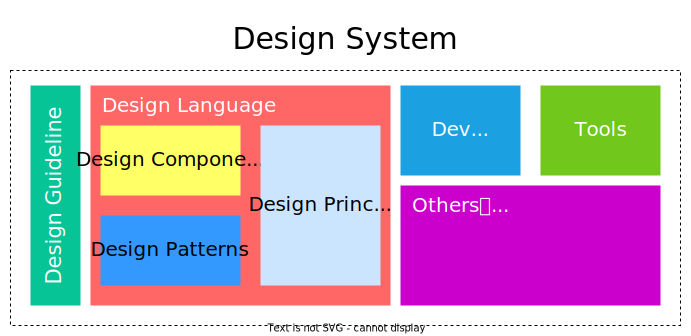
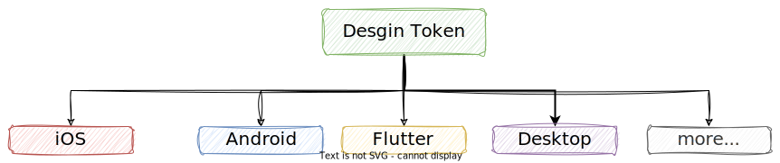
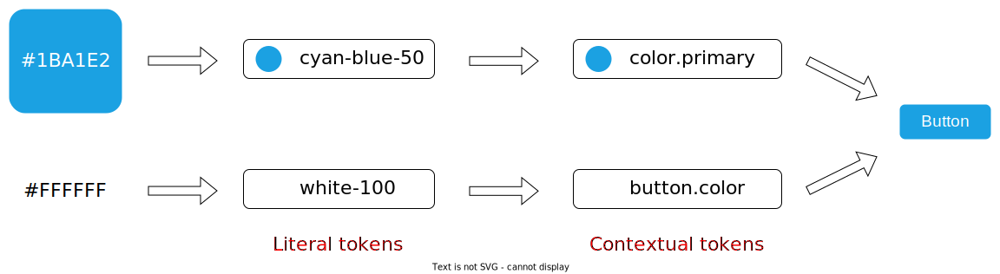
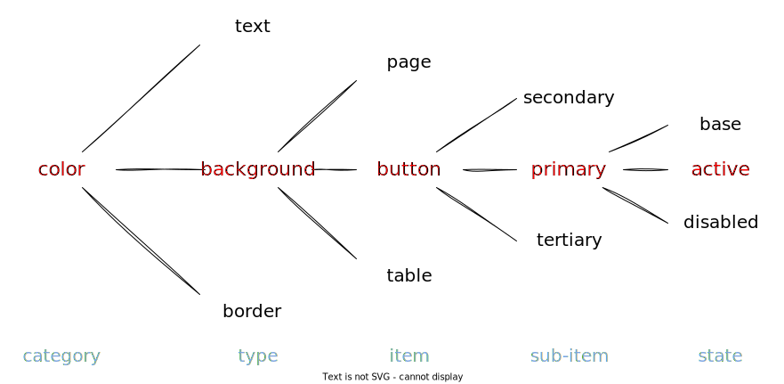
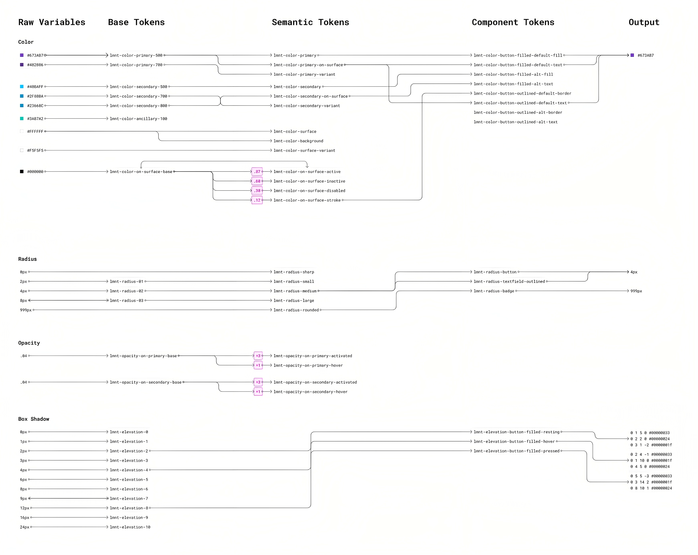

## 构建高效体验技术团队之设计系统 (Design System)  
### 什么是设计系统？

设计系统并不是一个新观念，可以回溯于早期 2013 年 Brad Forst 提出的 [Atomic Design](https://bradfrost.com/blog/post/atomic-web-design/)。Google [Material Design](https://m3.material.io/) 在 2014 年大放异彩。2016 年 [Airbnb](https://karrisaarinen.com/posts/building-airbnb-design-system/) 开始进行创建设计系统。

陆陆续续，许多知名公司包含 [Salesforce](https://www.lightningdesignsystem.com/) , [Atlasssian](https://atlassian.design/) , [Shopify](https://polaris.shopify.com/) 对外公布产品的设计系统，让大众认识设计系统的概要及推广`设计规模化` (modularity) 。

设计系统是一套完整的`标准`，旨在使用可重用的`组件`和`模式`来**大规模**的`管理设计`。

### 为什么需要设计系统？

较具规模的公司往往有多数个产品，有时候你用户使用公司的不同产品时，会发现视觉、使用方式和整个体验感觉像是来自不同的公司。

`市场/平台逐趋成熟`：无论是桌面端产品还是移动端产品，经过这么多年的发展，都较为成熟。大众对产品的品质要求更高。

`创建产品一致性`：不但是在单一产品之内，包含在不同平台及设备间的转换 (iOS, Andriod, Saas, Mobile Web, iPad, or TV, etc) ，都希望能创建产品的连贯性。

`加速开发过程`：由于有统一的设计系统，团队成员可以随时领取元素、同步更新，减少设计与开发反覆确认的过程。

`扩张产品团队`：设计系统是由有清楚规范、一系列可重复利用的元素所组成，当产品`模块化`，可延展性就增加了。

### 设计系统构成

设计系统有两个重要部分：`设计仓库`和`管理团队`。

#### 设计仓库

设计存储库可以采用多种形式，但它们通常包含`样式指南` (Style Guide) 、`组件库` (Component Library) 和`模式库` (Pattern Library) 。



##### 样式指南

样式指南包含用于创建界面或其他设计交付物的特定`实施指南`、`视觉参考`和`设计原则`。

最常见的风格指南倾向于关注品牌 (颜色、排版、商标、徽标和印刷媒体) ，但风格指南也提供有关内容 (如语气和语言推荐) 以及视觉和交互设计的指导标准 (也称为前端风格指南) 。这些指南有时也被合并到组件库中，以在上下文中提供相关指导。

##### 组件库

组件库 (也称为设计库) 是许多人与设计系统相关联的东西：这些完整的库包含预先确定的、可重用的 UI 元素，并为设计人员和开发人员提供了解和实现特定 UI 元素的一站式商店。创建这些库需要大量时间和资源。除了组件的视觉示例外，它们还包括：

* `组件名称`：特定且唯一的 UI 组件名称，避免设计人员和开发人员之间的沟通不畅
* `描述`：清楚地解释这个元素是什么以及它通常是如何使用的，偶尔会附上做和不做的事情，以进行上下文和澄清
* `属性`：可以为特定需求定制或调整组件的变量或调整 (即颜色、大小、形状、副本)
* `状态`：推荐的默认值和随后的外观变化
* `代码片段`：元素的实际代码摘录 (一些设计系统甚至共享多个示例并提供“沙盒”环境来尝试不同的组件定制)

用于实现库的前端和后端框架 (如果适用) ，以避免痛苦和不必要的调试。

##### 模式库

有时，术语**组件库**和**模式库**是同义词；但是，这两种类型的库之间存在区别。

`组件库`指定单独的 UI 元素，而模式库具有 UI 元素`分组`或`布局`的集合。与组件库相比，`模式库`通常被认为不够健壮，但它们可以根据需要尽可能全面或高级。它们通常具有`内容结构`、`布局`或`模板`。就像组件一样，这些模式旨在被重用和调整。

#### 设计系统团队

无论是创建还是改造，设计系统都需要`持续维护`和`监督`，以确保它们不会过时、过时或因多余的条目或提交而过度拥挤。

这个团队的规模可能会有所不同，因为设计系统本身可以采用不同的规模和定制级别。但是，该团队至少应包括`1 名交互设计师`、`1 名视觉设计师`和`1 名开发人员`。

每个人都旨在帮助编写交互设计指南，创建可视化示例，并分别为每个元素提供代码片段和实现规范。理想情况下，如果您的组织明确确定了这些角色，那么团队还应该包括一名`兼职研究员`、`兼职架构师`和`内容作者`。

最后，考虑确保一个`执行发起人` (来自领导层) 来协调设计系统的工作。虽然缺乏发起人不会成为阻碍，但发起人可以确保资金和资源，同时也将设计系统的战略重要性传达给组织的其他成员。

一个成建的完备团队有以下角色：

* 用户体验设计师 UX Designer
* 视觉设计师 Visual Designer
* 动效设计师 Motion Designer
* 内容写手 [Content Copy](https://zhuanlan.zhihu.com/p/33919842)
* 前端工程师 Front End Engineer
* 产品经理 Product Manager

### 设计令牌

`设计令牌` (Design tokens) 是定义`设计体系`中`标准元素`的有用机制，设计令牌的概念在不同的设计系统有很多不同的描述：

在 [Material](https://m3.material.io/foundations/design-tokens/overview) 中，令牌描述为存储样式值，比如颜色和字体。这些值可以被用于设计、代码、工具以及平台。

在 [Lightning](https://www.lightningdesignsystem.com/design-tokens/) 中，令牌描述为设计系统的可视化设计原子。具体来说，它们是存储可视化设计属性的命名实体。我们使用他们替代硬编码值，并用来维护一个可伸缩和一致视觉系统。

在[designbetter 的设计系统手册](https://www.designbetter.co/design-systems-handbook)中，令牌描述为设计系统的实现基础，由名称和值组成的存储数据，用于抽象你需要管理的设计属性。

令牌可以存储：`颜色`、`字体`、`间距`、`透明度`、`行高`、`阴影`、`圆角`、`网格`等值。一个设计系统中，设计令牌是其关键组成部分，**非常的重要**。

**颜色**：

|令牌|值|描述|
|--|--|--|
|$color-gray-1|rgb(255, 255, 255)|灰色颜色 1|
|$color-gray-2|rgb(250, 250, 249)|灰色颜色 2|

**背景颜色**：

|令牌|值|描述|
|--|--|--|
|$color-background|rgb(243, 243, 243)|整个 app 默认背景色|
|$color-background-alt|rgb(255, 255, 255)|整个 app 第二默认背景色|

我们可以通过一个简单的 JSON 文件存储他们：

``` json
{
  "color": {
    "base": {
      "red": { "value": "#ff0000" }
    },
    "background": {
      "primary": { "value": "#eee" },
      "secondary": { "value": "#ccc" },
      "tertiary": { "value": "#999" }
    }
  }
}
```

也可以用 CommonJs 模块来存储，通常 JavaScript 更加灵活。

``` js
// config.js
module.exports = {
  tokens: {
    color: {
      background: {
        primary: { value: "#fff" }
      }
    }
  },
  platforms: {
    //...
  }
}
```

设计令牌通常被集成到组件库中及 UI 工具包里，并且它是`平台无关`及`语言无关`的。设计令牌描述了设计中标准化的所有属性值，并且`不可细分`的。所以在一些定义中描述成`原子性`的值。



#### 令牌的种类

令牌也有不同的抽象级别：



<!-- 以 `material` 设计系统为例，最终设计令牌通过 CLI 工具`格式化`生成对应终端的`属性样式`。 -->
**字面量令牌 (Literal Token)**：字面量令牌的命名无特殊含义，无关情境。例如：#FFFFFF 就可用 white 作为字面量令牌，通常`上下文令牌`已字面量令牌为基础值，也可以称为基础令牌。在 Material 中，被叫做[引用令牌](https://m3.material.io/foundations/design-tokens/how-to-read-tokens#bc81aaf5-fcd8-421b-a5ab-4b1f274c1baf) (Reference Tokens) 。这类令牌包含一个设计系统的所有样式可用选项。

**上下文令牌 (Contextual Token)**：上下文令牌是语境相关的，它有两种：`品牌令牌` (也可以叫语义化令牌) 和`组件令牌`。品牌令牌在 Material 中，这一抽象级别的令牌被叫做[系统令牌](https://m3.material.io/foundations/design-tokens/how-to-read-tokens#20829697-fd3d-4802-b295-96ba564f2e50)。

#### 如何设计令牌？

我们为了考虑设计令牌的完整度，会通过一些方法来快速决策如何较为完备得生成设计令牌。在 [style-dictionary](https://amzn.github.io/style-dictionary/#/tokens?id=category-type-item) 中，通过结构化方法来定义设计令牌。而我们在令牌命名时，也可以采用此思想。

首先，设计令牌名称会被组织成一个`层级树结构`来进行命名，和 [BEM](https://getbem.com/naming/) 命名这类语义化相似，这是我们对`令牌命名的约束`。



通过 **category / type / item** 的命名方式方便理解，同时他们的`先后顺序并不严格要求`，你可以命名 `button_color_error` 或 `error_button_color` 。



文献参考：

\> [https://designtongue.me/design_system_how_to_begin/](https://designtongue.me/design_system_how_to_begin/)

\> [https://24ways.org/2012/design-systems/](https://24ways.org/2012/design-systems/)

\> [https://m3.material.io/foundations/design-tokens/overview](https://m3.material.io/foundations/design-tokens/overview)

\> [https://developer.salesforce.com/docs/atlas.en-us.lightning.meta/lightning/tokens_standard_communities.htm](https://developer.salesforce.com/docs/atlas.en-us.lightning.meta/lightning/tokens_standard_communities.htm)

\> [https://www.zhihu.com/topic/25449246/top-answers](https://www.zhihu.com/topic/25449246/top-answers)

\> [https://www.gerireid.com/design-token-taxonomy.html](https://www.gerireid.com/design-token-taxonomy.html)

\> [https://www.youtube.com/watch?v=Ka1I5TphDb0&ab_channel=IntoDesignSystems](https://www.youtube.com/watch?v=Ka1I5TphDb0&ab_channel=IntoDesignSystems)

\> [https://design-tokens.github.io/community-group](https://design-tokens.github.io/community-group)
