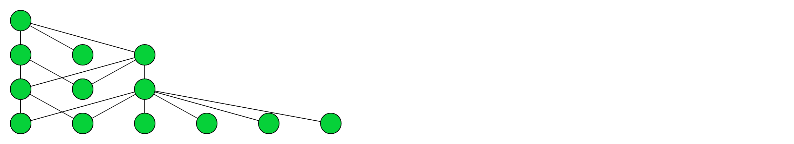
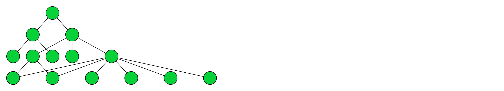

## 树型结构布局算法：Reingold-Tilford 算法 
### 考古

`Reingold-Tilford` 算法最早是 [IEEE 软件工程汇刊](https://zh.wikipedia.org/wiki/IEEE%E8%BD%AF%E4%BB%B6%E5%B7%A5%E7%A8%8B%E6%B1%87%E5%88%8A) 在 1981 年 3 月发表的[文章](https://reingold.co/tidier-drawings.pdf)，作者是 `Edward M. Reingold` 和 `John S. Tilfoid`。旨在创造美观且节省空间的表示方法，保证对称树可以被对称地绘制。

RT 算法以 Wetherell 和 Shannon 关于树形图绘制算法的早期工作为基础，提出了更具美学效果的绘制算法。


### 过程

1. 对树进行`第一次后序遍历`。
2. 如果是`最左边`的节点，则为每个节点分配一个 x 值 `0`，否则为 `LeftSibling.x + 1`。
3. 对于每个`父节点`，希望节点以`子节点`为`中心`。这将是第一个孩子的 x 位置和最后一个孩子的 x 位置之间的中间点。
4. 如果父项没有左同级，请将其 x 值更改为此中点值。如果它有一个左同级，将它存储在另一个节点属性中。称这个属性为 `mod`。
5. mod 属性用于确定修改子节点的 x 值的程度，以便将它们居中到父节点下，并在完成所有计算以确定每个节点的最终 x 值时使用。实际上，它应该设置为 `Parent.x – MiddleOfChildrenX`，以确定要移动子项的正确数量。
6. 检查此树是否与以前的任何同级树不冲突，并根据需要调整 mod 属性。这意味着遍历当前节点中的每个 Y 级别，并检查节点左侧任何同级节点最右侧的 x 值是否与当前节点中任何子节点的最左侧 x 值交叉。
7. 在树中执行`第二次遍历`，以确定不会在屏幕外绘制子项，并根据需要调整 mod 属性。如果 mod 属性为负数，则可能会发生这种情况。
8. 在树中执行`第三次遍历`，以确定每个节点的最终 x 值。这将是节点的 x，加上该节点的所有父节点的所有 mod 值的总和。

### 实现

下面通过 JavaScript 来实现。

#### 初始布局

进行`后序遍历`，为每个节点分配一个 x 值，`node.x = node.previousSlibling.x + 40`。若是最左边的节点，`node.x = 0`。

每个节点 y 值直接根据层级设置即可，`node.y = (level - 1) * 50`。

``` ts
function firstTraverse(node, level = 1, visitor) {

  if (Array.isArray(node.children)) {
    for (let i = 0; i < node.children.length; ++i) {
      const child = node.children[i];
      if (i === 0) {
        child.isLeftMost = true;
      } else {
        child.previousSlibling = node.children[i - 1];
      }
      firstTraverse(child, level + 1, visitor);
    }
  }

  node.y = (level - 1) * 50;
  if (node.isLeftMost || level === 1) {
    node.x = 0;
  } else {
    node.x = node.previousSlibling.x + 90;
  }

  // 访问器，绘制树
  visitor(node);
}
```

visitor 访问器进行节点绘制：

``` ts
// 起始绘制坐标
let startX = 30;
let startY = 30;

const visitor = (node) => {
  // setTimeout 延迟画圆，防止 line 覆盖 circle
  setTimeout(() => {
    // 画圆
    circle(node.x + startX, node.y + startY, 30);
  }, 0)
  if (Array.isArray(node.children)) {
    for (const child of node.children) {
      // 画线
      line(node.x + startX, node.y + startY, child.x + startX, child.y + startY);
    }
  }
}

firstTraverse(data, 1, visitor);
```



第一个步骤中，我们保证了`同级节点`以 `x` 值为 `0` 开始迭代的位置间隔。但可以看到存在节点`位置冲突`的问题。

#### 调整父节点位置

对于每个父节点，我们希望它以子节点为中心。即把它的 x 值设置成第一个孩子的 x 位置和最后一个孩子的 x 位置之间的中间点。

```ts
parentNode.x = (firstChild.x + lastChild.x) / 2;
```

于是我们调整下 `firstTraverse` 函数：

``` ts {hl_lines="16-22"}
function firstTraverse(node, level = 1, visitor) {

  node.y = (level - 1) * 50;

  if (Array.isArray(node.children)) {
    for (let i = 0; i < node.children.length; ++i) {
      const child = node.children[i];
      if (i === 0) {
        child.isLeftMost = true;
      } else {
        child.previousSlibling = node.children[i - 1];
      }
      firstTraverse(child, level + 1, visitor);
    }

    if (node.children.length === 1) {
      node.x = 0;
    } else {
      // 计算当前节点在子节点们的中间位置
      node.x = (node.children[0].x + node.children[node.children.length - 1].x) / 2;
    }
  } else {
    if (node.isLeftMost || level === 1) {
      node.x = 0;
    } else {
      node.x = node.previousSlibling.x + 90;
    }
  }

  visitor(node);
}
```

于是，得到下面的形状：



这一步，我们把父节点放到了子节点们的中间，但同级节点位置冲突问题任然存在。

#### 解决节点位置冲突问题

解决节点位置冲突问题，我们需要计算树的`轮廓` (Contour)。把`右分支`右移足够远的位置，让右分支的`左轮廓`大于左分支的`右轮廓`。

`轮廓`是指树的`每一层`最左和最右`边缘节点`的位置。通过跟踪这些轮廓，算法可以有效地调整树中节点的位置，避免不同分支的节点重叠。



将两个同级节点进行比较，右节点的 x 值 < 左节点的 x 值，则记录右节点的属性 mod = 左节点 x。node.mod 表示将来当前节点做偏移时，只需要执行 node.x + node.mod。

如父级也存在 mod 值时，偏移是叠加的。表现为 parentModSum + node.x + node.mod。

我们对 `firstTraverse` 做再次调整，用于记录 mod 值，用于将来应用 x 的实际值。

```ts

```

参考资料：

\> [https://rachel53461.wordpress.com/tag/reingold-tilford/](https://rachel53461.wordpress.com/tag/reingold-tilford/)

\> [https://graphics.stanford.edu/courses/cs448b-02-winter/lectures/treesgraphs/tree.graph.pdf](https://graphics.stanford.edu/courses/cs448b-02-winter/lectures/treesgraphs/tree.graph.pdf)
