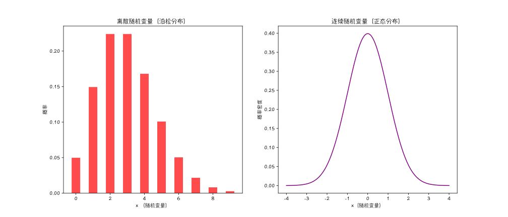
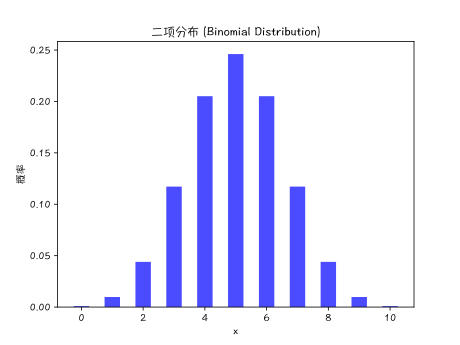
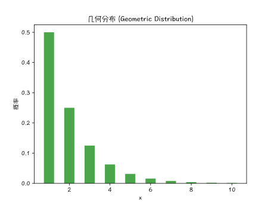
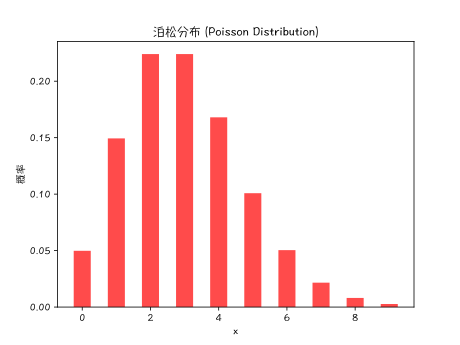
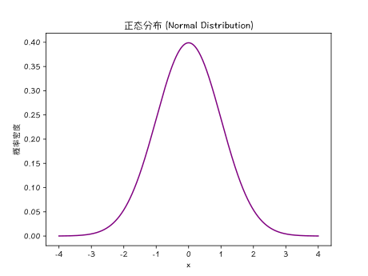
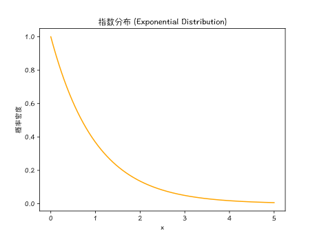
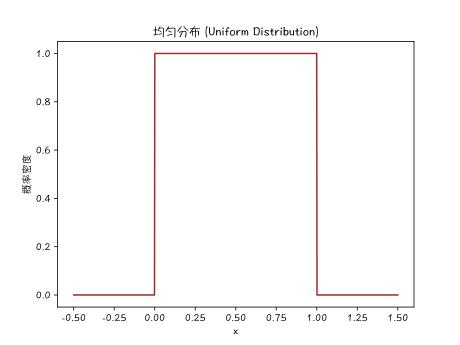
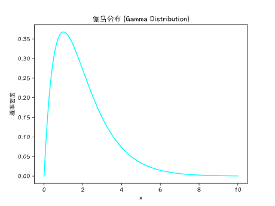

## 概率论 (一) - 概述 
### 简介

概率论 (Probability Theory) 的核心主题包括`离散`和`连续的随机变量`、`概率分布`和`随机过程`。

以下是概率论中的主要概念列表，涵盖了基础和高级概念：

### 基础概念

1. **随机试验 (Random Experiment)**：在相同条件下可以重复进行，并且结果具有不确定性的实验。
2. **样本空间 (Sample Space)**：所有可能结果的集合，通常用 $ S $ 表示。
3. **事件 (Event)**：样本空间的子集，表示一个或多个结果的集合。
4. **互斥事件 (Mutually Exclusive Events)**：两个事件不能同时发生。
5. **独立事件 (Independent Events)**：两个事件的发生与否彼此没有影响。
6. **条件概率 (Conditional Probability)**：在已知 $B$ 事件发生的条件下，$A$ 事件发生的概率，记作 $ P(A|B) $。
7. **全概率公式 (Total Probability Formula)**： $ P(B) = \sum P(B|A_i) \cdot P(A_i) $，其中 $ \{A_i\} $ 是一个划分样本空间的事件集合。
8. **贝叶斯定理 (Bayes' Theorem)**： $ P(A|B) = \frac{P(B|A) \cdot P(A)}{P(B)} $。
9. **随机变量 (Random Variable)**：将样本空间的元素映射到实数的函数，分为`离散型`和`连续型`。
10. **概率分布 (Probability Distribution)**：描述随机变量取值的概率，分为`概率质量函数` (PMF) 和`概率密度函数` (PDF)。

### 概率类型

| 概率类型      | 定义                                                                                     | 公式                                          | 示例                                                     |
| ------------- | ---------------------------------------------------------------------------------------- | --------------------------------------------- | -------------------------------------------------------- |
| **条件概率**  | 在事件 $B$ 已发生的条件下，事件 $A$ 发生的概率                                           | $P(A\|B) = \frac{P(A \cap B)}{P(B)} $  | 已知红球的情况下，抽到大球的概率                         |
| **边缘概率**  | 单个事件发生的概率，不考虑其他事件的发生                                                 | $P(A)$                                   | 抽到大球的概率                                           |
| **联合概率**  | 两个或多个事件`同时发生`的概率                                                             |                            |                                        |
|   |                                                              | $ P(A \cap B) = P(A) \cdot P(B) $  (独立事件)                          | 掷硬币和掷骰子的结果                                       |
|   |                                                              | $ P(A \cap B) = P(A) \cdot P(B\|A) $ (非独立事件)                            | 抽到红色大球的概率                                       |
| **全概率**    | 通过分解事件的所有可能性来计算事件的总概率                                               | $ P(A) = \sum_{i=1}^{n} P(A\|B_i) \cdot P(B_i) $ | 三个袋子中抽到红球的概率                                 |
| **先验概率**  | 在考虑新信息之前，对事件的初步估计                                                       | $ P(A) $                                   | 疾病流行病学数据估计的患病概率                           |
| **后验概率**  | 在获得新信息后，对事件的更新概率估计                                                     | $ P(A\|B) = \frac{P(B\|A) \cdot P(A)}{P(B)} $ | 根据测试结果更新的患病概率                               |
| **似然概率**  | 在给定某个结果的情况下，观察到某个数据的概率                                             | $ P(B\|A) $                                 | 已知患病情况下，测试结果为阳性的概率                     |
| **独立概率**  | 两个事件相互独立，不影响彼此发生的概率                                                   | $ P(A \cap B) = P(A) \cdot P(B) $          | 掷硬币和掷骰子的结果                                     |

#### 条件概率

[条件概率](https://en.wikipedia.org/wiki/Conditional_probability) (Conditional probability) 是指在已知(通过`假设`、`推定`、`断言`或`证据`)事件 $ B $ 已经发生的情况下，事件 $ A $ 发生的概率。

它的公式为：$ P(A|B) = \frac{P(A \cap B)}{P(B)} $

**示例**：假设有一个袋子里有 3 个红球和 2 个蓝球，从中随机抽取一个球，然后不放回再抽取一个球。已知第一次抽到的是红球，求第二次抽到红球的概率：
$ P(R_2|R_1) = \frac{P(R_1 \cap R_2)}{P(R_1)} = \frac{\frac{3}{10}}{\frac{3}{5}} = \frac{1}{2} $

#### 边缘概率

边缘概率是指单个事件发生的概率，不考虑其他事件的发生。

它的公式为：$ P(A) $

**示例**：假设有一个袋子里有 3 个红球和 2 个蓝球，从中随机抽取一个球。抽到红球的边缘概率是：
$ P(\text{红球}) = \frac{3}{5} $

#### 联合概率

联合概率 (Joint Probability) 是指两个或多个事件同时发生的概率。

计算公式：

对于两个事件 $A$ 和 $B$，如果它们是`独立事件`，那么联合概率可以简单地表示为：

$ P(A \cap B) = P(A) \cdot P(B) $

**例子**：投掷两个骰子。假设我们投掷两个骰子，求两个骰子同时为 6 点的概率。

因为两个骰子是独立的，所以联合概率为：$ P(A \cap B) = P(A) \cdot P(B) = \frac{1}{6} \cdot \frac{1}{6} = \frac{1}{36} $

但如果它们是`非独立事件`，联合概率则需要通过`条件概率`来计算：$ P(A \cap B) = P(A) \cdot P(B|A) $ 或者 $ P(A \cap B) = P(B) \cdot P(A|B) $

**例子**：抽牌。假设从一副标准扑克牌（52张）中抽取两张牌，求第一张和第二张都是红色的概率（不放回抽取）。

1. $ P(A) $：第一张是红色的概率：$ P(A) = \frac{26}{52} = \frac{1}{2} $

2. $ P(B|A) $：在第一张是红色的条件下，第二张也是红色的概率：$ P(B|A) = \frac{25}{51} $

所以，联合概率为：$ P(A \cap B) = P(A) \cdot P(B|A) = \frac{1}{2} \cdot \frac{25}{51} = \frac{25}{102} $

##### 联合概率的应用

联合概率在许多领域有广泛的应用，例如：

1. **统计学**：用于分析多变量之间的关系。
2. **机器学习**：在分类和回归模型中，用于计算特征和目标变量之间的联合概率。
3. **风险管理**：在金融和保险领域，用于评估多个风险事件同时发生的概率。
4. **医疗统计**：用于分析不同疾病或症状同时发生的概率。

#### 全概率

全概率是通过分解事件的所有可能性来计算事件的总概率。

它的公式为：$ P(A) = \sum_{i=1}^{n} P(A|B_i) \cdot P(B_i) $

**示例**：假设有三个袋子，每个袋子里都有一些红球和蓝球，随机选择一个袋子，然后从中抽取一个球，求抽到红球的概率。

设事件 $ A $ 为抽到红球，事件 $ B_i $ 为选择第 $ i $ 个袋子，则：
$ P(A) = P(A|B_1) \cdot P(B_1) + P(A|B_2) \cdot P(B_2) + P(A|B_3) \cdot P(B_3) $

$ P(A) = \left(\frac{2}{3}\right) \cdot \left(\frac{1}{3}\right) + \left(\frac{1}{3}\right) \cdot \left(\frac{1}{3}\right) + \left(\frac{3}{7}\right) \cdot \left(\frac{1}{3}\right) $

#### 先验概率

先验概率是指在考虑新信息之前，对事件的初步估计。它的公式为：$ P(A) $

**示例**：在进行医学诊断前，医生根据疾病的`流行病学数据`估计某个病人的`患病概率`。这种估计就是先验概率。

#### 后验概率

后验概率是指在获得新信息后，对事件的更新概率估计。它的公式为：$ P(A|B) = \frac{P(B|A) \cdot P(A)}{P(B)} $

**示例**：在医学诊断中，假设通过一个测试结果更新了患者的患病概率，那么这个新的概率估计就是后验概率。

#### 似然概率 (Likelihood)

似然概率是指在给定某个结果的情况下，观察到某个数据的概率。它的公式为：$ P(B|A) $

**示例**：在医学测试中，似然概率是指在已知患者患病或未患病的情况下，测试结果为阳性的概率。

#### 独立概率

两个事件 $ A $ 和 $ B $ 独立，如果 $ A $ 的发生不影响 $ B $ 的发生，反之亦然。独立事件的概率有如下关系：$ P(A \cap B) = P(A) \cdot P(B) $

**示例**：掷硬币和掷骰子是两个独立事件，因为掷硬币的结果不影响掷骰子的结果。

这些概率类型在不同的应用场景中起着关键作用，理解它们有助于更好地处理不确定性和进行概率推断。

### 贝叶斯定理

贝叶斯定理（Bayes' Theorem）是概率论中的一个重要定理，用于描述在已知某些条件发生的情况下，更新事件概率的方法。贝叶斯定理以其创始人托马斯·贝叶斯（Thomas Bayes）的名字命名。

贝叶斯定理的公式：$ P(A|B) = \frac{P(B|A) \cdot P(A)}{P(B)} $

其中：

- $ P(A|B) $ 是在事件 B 发生的条件下，事件 A 发生的概率，即 A 的`后验概率`。
- $ P(B|A) $ 是在事件 A 发生的条件下，事件 B 发生的概率，即 B 的`似然`。
- $ P(A) $ 是事件 A 发生的`先验概率`。
- $ P(B) $ 是事件 B 发生的概率。

贝叶斯定理在很多领域都有广泛的应用，如医学诊断、机器学习、统计推断等。通过贝叶斯定理，我们可以根据新的证据不断更新我们对事件概率的估计。

举一个简单的例子，假设我们想知道某人患某种疾病的概率。已知该疾病在总体人群中的患病率（先验概率），以及该疾病的检测方法的准确率（似然），通过贝叶斯定理可以在得到检测结果后更新某人患病的概率（后验概率）。

### 概率分布

概率论和统计学中，概率分布 (Probability distribution) 是一种数学函数，它给出了实验不同可能结果发生的概率。 它是随机现象的数学描述，包括其样本空间和事件的概率（样本空间的子集）。

#### 离散随机变量

`离散随机变量`只能取有限个或可数无穷多个特定值。常见的例子包括`掷骰子的结果`、`人口数量`、`事件次数`等。

特点：

1. **取值是离散的**：离散随机变量的取值是`单独的`、`分立的`。例如，掷骰子的结果只能是 1 到 6 之间的整数。
2. **概率质量函数 (PMF)**：离散随机变量的概率分布由概率质量函数 (Probability Mass Function, PMF) 描述。PMF 给出了每个可能取值的概率。

#### 连续随机变量

`连续随机变量`可以取任意实数值（通常在某个区间内）。常见的例子包括`温度`、`身高`、`时间`等。

特点：

1. **取值是连续的**：连续随机变量可以取某个区间内的任意值。例如，温度可以是 20.5°C、21.3°C 等。
2. **概率密度函数 (PDF)**：连续随机变量的概率分布由概率密度函数 (Probability Density Function, PDF) 描述。PDF 给出了随机变量在某个特定值附近取值的密度。注意：PDF 本身不是概率，它的积分（面积）才是概率。

| 特性        | 离散随机变量                            | 连续随机变量                              |
| ----------- | --------------------------------------- | ----------------------------------------- |
| 取值范围    | 有限个或可数无穷多个特定值              | 无穷多个值，通常在某个区间内              |
| 分布函数    | 概率质量函数 (PMF)                      | 概率密度函数 (PDF)                        |
| 计算概率    | 直接计算某个特定值的概率                | 通过对 PDF 进行积分计算区间的概率         |
| 常见分布    | 二项分布、泊松分布、几何分布            | 正态分布、指数分布、均匀分布、伽马分布    |
| 示例        | 掷骰子的结果、孩子数量                  | 身高、时间、温度                          |

为了更直观地理解离散和连续的区别，我们可以分别绘制它们的`概率质量函数`和`概率密度函数`。

#### 离散分布

 离散分布 (Discrete Distributions)

##### 二项分布

二项分布 (Binomial Distribution)：描述在 $ n $ 次独立试验中成功的次数。

##### 几何分布

几何分布 (Geometric Distribution)：描述首次成功前失败的次数。

##### 泊松分布

泊松分布 (Poisson Distribution)：描述在固定时间间隔内发生的事件次数。

#### 连续分布

续续分布 (Continuous Distributions)

##### 正态分布

正态分布 (Normal Distribution)：也叫`高斯分布` (Gaussian Distribution)，常见的`对称分布`，均值 $ \mu $ 和方差 $ \sigma^2 $。

##### 指数分布

指数分布 (Exponential Distribution)：描述时间间隔的分布，通常用于模型故障和等待时间。

##### 均匀分布

均匀分布 (Uniform Distribution)：所有取值的概率相等。

##### 伽马分布

伽马分布 (Gamma Distribution)：广义的指数分布，包含形状参数 $ k $ 和尺度参数 $ \theta $。

### 高级概念

1. **期望值 (Expectation or Expected Value)**：随机变量的加权平均值，表示为 $ E(X) $。
2. **方差 (Variance)**：衡量随机变量取值的离散程度，表示为 $ Var(X) $ 或 $ \sigma^2 $。
3. **协方差 (Covariance)**：衡量两个随机变量之间的线性关系，表示为 $ Cov(X, Y) $。
4. **相关系数 (Correlation Coefficient)**：标准化的协方差，表示为 $ \rho(X, Y) $。
5. **矩 (Moments)**：描述随机变量分布形状的量，分为原点矩和中心矩。
6. **特征函数 (Characteristic Function)**：描述随机变量分布的函数，通过傅里叶变换定义。
7. **概率母函数 (Probability Generating Function)**：描述离散随机变量分布的函数，常用于处理随机变量的求和问题。
8. **马尔可夫链 (Markov Chain)**：一种随机过程，满足无后效性，即未来状态只依赖于当前状态。
9. **马氏距离 (Mahalanobis Distance)**：一种度量多元随机变量之间距离的方法，考虑协方差。
10. **大数定律 (Law of Large Numbers)**：随着试验次数增加，样本均值趋近于期望值。
11. **中心极限定理 (Central Limit Theorem)**：大量独立同分布随机变量的和趋近于正态分布。

### 特殊分布和定理

1. **泊松过程 (Poisson Process)**：一种计数过程，用于描述随机事件在时间上的分布。
2. **随机游走 (Random Walk)**：一种随机过程，描述在每一步都随机选择方向的路径。
3. **马尔可夫过程 (Markov Process)**：无记忆的随机过程，状态转移只依赖当前状态。
4. **伊藤积分 (Itô Integral)**：用于处理随机微分方程的积分方法。
5. **马尔可夫不等式 (Markov's Inequality)**：提供概率上界，适用于任意非负随机变量。
6. **切比雪夫不等式 (Chebyshev's Inequality)**：提供概率上界，适用于任意随机变量。

参考资料：

\> [https://en.wikipedia.org/wiki/Bayes%27_theorem](https://en.wikipedia.org/wiki/Bayes%27_theorem)