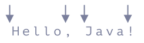

## 正则表达式 (Regular Expression) 基础 
### 简介

正则表达式 (缩写为 regex) 是一个`字符序列`，用于指定文本中的搜索模式。通常，此类模式由字符串搜索算法用于对字符串进行`查找和替换`操作，或用于`输入验证`。

正则表达式技术是在`理论计算机科学`和`形式语言`理论中发展起来的。自 1980 年代以来，出现了用于编写正则表达式的不同语法，一种是 `POSIX 标准`，另一种是`广泛使用的 Perl 语法`。

正则表达式用于`搜索引擎`、`文字处理器`和`文本编辑器的搜索和替换`以及`词法分析`。大多数通用编程语言本身或通过库支持正则表达式功能，包括 Python、C、C++、Java、Rust、OCaml 和 JavaScript。

### 语法

正则表达式`模式匹配`目标字符串。该模式由多个原子 (atoms) 序列化组成。原子是正则表达式模式中的一个点，它试图匹配目标字符串。最简单的原子是字面 (literal) 意义的文字，但将模式的各个部分进行分组以匹配原子，则需要使用`元字符` (Metacharacters)。

### 标准

IEEE POSIX 标准具有三组合规性：`BRE`(基本正则表达式)、`ERE`(扩展正则表达式) 和 `SRE` (简单正则表达式)。SRE 已被弃用。

BRE 和 ERE 一起工作。ERE 添加了 `?`、`+` 和 `|`，它消除了在 BRE 中转义元字符。此外，只要遵守正则表达式的 POSIX 标准语法，就可以在特定的 (但符合 POSIX 的) 应用程序运行。

尽管 POSIX.2 未定义一些实现细节，但 BRE 和 ERE 提供了一个`标准`，此后已被许多工具采用为默认语法，其中 BRE 或 ERE 模式的选择通常是受支持的选项。

 `Perl 正则表达式已成为事实上的标准`，具有丰富而强大的原子表达式集。Perl 没有`基本`或`扩展`级别。与在 POSIX ERE 中一样`( )`，`{ }`除非进行转义，否则将被视为元字符。附加功能包括`惰性匹配`、`反向引用`、`命名捕获组`和`递归模式`。

#### 基本正则表达式

在 POSIX 标准中，基本正则语法 (BRE) 要求将元字符`( )`和`{ }`指定为 `\(\)`and`\{\}`，而扩展正则语法 (ERE) 则不需要。

| 元字符  | 描述|
| :--: | -- |
|^| 匹配字符串中的`起始位置`。在基于行的工具中，它匹配任何行的起始位置。|
|.| 匹配`任意单个字符`。在 POSIX 括号表达式中，点字符匹配文字点。例如：`a.c` 匹配 `abc` 等，但`[a.c]`只匹配 `a`、`.`或 `c` 。|
|[ ]| 括号表达式。匹配`方括号中包含的单个字符`。例如：`[abc]`匹配 `a`、`b` 或 `c` ；`[a-z]`指定匹配从 `a 到 z` 的任何`小写`字母的范围。这些形式可以混合使用：`[abcx-z]`匹配 `a`、`b`、`c`、`x`、`y` 或 `z`，就像`[a-cx-z]`。<br>若`-`是方括号内的`第一个字符`或`最后一个字符`，则`-`字符被视为字面字符。例如：`[abc-]`，`[-abc]`。**请注意，不允许反斜杠转义(\\)**。若`]`字符是方括号的`第一个字符`，则可以包含在方括号表达式中。例如：`[]abc]`。|
|[^ ]| 匹配`不包含`在方括号内的`单个字符`。例如：`[^abc]`匹配 `a、b 或 c 以外的任意字符` 。`[^a-z]`匹配`从 a 到 z 的任何非小写字母`的`单个字符`。同样，可以混合文字字符和范围。|
|$| 匹配字符串的`结束位置`或字符串结束`换行符之前`的位置。在基于行的工具中，它匹配任何行的结束位置。|
|( )| 定义`标记的子表达式`。括号内匹配的字符串可以稍后调用。标记的子表达式也称为`块`或`捕获组`。在 Perl 中可以使用它创建`反向引用`，例如：在一些编程语言中 (Java, Perl, JavaScript等等) 则使用`$1…$9`属性按顺序检索反向引用。|
|\n| 匹配`第 n 个标记的子表达式`匹配的内容，其中 n 是从 1 到 9 的数字。此构造在 POSIX.2 标准中有模糊定义。一些工具允许引用超过九个捕获组。也称为`反向引用`。反向引用仅在 BRE 模式下受支持。|
|* | 匹配`前面的元素零次或多次`。例如：`ab*c` 匹配 `ac`、`abc`、`abbbc` 等；`[xyz]*`匹配 `x`、`y`、`z`、`zx`、`zyx`、`xyzzy` 等。`(ab)*`匹配 `ab`、`abab`、`ababab` 等。|
|{m,n}| 匹配`前面的元素至少 m 次且不超过 n 次`。例如：`a{3,5}` 仅匹配 `aaa`、`aaaa` 和 `aaaaa` 。 `n` 可以不填，则不设置上限。|

> 文章中`匹配前面`或`瞻前`所表达的指 `←` 向左边方向的意思，而`匹配后面`或`瞻后`与之相反。

**例子：**

* `.at`匹配以 `at` 结尾的任意三个字符, 包括 `hat`、`cat`、`bat`、`4at`、`#at`等等；
* `[hc]at`匹配 `hat` 和 `cat` ；
* `[^b]at`匹配所有`.at`匹配的结果，但不包含 `bat` ；
* `[^hc]at`匹配所有`.at`匹配的结果，但不包含 `hat` 和 `cat` ；
* `^[hc]at`匹配 `hat` 和 `cat`，但只限字符串或行的开头；
* `[hc]at$`匹配 `hat` 和 `cat`，但只限字符串或行的结尾；
* `\[.\]`匹配任意一个被`[`和`]`包裹的字符。例如：`[a]`、`[b]`、`[7]`、`[@]`、`[]]`和`[ ]`；
* `s.*` 匹配跟随在 `s` 之后的`0`个或`多个`任意字符。例如：`s`、`saw`、`seed`、`s3w96.7` 和 `s6#h%(>>>m n mQ` 。

#### POSIX 扩展

对于 POSIX 扩展正则表达式语法中的某些字符，使用反斜杠转义( `\` )的元字符的含义是相反的。使用此语法，反斜杠会使元字符被视为字面字符。所以 `\( \)`现在直接`( )`就好了。 `\{ \}`现在直接`{ }`就好了。

此外，删除了对 `\n`元字符的反向引用支持并添加了以下元字符。

| 元字符  | 描述|
| :--: | -- |
|?|匹配`前面`的元素`0`次或`1`次。例如：`ab?c` 仅匹配 `ac` 或 `abc` 。|
|+|匹配`前面`的元素`1`次或`多次`。例如：`ab+c` 匹配 `abc`、`abbc`、`abbbc` 等等，但不匹配 `ac` 。|
|\||`选择 (也称为交替或并集) 操作符`匹配操作符之前或之后的表达式。例如：`abc|def` 匹配 `abc` 或 `def` 。|

**例子：**

* `[hc]?at`匹配 `at`、`hat` 和 `cat` ；
* `[hc]*at`匹配 `at`、`hat`、`cat`、`hhat`、`chat`、`hcat`、`cchchat` 等等；
* `[hc]+at`匹配 `hat`、`cat`、`hhat`、`chat`、`hcat`、`cchchat` 等等，但不包括 `at` ；
* `cat|dog` 匹配 `cat` 或 `dog` 。

#### 字符类

除了元字符，POSIX 还提供了`字符类` (character classes) 来简化正则的编写。字符类也被叫做字符集或字符组，源于字符类是一组包含在`方括号`中的特殊含义的命名单词。

| POSIX 语法 | 说明                          | ASCII 环境                           | Unicode 环境        |
|:-------------:|-------------------------------|-------------------------------------|--------------------|
| [:alnum:]   | 字母字符和数字字符            | [a-zA-Z0-9]                         | [\p{L&}\p{Nd}]     |
| [:alpha:]   | 字母                          | [a-zA-Z]                            | \p{L&}             |
| [:ascii:]   | ASCII字符                     | [\x00-\x7F]                         | \p{InBasicLatin}   |
| [:blank:]   | 空格字符和制表符              | [ \t]                               | [\p{Zs}\t]         |
| [:cntrl:]   | 控制字符                      | [\x00-\x1F\x7F]                     | \p{Cc}             |
| [:digit:]   | 数字字符                      | [0-9]                               | \p{Nd}             |
| [:graph:]   | 空白字符之外的字符            | [\x21-\x7E]                         | [^\p{Z}\p{C}]      |
| [:lower:]   | 小写字母字符                  | [a-z]                               | \p{Ll}             |
| [:print:]   | 类似[:graph:]，但包括空白字符 | [\x20-\x7E]                         | \P{C}              |
| [:punct:]   | 标点符号                      | [][!"#$%&'()*+,./:;<=>?@\^_`{\|}~-] | [\p{P}\p{S}]       |
| [:space:]   | 空白字符                      | [ \t\r\n\v\f]                       | [\p{Z}\t\r\n\v\f]  |
| [:upper:]   | 大写字母字符                  | [A-Z]                               | \p{Lu}             |
| [:word:]    | 字母字符                      | [A-Za-z0-9_]                        | [\p{L}\p{N}\p{Pc}] |
| [:xdigit:]  | 十六进制字符                  | [A-Fa-f0-9]                         | [A-Fa-f0-9]        |

遵循 POSIX 规则的正则表达式其中代表软件有 `grep`、`sed` 和 `awk` 等。

> `grep`、`sed`、`awk` 三个命令被业界称为 `Linux 的三剑客命令`，得益于他们强大的文本处理能力。

POSIX 的书写形式常用编程语言的实现可能不支持。目前主流的编程语言都会基于 `Perl` 语法，例如：Java、JavaScript、Julia、Python、Ruby、Qt等等。

### Perl 和 PCRE

由于 Perl 表达能力和 (相对) 易读性，许多其他实用程序和编程语言都采用了类似于 Perl 的语法。Perl 派生的正则表达式实现并不完全相同，通常实现 1994 年发布的 Perl 5.0 中的功能子集。Perl 有时确实合并了最初在其他语言中发现的功能。例如：Perl 5.10 实现了最初在 PCRE 和 Python 中开发的句法扩展。

PCRE 是由 C 实现的一个基于 Perl 语法正则表达式引擎库，PCRE 的语法比任何一种 POSIX 正则表达式风格 (BRE、ERE) 和许多其他正则表达式库的语法都要强大和灵活得多。

许多著名的开源程序，例如 Apache 和 Nginx HTTP 服务器，以及 PHP 和 R 脚本语言，都包含 PCRE 库。专有软件也可以这样做，因为库是 BSD 许可的。

> 另请参阅：[Perl 兼容的正则表达式](https://en.wikipedia.org/wiki/Perl_Compatible_Regular_Expressions)

#### PCRE 派系特点

1. 更简洁在兼容 POSIX 字符组的基础上还支持更简洁的写法。例如：\w 等价于 [[:word:]]，\d 等价于 [[:digit:]]；
2. 更多功能。例如：`Lookarounds Assertion`(环视断言)，`Non-capturing Group`(非捕获组)，`Non-greedy`(非贪婪) 等。

PCRE 扩展的元字符功能：

| 元字符  | 描述  |
|:-:|---|
| {n}  | n 是一个非负整数。匹配确定的 n 次。例如：`o{2}` 不能匹配 `Bob` 中的 `o`，但是能匹配 `food` 中的两个 `o` 。  |
| {n,}  | n 是一个非负整数。至少匹配 n 次。例如：`o{2,}` 不能匹配 `Bob` 中的 `o`，但能匹配 `foooood` 中的所有 `o` 。 `o{1,}` 等价于 `o+` 。 `o{0,}` 则等价于 `o*` 。  |
| {n,m}  | m 和 n 均为非负整数，其中 n<=m。最少匹配 n 次且最多匹配 m 次。例如：`o{1,3}` 将匹配 `fooooood` 中的前三个 o。 `o{0,1}` 等价于 `o?` 。请注意在逗号和两个数之间不能有空格。  |
| (?:pattern)  | 匹配 pattern 但不获取匹配的子字符串 (shy groups)，也就是说这是一个非获取匹配，不存储匹配的子字符串用于向后引用。这在使用或字符`(\|)`来组合一个模式的各个部分是很有用。例如 `industr(?:y\|ies)` 就是一个比 `industry\|industries` 更简略的表达式。  |
| (?=pattern)  | **肯定瞻前断言** (positive lookahead assert)，在任何匹配 pattern 的字符串`开始处`匹配查找字符串。`()`括号里的匹配内容`不包含在匹配结果里`。例子：`Windows(?=95\|98\|NT\|2000)` 能匹配 `Windows2000` 中的 `Windows`，但不能匹配 `Windows3.1` 中的 `Windows` 。不消耗字符，也就是说，在一个匹配发生后，在最后一次匹配之后立即开始下一次匹配的搜索，而不是从包含预查的字符之后开始。  |
| (?!pattern)  | **否定瞻前断言** (negative lookahead assert)，在任何不匹配 pattern 的字符串`开始处`匹配查找字符串。`()`括号里的匹配内容`不包含在匹配结果里`。例子：`Windows(?!95\|98\|NT\|2000)` 能匹配 `Windows3.1` 中的 `Windows`，但不能匹配 `Windows2000` 中的 `Windows` 。预查不消耗字符，也就是说，在一个匹配发生后，在最后一次匹配之后立即开始下一次匹配的搜索，而不是从包含预查的字符之后开始  |
| (?<=pattern)  | **肯定后视断言** (positive bookbehind assert)，与`肯定瞻前断言`类似，只是方向相反。例子：`(?<=95\|98\|NT\|2000)Windows`能匹配`2000Windows`中的 `Windows`，但不能匹配`3.1Windows`中的 `Windows` 。  |
| (?<!pattern)  | **否定后视断言** (negative bookbehind assert)，与`否定瞻前断言`类似，只是方向相反。例子：`(?<!95\|98\|NT\|2000)Windows`能匹配`3.1Windows`中的 `Windows`，但不能匹配`2000Windows`中的 `Windows` 。  |
| x\|y  | 没有包围在()里，其范围是整个正则表达式。例如：`z\|food` 能匹配 `z` 或 `food` 。`(?:z\|f)ood`则匹配 `zood` 或 `food` 。  |
| [:name:]  | 增加命名字符类 (named character class) 中的字符到表达式。只能用于方括号表达式。  |
| [=elt=]  | 增加当前 locale 下排序 (collate) 等价于字符 `elt` 的元素。例如：[=a=] 可能会增加 ä、á、à、ă、ắ、ằ、ẵ、ẳ、â、ấ、ầ、ẫ、ẩ、ǎ、å、ǻ、ä、ǟ、ã、ȧ、ǡ、ą、ā、ả、ȁ、ȃ、ạ、ặ、ậ、ḁ、ⱥ、ᶏ、ɐ、ɑ 。只能用于方括号表达式。  |
| [.elt.]  | 增加排序元素 (collation element) elt到表达式中。这是因为某些排序元素由多个字符组成。例如：29 个字母表的西班牙语，`CH`作为单个字母排在字母 C 之后，因此会产生如此排序 `cinco, credo, chispa` 。只能用于方括号表达式。  |
| \b  | 匹配`一个单词边界`，也就是指单词和空格间的位置。例如：`er\b`  可以匹配 `never` 中的 `er`，但不能匹配 `verb` 中的 `er` 。  |
| \B  | 匹配`非单词边界`。 `er\B`  能匹配 `verb` 中的 `er`，但不能匹配 `never` 中的 `er` 。  |
| \cx  | 匹配由 x 指明的控制字符。x 的值必须为 A-Z 或 a-z 之一。否则，将 c 视为一个原义的 `c` 字符。控制字符的值等于 x 的值最低 5 比特 (即对 3210 进制的余数) 。例如：\cM 匹配一个 Control-M 或回车符。\ca 等效于 \u0001, \cb 等效于 \u0002, 等等…  |
| \d  | 匹配`一个数字字符`。等价于`[0-9]`。注意 Unicode 正则表达式会匹配全角数字字符。  |
| \D  | 匹配`一个非数字字符`。等价于`[^0-9]`。  |
| \f  | 匹配`一个换页符`。等价于 `\x0c`和 `\cL`。  |
| \n  | 匹配`一个换行符`。等价于 `\x0a`和 `\cJ`。  |
| \r  | 匹配`一个回车符`。等价于 `\x0d`和 `\cM`。  |
| \s  | 匹配`任何空白字符`，包括`空格`、`制表符`、`换页符`等等。等价于`[ \f\n\r\t\v]`。注意 Unicode 正则表达式会匹配全角空格符。  |
| \S  | 匹配`任何非空白字符`。等价于`[^ \f\n\r\t\v]`。  |
| \t  | 匹配`一个制表符`。等价于 `\x09`和 `\cI`。  |
| \v  | 匹配`一个垂直制表符`。等价于 `\x0b`和 `\cK`。  |
| \w  | 匹配`包括下划线的任何单词字符`。等价于`[A-Za-z0-9_]`。注意 Unicode 正则表达式会匹配中文字符。  |
| \W  | 匹配`任何非单词字符`。等价于`[^A-Za-z0-9_]`。  |
| \xnn  | 十六进制转义字符序列。匹配两个十六进制数字 nn 表示的字符。例如： `\x41`匹配 `A` 。 `\x041`则等价于 `\x04&1`。正则表达式中可以使用 ASCII 编码。.  |
| \num  | 向后引用 (back-reference) 一个子字符串 (substring)，该子字符串与正则表达式的第 num 个用括号围起来的捕捉群 (capture group) 子表达式 (subexpression) 匹配。其中 num 是从 1 开始的十进制正整数，其上限可能是 9、31、99 甚至无限。例如：`(.)\1`匹配两个连续的相同字符。  |
| \n  | 标识一个八进制转义值或一个向后引用。如果 \n 之前至少 n 个获取的子表达式，则 n 为向后引用。否则，如果 n 为八进制数字 (0-7)，则 n 为一个八进制转义值。  |
| \nm  | 3 位八进制数字，标识一个八进制转义值或一个向后引用。如果 \nm 之前至少有 nm 个获得子表达式，则 nm 为向后引用。如果 \nm 之前至少有 n 个获取，则 n 为一个后跟文字 m 的向后引用。如果前面的条件都不满足，若 n 和 m 均为八进制数字 (0-7)，则 \nm 将匹配八进制转义值 nm。  |
| \nml  | 如果 n 为八进制数字 (0-3)，且 m 和 l 均为八进制数字 (0-7)，则匹配八进制转义值 nml。  |
| \un  | Unicode 转义字符序列。其中 n 是一个用四个十六进制数字表示的 Unicode 字符。例如：\u00A9 匹配著作权符号 (©) 。  |

#### 量词 +, *, ? 和 {n}

假设我们有一个像这样`+7(903)-123-45-67`的字符串，并想要找到其中所有数字。但与之前不同的是，我们对单个数字不感兴趣，只对全数感兴趣`7`,`903`,`123`,`45`,`67`。

数字是一个或多个数字 `\d`的序列。为了标记我们需要的数量，我们需要加一个量词 (Quantifiers)。

##### 数量 {n}

1. **确切的位数：{5}**

最简单的量词便是大括号中的数字：{n}。 `\d{5}`表示 5 位数字，与 `\d\d\d\d\d`相同。

下面这个例子查找一个五位数的数字：

``` ts
alert( "I'm 12345 years old".match(/\d{5}/) ); //  "12345"
```

我们可以添加 \b 来排除位数更多的数字：\b\d{5}\b。

2. **范围：{3,5}，匹配 3-5 个**

要查找 3-5 位的数字，我们可以将限制写在花括号中：\d{3,5}

``` ts
alert( "I'm not 12, but 1234 years old".match(/\d{3,5}/) ); // "1234"
```

我们可以省略上限。那么正则表达式 `\d{3,}`就会查找位数>=`3`的数字：

``` ts
alert( "I'm not 12, but 345678 years old".match(/\d{3,}/) ); // "345678"
```

让我们回到字符串 +7(903)-123-45-67。我们如果需要一个及以上的数字，就使用 `\d{1,}`：

``` ts
let str = "+7(903)-123-45-67";

let numbers = str.match(/\d{1,}/g);

alert(numbers); // 7,903,123,45,67
```

##### 缩写

大多数常用的量词都有简写形式。

1. `+` 代表`匹配前面的元素 1 个或多个`，与`{1,}`相同。

例如，\d+ 用来查找所有数字：

``` ts
let str = "+7(903)-123-45-67";

alert( str.match(/\d+/g) ); // 7,903,123,45,67
```

2. `?` 代表`匹配前面的元素 0 个或 1 个`，与`{0,1}`相同。换句话说，它使得符号变得可选。

例如：模式 `ou?r` 查找 `o`，后跟 0 个或 1 个 `u`，然后是 `r` 。所以 `colou?r` 会找到 `color` 和 `colour` ：

``` ts
let str = "Should I write color or colour?";

alert( str.match(/colou?r/g) ); // color, colour
```

3. `*`代表`匹配前面的元素 0 个及以上`，与`{0,}`相同。也就是说，字符可以出现任何次数或者不出现。

例如： `\d0*`查找`1`个数字后面跟着任意数量的`0`（可能有很多或没有）的数字：

``` ts
alert( "100 10 1".match(/\d0*/g) ); // 100, 10, 1
```

将其与 `+`（ 1 个或更多）做比较：

``` ts
alert( "100 10 1".match(/\d0+/g) ); // 100, 10
// 1 没有被匹配出来，因为 0+ 要求至少有一个 0
```

#### 边界词 \b

词边界 `\b` 是一种`检查`，就像 `^` 和 `$` 一样。当正则表达式引擎遇到 `\b` 时，它会检查字符串中的位置`是否是词边界`。

有三种不同的位置可作为词边界：

* 在字符串开头，如果第一个字符是单词字符 `\w`。
* 在字符串中的两个字符之间，其中一个是单词字符 `\w`，另一个不是。
* 在字符串末尾，如果最后一个字符是单词字符 `\w`。

例如：可以在 `Hello, Java!` 中找到 `\bJava\b` 的匹配项，其中 `Java` 是一个独立的单词，而在 `Hello, JavaScript!` 中则不行。

```ts
alert( "Hello, Java!".match(/\bJava\b/) ); // Java
alert( "Hello, JavaScript!".match(/\bJava\b/) ); // null
```

在字符串 `Hello, Java!` 中，以下位置对应于 `\b` ：



因此，它与模式 `\bHello\b` 相匹配，因为：

1. 字符串的开头符合第一个检查 `\b` 。
2. 然后匹配了单词 `Hello` 。
3. 然后与 `\b` 再次匹配，因为我们在 `o` 和`逗号`之间。

所以模式 `\bHello\b` 会匹配，但 `\bHell\b` 不会匹配 (因为在 l 之后没有单词边界)，`Java!\b`  也不会匹配(因为感叹号不是单词字符 \w，所以其后没有词边界)。

``` ts
alert( "Hello, Java!".match(/\bHello\b/) ); // Hello
alert( "Hello, Java!".match(/\bJava\b/) );  // Java
alert( "Hello, Java!".match(/\bHell\b/) );  // null（无匹配项）
alert( "Hello, Java!".match(/\bJava!\b/) ); // null（无匹配项）
```

 `\b` 既可以用于`单词`，也可以用于`数字`。

例如，模式 `\b\d\d\b` 查找`独立的两位数`。换句话说，它查找的是两位数，其周围是与 `\w`不同的字符，例如空格或标点符号（或文本开头/结尾）。

```ts
alert( "1 23 456 78".match(/\b\d\d\b/g) ); // 23,78
alert( "12,34,56".match(/\b\d\d\b/g) ); // 12,34,56
```

> ⚠️ 词边界 `\b` 不适用于非拉丁字母

词边界测试 `\b` 检查该位置的一侧是否匹配 `\w`，而另一侧则不匹配 `\w`。

但是， `\w`表示拉丁字母 `a-z` (或`数字`或`下划线`)，所以此检查不适用于其他字符，如`西里尔字母` (cyrillic letters) 或`象形文字` (hieroglyphs)。

#### 贪婪搜索和惰性匹配

`默认正则的匹配方式是贪婪的`。

我们通过模式`".+"/g`想要匹配双引号及其内容：

``` ts
let regexp = /".+"/g;

let str = 'a "witch" and her "broom" is one';

alert( str.match(regexp) ); // "witch" and her "broom"
```

它没有找到匹配项`"witch"`和`"broom"`，而是找到：`"witch" and her "broom"`。

##### 贪婪搜索

为了查找到一个匹配项，正则表达式引擎采用了以下算法：

* 对于字符串中的每一个位置
  * 尝试匹配该位置的模式。
  * 如果未匹配，则转到下一个位置。

在贪婪模式下（默认情况），`量词`都会`尽可能多地重复`。

正则表达式引擎尝试用`.+`去匹配尽可能多的字符，然后在模式的其余部分不匹配时再将其逐一缩短。

对于这个任务，我们想要得是另一种结果。这也就是`惰性量词模式`的用途。

##### 惰性模式

惰性模式中的量词与贪婪模式中的是相反的。它表示：`重复最少的次数`。

我们可以通过在`量词后面添加`一个问号 `?` 来启用它，这样匹配模式就变成了`*?`或`+?`，甚至将`?`变成`??`。

这么说吧：通常问号 `?` 本身就是一个量词 (0 或 1)，但如果将其放到**另一个量词 (甚至是它自己) 后面**，就会有不同的含义 —— 它将匹配的模式从贪婪转为惰性。

正则表达式`/".+?"/g`能够按预期工作了：它找到了`"witch"`和`"broom"`：

``` ts
let regexp = /".+?"/g;

let str = 'a "witch" and her "broom" is one';

alert( str.match(regexp) ); // "witch", "broom"
```

**惰性模式仅对带有 `?` 的量词启用**，其它量词依旧保持贪婪模式。

``` ts
alert( "123 456".match(/\d+ \d+?/) ); // 123 4
```

##### 替代方法

使用正则表达式，通常有不止一种方式可以做相同的事。

在我们的例子中，我们可以在不启用惰性模式的情况下使用正则表达式`"[^"]+"`找到带引号的字符串：

``` ts
let regexp = /"[^"]+"/g;

let str = 'a "witch" and her "broom" is one';

alert( str.match(regexp) ); // "witch", "broom"
```

#### 反向引用

我们不仅可以在结果或替换字符串中使用捕获组`(...)`的内容，还可以在`模式本身`中使用它们。

##### 按编号反向引用：\N

可以使用 `\N`在模式中引用一个组，其中 `N` 是`组号`。

为了弄清这有什么用，让我们考虑一个任务。

我们需要找到带引号的字符串：单引号`'...'`或双引号`"..."`—— 应匹配这两种变体。如何找到它们？

我们可以将两种引号都放在方括号中 `['"][.*?]('")`，但它会找到带有混合引号的字符串，例如 `"...'` 和 `'..."`。当一种引号出现在另一种引号内，比如在字符串 `"She's the one!"` 中时，便会导致不正确的匹配：

``` ts
let str = `He said: "She's the one!".` ;

let regexp = /['"](.*?)['"]/g;

// 不是我们想要的结果
alert( str.match(regexp) ); // "She'
```

正如我们所看到的，该模式找到了一个开头的引号`"`，然后文本被匹配，直到另一个引号`'`，该匹配结束。

为了确保模式查找的`结束引号`与`开始的引号`完全相同，我们可以将其`包装到捕获组`中并对其进行`反向引用`：`(['"])(.*?)\1`。

这是正确的代码：

``` ts {hl_lines=[3]}
let str = `He said: "She's the one!".` ;

let regexp = /(['"])(.*?)\1/g;

alert( str.match(regexp) ); // "She's the one!"
```

> 如果我们在捕获组中使用`?:`，那么我们将无法引用它。用`(?:...)`捕获的组被排除，引擎不会记住它。

> 在替换字符串中我们使用美元符号`$1`，而在模式中 —— 使用反斜杠 `\1`。

##### 按命名反向引用：\k<name>

如果一个正则表达式中有很多括号，给它们起个名字会便于引用。

要引用命名的捕获组，我们可以使用： `\k<name>`。

在下面的示例中，带引号的组被命名为 `?<quote>`，因此反向引用为 `\k<quote>`：

``` ts {hl_lines=[3]}
let str = `He said: "She's the one!".` ;

let regexp = /(?<quote>['"])(.*?)\k<quote>/g;

alert( str.match(regexp) ); // "She's the one!"
```

#### 断言

正则的断言和编程里的断言相似。编程里断言里，若断言结果为 True，则程序继续执行；若断言结果为 False，程序将终止执行。而在正则里，断言是一个正则表达式，要么匹配成功，要么匹配失败。

上面也的表格也列举了 Perl 正则的`前瞻断言`和`后视断言`，被统称为`环视断言` (Lookarounds Assertion)。需要注意的是`断言只是一个测试，括号中的内容不会成为结果的一部分`。

| 断言 (Assertion) | 前瞻 (Lookahead) |  后视 (Lookbehind) |
|:---:|---|---|
| 肯定 (Positive)  |(?=pattern)  | (?<=pattern)  |
| 否定 (Negative)  |(?!pattern)  | (?<!pattern)  |

##### 前瞻断言

我们从字符串中查找价格。例如：`1 turkey costs 30€`，即：一个数字，后跟 `€` 符号。

那么对于一个后面跟着`€`的整数，正则表达式应该为： `\d+(?=€)`。

``` ts
let str = "1 turkey costs 30€";

console.log(str.match(/\d+(?=€)/)); // 打印 30。数字 1 被忽略了，因为它后面没有 €。
```

当我们查找 `X(?=Y)` 时，正则表达式引擎会找到 `X`，然后检查其后是否有 `Y` 。如果没有，则跳过潜在匹配，并继续搜索。

更复杂的测试也是可能的，例如：`X(?=Y)(?=Z)` 表示：

1. 寻找 `X` 。
2. 检查 `Y` 是否紧跟在 `X` 之后（如果不是则跳过）。
3. 检查 `Z` 是否也在 `X` 之后（如果不是则跳过）。
4. 如果两个测试都通过了，那么 `X` 是匹配的，否则继续搜索。

换句话说，这样的模式意味着我们同时在寻找 `X` 后跟 `Y` 和 `Z` 。

这只有在模式 Y 和 Z`不是互斥`的情况下才可行。

例如： `\d+(?=\s)(?=.*30)`查找后跟着空格`(?=\s)`的 `\d+`，并且有`30`在它之后的某个地方`(?=.*30)`：

``` ts
let str = "1 turkey costs 30€";

console.log(str.match(/\d+(?=\s)(?=.*30)/)); // 打印 1
```

##### 否定前瞻断言

假设我们想要一个数量，而不是来自同一字符串的价格。那是一个数字 `\d+`，后面不是`€`。

为此，我们可以使用否定的前瞻断言。

语法是：`X(?!Y)`，意思是`搜索 X，但前提是后面没有 Y`。

``` ts
let str = "2 turkeys cost 60€";

console.log(str.match(/\d+\b(?!€)/g)); // 打印 2（价格不匹配）
```

##### 后视断言

> ⚠️ 请注意：非 V8 引擎的浏览器不支持后视断言，例如 Safari、Internet Explorer。

前瞻断言允许添加一个`后面要跟着什么`的条件判断。

后视断言也类似，只不过它是在相反的方向上进行条件判断。也就是说，它只允许匹配前面有特定字符串的模式。

语法为如下：

* 肯定的后瞻断言：(?<=Y)X，匹配 X，仅在前面是 Y 的情况下。
* 否定的后瞻断言：(?<!Y)X，匹配 X，仅在前面不是 Y 的情况下。

例如：让我们把价格换成美元。美元符号通常在数字前面，所以要查找 `$30` 我们将使用 `(?<=\$)\d+·` —— 一个前面带 `$` 的数值：

```ts
let str = "1 turkey costs $30";

// 美元符号被转义 \$
console.log(str.match(/(?<=\$)\d+/)); // 打印 30（跳过了仅仅是数字的值）
```

##### 否定后视断言

如果我们需要找到量词 —— 一个前面不带 `$` 的数字，我们可以使用否定的后瞻断言：`(?<!\$)\d+`。

``` ts
let str = "2 turkeys cost $60";

console.log(str.match(/(?<!\$)\b\d+/g)); // 打印 2（价格不匹配）
```

| 模式 | 类型 | 匹配 |
|---|---|---|
| X(?=Y) | 肯定的前瞻断言 | `X` 后紧跟着 `Y` |
| X(?!Y) | 否定的前瞻断言 | `X` 后没紧跟着 `Y` |
| (?<=Y)X | 肯定的后视断言 | `X` 紧跟在 `Y` 后面 |
| (?<!Y)X | 否定的后视断言 | `X` 没紧跟在 `Y` 后面 |

#### 捕获组

模式的一部分可以用括号括起来 (...)，这被称为`捕获组` (capturing group)。

这有两个影响：

* 它允许将匹配的一部分作为结果数组中的单独项；
* 如果我们将`量词`放在括号后，则它将括号视为一个整体。

前瞻断言和后视断言括号中的内容不会成为结果的一部分。但在某些情况下，我们可能还想捕获前瞻断言和后视断言所匹配的内容，或者部分内容。这也是可行的。只需要将该部分包装在额外的括号 `( )` 中。

在下面的示例中，货币符号 `(€|kr)` 和金额一起被捕获了：

``` ts
let str = "1 turkey costs 30€";
let regexp = /\d+(?=(€|kr))/; // €|kr 两侧有额外的括号

console.log(str.match(regexp)); // 打印 30, €
```

后视断言也一样：

``` ts
let str = "1 turkey costs $30";
let regexp = /(?<=(\$|£))\d+/;

console.log(str.match(regexp)); // 打印 30, $
```

### 优先级

正则的元字符匹配优先级如下表所示：

|  优先级 | 符号  |
|:---:|---|
| 最高 |  `\`\<special character\>  |
| 高 | `()`、`(?:)`、`(?=)`、`[]` |
| 中 | `*`、`+`、`?`、`{n}`、`{n,}`、`{n,m}` |
| 低 |  `^` 、 `$` 、中介字符  |
| 次最低 | 串接，即相邻字符连接在一起  |
| 最低 |  `\|` |

### 常见用例

#### 正则校验

通常如果有`位数限制`，需要在起始位置添加 `^` 元字符以及在结束位置添加 `$` 元字符，即匹配到的文本就是所有文本内容。

##### IP 地址

最简单的 IP 匹配。

``` text
^\d{1,3}\.\d{1,3}\.\d{1,3}\.\d{1,3}$
```

<iframe frameborder="0" width="809" height="115" src="https://www.lumin.tech/tools/regulex/#!embed=true&flags=&re=%5E%5Cd%7B1%2C3%7D%5C.%5Cd%7B1%2C3%7D%5C.%5Cd%7B1%2C3%7D%5C.%5Cd%7B1%2C3%7D%24"></iframe>

##### 身份证号

老的 15 位的身份证号目前各类公共场合的刷卡都`已经失效`，基本没人再用了。

``` text
^[1-9]\d{7}((0\d)|(1[0-2]))(([0|1|2]\d)|3[0-1])\d{3}$
```

<iframe frameborder="0" width="933" height="291" src="https://www.lumin.tech/tools/regulex/#!embed=true&flags=&re=%5E%5B1-9%5D%5Cd%7B7%7D((0%5Cd)%7C(1%5B0-2%5D))((%5B0%7C1%7C2%5D%5Cd)%7C3%5B0-1%5D)%5Cd%7B3%7D%24"></iframe>

目前所有身份证位数都已是 18 位，它的匹配正则如下：

``` text
^[1-9]\d{5}[1-9]\d{3}((0\d)|(1[0-2]))(([0|1|2]\d)|3[0-1])((\d{4})|\d{3}[Xx])$
```

<iframe frameborder="0" width="1239" height="309" src="https://www.lumin.tech/tools/regulex/#!embed=true&flags=&re=%5E%5B1-9%5D%5Cd%7B5%7D%5B1-9%5D%5Cd%7B3%7D((0%5Cd)%7C(1%5B0-2%5D))((%5B0%7C1%7C2%5D%5Cd)%7C3%5B0-1%5D)((%5Cd%7B4%7D)%7C%5Cd%7B3%7D%5BXx%5D)%24"></iframe>

##### 邮箱

``` text
^\w+([.-]?\w+)*@\w+([.-]?\w+)*(\.\w{2,3})+$
```

<iframe frameborder="0" width="1378" height="244" src="https://www.lumin.tech/tools/regulex/#!embed=true&flags=&re=%5E%5Cw%2B(%5B.-%5D%3F%5Cw%2B)*%40%5Cw%2B(%5B.-%5D%3F%5Cw%2B)*(%5C.%5Cw%7B2%2C3%7D)%2B%24"></iframe>

另一种等价表示：

``` text
^[\w\-\.\+]+\@[a-zA-Z0-9\.\-]+\.[a-zA-z0-9]{2,4}$
```

<iframe frameborder="0" width="705" height="252" src="https://www.lumin.tech/tools/regulex/#!embed=true&flags=&re=%5E%5B%5Cw%5C-%5C.%5C%2B%5D%2B%5C%40%5Ba-zA-Z0-9%5C.%5C-%5D%2B%5C.%5Ba-zA-z0-9%5D%7B2%2C4%7D%24"></iframe>

##### 手机号

手机号是由`国家码`(86)、`移动接入码`(号段)、`HLR 识别码` 和`移动用户号`组成。

通常国内通信不需要自己加国家码，每个运营商都有自己被分配的号段，并且号段是会增加变化的。详情可以查看[百度百科](https://baike.baidu.com/item/手机号码/1417348?fr=aladdin#2)。

一个宽松的手机号验证可以如下：

``` text
^1[3-9][0-9]{9}$
```

<iframe frameborder="0" width="436" height="147" src="https://www.lumin.tech/tools/regulex/#!embed=true&flags=&re=%5E1%5B3-9%5D%5B0-9%5D%7B9%7D%24"></iframe>

##### 密码

如果我们要匹配一串登录密码，它必须符合以下规则：

* 长度 8~20 位；
* 必须包含大小写英文字母；
* 必须包含数字；
* 必须包含 `[*.!@#$%^&(){}[]:;<>,.?/~_+-=|\]` 至少一个特殊字符，且禁止空格；

那么，它的正则表达式如下：

``` text
^(?=.*[0-9])(?=.*[a-z])(?=.*[A-Z])(?=.*[*.!@$%^&(){}[]:;<>,.?/~_+-=|\]).{8,20}$
```

<iframe frameborder="0" width="2574" height="222" src="https://www.lumin.tech/tools/regulex/#!embed=true&flags=&re=%5E(%3F%3D.*%5B0-9%5D)(%3F%3D.*%5Ba-z%5D)(%3F%3D.*%5BA-Z%5D)(%3F%3D.*%5B*.!%40%24%25%5E%26()%7B%7D%5B%5D%3A%3B%3C%3E%2C.%3F%2F~_%2B-%3D%7C%5C%5D).%7B8%2C20%7D%24"></iframe>

#### 文本替换

##### 替换 markdown 里的 []() 链接符号

``` text
((?<!!| )\[[^!](.+?)\]\((.+?)\))
```

### 正则工具

这里有几款比较好用的正则验证工具，可以用来对正则的学习和加深理解：

* [regexr](https://regexr.com/)
* [regulex](https://jex.im/regulex/#!flags=&re=%5E(a%7Cb)*%3F%24)
* [regex-vis](https://regex-vis.com/)
* [regex101](https://regex101.com/)

参考资料：

\> [https://en.wikipedia.org/wiki/Regular_expression](https://en.wikipedia.org/wiki/Regular_expression)

\> [https://pubs.opengroup.org/onlinepubs/9699919799/basedefs/V1_chap09.html](https://pubs.opengroup.org/onlinepubs/9699919799/basedefs/V1_chap09.html)

\> [https://zhuanlan.zhihu.com/p/435815082](https://zhuanlan.zhihu.com/p/435815082)

\> [https://www3.ntu.edu.sg/home/ehchua/programming/howto/Regexe.html](https://www3.ntu.edu.sg/home/ehchua/programming/howto/Regexe.html)

\> [https://zh.javascript.info/regular-expressions](https://zh.javascript.info/regular-expressions)
