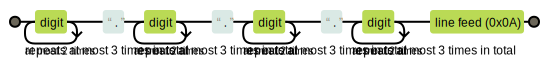

## 正则表达式 (Regular Expression) 基础 
### 简介

正则表达式 (缩写为 regex) 是一个字符序列，用于指定文本中的搜索模式。通常，此类模式由字符串搜索算法用于对字符串进行“查找”或“查找和替换”操作，或用于输入验证。

正则表达式技术是在`理论计算机科学`和`形式语言`理论中发展起来的。自 1980 年代以来，出现了用于编写正则表达式的不同语法，一种是 POSIX 标准，另一种是广泛使用的 Perl 语法。

正则表达式用于`搜索引擎`、`文字处理器`和`文本编辑器的搜索和替换`对话框以及`词法分析`。大多数通用编程语言本身或通过库支持正则表达式功能，包括Python、C、C++、Java、Rust、OCaml 和 JavaScript。

### 语法

正则表达式`模式匹配`目标字符串。该模式由多个原子 (atoms) 序列化组成。原子是正则表达式模式中的一个点，它试图匹配目标字符串。最简单的原子是字面 (literal) 意义的文字，但将模式的各个部分进行分组以匹配原子，则需要使用`元字符` (Metacharacters)。

### 标准

IEEE POSIX 标准具有三组合规性：`BRE` (基本正则表达式)、`ERE` (扩展正则表达式) 和`SRE` (简单正则表达式)。SRE 已被弃用。

BRE 和 ERE 一起工作。ERE 添加了`?`,`+`和`|`，它消除了在 BRE 中转义元字符。此外，只要遵守正则表达式的 POSIX 标准语法，就可以在特定的 (但符合 POSIX 的) 应用程序运行。

尽管 POSIX.2 未定义一些实现细节，但 BRE 和 ERE 提供了一个“标准”，此后已被许多工具采用为默认语法，其中 BRE 或 ERE 模式的选择通常是受支持的选项。

Perl 正则表达式已成为事实上的标准，具有丰富而强大的原子表达式集。Perl 没有“基本”或“扩展”级别。与在 POSIX ERE 中一样`( )`，`{ }`除非转义，否则将被视为元字符。附加功能包括`惰性匹配`、`反向引用`、`命名捕获组`和`递归模式`。

#### 基本正则表达式

在 POSIX 标准中，基本正则语法 (BRE) 要求将元字符`( )`和`{ }`指定为`\(\)`and`\{\}`，而扩展正则语法 (ERE) 则不需要。

| 元字符  | 描述|
| :--: | -- |
|^| 匹配字符串中的`起始位置`。在基于行的工具中，它匹配任何行的起始位置。|
|.| 匹配`任意单个字符`。在 POSIX 括号表达式中，点字符匹配文字点。例如：`a.c`匹配`abc`等，但`[a.c]`只匹配`a`、`.`或`c`。|
|[ ]| 括号表达式。匹配`方括号中包含的单个字符`。例如：`[abc]`匹配`a`、`b`或`c`；`[a-z]`指定匹配从`a 到 z`的任何`小写`字母的范围。这些形式可以混合使用：`[abcx-z]`匹配`a`、`b`、`c`、`x`、`y`或`z`，就像`[a-cx-z]`。<br>若`-`是方括号内的`第一个字符`或`最后一个字符`，则`-`字符被视为字面字符。例如：`[abc-]`，`[-abc]`。**请注意，不允许反斜杠转义(\\)**。若`]`字符是方括号的`第一个字符`，则可以包含在方括号表达式中。例如：`[]abc]`。|
|[^ ]| 匹配`不包含`在方括号内的`单个字符`。例如：`[^abc]`匹配`a、b 或 c 以外的任意字符`。`[^a-z]`匹配`从 a 到 z 的任何非小写字母`的`单个字符`。同样，可以混合文字字符和范围。|
|$| 匹配字符串的`结束位置`或字符串结束`换行符之前`的位置。在基于行的工具中，它匹配任何行的结束位置。|
|( )| 定义`标记的子表达式`。括号内匹配的字符串可以稍后调用。标记的子表达式也称为`块`或`捕获组`。|
|\n| 匹配`第 n 个标记的子表达式`匹配的内容，其中 n 是从 1 到 9 的数字。此构造在 POSIX.2 标准中有模糊定义。一些工具允许引用超过九个捕获组。也称为`反向引用`。反向引用仅在 BRE 模式下受支持。|
|* | 匹配`前面的元素零次或多次`。例如，`ab*c`匹配`ac`、`abc`、`abbbc`等；`[xyz]*`匹配`x`、`y`、`z`、`zx`、`zyx`、`xyzzy`等。`(ab)*`匹配`ab`、`abab`、`ababab`等。|
|{m,n}| 匹配`前面的元素至少 m 次且不超过 n 次`。例如：`a{3,5}`仅匹配`aaa`、`aaaa`和`aaaaa`。这在一些较旧的正则表达式实例中找不到。|

##### 例子

* `.at`匹配以`at`结尾的任意三个字符, 包括`hat`、`cat`、`bat`、`4at`、`#at`等等；
* `[hc]at`匹配`hat`和`cat`；
* `[^b]at`匹配所有`.at`匹配的结果，但不包含`bat`；
* `[^hc]at`匹配所有`.at`匹配的结果，但不包含`hat`和`cat`；
* `^[hc]at`匹配`hat`和`cat`，但只限字符串或行的开头；
* `[hc]at$`匹配`hat`和`cat`，但只限字符串或行的结尾；
* `\[.\]`匹配任意一个被`[`和`]`包裹的字符。例如：`[a]`、`[b]`、`[7]`、`[@]`、`[]]`和`[ ]`；
* `s.*`匹配跟随在`s`之后的`0`个或`多个`任意字符。例如：`s`、`saw`、`seed`、`s3w96.7`和`s6#h%(>>>m n mQ`。

#### POSIX 扩展

对于 POSIX 扩展正则表达式语法中的某些字符，使用反斜杠转义(`\`)的元字符的含义是相反的。使用此语法，反斜杠会使元字符被视为字面字符。所以`\( \)`现在直接`( )`就好了。`\{ \}`现在直接`{ }`就好了。

此外，删除了对`\n`元字符的反向引用支持并添加了以下元字符。

| 元字符  | 描述|
| :--: | -- |
|?|匹配前面的元素`0`次或`1`次。例如：`ab?c`仅匹配`ac`或`abc`。|
|+|匹配前面的元素`1`次或`多次`。例如：`ab+c`匹配`abc`、`abbc`、`abbbc`等等，但不匹配`ac`。|
|\||`选择（也称为交替或并集）操作符`匹配操作符之前或之后的表达式。例如：`abc|def`匹配`abc`或`def`。|

##### 例子

* `[hc]?at`匹配`at`、`hat`和`cat`；
* `[hc]*at`匹配`at`、`hat`、`cat`、`hhat`、`chat`、`hcat`、`cchchat`等等；
* `[hc]+at`匹配`hat`、`cat`、`hhat`、`chat`、`hcat`、`cchchat`等等，但不包括`at`；
* `cat|dog`匹配`cat`或`dog`。

### 常见用例

#### IP 地址

``` tex
\d{1,3}\.\d{1,3}\.\d{1,3}\.\d{1,3}
```



参考文献：

\> [https://en.wikipedia.org/wiki/Regular_expression](https://en.wikipedia.org/wiki/Regular_expression)
