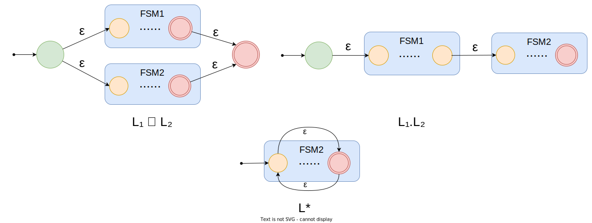

## 正则语言 (Regular Language) 
### 简介

正则语言 (regular language) 是可以用`正则表达式`或`自动机`描述的语言，用于解析和设计编程语言。`正则语言`和`有限自动机`可以对需要极少量内存的计算问题进行建模。如果有一个`有限自动机`可以`识别`一种语言，那么它就是一种`正则语言`。

正则语言是形式语言 (Formal Language) 的其中一种，如果存在有限的符号集合 ($\Sigma$ 表示)，那么该集合就可以被称为是一种语言。这种定义非常宽泛，区别于我们日常所了解的自然语言。

如果有个集合为空，那么该空集也可以被称为一种语言。可以表示为：$\varnothing$。若有个集合包含一个`空字符串` ($ε$ 表示)，那么该集合也是一种语言，可以表示为 $\lbraceε\rbrace$。但是 $\lbraceε\rbrace \not ={\varnothing}$。

### 形式定义

正则表达式的形式定义如下：

* 空集合 $\varnothing$ 是正则语言；
* 只包含一个空串的语言 $\lbraceε\rbrace$ 是正则语言；
* 对所有 $a ∈ \Sigma $，$\lbrace a \rbrace$ 是正则语言；
* 若 $A$, $B$ 是正则语言，则 $A\cdot B$ (concatenation), $A \bigcup B$ (union), $A^{*}$ ([kleene star](https://zh.wikipedia.org/wiki/克莱尼星号)) 都是正则语言。

除此之外都不是正则语言。

### 正则语言运算

正则语言有三种运算：`连接` (Concatenation)、`并` (Union)、`Kleene 星` (Kleene Star)。

> Kleene 在 20 世纪 50 年代提出的这三种基本运算符。

#### 连接

通过连接可以把两种或两种以上的语言组合到一起。

若有集合 $L_1 = \lbrace 100, 01 \rbrace$ 和 $L_2 = \lbrace 101,01 \rbrace$，那么通过`连接`运算后就结果为 $L_1 \cdot L_2 = \lbrace 100101,10001,01101,0101 \rbrace$。

#### 并

若有集合 $L_1 = \lbrace 100,01 \rbrace$ 和 $L_2 = \lbrace 101,01 \rbrace$，那么通过`并`运算后结果为 $L_1 \bigcup L_2 = \lbrace 100,01,101 \rbrace$。

#### Kleene 星

Kleene 星运算是一元运算，用 $*$ 表示。它用来`重复`集合元素`任意多次`的运算，形式表示：$A^∗ = \lbrace x_1x_2...x_k ∣ k≥0, x_i∈A \rbrace$。

若有集合 $L_1 = \lbrace 100,01 \rbrace$，那么通过`Kleene 星`运算后结果为 $L_1^* = \lbrace ε,100,100100,100^n,01,01^n,10001100,... \rbrace$，它是一个无穷集合。

### 用正则表达式描述正则语言

开头简介说过正则表达式可以用来描述正则语言。正则表达式可以描述所有通过对某个字母表上的符号应用上面三种运算符而得到的语言。

例子：一个有限集合 $\lbrace 0,1 \rbrace$，我们自定义语言给出一个正则表达式：`0(0|1)*1`，如果用字母符号和正则语言运算符表示它是这样的：$0\cdot(0 \bigcup 1)^*\cdot1$。

所以以下字符串对于该语言来说语法都是正确的：

* 01
* 0011
* 00101
* 000001
* 0000001
* ...

### 用有限状态自动机 (FSM) 描述正则语言

如果有一个有限语言 $\lbrace 00,11,010 \rbrace $，那么用 FSM 表示如下：

#### FSM 的正则运算

如果有两个语言：*`L₁`* 用 *`FSM₁`* 表示，*`L₂`* 用 *`FSM₂`*，那么对应自动机的三个运算转换如下图所示：

参考资料：

\> [https://www.bearnok.com/grva/it/knowledge/software/mathjax](https://www.bearnok.com/grva/it/knowledge/software/mathjax)

\> [https://www.bilibili.com/video/BV1xq4y1N7Vp](https://www.bilibili.com/video/BV1xq4y1N7Vp)
