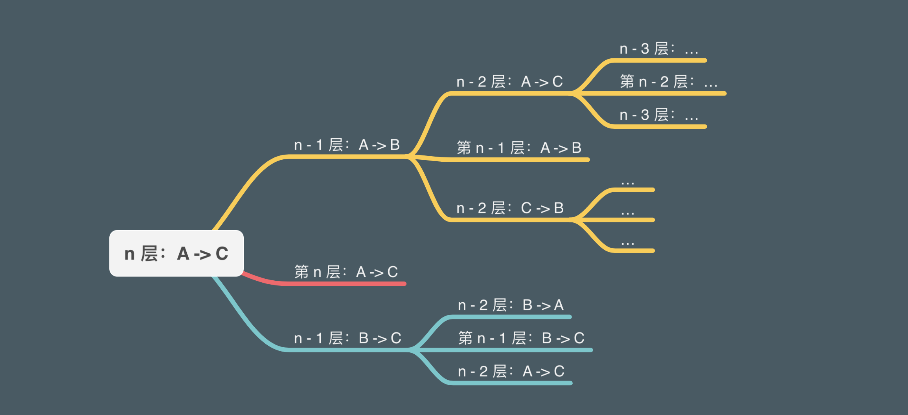

## 汉诺塔 (tower of hanoi) 问题分析 


### 游戏简介

`初始状态`：有三根柱子 `A`，`B`，`C` 。 `A` 柱上有 `N` 个 (N > 1) 穿孔圆盘，盘的尺寸由下到上依次变小。

`游戏目标`：把所有 `A` 柱的圆盘全部移到 `C` 柱，并保持原有顺序。

`游戏规则`：

1. 每次只能移动一个圆盘；
2. 无论在哪个柱上，移动时大盘必须都在小盘下面。

`算法目标`：求完成游戏目标的最少步骤。

这里有个模拟汉诺塔的可视化工具：[tower of hanoi](https://www.mathsisfun.com/games/towerofhanoi.html)。

### 问题分析

汉诺塔问题是`递归`的经典用例，我们可以把这个`大问题`拆解为重复的`小问题`，每个人小问题重复`几个步骤`。解决了一个小问题，就解决了下个小问题必要条件。

对于`3`层圆盘情况下，我们把上面的`2`层圆盘当做整体来操作。



对于`4`层圆盘情况下，我们把上面的`3`层圆盘当整体来操作：



如果我们固定`4`层圆盘最底层的圆盘，其实就是在解决层数为`3`的汉诺塔问题。并且每一个小问题，都是三个步骤。

所以当我们有 `n` 层圆盘时，我们要解决的问题是层数为 `n-1` 的子问题，以此继续类推：



### 算法实现

通过上面的分析，我可以通过`递归`分成三个步骤编写我们的代码：

``` javascript
const A = ' A 柱'
const B = ' B 柱'
const C = ' C 柱'

function move(orderNumber, from, to) {
  console.log(`把第 ${orderNumber} 层圆盘，从${from}移至${to}`)
}

function hanoi(n, from, to, helper) {
  if (n > 0) {
    // 第一步
    hanoi(n - 1, from, helper, to)
    // 第二步
    move(n, from, to)
    // 第三步
    hanoi(n - 1, helper, to, from)
  }
}

hanoi(4, A, C, B)
```

值得注意的是每个子问题唯一要做的事，就是寻找`目标`柱子和`辅助`柱子。

上面的算法我们得到了以下输出结果：

``` text
把第 1 层圆盘，从 A 柱移至 B 柱
把第 2 层圆盘，从 A 柱移至 C 柱
把第 1 层圆盘，从 B 柱移至 C 柱
把第 3 层圆盘，从 A 柱移至 B 柱
把第 1 层圆盘，从 C 柱移至 A 柱
把第 2 层圆盘，从 C 柱移至 B 柱
把第 1 层圆盘，从 A 柱移至 B 柱
把第 4 层圆盘，从 A 柱移至 C 柱
把第 1 层圆盘，从 B 柱移至 C 柱
把第 2 层圆盘，从 B 柱移至 A 柱
把第 1 层圆盘，从 C 柱移至 A 柱
把第 3 层圆盘，从 B 柱移至 C 柱
把第 1 层圆盘，从 A 柱移至 B 柱
把第 2 层圆盘，从 A 柱移至 C 柱
把第 1 层圆盘，从 B 柱移至 C 柱
```

参考资料：

\> [https://www.youtube.com/watch?v=1QgJEcnsqsQ&ab_channel=李永乐老师](https://www.youtube.com/watch?v=1QgJEcnsqsQ&ab_channel=李永乐老师)

\> [https://en.wikipedia.org/wiki/Tower_of_Hanoi#Solution](https://en.wikipedia.org/wiki/Tower_of_Hanoi#Solution)
