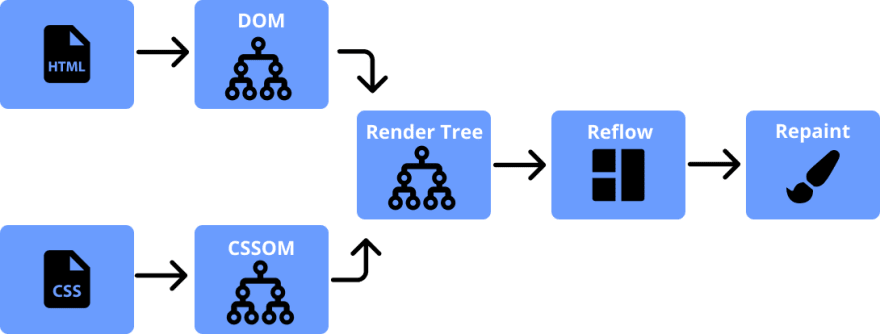
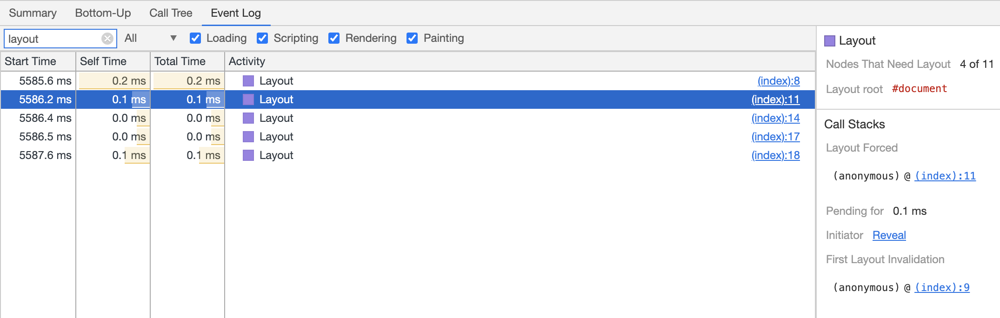
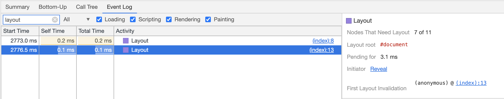

## 浏览器的重绘 (repaint) 和重排 (reflow)  
### 浏览器如何渲染网站

在了解`重绘` (repaint) 和`重排` (reflow) 如何影响页面性能之前，我们先去理解浏览器如何渲染一个网站。



1. 当用户输入 URL 后，浏览器会去从服务器获取 HTML 资源代码；
2. 浏览器解析 HTML 资源代码并把他们转换成令牌< TagName, Attribute, AttributeValue, >等；
3. 这些令牌 会被传换成节点并形成一颗 DOM 树；
4. CSSOM 树也会从 CSS 规则里被生成；
5. DOM 和 CSSOM 会结合形成一颗渲染树 (RenderTree) ;
6. RenderTree 的构造如下：
    * 起始于 DOM 的根节点，并计算可见元素和他们的[计算样式 (computed style)](https://www.w3.org/TR/1998/REC-CSS2-19980512/cascade.html#computed-value)；
    * RenderTree 会忽略那些不可见元素，像 (meta，script，link) 以及 `display:none` ；
    * 渲染树会把可见节点匹配符合 CSSOM 规则并应用他们；
7. 重排：计算可见节点的位置和尺寸；
8. 重绘：最后，浏览器会绘制 RenderTree 到屏幕上去。

浏览器解析在解析 HTML 资源代码 (包括 script) 采用的`同步`的方式，如果在其中包含 script 脚本，那么浏览器会先去执行它，然后继续解析下面的代码，同步会使用户处于交互阻塞状态，过多的重排将直接影响用户体验。

### 重绘和重排

`重绘`发生在元素可见性发生改变并且不影响不布局的情况下，比如：visibility，background-color，outline 发生改变会触发重绘。

`重排`意味着元素的位置和几何形状发生了改变，它影响了部分布局或整个页面的情况下，一个元素的重排可能需要同时对其父级元素及其后面的所有元素进行重排。

> 重排是一个非常昂贵的操作，大部分重排都会导致页面被重新渲染。它是导致DOM 脚本执行缓慢的主要原因之一，特别是在移动手机端。在大部分情况下，重排等同于重新进入一次页面。

### 如何导致重绘和重排

* 重排会发生在添加、删除以及更新 DOM 节点时；
* 使用 `display:none` 隐藏 DOM 元素，会同时导致重排和重绘；
* 使用 `visibility:hidden` 只会造成重绘，因为没有布局和位置的改变，所以不发生重排；
* 移动或执行一个 DOM 节点都会触发重绘和重排；
* 调整浏览器窗口的大小会触发重排；
* 改变 font-style 意味着改变了元素几何形状，会影响其它元素的位置和尺寸，所以同时会要求浏览器执行重排。一旦这些布局操作完成，那么任何被损坏的像素点都会被重绘；
* 添加或移除 Stylesheet 都会造成重排和重绘；

### 尽量减少重排次数

为了减少在用户体验上，重排和重绘带来的负面效应，需要尽可能减少重排和重绘次数。

#### className 或 cssText 改变样式

不要一个一个的修改个别样式，最明智切可维护的做法是通过 class 去改变而不是编辑 style 属性：
  
``` javascript
// bad
var left = 10,
    top = 10;
el.style.left = left + "px";
el.style.top  = top  + "px";

// better 
el.className += " theclassname";

// or when top and left are calculated dynamically...

// better
el.style.cssText += "; left: " + left + "px; top: " + top + "px;";
```

#### 批处理 DOM 的改变

* 使用 `documentFragment` 来作为临时代理节点片段
* 首次读取任何所需的东西，然后一次写入所有的东西

查看下面的反面教材的代码：

``` html
<html>
<body>
  <div id="box1">1</div>
  <div id="box2">2</div>
  <div id="box3">3</div>
  <div id="box4">4</div>
  <script>
    var box1Height = document.getElementById('box1').clientHeight;
    document.getElementById('box1').style.height = box1Height + 10 + 'px';

    var box2Height = document.getElementById('box2').clientHeight;
    document.getElementById('box2').style.height = box2Height + 10 + 'px';

    var box3Height = document.getElementById('box3').clientHeight;
    document.getElementById('box3').style.height = box3Height + 10 + 'px';

    var box4Height = document.getElementById('box4').clientHeight;
    document.getElementById('box4').style.height = box4Height + 10 + 'px';
  </script>
</body>
</html>
```

上面的地面最终导致浏览器布局计算了多次


所以我们做下面的优化：

``` html
<html>
<body>
  <div id="box1">1</div>
  <div id="box2">2</div>
  <div id="box3">3</div>
  <div id="box4">4</div>
  <script>
    var box1Height = document.getElementById('box1').clientHeight;
    var box2Height = document.getElementById('box2').clientHeight;
    var box3Height = document.getElementById('box3').clientHeight;
    var box4Height = document.getElementById('box4').clientHeight;

    document.getElementById('box1').style.height = box1Height + 10 + 'px';
    document.getElementById('box2').style.height = box2Height + 10 + 'px';
    document.getElementById('box3').style.height = box3Height + 10 + 'px';
    document.getElementById('box4').style.height = box4Height + 10 + 'px';
    
  </script>
</body>
</html>
```



 `read` -> `write` -> `read` -> `write` 操作变会触发多次重排，而 `read` -> `write` -> `write` 只会触发一次。

### 减少重排时间

* 减少不必要的 DOM 深度。在 DOM 树中的一个级别进行更改可能会致使该树的所有级别 (上至根节点，下至所修改节点的子级) 都随之变化。这会导致花费更多的时间来执行重排。
* 尽可能减少 CSS 规则的数量，并移除未使用的 CSS 规则。
* 如果你想进行复杂的渲染更改 (例如动画) ，请在流程外执行此操作。您可以使用 position-absolute 或 position-fixed 来实现此目的。
* 避免使用不必要且复杂的 CSS 选择器 (尤其是后代选择器) ，因为此类选择器需要耗用更多的 CPU 处理能力来执行选择器匹配。

参考资料：

\> [https://dev.to/gopal1996/understanding-reflow-and-repaint-in-the-browser-1jbg](https://dev.to/gopal1996/understanding-reflow-and-repaint-in-the-browser-1jbg)

\> [https://blog.sessionstack.com/how-javascript-works-the-rendering-engine-and-tips-to-optimize-its-performance-7b95553baeda](https://blog.sessionstack.com/how-javascript-works-the-rendering-engine-and-tips-to-optimize-its-performance-7b95553baeda)

\> [https://developers.google.com/speed/docs/insights/browser-reflow](https://developers.google.com/speed/docs/insights/browser-reflow)
