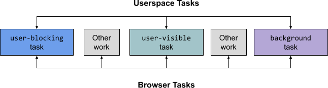
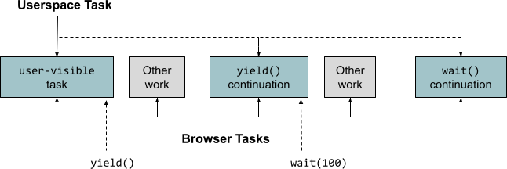

## 用户空间模型 
### 简介

一个`任务` (task) 是`计划或调度` (scheduling) 的基本概念，表示一定量的执行工作。下面通过介绍`用户空间模型`映射到浏览器的`事件循环`以及调度 APIs如何工作。

### 用户空间任务

一个用户空间模型是执行一些数量任务的 javasscript 代码。例如：响应点击按钮事件获取和展示结果，渲染一个框架的虚拟树。如何将一个应用拆解为任务取决于开发者。

用户空间任务的特点：

* `有一个入口点`：通常是一个`回调`，例如传给 `scheduler.postTask()` 或 `setTimeout()` 的值，也可以是 `event listener`，一个 `microtask` 等等；
* `可计划或不可计划的`：有两大类任务：计划运行的任务和响应其他任务而启动的任务。通过入口点 scheduler.postTask()，requestIdleCallback()，setTimeout() 和 requestAnimationFrame() 等被安排的归为前一类，`事件监听`被划为后一类。 `postMessage()` 两类都符合。
* `可异步或同步的`：异步任务被定义为有控制流的任务，例如：Promise 或异步回调，而同步任务没有。
* `可让步的 (yieldy)`：任务执行期间让步于事件循环。可以调用 setTimeout() 或调度延续 postTask()。
* `有一个开发者定义的结束点`：一个异步任务的产生可能是用户空间任务的一部分。

### 事件循环和浏览器任务

HTML 也有任务的概念，它是由浏览器的`事件循环`执行的同步工作块。我们将这些任务称为`事件循环任务`。

用户空间代码通常在事件循环任务中运行，例如 postTask() 回调，但不仅限于：

* 该渲染步骤，其中包括运行 requestAnimationFrame() 等回调，发生的事件循环任务之外。此外，渲染可能不会在事件循环的每一轮中发生，例如由于节流。
* 用户空间代码通常在`微任务检查点` (microtask checkpoints) 中运行，这可以发生在事件循环任务的内部和外部。

为了简化我们的处理模型，我们将事件循环处理分为两个阶段，并将浏览器任务定义为 (a) 运行下一个事件循环任务和后续微任务检查点或 (b) 运行渲染步骤的任务。我们注意到这与 Chromium 的处理模型相匹配。

### 用户空间任务类型

我们对建模感兴趣的用户空间任务分为三类：`同步任务`、`yieldy 异步任务` 和 `nonyieldy 异步任务` 。在接下来的部分中，我们将说明使用scheduler.postTask()。

#### 异步任务 (Synchronous Tasks)

考虑以下简单示例，该示例按每个`优先级`安排任务：

``` javascript
scheduler.postTask(() => {
  startBackgroundTask();
  finishBackgroundTask();
}, {priority: 'background'});

scheduler.postTask(() => {
  startUserVisibleTask();
  finishUserVisibleTask();
}, {priority: 'user-visble'});

scheduler.postTask(() => {
  startUserBlockingTask();
  finishUserBlockingTask();
}, {priority: 'user-blocking'});
```

在这个例子中有三个用户空间任务，每个都是同步的。同步任务根据定义包含在单个浏览器任务中；使用调度时scheduler.postTask()，浏览器任务和用户空间任务之间存在 1:1 映射，如下所示：



scheduler.postTask() 适用于处理优先级任务，提供使用单个 API 对任务进行`优先级排序`和`动态控制`的能力。

#### Yieldy 异步任务 (Yieldy Asynchronous Tasks)

如果任务相当短，同步任务就可以很好地工作，但如果任务很长，它们可能会导致页面无响应。缓解这种情况的两种常见方法是：

* 将长任务细分为多个较小的任务，预先安排所有部分。这会导致更多的同步任务。
* 一段时间后让步于事件循环，计划继续进行。这将同步任务转换为一个 yieldy 异步任务。
*

目前设计用于处理 yieldy 异步任务的两个 API 是：

* scheduler.yield()：用于从当前用户空间任务屈服于浏览器事件循环的 API
* scheduler.wait(): 一个提议的对应物 scheduler.yield()，使脚本能够在一段时间或事件发生后产生和恢复

考虑以下 yieldy 异步任务的示例，postTask() 使用这些 yieldy API 进行调度 ：

``` javascript
scheduler.postTask(async () => {
  startTask();
  // Yield to the browser's event loop.
  await scheduler.yield();

  continueTask();

  // Pause execution for 100 ms.
  await scheduler.wait(100);

  finishTask();
}, {priority: 'user-visible'});
```

像这样的 Yieldy 异步任务分布在多个浏览器任务中：



##### Yieldy 异步任务和线程

Yieldy 异步任务启用了一些并发性，这些任务类似于线程——运行在单核机器上的不可抢占线程，即：

* 该 postTask() 回调是线程的切入点；
* 调用 scheduler.yield() 或 scheduler.wait() 暂停当前​​线程/任务的执行 (类似于 Thread.yield() 和 Thread.sleep() 在 Java 中) ；
* 线程和 postTask() 任务一样，通常具有可修改的优先级；
* Java 的 Thread 也有获取当前线程的能力，类似于scheduler.currentTaskSignal 提议。

#### 非 Yieldy 异步任务

最后一类任务是非 Yieldy 异步任务，它们看起来像是伪装成 yieldy 异步任务的同步任务。考虑以下示例：

``` javascript
scheduler.postTask(async () => {
  startTask();
  // This promise may or may not resolve in this task, depending on if the data
  // is local.
  let data = await getDataFromCache();
  processData(data);
}, priority: 'user-visible');
```

如果在这个例子中 getDataFromCache() 返回一个 resolved promise，那么任务本身是异步的，但不会 yield：


我们注意到，与从 microtasks 开始的新任务类似，如果在同一个浏览器任务中完成大量工作，非 yieldy 异步任务可能会导致性能问题。

参考资料：

\> [https://github.com/WICG/scheduling-apis/blob/main/misc/userspace-task-models.md](https://github.com/WICG/scheduling-apis/blob/main/misc/userspace-task-models.md)

\> [https://html.spec.whatwg.org/multipage/webappapis.html#event-loops](https://html.spec.whatwg.org/multipage/webappapis.html#event-loops)
