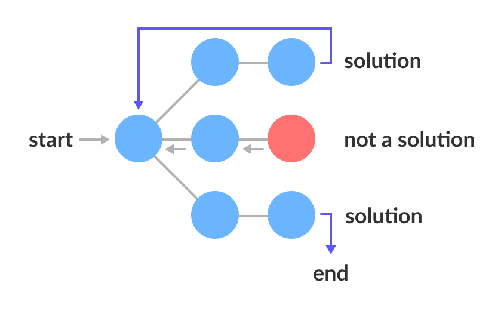

## 算法设计范式 
### 简介

算法设计范式 (algorithmic design paradigm) ，或者直接叫做算法范式 (algorithmic paradigm) ，一个通用模型或框架，描述一种类型算法的设计方法。

一个`算法范式`是一个高于其`算法` (algorithm) 的抽象，而一种`算法`是高于`计算程序`的抽象。

国内通常把它叫做算法思想，但是国外的资料一般叫`范式 (paradigm)`。个人也比较倾向于这个翻译，因为范式更多意味着它有着相应的方法论去执行这种范式。但`思想`这个词较为泛化，作为一般术语缺乏一定的可解读性。说白了，把`思想`放这对于理解它的本意毫无用处。

算法范式较为通俗的说法可以叫做`设计算法的方法`。

### 范式列表

#### 一般范式

* 回溯 (Backtracking)
* 分支定界 (Branch and bound)
* 暴力搜索 (Brute-force search)
* 动态规划 (Dynamic programming)
* 贪心算法 (Greedy algorithm)
* 消减搜索 (Prune and search)

#### 参数复杂性

* 核心化 (Kernelization)
* 迭代压缩 (Iterative compression)

#### 计算几何

* 扫描线算法 (Sweep line algorithm)
* 旋转卡壳 (Rotating calipers)
* 随机算法 (Randomized algorithm)

### 通用术语

#### 解空间

有一种问题，它有 $n$ 个输入，都能用一个 $n$ 元组 $X= {\\{x_1, x_2,..., x_n\\}}$ 来表示问题的解。其中，$x_i$ 的取值范围为某个有穷集 $S$。我们把 $X$ 集合称为问题的`解向量`，而把 $x_i$ 所有可能取值范围的组合，称为问题的`解空间`。

#### 状态空间树

问题的解空间若可以用树表示，可以叫`解空间树`。在计算机领域，它被叫做`状态空间树`。一个状态空间树表示问题的所有可能状态 (解和无解) ，根节点作为起始状态，一直延伸到叶子末端状态。



#### 可行解

问题的解只是整个解空间的一个子集，子集中的解必须满足事先给定的约束条件。我们把满足约束条件的解称为问题的`可行解`。

#### 目标函数

可行解可能不止一个。对于需要寻找最优解的问题，还需给出一个`目标函数` (objective function) ，满足目标函数的可行解称为`最优解`。

目标函数只有在找出可行解之后，才有意义。

### 回溯

回溯法 (backtracking) 是`暴力搜索法`中的一种。

回溯法是一种可以找出所有 (或一部分) 解的一般性算法，尤其适用于`约束补偿问题` (在解决约束满足问题时，我们逐步构造更多的候选解，并且在确定某一部分候选解不可能补全成正确解之后放弃继续搜索这个部分候选解本身及其可以拓展出的子候选解，转而测试其他的部分候选解) 。

回溯法采用`试错`的思想，它尝试分步的去解决一个问题。

在分步解决问题的过程中，当它通过`尝试`发现，现有的分步答案不能得到有效的正确的解答的时候，它将取消上一步甚至是上几步的计算，再通过其它的可能的分步解答再次尝试寻找问题的答案。

回溯法通常用`最简单的递归`方法来实现，在反复重复上述的步骤后可能出现两种情况：

* 找到一个可能存在的正确的答案
* 在尝试了所有可能的分步方法后宣告该问题没有答案

在最坏的情况下，回溯法会导致一次复杂度为指数时间的计算。

#### 常见用例

* [八皇后疑惑](/articles/algorithms-case/eight-queens-puzzle)
* 哈密顿路径问题 (Hamiltonian path problem)
* 解迷宫演算法 (Maze-solving algorithm)
* 骑士巡逻 (Knight's tour)
* 着色问题
* 背包问题

### 分支定界

分支定界 (Branch and bound) ，简称：BB，B&B 或 BnB，是一种`搜索`与`迭代`的方法，指的是`分支`和`定界`两个动作。

`分支`的过程就是不断给树增加子节点的过程，而`定界`就是在分支的过程中检查子问题的上下界，如果子问题不能产生一个比当前最优解还要优的解，那么砍掉这一支。直到所有子问题都不能产生一个更优的解时，算法结束。

B&B 把问题拆解一个`状态空间树` (state space tree) ，然后遍历树来查找解。

B&B 算法的目标是在可行解的集合 $S$ 中找到一个值 $x$，$x$ 使目标函数的值`最大化`或`最小化`，即`极值`。

#### 算法原则

B&B 算法根据两个原则运行：

* 递归地将搜索空间分割成为更小的空间，然后在这些更小的空间上找到$f(x)$的最小值，这个过程被叫做`分支`。
* 暴力搜索单独的分支。为了提高性能，B&B 算法跟踪它，试图找到最小值的边界，并使用这些边界来`修剪`搜索空间，并且能够证明这种修剪并不会包含最优解。

将这些原则转化为特定优化的具体算法需要用某种`数据结构`表示可行解集，这种表示称为问题的一个`实例`。

我们用 $S$ 表示实例 $I$ 的可行解集。实例表示必须带有三个操作：

* branch($I$) 生成两个或多个实例，每个实例代表 $S_I$ 的子集 (通常，子集不相交，以防止算法两次访问相同的可行解，但这不是必要的。而 $S_I$ 的最优解则必须被包含在至少一个子集之中) 。
* bound($I$) 在一个空间中，计算任意可行解的值的下界 (lower bound) ，使在所有在集合 $S_I$ 里的值 $x$，都满足 bound($I$) $\leq f(x)$ 。
* solution($I$) 确定 $I$ 是否表示一个可行解。

B&B 算法通过分支操作形成实例树，执行自上而下的递归搜索。在访问实例 $I$ 时，它检查 bound($I$) 是否大于目前找到的上界，若如此 $I$ 可能会被安全得从搜索中丢弃并且停止递归。

这个`修剪`步骤通常通过维护一个`全局变量`来实现，改变量记录迄今为止检查的所有实例中看到的`最小上界`。

#### 算法骨架

下面是一个求目标函数 $f$ 极小值的算法骨架。为了获取实际算法，被要求提供一个 bound 函数，它被用于计算 $f$ 的下界和一些特定问题的分支规则。就此而言，该算法表示为一个高阶函数。

1. 使用启发式，找到可行解 $x_h$，存储它 $B = f(x_h)$。 (若没有可用的启发式方法，则将 $B$ 设置为无穷大。) $B$ 将表示目前为止周到的最优解，并将用作可行解的上界。
2. 初始化一个队列以保存没有分配问题变量的部分可行解。
3. 循环直到队列为空：
   1. 从队列中取出一个节点 $N$。
   2. 若 $N$ 代表单个可行解 $x$，并且 $f(x) < B$，那么 $x$ 是目前为止最好的解。记录它并设置 $B ← f(x)$。
   3. 否则，在 $N$ 上进行分支并生成新的节点 $N_i$。对于这些中的每一个：
      1. 若 bound($N_i$) $> B$，则什么都不做；由此节点的下界 $>$ 问题的上界，因此永远不会导致最优解，可以丢弃。
      2. 否则，将 $N$ 存储到队列中去。

队列可以选择 `FIFO 队列` 数据结构，这种队列产出`广度优先搜索`。也可以选择一个栈 `LIFO 队列`，它将产出一个`深度优先算法`。

#### 伪代码

``` c++
// C++-like implementation of branch and bound, 
// 假设目标函数 f 要实现最小化
CombinatorialSolution branch_and_bound_solve(
    CombinatorialProblem problem, 
    ObjectiveFunction objective_function /*f*/,
    BoundingFunction lower_bound_function /*bound*/) 
{
    // 上面的步骤 1
    double problem_upper_bound = std::numeric_limits<double>::infinity; // = B
    CombinatorialSolution heuristic_solution = heuristic_solve(problem); // x_h
    problem_upper_bound = objective_function(heuristic_solution); // B = f(x_h)
    CombinatorialSolution current_optimum = heuristic_solution;
    // 上面的步骤 2
    queue<CandidateSolutionTree> candidate_queue;
    // 特定问题的队列初始化
    candidate_queue = populate_candidates(problem);
    while (!candidate_queue.empty()) { //上面步骤 3
        // 步骤 3.1
        CandidateSolutionTree node = candidate_queue.pop();
        // "node" 表示上面的 N
        if (node.represents_single_candidate()) { // 步骤 3.2
            if (objective_function(node.candidate()) < problem_upper_bound) {
                current_optimum = node.candidate();
                problem_upper_bound = objective_function(current_optimum);
            }
            
            // 否则，node 不是一个最佳的候选节点
        }
        else { // 步骤 3.3：node 代表候选解的一个分支
            // "child_branch" 表示上面的 $N_i
            for (auto&& child_branch : node.candidate_nodes) {
                if (lower_bound_function(child_branch) <= problem_upper_bound) {
                    candidate_queue.enqueue(child_branch); // 步骤 3.3.2
                }
                // 否则，bound(N_i) > B 所以我们修剪分支；步骤 3.3.1
            }
        }
    }
    return current_optimum;
}
```

在上面的伪代码中， 函数 `heuristic_solve` 和 `populate_candidates` 被叫做子程序 (subroutines) ，它对于问题必须是可应用的。目标函数 `objective_function` 和函数 `lower_bound_function` 被当做函数对象。

#### 常见用例

* 旅行推销员问题。

### 暴力搜索

暴力搜索 (Brute-force search) 或者说`穷举搜索`，也称为`生成与测试`，是一种非常低效的解决问题的技术，方法包括了系统地枚举解决方案的所有可能候选项，以及检查每个候选项是否符合问题描述。

虽然暴力搜索很容易实现，并且如果解决方案存在，它就一定能够找到。

但是它的代价是和候选方案的数量成正比，由于这一点，在很多实际问题中，消耗的代价会随着问题规模的增加而快速地增长。

因此，当问题规模有限或当存在可用于将候选解决方案的集合减少到可管理大小的针对特定问题的`启发式算法`时，通常使用暴力搜索。另外，当实现方法的`简单度比速度更重要`的时候，也会用到这种方法。

当用计算机证明数学定理时，算法中的任何错误将会导致严重的后果。暴力搜索也可在其他基准化算法和启发式算法里用作`基准方法`。事实上，暴力搜索可以被看作`最简单的启发式算法`。

暴力搜索与回溯概念是不相同的，在回溯算法中，大量的解决方案并没有被枚举而直接被丢弃 (例如上文提到的“八皇后问题”的解决方案) 。

用于在表中查找一个项目，也就是说顺序地检查表中所有条目的暴力方法被称为`线性搜索`。

#### 常见用例

* 找出自然数n的约数的暴力搜索算法将枚举出从 $1$ 到 $n$ 的所有整数，并检查它们中的每一个是否除 $n$ 后没有余数。
* 针对`八皇后问题`的暴力搜索算法会检查所有在 $8 \times 8$ 棋盘上八个“皇后”可能的摆放方法，并且对每一种摆放方法，检查其每一个“皇后”是否能攻击到其它人。

### 动态规划

动态规划 (Dynamic programming，简称 DP) 是一种在数学、管理科学、计算机科学、经济学和生物信息学中使用的，通过把原问题`分解`为相对简单的`子问题`的方式求解复杂问题的方法。

动态规划常常适用于`重叠子问题`和有`最优子结构性质`的问题，动态规划方法所耗时间往往远少于`朴素解法`。

#### 适用情况

* `最优子结构性质`：如果问题的最优解所包含的子问题的解也是最优的，就称该问题具有最优子结构性质 (即满足最优化原理) 。最优子结构性质为动态规划算法解决问题提供了重要线索。
* `无后效性`：即子问题的解一旦确定，就不再改变，不受在这之后、包含它的更大的问题的求解决策影响。
* `子问题重叠性质`：子问题重叠性质是指在用递归算法自顶向下对问题进行求解时，每次产生的子问题并不总是新问题，有些子问题会被重复计算多次。动态规划算法正是利用了这种子问题的重叠性质，对每一个子问题只计算一次，然后将其计算结果保存在一个表格中，当再次需要计算已经计算过的子问题时，只是在表格中简单地查看一下结果，从而获得较高的效率，降低了时间复杂度。

动态规划背后的基本思想非常简单。大致上，若要解一个给定问题，我们需要解其不同部分 (即子问题) ，再根据子问题的解以得出原问题的解。

通常许多子问题非常相似，为此动态规划法试图仅仅解决每个子问题一次，从而减少计算量：一旦某个给定子问题的解已经算出，则将其`记忆化存储`，以便下次需要同一个子问题解之时`直接查表`。这种做法在重复子问题的数目关于输入的规模呈指数增长时特别有用。

通常动态规划会保存以前的运算结果，并根据以前的结果对当前进行选择，有`回退功能`。

#### 常见用例

* 背包问题
* 切割钢条问题
* Floyd最短路问题
* 最大不下降子序列
* 矩阵链乘
* 凸多边形三角剖分
* 0-1背包
* 最长公共子序列
* 最优二分搜索树

### 贪心算法

贪心算法 (Greedy algorithm) 是一种在每一步选择中都采取在当前状态下最好或最优 (即最有利) 的选择，从而希望导致结果是最好或最优的算法。

贪心算法在有`最优子结构`的问题中尤为有效。最优子结构的意思是局部最优解能决定全局最优解。简单地说，问题能够分解成子问题来解决，子问题的最优解能递推到最终问题的最优解。

贪心算法在数据科学领域被广泛应用，特别是`金融工程`。其中一个贪心算法例子就是 `Ensemble method` 。

#### 细节

1. 创建数学模型来描述问题。
2. 把求解的问题分成若干个子问题。
3. 对每一子问题求解，得到子问题的局部最优解。
4. 把子问题的解局部最优解合成原来解问题的一个解。

#### 特性

* 对于大部分的问题，贪心通常都不能找出最优解 (不过也有例外) ，因为他们一般**没有**测试所有可能的解。
* 贪心容易**过早做决定**，因而没法达到最优解。例如，所有对`图着色问题`。

#### 常见用例

* 图着色问题

### 贪心算法 vs 动态规划

`贪心算法`与`动态规划`的不同在于它对**每个子问题**的解决方案都做出`选择`，**不能回退**。`动态规划`则会`保存`以前的运算结果，并根据以前的结果对当前进行选择，有回退功能。

贪心算法在有`最优子结构`的问题中尤为有效。**最优子结构**的意思是`局部最优解`能决定`全局最优解`。简单地说，问题能够分解成子问题来解决，`子问题`的最优解能递推到`最终问题`的最优解。

### 消减搜索

消减搜索 (Prune and search) 是用于解决最优化问题，在 1983 年由 Nimrod Megiddo 提出。

该方法的基本思想是一个递归过程，在该过程中，输入大小在每一步都消减一个常数因子0 < p < 1。因此，它是一种减少和征服算法的形式，其中每一步的减少都是一个常数因子。让`Ñ`是输入大小，`Ť (Ñ)`是时间复杂性的整个修剪和搜索算法的，和小号`(Ñ)`是消减步骤的时间复杂度。那么T ( n )服从以下递推关系：

${\displaystyle T(n)=S(n)+T(n(1-p))}$

这类似于`二分搜索的循环`，但比二分搜索的常数项具有更大的 S ( n ) 项。在修剪和搜索算法中，S(n) 通常至少是线性的 (因为必须处理整个输入) 。有了这个假设，递归就有解 T ( n ) =  O ( S ( n ))。这可以通过应用分而治之递归的主定理或通过观察递归子问题的时间以几何级数减少来看到。

特别是，Megiddo 本人在他的线性时间算法中使用了这种方法来解决维度固定时的`线性规划问题`以及空间中一组点的`最小封闭球问题`。
