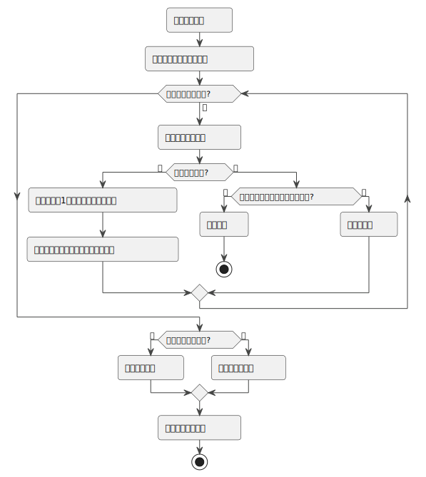

## 线性代数 (一) - 概念、特性及运算 
### 概念

`线性代数` (Linear Algebra) 是数学中处理`向量空间`和`线性映射`之间的关系的一个分支。它包含了许多基本概念和术语，以下是一些主要的概念。

下面的方程组的概念都特指线性方程组。

#### 基础概念

- **标量（Scalar）**：一个单一的数值，通常表示向量空间中向量的长度或大小。
  - 表示：通常用小写字母表示，如 $ a $, $ b $, $ c $。
- **向量（Vector）**：具有大小和方向的量，可以在 n 维空间中表示。
  - 表示：通常用箭头符号，如 $ \vec{v} $, $ \vec{u} $。例如：在`二维空间`中，`一个向量`可以表示为 $ \mathbf{v} = \begin{bmatrix} v_1 \\\\ v_2 \end{bmatrix} $。
- **向量空间（Vector Space）**：一个由向量组成的集合，这些向量可以通过`加法`和`标量乘法`进行组合。
  - 表示：通常用大写字母表示，如 $ V $, $ W $。

#### 矩阵和行列式

- **矩阵（Matrix）**：一个矩形的数字阵列，可以表示`线性变换`。
  - 表示：通常用大写粗体字母表示，如 $ \mathbf{M} $, $ \mathbf{A} $。例如：一个 2x2 矩阵可以表示为 $ \mathbf{A} = \begin{bmatrix} a_{11} & a_{12} \\\\ a_{21} & a_{22} \end{bmatrix} $。
- **方阵（Square Matrix）**：一个 `m` 行和 `n` 列的矩阵称为 `m x n` 阵，如果矩阵的行数和列数相等，即 m = n 则称该矩阵为`方阵`。
- **行列式（Determinant）**：一个与方阵相关的`标量值`，可以提供方阵的某些属性，如`是否可逆`。
  - 表示：使用“det”表示或矩阵符号内加竖线，如 $ \det(\mathbf{A}) $ 或 $ |\mathbf{A}| $。例如：一个 2x2 矩阵的行列式为 $ |\mathbf{A}| = a_{11}a_{22} - a_{12}a_{21} $。
- **逆矩阵（Inverse Matrix）**：一个矩阵的逆，与原矩阵相乘结果为单位矩阵。
  - 表示：使用上标“-1”表示，如 $ \mathbf{A}^{-1} $。
- **单位矩阵（Identity Matrix）**：一个主对角线上元素为 `1`，其他元素为 `0` 的方阵。
  - 表示：通常用 $ \mathbf{I} $ 表示。例如：2x2 单位矩阵为 $ \mathbf{I} = \begin{bmatrix} 1 & 0 \\\\ 0 & 1 \end{bmatrix} $。

#### 线性映射和变换

- **线性变换（Linear Transformation）**：保持向量加法和标量乘法的函数。
  - 表示：通常用大写字母表示，如 $ T $。例如：$ T(\mathbf{v}) = \mathbf{A}\mathbf{v} $，其中 $ \mathbf{A} $ 是变换矩阵。
- **特征值和特征向量（Eigenvalues and Eigenvectors）**：一个线性变换下不改变方向的非零向量和对应的标量。
  - 表示：特征值通常用 $ \lambda $ 表示，特征向量用 $ \mathbf{v} $ 表示。例如：$ \mathbf{A}\mathbf{v} = \lambda\mathbf{v} $。

#### 向量操作

- **点积（Dot Product）**：两个`向量的乘积`，反映了它们的方向关系和长度。
  - 表示：$ \mathbf{a} \cdot \mathbf{b} $
- **叉积（Cross Product）**：两个`向量的乘积`，结果是一个`垂直`于这两个向量的`第三个向量`。
  - 表示：$ \mathbf{a} \times \mathbf{b} $
- **范数（Norm）**：向量的长度或大小。
  - 表示：$ \|\mathbf{v}\| $

#### 线性方程组

- **线性方程组（System of Linear Equations）**：一组线性方程，可以用矩阵表示。
  - 表示：使用增广矩阵或等式组，如 $ \mathbf{Ax} = \mathbf{b} $。
- **高斯消元法（Gaussian Elimination）**：解线性方程组的一种方法。
- **秩（Rank）**：矩阵列（或行）的最大线性无关集合的大小。

#### 空间

- **子空间（Subspace）**：向量空间中的一个集合，本身也是一个向量空间。
  - 表示：通常用 $ U $, $ W $ 等大写字母表示。
- **列空间和零空间（Column Space and Null Space）**：矩阵的列空间是其列向量的所有线性组合，零空间是使矩阵乘以向量等于零向量的所有向量的集合。

#### 进阶概念

- **基（Basis）**：向量空间的一个`线性无关向量集`，可以通过线性组合来表示空间中的每一个向量。
  - 表示：一组基向量通常用集合表示，如 $ \{ \mathbf{v}_1, \mathbf{v}_2, \ldots, \mathbf{v}_n \} $。
- **维度（Dimension）**：基中向量的数量。
  - 表示：使用“dim”表示，如 $ \dim(V) $。
- **线性相关和线性无关（Linearly Dependent and Linearly Independent）**：一组向量是否可以通过线性组合互相表示的属性。
- **正交和正交化（Orthogonality and Orthogonalization）**：向量之间的垂直关系及其过程。
  - 表示：正交向量用点积为 `0` 表示，如 $ \mathbf{a} \cdot \mathbf{b} = 0 $。
- **奇异值分解（Singular Value Decomposition, SVD）**：将矩阵分解为奇异向量和奇异值。
  - 表示：$ \mathbf{A} = \mathbf{U}\Sigma\mathbf{V}^T $，其中 $ \mathbf{U} $ 和 $ \mathbf{V} $ 是`正交矩阵`，$ \Sigma $ 是`对角矩阵`。

这些概念是线性代数的基础，用于解决多种数学、科学和工程问题，特别是在计算机图形学、机器学习、优化问题等领域中有着广泛的应用。

### 线性方程组和矩阵

下面包含了三组线性方程组：

$(a) \cases {\begin{aligned} &x_1 + 2x_2 = 5 \\\ 2&x_1 + 3x_2 = 8 \end{aligned}}$
$(b) \cases {\begin{aligned} &x_1 - x_2 + x_3 = 2 \\\ 2&x_1 + x_2 - x_3 = 4 \end{aligned}}$
$(c) \cases {\begin{alignat}{1} x_1& + x_2&= 2 \\\ x_1& - x_2&= 1 \\\ x_1&&= 4 \end{alignat}}$

方程组 (a) 称为 `2x2` 的方程组，(b) 称为 `2x3` 的方程组，(c) 称为 `3x2` 的方程组。

#### 等价方程组

考虑下面两个方程组

$(a)  \cases {\begin{alignat}{1}
3&x_1& + &2&x_2 & - & &x_3  &= &-&2 \ \ \ [{\color{red}{\ a1\ }}]\\\
 &   &   & &x_2 &  & &     &= & &3  \ \ \ [{\color{red}{\ a2\ }}] \\\
 &   &   & &    &  &2&x_3  &= & &4 \ \ \ [{\color{red}{\ a3\ }}]
\end{alignat}}$
$(b) \cases {\begin{alignat}{1}
&3x_1 &+ &2&x_2 - x_3 &= -&2 \ \ \ [{\color{green}{\ b1\ }}]\\\
-&3x_1 &- &&x_2 + x_3 &= &5 \ \ \ [{\color{green}{\ b2\ }}]\\\
&3x_1 &+ &2&x_2 + x_3 &= &2 \ \ \ [{\color{green}{\ b3\ }}]
\end{alignat}}$

(b) 方程组和 (a) 方程组具有相同的解：

将 (b) 的 $\color{green}{b1}$ 和 $\color{green}{b2}$ 两个方程`相加`得出
$\begin{alignat}{1}
 3&x_1 &+  &2&x_2 &- &x_3&=-&2  \ \ \ [{\color{green}{\ b1\ }}]\\\
-3&x_1 &-  & &x_2 &+ &x_3&= &5 \ \ \ [{\color{green}{\ b2\ }}]\\\
\hline
&        & & &x_2 &  &   &= &3  \ \ \ [{\color{red}{\ a2\ }}]\end{alignat}$

将 (b) 的 $\color{green}{b3}$ 方程`减去` $\color{green}{b1}$ 方程得出
$\begin{alignat}{1}
3x_1 &+ 2&x_2 + x_3 &= &2 \ \ \ [{\color{green}{\ b3\ }}] \\\
3x_1 &+ 2&x_2 - x_3 &= -&2 \ \ \ [{\color{green}{\ b1\ }}]\\\
\hline
&&2x_3 &= &4 \ \ \ [{\color{red}{\ a3\ }}]\end{alignat}$

所以，方程组 (b) 的解必为方程组 (a) 的解。通过运算方程组 (a) 也能证明方程组 (a) 的解必为方程组 (b) 的解。

#### 系数矩阵

把 (b) 方程组系数提出来便得到`系数矩阵` (coefficient matrix)：$ \begin{bmatrix} 3 & 2 & -1 \\\ -3 & -1 & 1 \\\ 3 & 2 & 1 \end{bmatrix}$。

#### 增广矩阵

把 (b) 方程组的`常数项`提出来和系数矩阵形成新的矩阵叫`增广矩阵` (augmented matrix)：$\left [ \begin{array}{ccc|c} 3 & 2 & -1 & -2 \\\ -3 & -1 & 1 & 5 \\\ 3 & 2 & 1 & 2 \end{array} \right ]$。竖线`左边`是`系数项`，`右边`是`常数项`。

### 方程组的求解和分析

求解方程组的过程通常是一个`消元`过程。这个过程的目标是`简化`方程组，使其更容易解析或直接找到解。通常可以使用`高斯消元法` (Gaussian Elimination) 来求解方程。

方程组的所有解的集合称为方程组的`解集` (solution set)。若方程组无解，则称该方程组是`不相容` (inconsistent) 的，若方程组有解，则称该方程组是`相容` (consistent) 的，

#### 高斯消元法

高斯消元法有三种基础`行运算`，这三种行运算也被叫做`初等行变换(运算)`：

1. 把一个方程的倍数加到另一个方程上;
2. 互换两个方程的位置;
3. 用一个`非零`数`乘`某一个方程;

对于 $
\cases {\begin{alignat}{1} 2&x+ 3y - 7 &= 0 \\\
3&x-5y+18 &= 0
\end{alignat}}
$ 的`齐次`二元方程组，如何通过高斯消元来解呢？

**步骤 1**: `常数项`移至方程式的`右边`，转成标准形式： $\cases {\begin{align}
  2x+ 3y &= 7 \ \ \color{red}{①} \\\ 3x-5y &= -18 \ \ \color{red}{②}
\end{align}}$

**步骤 2**: 执行运算 $({\color{red}{①}} \times \frac{-3}{2}) + \color{red}{②}$，把标准形式进行`消元`简化为`阶梯形方程组`：$\cases { \begin{align}2x+ 3y &= 7  \ \ \color{green}{③} \\\ -\frac{19}{2}x&= -\frac{57}{2} \ \ \color{green}{④}\end{align}}$

**步骤 3**: 解方程 $\color{green}{④}$，y = 3，然后`回代` (back-substitution)到方程 $\color{green}{④}$，x = -1。

#### 矩阵高斯消元运算

下面展示矩阵如何使用高斯消元法来解它。让我们考虑以下方程组：
$$
\cases {
\begin{align}
x + 2y + z = 9 \\\
2x - y + 2z = 8 \\\
-3x + 3y - z = 3
\end{align}
}
$$

**步骤 1**: 首先，我们将方程组写成`增广矩阵`的形式：
$
\begin{bmatrix}
\begin{array}{ccc|c}
1 & 2 & 1  & 9 \\\
2 & -1 & 2  & 8 \\\
-3 & 3 & -1  & 3
\end{array}
\end{bmatrix}
\begin{align}
\ \ \color{red}{①}\\\
\ \ \color{green}{②} \\\
\ \ \color{blue}{③}
\end{align}
$

**步骤 2**: 使用高斯消元法进行消元，我们将进行一系列的行操作来转换这个矩阵，形成一个`行阶梯形矩阵`(REF, Row-Echelon Form) 矩阵。

第一步: 使用第一行(主行)消去其他行中的 $x$

- 将`第二行`替换为第二行`加上`第一行的`负两倍`，${\color{green}{②}} =\color{green}{②} + {\color{red}{①}} \cdot (-2)$。
- 将`第三行`替换为第三行`加上`第一行的`三倍`，${\color{blue}{③}} =  \color{blue}{③} + {\color{red}{①}} \cdot (3)$。

$
\begin{bmatrix}
\begin{array}{ccc|c}
1 & 2 & 1  & 9 \\\
0 & -5 & 0  & -10 \\\
0 & 9 & 2  & 30
\end{array}
\end{bmatrix}
\begin{align}
\ \ \color{red}{①}\\\
\ \ \color{green}{②} \\\
\ \ \color{blue}{③}
\end{align}
$

第二步: 使用第二行(主行)消去第三行中的 $y$

- 将`第三行`替换为第三行`加上`第二行的 ${9}\over{5}$ 倍，${\color{blue}{③}} ={\color{blue}{③}} + {\color{green}{②}} \cdot \frac{9}{5}$。

$
\begin{bmatrix}
\begin{array}{ccc|c}
\color{coral}{1} & 2 & 1  & 9 \\\
0 & \color{coral}{-5} & 0  & -10 \\\
0 & 0 & \color{coral}{2} & 12
\end{array}
\end{bmatrix}
\begin{align}
\ \ \color{red}{①}\\\
\ \ \color{green}{②} \\\
\ \ \color{blue}{③}
\end{align}
$

此时，这个行阶梯形矩阵就表示了一个`严格三角形`方程组。一个严格三角形方程组，说明了该方程组的`解只有一个`。该方程组和原方程组是`等价的`。在每一次变换后，方程组的`维数`实际上有效减一。

行阶梯形矩阵中，每一行的第一个非零元素称为`主元` (pivot)，即 $\color{coral}{\set{1\ {-5}\ 2}}$。

**步骤 3**: `回代`。一旦我们得到了阶梯形矩阵，我们将从`最后一行`开始`回代`，逐步求解每个变量。

1. 从最后一行开始，我们可以直接求出 $z$：$ 2z = 12 \implies z = \frac{12}{2} = 6 $
2. 然后我们可以使用第二行求出 $y$：$ -5y = -10 \implies y = \frac{-10}{-5} = 2 $
3. 最后，我们使用第一行求出 $x$：$ x + 2y + z = 9 \implies x = 9 - 2y - z = 9 - 2 \cdot 2 - 6 = -1 $

因此，方程组的解是 ($x = -1$, $y = 2$, $z = 6$)。

#### RREF

在上面使用高斯消元法中，`步骤 2` 进行`初等行变换`后形成了`行阶梯形矩阵` (REF)。在 REF 中：

- 元素全为 `0` 的行叫`零行`。
- 元素不全为 `0` 的行叫`非零行`。
- 非零行都在零行之上。
- 每行的首个非零元素（主元）位于前一行主元的`右侧`。
- 主元`下方`的所有元素都是 `0`。
- 以`主元`为系数的未知量叫做`主变量`，其余未知量叫`自由未知量`。

在形成行阶梯形矩阵后，可以继续对`行阶梯形矩阵`进行`初等行变换`，最后形成如下一个`简化行阶梯形矩阵` (RREF, Reduced Row-Echelon Form)。

$
\begin{align}
\color{red}{①}\ \ \\\
\color{green}{②} \ \ \\\
\color{blue}{③} \ \ 
\end{align}
\begin{bmatrix}
\begin{array}{ccc|c}
1 & 2 & 1  & 9 \\\
0 & -5 & 0  & -10 \\\
0 & 0 & 2  & 12
\end{array}
\end{bmatrix}
$
$\xrightarrow{{{\color{red}{①}}= {\color{red}{①}} + {\color{green}{②}} \cdot \frac{2}{5}}}$
$
\begin{bmatrix}
\begin{array}{ccc|c}
1 & 0 & 1  & 5 \\\
0 & -5 & 0  & -10 \\\
0 & 0 & 2  & 12
\end{array}
\end{bmatrix}
$
$\xrightarrow{{{\color{red}{①}}= {\color{red}{①}} + {\color{blue}{③}} \cdot (-\frac{1}{2})}}$
$
\begin{bmatrix}
\begin{array}{ccc|c}
1 & 0 & 0  & -1 \\\
0 & 1 & 0  & 2 \\\
0 & 0 & 2  & 12
\end{array}
\end{bmatrix}
$
$\xrightarrow{{{\color{blue}{③}}={\color{blue}{③}} \cdot \frac{1}{2}}}$
$
\begin{bmatrix}
\begin{array}{ccc|c}
\color{coral}{1} & 0 & 0  & -1 \\\
0 & \color{coral}{1} & 0  & 2 \\\
0 & 0 & \color{coral}{1}  & 6
\end{array}
\end{bmatrix}
$

最后形成的 RREF 的常数项就是方程组的解是： ($x = -1$, $y = 2$, $z = 6$)。

在 RREF 中：

- 每一行的主元都为 `1`，而且是所在列`唯一`的非零数，即同列的其他元素都为 `0`。

RREF 是 REF 的一个特殊情况，提供了一种更加标准化和简化的矩阵形式，有助于直接从矩阵中读取解或进行进一步的数学处理。

#### RREF 分析

不同 RREF 构型具有不同的性质。

`无解` (inconsistent): 当矩阵的某一行（除了最后一列）为零行，但最后一列的对应元素不为零时，方程组无解。例如：

$
\begin{bmatrix}
1 & 0 & 0 & | & a \\\
0 & 1 & 0 & | & b \\\
0 & 0 & 0 & | & c \, (\text{且} c \neq 0)
\end{bmatrix}
$

在这个例子中，$ a $ 和 $ b $ 是任意实数，而 $ c $ 是一个非零实数。最后一行对应的方程是 $ 0x + 0y + 0z = c $，这在 $ c \neq 0 $ 时没有解。

`唯一解`（consistent and independent）: 当矩阵的每一行都有一个主元（该列的唯一非零元素），且不存在全零行时，方程组有唯一解。例如：

$
\begin{bmatrix}
1 & 0 & 0 & | & a \\\
0 & 1 & 0 & | & b \\\
0 & 0 & 1 & | & c
\end{bmatrix}
$

这里 $ a $, $ b $, 和 $ c $ 是任意实数。这个方程组的解是 $ x = a $, $ y = b $, $ z = c $。

`无穷多解`（consistent and dependent）: 当矩阵有至少一个非主元列，并且不存在使方程组无解的行时，方程组有无穷多解。例如：

$
\begin{bmatrix}
1 & 0 & a & | & b \\\
0 & 1 & c & | & d \\\
0 & 0 & 0 & | & 0
\end{bmatrix}
$

在这个例子中，$ a $, $ b $, $ c $, 和 $ d $ 是任意实数。`最后一行`是一个`全零行`，表示这个方程组是有`依赖的`，因此有无穷多解。

#### 高斯-约当算法

`高斯 (Gauss) -约当 (Jordan) 算法`是高斯消元法的一个变体，主要目的是将矩阵简化为 `RREF`，它适用于`计算机`算法实现，能够处理处理大型矩阵的初等变换。

算法步骤：

1. **选择主元**：在每一步中，选择当前行的主元（首个非零元素）。不同于高斯消元法，这里主元是在整个矩阵中选择，而不仅仅是当前列的下方。
2. **主元归一化**：通过将主元所在的行`乘以`该主元的`倒数`，使主元变为 1。
3. **消去上下元素**：使用`行运算`，消去主元所在列的上方和下方的所有元素。这是高斯-约当算法与高斯消元法的`主要区别`，后者仅消去主元下方的元素。
4. **重复以上步骤**：对于每一行重复以上步骤，直到整个矩阵变为 RREF。
5. **解读结果**：在完成所有步骤后，矩阵的最后形态将直接显示出每个变量的值（对于方程组解的情况），或者如果是用于`求矩阵逆`，则最终`矩阵右侧`的`增广部分`即为所求的`逆矩阵`。

### 矩阵运算

矩阵加法、乘法和减法遵循特定的规则。这里是每种运算的一个例子：

#### 加法

两个矩阵可以相加，如果它们的维度相同，即它们有相同数量的行和列。矩阵加法是逐元素的。

例如，设矩阵 $ A $ 和 $ B $ ：
$ A = \begin{bmatrix}
1 & 2 \\\
3 & 4
\end{bmatrix} $
$ B = \begin{bmatrix}
5 & 6 \\\
7 & 8
\end{bmatrix} $

矩阵 $ A + B $ 的结果是：
$ A + B = \begin{bmatrix}
1+5 & 2+6 \\\
3+7 & 4+8
\end{bmatrix} = \begin{bmatrix}
6 & 8 \\\
10 & 12
\end{bmatrix} $

#### 减法

矩阵减法和加法类似，也是逐元素进行的。继续使用上面的矩阵 $ A $ 和 $ B $，矩阵 $ A - B $ 的结果是：

$ A - B = \begin{bmatrix}
1-5 & 2-6 \\\
3-7 & 4-8
\end{bmatrix} = \begin{bmatrix}
-4 & -4 \\\
-4 & -4
\end{bmatrix} $

#### 乘法

矩阵乘法较为复杂，一个矩阵的`列数`**必须**`等于`另一个矩阵的`行数`。在矩阵乘法中，我们计算行与列之间的点积。

如果 $ A $ 是一个 $ m \times n $ 矩阵，$ B $ 是一个 $ n \times p $ 矩阵，那么 $ AB $ 将是一个 $ m \times p $ 矩阵。

设矩阵 $ C $ 和 $ D $ ：
$ C = \begin{bmatrix}
1 & 0 \\\
0 & 1
\end{bmatrix} $
$ D = \begin{bmatrix}
4 & 1 \\\
2 & 2
\end{bmatrix} $

矩阵 $ C \times D $ 的结果是：
$ C \times D = \begin{bmatrix}
1 \cdot 4 + 0 \cdot 2 & 1 \cdot 1 + 0 \cdot 2 \\\
0 \cdot 4 + 1 \cdot 2 & 0 \cdot 1 + 1 \cdot 2
\end{bmatrix} = \begin{bmatrix}
4 & 1 \\\
2 & 2
\end{bmatrix} $

矩阵乘法`不满足交换律`，即 $ CD \neq DC$。

### 矩阵x逆矩阵=单位矩阵

$
\begin{bmatrix}
4 & 7 \\\
2 & 6
\end{bmatrix} $
它的`逆矩阵` (Inverse Matrix) $ A^{-1} $ 为：
$ A^{-1} = \begin{bmatrix}
\frac{3}{5} & -\frac{7}{10} \\\
-\frac{1}{5} & \frac{2}{5}
\end{bmatrix} $

当矩阵 $ A $ 与它的`逆矩阵` $ A^{-1} $ 相乘时，结果是`单位矩阵` $ I $：
$ A \times A^{-1} = \begin{bmatrix}
4 & 7 \\\
2 & 6
\end{bmatrix} \times
\begin{bmatrix}
\frac{3}{5} & -\frac{7}{10} \\\
-\frac{1}{5} & \frac{2}{5}
\end{bmatrix} =
\begin{bmatrix}
1 & 0 \\\
0 & 1
\end{bmatrix} $

`单位矩阵` (identity matrix) ，通常表示为 $ I $，是一个特殊类型的方阵，其`主对角线`上的元素都是 `1`，而所有其他位置的元素都是 `0`。单位矩阵在矩阵乘法中起着类似于数学中数字 1 的作用。它是`方阵`的`恒等元素`，这意味着`任何矩阵与单位矩阵相乘都会得到原矩阵`。

单位矩阵的性质包括：

1. **主对角线上的元素为 1**：单位矩阵的`主对角线`（即从左上角到右下角的对角线）上的元素都是 `1`。

2. **非对角线元素为 0**：单位矩阵中所有不在主对角线上的元素都是 `0`。

3. **乘法的恒等元素**：对于任何与单位矩阵相乘的方阵 $ A $，都有 $ AI = IA = A $，其中 $ I $ 是与 $ A $ 同阶的单位矩阵。

2x2 单位矩阵：
$ I_2 = \begin{bmatrix}
  1 & 0 \\\
  0 & 1
  \end{bmatrix} $

3x3 单位矩阵：
$ I_3 = \begin{bmatrix}
  1 & 0 & 0 \\\
  0 & 1 & 0 \\\
  0 & 0 & 1
  \end{bmatrix} $

#### 可逆性判断

##### 具有逆矩阵

矩阵可逆说明，它具有可逆矩阵，使得相乘等于单位矩阵。因此，可逆矩阵**必定**是个方阵。如果一个方阵不可逆，它被称为`奇异矩阵` (Singular Matrix)。

##### 行列式值

对每个 nxn 矩阵 A，均可对应一个`标量 det(A)`，它的值将告诉我们矩阵是否为`奇异的`。如果 $det(A) \neq 0$，则矩阵是`非奇异的`。否则，矩阵是奇异的。

> `奇异的`和`不可逆的`是一个意思，`可逆的`也可以叫做`非奇异的`。

### 行列式计算

行列式计算时一种不需要进行矩阵变换，`直接`使用`系数`和`常数`来判断方程组是否有解及有多少解。

#### 1. 二阶行列式

对于一个二阶矩阵 $ A = \begin{pmatrix} a & b \\\ c & d \end{pmatrix} $，行列式计算为：
$
\text{det}(A) = ad - bc
$

#### 2. 三阶行列式

对于一个三阶矩阵 $ A = \begin{pmatrix} a & b & c \\\ d & e & f \\\ g & h & i \end{pmatrix} $，行列式计算为：
$
\text{det}(A) = aei + bfg + cdh - ceg - bdi - afh
$

#### 3. 更高阶行列式

对于高于三阶的矩阵，行列式的计算变得更加复杂。有几种方法可以计算这些行列式：

- **展开法（Laplace Expansion）**：这种方法通过将行列式展开为其较小子矩阵的行列式的和来计算。这通常通过选择一行或一列来完成，然后计算该行或列的每个元素与其对应的余子式的乘积之和。
- **行（列）简化**：将矩阵转换为阶梯形或简化行阶梯形，然后计算对角线元素的乘积。这种方法可能涉及行互换（改变行列式的符号），行倍乘（不改变行列式的值）和行加减（不改变行列式的值）。
- **递归方法**：对于较大的矩阵，可以递归地使用较小阶数的行列式的计算方法。
- **计算机算法**：对于非常大的矩阵，通常使用数值算法进行计算，如高斯消元法。

行列式的计算可以变得非常复杂，特别是对于大型矩阵。但是，这些基本方法为理解行列式的计算提供了一个框架。在实践中，对于大型矩阵，通常使用计算机软件来执行这些计算。
