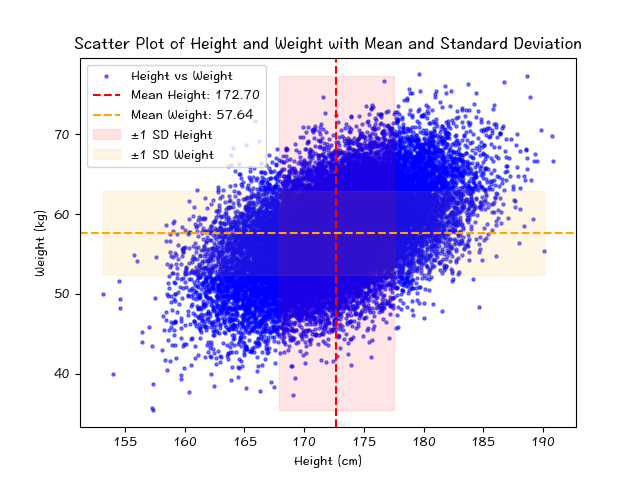
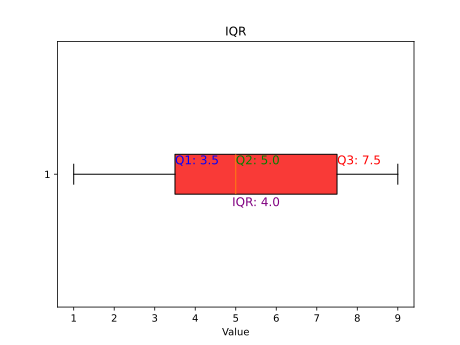
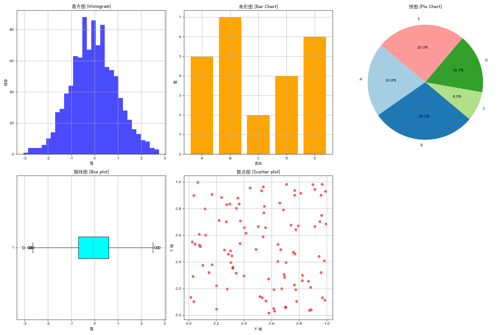
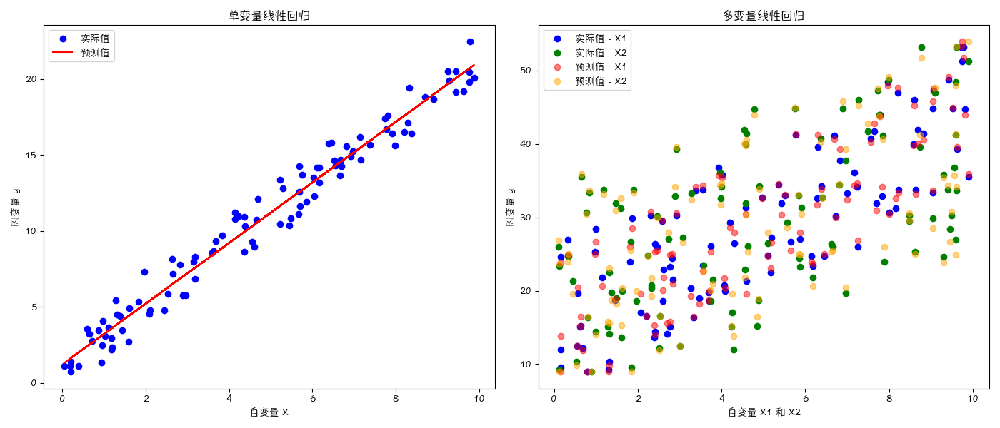
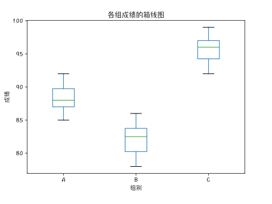
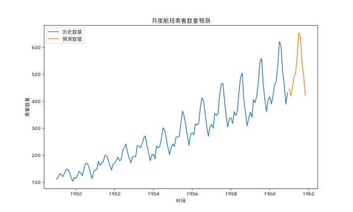

## 统计学 (一) - 概述 
统计学 (Statistic) 是一个广泛而复杂的领域，涉及许多重要的概念和方法。以下是统计学中的主要概念列表：


### 基本概念

1. **总体（Population）**：研究对象的全体。
2. **样本（Sample）**：从总体中抽取的部分数据。
3. **统计量（Statistic）**：从样本数据中计算得出的量。
4. **参数（Parameter）**：描述总体特征的数值。
5. **变量（Variable）**：研究对象的属性或特征。
   - **定量变量（Quantitative Variable）**：可以用数值表示，如身高、体重。
   - **定性变量（Qualitative Variable）**：表示类别或属性，如性别、颜色。

### 描述统计

（Descriptive Statistics）

#### 集中趋势

`集中趋势`（Measures of Central Tendency）是描述数据`分布中心位置`的统计量。它帮助我们了解`数据的中心`或`典型值`。

主要的集中趋势测量指标包括`均值`（Mean）、`中位数`（Median）和`众数`（Mode）。

##### 均值（Mean）

**定义**：均值是数据集中所有数值的`总和除以数据点的数量`，是数据的算术平均数。

**公式**：对于一个包含 $ n $ 个数值的数据集 $ x_1, x_2, \ldots, x_n $，均值 $ \mu $ 的计算公式为：
$ \mu = \frac{1}{n} \sum_{i=1}^{n} x_i $

**缺点**：对`极端值（outliers）敏感`，极端值会显著影响均值。

**例子**：假设有以下数据：$ 2, 3, 5, 7, 11 $ 则均值 $ \mu $ 为：$ \mu = \frac{2 + 3 + 5 + 7 + 11}{5} = \frac{28}{5} = 5.6 $

> $ \mu $ 的发音为 "mu"（/mjuː/）

##### 中位数（Median）

**定义**：中位数是将数据按`升序排列`后处于`中间位置的数值`。对于奇数个数据，中位数是中间的那个数；对于偶数个数据，中位数是中间两个数的平均值。

**计算步骤**：

1. 将数据按升序排列。
2. 确定中间位置的数值：
   - 如果数据个数 $ n $ 为奇数，中位数是第 $ \left(\frac{n+1}{2}\right) $ 个数。
   - 如果数据个数 $ n $ 为偶数，中位数是第 $ \left(\frac{n}{2}\right) $ 和第 $ \left(\frac{n}{2} + 1\right) $ 个数的平均值。

**优点**：

- `不受极端值影响`，能够更好地反映数据的中心位置。

**缺点**：

- 计算相对复杂，特别是对于大型数据集。

**例子**：假设有以下数据：

- 奇数个数据：$ 2, 3, 5, 7, 11 $，中位数为5（第三个数）。
- 偶数个数据：$ 2, 3, 5, 7, 11, 13 $，中位数为$ \frac{5 + 7}{2} = 6 $。

##### 众数（Mode）

**定义**：众数是数据集中出现`频率最高`的数值。

**特点**：

- 一个数据集中可以有一个众数、多个众数或没有众数。
- 对于分类数据，众数是唯一适用的集中趋势测量指标。

**优点**：

- 简单易理解。
- 能反映数据集中最常见的数值。

**缺点**：

- 不适用于所有数据集，特别是没有重复值的数据。
- 不能提供数据集的全面信息。

**例子**：假设有以下数据：$ 2, 3, 3, 5, 7, 11, 11 $ 则众数为3和11，因为它们都出现了两次，是频率最高的数值。

###### 应用

1. **均值的应用**：
   - 常用于衡量总体的平均水平，如`平均工资`、`平均成绩`等。
   - 适用于`对称分布数据`的描述。

2. **中位数的应用**：
   - 适用于描述`偏斜分布`的数据，如`家庭收入中位数`。
   - 在存在极端值时，中位数比均值更能反映数据的中心趋势。

3. **众数的应用**：
   - 常用于分类数据的分析，如`最常见的产品类型`、`最常见的疾病类型`等。
   - 在市场调查中，众数可以反映最受欢迎的选项。

###### 比较

- **均值 vs 中位数**：均值受到极端值影响，而中位数则不受影响。因此，在有极端值的情况下，中位数更能反映数据的中心位置。
- **均值 vs 众数**：均值适用于数值数据，而众数适用于分类数据。均值提供的是整体的平均水平，而众数提供的是数据中最常见的数值。
- **中位数 vs 众数**：中位数提供的是数据的中心位置，而众数提供的是数据中最常见的数值。在偏斜分布或有多个高频值的数据中，众数比中位数更具代表性。

#### 离散程度

**离散程度（Measures of Dispersion）**

##### 方差

`方差`（Variance）用于量化数据集的`分散程度`。它表示数据点与均值之间的平方差的平均值。

* 方差的值`越大`，数据的分散程度`越高`；
* 方差的值`越小`，数据的分散程度`越低`。

**定义**：方差表示数据点与总体均值之间的平方差的平均值。

**总体方差** (Population Variance)：总体中的 $N$ 个数据点 $x_1, x_2, \ldots, x_N$，总体方差 $\sigma^2$ 的计算公式为：

$ \sigma^2 = \frac{\sum_{i=1}^{N} (x_i - \mu)^2}{N}  $

- $\sigma^2$ 是方差。
- $N$ 是数据点的数量。
- $x_i$ 是第 $i$ 个数据点。
- $\mu$ 是均值。

**样本方差** (Sample Variance)：对样本计算方差，公式：$s^2 = \frac{1}{n-1} \sum_{i=1}^{n} (x_i - \bar{x})^2$。

计算中分母需要减一的原因是为了得到总体方差的`无偏估计`。这个减一的操作称为`贝塞尔校正`（Bessel's Correction）。它能够纠正样本方差作为总体方差估计时的系统性偏差，确保样本方差是总体方差的一个无偏估计。

**计算步骤**

假设有以下数据集：$2, 4, 4, 4, 5, 5, 7, 9$

1. 计算均值（Mean）：$ \bar{x} = \frac{2 + 4 + 4 + 4 + 5 + 5 + 7 + 9}{8} = 5 $
2. 计算每个数据点与均值的差值平方：
   $$
   \begin{align*}
   (2 - 5)^2 &= 9 \\\
   (4 - 5)^2 &= 1 \\\
   (4 - 5)^2 &= 1 \\\
   (4 - 5)^2 &= 1 \\\
   (5 - 5)^2 &= 0 \\\
   (5 - 5)^2 &= 0 \\\
   (7 - 5)^2 &= 4 \\\
   (9 - 5)^2 &= 16 \\
   \end{align*}
   $$
3. 计算这些差值平方的总和：$ 9 + 1 + 1 + 1 + 0 + 0 + 4 + 16 = 32 $
4. 计算样本方差（使用 $ n-1 $ 作分母）：$ s^2 = \frac{32}{8-1} = \frac{32}{7} \approx 4.57 $

##### 标准差

`标准差`（Standard Deviation）是用于量化数据集中`每个数值与均值之间`的`差异程度`。

标准差是对`方差开根号`，$\sigma = \sqrt{\frac{1}{N} \sum_{i=1}^{N} (x_i - \mu)^2}$。

**例子**：

下面是对包含了身高和体重的数据集图表，数据来源[这里](https://www.kaggle.com/datasets/burnoutminer/heights-and-weights-dataset?resource=download)。

它包含 25,000 名 18 岁不同人类的身高（英寸）和体重（磅）。该数据集可用于构建可以预测人类身高或体重的模型。

图表中，进行了单位的调整。



``` text
身高均值: 172.70
身高标准差: 4.83
体重均值: 57.64
体重标准差: 5.29
```

##### 极差
  
`极差`（Range）是用来表示一组数据中最大值与最小值之间的差距。计算极差的方法非常简单：从数据集中找出最大值和最小值，然后用最大值减去最小值即可。公式为：

$ \text{极差} = \text{最大值} - \text{最小值} $

例如，如果一组数据是 $3, 7, 2, 9, 5$，那么最大值是 9，最小值是 2，极差就是：$ 9 - 2 = 7 $

极差可以用来衡量数据的分散程度，但它对极端值（异常值）非常敏感。如果数据集中有极端值，极差可能会显得非常大，因此在实际应用中通常还会结合其他统计指标一同使用。

##### 四分位数间距

`四分位数间距`（Interquartile Range，`IQR`）用来衡量数据分布的`集中程度`和`分散程度`。它表示数据集中间 50% 的范围，减少了极端值的影响。

四分位数间距的计算步骤如下：

1. **排序**：将数据按从小到大的顺序排列。
2. **计算四分位数**：
   - 第一四分位数（Q1），也称为`下四分位`数，是排在第 `25%` 位置上的数据点。
   - 第三四分位数（Q3），也称为`上四分位`数，是排在第 `75%` 位置上的数据点。
3. **计算四分位数间距**：$ \text{四分位数间距} = Q3 - Q1 $

例如，如果一组数据为 $1, 3, 4, 5, 7, 8, 9$，则：

- Q1 = 3
- Q3 = 8

四分位数间距就是：$ \text{IQR} = 8 - 3 = 5 $

四分位数间距能够有效地描述数据的分散程度，尤其在有`异常值时，它比极差更稳定`。



##### 变异系数

变异系数（Coefficient of Variation，CV）是统计学中用来衡量数据集相对离散程度的一种指标。它表示标准差与平均值的比率，通常以`百分比形式表示`。

变异系数的计算公式为：$ \text{CV} = \frac{\text{标准差}}{\text{平均值}} \times 100\% $

变异系数具有以下特点：

1. **无量纲**：变异系数是一个无量纲量，消除了不同单位之间的影响，使得不同数据集的离散程度可以直接比较。
2. **适用于比例尺度**：变异系数特别适用于具有`比例尺度的数据`，因为它反映了数据的相对波动性。

下面是变异系数的计算示例：

假设一组数据为 $10, 20, 30, 40, 50$，计算其平均值和标准差：

- 平均值（Mean）：$ \mu = \frac{10 + 20 + 30 + 40 + 50}{5} = 30 $
- 标准差（Standard Deviation）：$ \sigma = \sqrt{\frac{(10-30)^2 + (20-30)^2 + (30-30)^2 + (40-30)^2 + (50-30)^2}{5}} = 14.14 $

变异系数：$ \text{CV} = \frac{14.14}{30} \times 100\% \approx 47.13\% $

在这个例子中，变异系数约为 47.13%，表示数据相对离散程度。CV 越高，表示数据的离散程度越大；CV 越低，表示数据的离散程度越小。

偏度和峰度是统计学中用来描述数据分布形状的两个重要指标。

##### 偏度

偏度（Skewness）是用来衡量数据分布的`对称性程度`的统计量。根据数据分布的偏斜方向，偏度可以分为三种类型：

1. **正偏（右偏，Positive Skewness）**：当数据的右尾比左尾长时，数据分布向右偏，偏度为正值。这意味着大部分数据集中在较低的数值范围内，极端高值拉长了右尾。
2. **负偏（左偏，Negative Skewness）**：当数据的左尾比右尾长时，数据分布向左偏，偏度为负值。这意味着大部分数据集中在较高的数值范围内，极端低值拉长了左尾。
3. **无偏（对称，Zero Skewness）**：当数据分布对称时，偏度接近于零。这意味着数据在平均值的两侧分布大致均匀。

偏度的计算公式为：$ \text{Skewness} = \frac{E[(X - \mu)^3]}{\sigma^3} $

其中，$ \mu $ 是`均值`，$ \sigma $ 是`标准差`，E 表示`期望值`。

##### 峰度

峰度（Kurtosis）是用来衡量数据分布的`尖峰程度`的统计量。峰度反映了数据分布的尾部重量和集中度。根据峰度值的大小，峰度可以分为三种类型：

1. **高峰态（Leptokurtic）**：当峰度值大于 3 时，数据分布比正态分布更尖锐，尾部较重。这表明数据集中在平均值附近，并且有更多的极端值。
2. **中峰态（Mesokurtic）**：当峰度值等于 3 时，数据分布与正态分布的尖锐程度相同。这表示数据分布的尾部与正态分布相似。
3. **低峰态（Platykurtic）**：当峰度值小于 3 时，数据分布比正态分布更平坦，尾部较轻。这表明数据分布较为平缓，极端值较少。

峰度的计算公式为：$ \text{Kurtosis} = \frac{E[(X - \mu)^4]}{\sigma^4} - 3 $

减去 3 是为了使正态分布的峰度值为 0，便于比较。

###### 示例

假设我们有一组数据，我们可以通过计算其偏度和峰度来了解其分布形状。

对于示例数据 $10, 20, 30, 40, 50, 60, 70, 80, 90, 100$，计算出的偏度和峰度如下：

- **偏度（Skewness）**：0.0
  - 这表明数据分布是对称的，没有明显的偏斜。

- **峰度（Kurtosis）**：-1.2242424242424241
  - 这个负值表明数据分布比正态分布更平坦（低峰态），尾部较轻，极端值较少。

这些统计量提供了数据分布形状的有价值信息，对于理解数据特征和选择适当的统计模型非常重要。

##### 图表



### 推断统计

（Inferential Statistics）

#### 抽样方法

抽样 (Sampling) 是从总体中选取部分个体或单位的过程，用以推断整个总体的特征。常见的抽样方法包括以下几种：

1. **简单随机抽样** (Simple Random Sampling)：每个个体都有相等的机会被抽取，通常通过随机数表或计算机生成随机数实现。
2. **系统抽样** (Systematic Sampling)：将总体中的个体按某种顺序排列，然后按照固定的间隔抽取。例如，从一个排好顺序的列表中每隔第k个抽取一个样本。
3. **分层抽样** (Stratified Sampling)：先将总体分成互不重叠的若干层，然后在每层中进行简单随机抽样。适用于总体中存在显著差异的情况。
4. **整群抽样** (Cluster Sampling)：将总体划分为若干个群组（或簇），然后随机抽取若干个群组，对这些群组内的所有个体进行调查。常用于地理分布广泛的总体。
5. **多阶段抽样**：结合多种抽样方法的一种抽样策略，通常分为多个阶段，每个阶段使用不同的抽样方法。例如，第一阶段使用整群抽样，第二阶段在抽中的群组中使用简单随机抽样。
6. **非概率抽样**：不基于随机选择的抽样方法，包括以下几种：
   - **方便抽样**：选择易于接触或获取的个体。
   - **判断抽样**：由调查者根据自己的判断选择样本。
   - **配额抽样**：根据某些预定的特征（如年龄、性别等）配额选择样本。
   - **滚雪球抽样**：初始样本中的个体推荐其他符合条件的个体，适用于难以接触的总体。

#### 估计理论

在统计学中，评估理论主要涉及对统计模型、预测、假设和实验结果的评估。以下是一些常见的统计学评估理论和方法：

##### 假设检验

**特点**：通过`检验样本数据`来`判断总体假设`是否成立。  
**步骤**：

- 提出原假设 $H_0$ 和备择假设 $H_1$。
- 选择适当的检验统计量（如t检验、z检验、卡方检验等）。
- 确定显著性水平（如0.05）。
- 计算p值或检验统计量。
- 根据p值或临界值做出决策（拒绝或不拒绝 $H_0$）。
**优点**：提供了一种系统的方法来判断数据是否支持假设。  
**缺点**：结果受样本大小和假设条件的影响较大。

##### 置信区间

**特点**：估计参数的区间范围，并附上置信水平。  
**步骤**：

- 计算样本统计量（如均值、比例等）。
- 选择置信水平（如95%）。
- 使用统计公式计算置信区间的上下限。
**优点**：提供了估计参数的范围，而不仅仅是一个点估计。  
**缺点**：置信区间的宽度受样本大小影响，较小的样本可能导致较宽的区间。

##### 模型评估

**特点**：评估统计模型的拟合优度和预测能力。  
**方法**：

- **交叉验证（Cross-Validation）**：将数据分为训练集和测试集，多次重复分割以评估模型的稳定性。
- **AIC/BIC**：使用赤池信息准则（AIC）和贝叶斯信息准则（BIC）评估模型的复杂度和拟合度。
- **R平方（$R^2$）**：衡量回归模型解释变异的能力。
- **残差分析**：通过残差图检查模型假设的合理性。
**优点**：可以全面评估模型的表现，帮助选择最佳模型。  
**缺点**：有时需要大量计算资源，模型选择可能受评估标准的影响。

##### 实验设计

**特点**：规划和分析实验以最优方式获取数据。  
**方法**：

- **完全随机设计**：所有处理组合随机分配给实验单位。
- **随机区组设计**：将实验单位分为若干组，组内随机分配处理。
- **因子设计**：研究多因素及其交互作用。
**优点**：提高实验效率，减少误差，提高结果的可靠性。  
**缺点**：设计和分析复杂，需要专业知识。

##### 参数估计

**特点**：估计总体参数，如均值、方差等。  
**方法**：

- **最大似然估计（MLE）**：找到使观测数据似然最大的参数值。
- **最小二乘估计（OLS）**：在回归分析中，找到使残差平方和最小的参数值。
**优点**：提供了系统的方法来估计参数。  
**缺点**：有时计算复杂，对模型假设敏感。

##### 功效分析

**特点**：评估实验设计的统计检验能力。  
**步骤**：

- 确定效应大小、显著性水平和样本大小。
- 计算检验的统计功效（1 - β）。
**优点**：帮助确定合适的样本量，增加结果的可信度。  
**缺点**：需要对效应大小有合理的预估。

##### 贝叶斯评估

**特点**：使用贝叶斯方法对参数进行估计和检验。  
**方法**：

- 通过先验分布和似然函数计算后验分布。
- 使用贝叶斯因子进行模型比较。
**优点**：能够结合先验信息，提供灵活的分析方法。  
**缺点**：计算复杂，对先验信息的选择较敏感。

这些评估理论和方法在统计学中广泛应用，选择合适的方法取决于具体的研究问题和数据特征。

#### 假设检验

假设检验是一种统计方法，用于根据样本数据来判断一个假设是否合理。以下是假设检验的基本步骤和关键概念：

##### 步骤

1. **提出假设**
   - **零假设 ($H_0$)**：通常表示没有效果或没有差异的情况。例如，某种药物对疾病没有影响。
   - **备择假设 ($H_1$ 或 $H_a$)**：表示存在效果或存在差异。例如，某种药物对疾病有影响。

2. **选择适当的检验统计量**
   - 根据数据类型和假设的性质选择合适的统计检验方法，如t检验、z检验、卡方检验等。

3. **确定显著性水平 ($\alpha$)**
   - 显著性水平是拒绝原假设的临界值，常用的显著性水平有0.05、0.01等。

4. **计算检验统计量和 p 值**
   - 计算样本数据对应的检验统计量。
   - 计算 p 值，即在原假设为真时，获得当前样本结果或更极端结果的概率。

5. **做出决策**
   - 比较 p 值和显著性水平。如果p值小于显著性水平，则拒绝原假设，否则不拒绝原假设。
6. **错误类型**

   `类型一错误`（Type I Error）：指在零假设为真时，错误地拒绝零假设的错误。类型一错误的概率通常用显著性水平 $\alpha$ 表示。例如，选择 $\alpha = 0.05$ 表示有5%的概率犯类型一错误。

   `类型二错误`（Type II Error）：指在备择假设为真时，错误地接受零假设的错误。类型二错误的概率通常用 $\beta$ 表示。减少类型二错误的一个方法是增加样本量。

##### 常见方法

###### 1. t 检验

用于比较两个样本均值是否显著不同。常见的t检验有：

- **单样本t检验**：用于检验一个样本均值是否与已知值不同。
- **独立样本t检验**：用于比较两个独立样本的均值。
- **配对样本t检验**：用于比较两个相关样本的均值。

###### 2. z 检验

用于样本量较大时的均值比较。常见的z检验有：

- **单样本z检验**：用于检验一个样本均值是否与已知值不同。
- **两样本z检验**：用于比较两个样本的均值。

###### 3. 卡方检验 (Chi-square Test)

用于检验分类数据的分布是否符合预期。常见的卡方检验有：

- **拟合优度检验**：用于检验一个样本的频数分布是否与期望的分布相符合。
- **独立性检验**：用于检验两个分类变量是否独立。

###### 4. 方差分析 (ANOVA)

用于比较三个或更多样本均值是否有显著差异。常见的方差分析有：

- **单因素方差分析**：用于比较一个因子的不同水平对结果变量的影响。
- **多因素方差分析**：用于比较多个因子的交互作用对结果变量的影响。

**示例**：单样本 t 检验

假设某研究人员想知道某种药物是否能显著降低血压。已知一般人群的`平均血压`为 `120 mmHg`。研究人员对一个服用药物的样本进行了测量，得到的：

- 样本均值：115 mmHg
- 标准差：10 mmHg
- 样本量：30

**步骤**：

1. **提出假设**：
   - **零假设 ($H_0$)**：$\mu = 120$（药物对血压没有影响）
   - **备择假设 ($H_1$)**：$\mu \neq 120$（药物对血压有影响）
2. **选择检验统计量**：使用单样本 t 检验。
3. **确定显著性水平 ($\alpha$)**：选择 0.05。
4. **计算检验统计量和p 值**：
   - 计算 t 统计量：$ t = \frac{\bar{x} - \mu_0}{s / \sqrt{n}} = \frac{115 - 120}{10 / \sqrt{30}} = -2.74 $
   - 查找 t 分布表或使用统计软件计算 p 值。
5. **做出决策**：
   - 如果p值 < 0.05，拒绝零假设，说明药物对血压有显著影响。
   - 如果p值 ≥ 0.05，不拒绝原假设，说明药物对血压没有显著影响。

假设检验提供了一种`系统的方法`来`检验假设`是否成立，通过严格的统计方法可以减少判断错误的概率。在实际应用中，选择合适的假设检验方法和步骤对于得到可靠的结论非常重要。

#### 回归分析

回归分析（Regression Analysis）是一种统计方法，用于`研究变量之间的关系`，尤其是一个或多个自变量（独立变量）对因变量（依赖变量）的影响。

在回归分析中，“回归”一词源自于统计学家`弗朗西斯·高尔顿`（Francis Galton）在 19 世纪末的研究。他在研究遗传学时发现，子女的身高往往会回归到父母身高的平均值附近，而不是无限增长或缩短。他称这种现象为“回归到平均值”（regression to the mean）。

因此，在统计学和数据分析中，“回归”指的是通过建立一个数学模型来描述两个或多个变量之间的关系，以便预测一个变量（因变量）在另一个变量（自变量）变化时的变化情况。

回归分析的核心思想：

1. **建立模型**：`找到一个数学函数`来描述自变量和因变量之间的关系。
2. **拟合数据**：使用现有的数据来`估计模型的参数`，使模型能够最好地描述这些数据。
3. **预测和解释**：`利用模型来预测新的数据`，并解释自变量对因变量的影响。

回归分析的目的：

1. **预测**：利用现有的数据来预测未来的结果。例如，利用历史销售数据来预测未来的销售额。
2. **解释**：理解和量化自变量对因变量的影响。例如，分析教育水平对收入的影响。
3. **控制**：通过调整自变量来控制因变量。例如，通过广告投入来控制销售额。

##### 线性回归

###### 单变量线性回归

`单变量线性回归`（Simple Linear Regression）用于研究一个自变量 $X$ 对因变量 $Y$ 的线性影响。模型形式为：$ Y = \beta_0 + \beta_1 X + \epsilon $

- $Y$ 是因变量。
- $X$ 是自变量。
- $\beta_0$ 是截距。
- $\beta_1$ 是斜率（自变量的系数）。
- $\epsilon$ 是误差项。

###### 多变量线性回归

`多变量线性回归`（Multiple Linear Regression）用于研究多个自变量 $X_1, X_2, ..., X_p$ 对因变量 $Y$ 的线性影响。

模型形式为：$ Y = \beta_0 + \beta_1 X_1 + \beta_2 X_2 + \cdots + \beta_p X_p + \epsilon $

- $Y$ 是因变量。
- $X_1, X_2, ..., X_p$ 是自变量。
- $\beta_0$ 是截距。
- $\beta_1, \beta_2, ..., \beta_p$ 是自变量的系数。
- $\epsilon$ 是误差项。



##### 非线性回归

`非线性回归`（Nonlinear Regression）用于研究因变量和自变量之间的非线性关系。模型形式不局限于线性关系，可以是多项式回归、指数回归、对数回归等。

##### 逻辑回归

逻辑回归（Logistic Regression）用于`分类问题`，特别是`二分类问题`，即因变量是`二元离散变量`（如 0 或 1 ）。

模型形式为：$ \log\left(\frac{p}{1-p}\right) = \beta_0 + \beta_1 X_1 + \beta_2 X_2 + \cdots + \beta_p X_p $

- $ p $ 是事件发生的概率，即 $ p = P(Y=1) $。
- $ \log\left(\frac{p}{1-p}\right) $ 是因变量的对数几率（log-odds）。
- $ X_1, X_2, \cdots, X_p $ 是自变量。
- $ \beta_0, \beta_1, \cdots, \beta_p $ 是回归系数。

逻辑回归使用的是逻辑函数（logistic function），将线性组合映射到 0 到 1 之间的概率：$ p = \frac{1}{1 + e^{-(\beta_0 + \beta_1 X_1 + \beta_2 X_2 + \cdots + \beta_p X_p)}} $


##### 回归系数的估计

回归系数的估计（Estimation of Regression Coefficients）常用的方法是`最小二乘法`（Ordinary Least Squares, OLS），其目的是最小化预测值与实际值之间差值的平方和。

##### 模型评估

- **R 平方 ($R^2$)**：衡量模型解释变异的比例，值越接近 1，说明模型拟合越好。
- **调整后的 R 平方**：调整自变量数量对 $R^2$ 的影响，适用于多变量回归。
- **F 检验**：检验整个模型是否显著。
- **t 检验**：检验每个自变量的系数是否显著。

##### 残差分析

通过分析残差（Residual Analysis）（实际值与预测值的差异），可以检查模型假设的合理性，如线性关系、同方差性和独立性。

##### 回归诊断

检查模型中的`异常点`（outliers）和`高影响点`（influential points），这些点可能对回归结果有较大影响。

##### 多重共线性

当自变量之间存在高度相关性时，可能会导致回归系数估计不稳定。可以通过`方差膨胀因子`（Variance Inflation Factor, VIF）来检测`多重共线性` (Multicollinearity)。

**示例**：单变量线性回归

假设我们有一组数据，研究一个人的学习时间（小时）对考试成绩的影响。数据如下：

| 学习时间（小时） | 考试成绩 |
|:---------------:|:-------:|
| 1               | 50      |
| 2               | 55      |
| 3               | 60      |
| 4               | 65      |
| 5               | 70      |

回归分析是统计学中非常重要的一部分，它不仅可以用于预测，还可以帮助我们理解变量之间的关系。不同类型的回归分析适用于不同的研究问题和数据类型，选择合适的方法对于得到准确的结论至关重要。

### 方差分析

方差分析（Analysis of Variance，简称 ANOVA）是一种统计方法，用于`比较多个组的均值是否存在显著差异`。

它通过分析数据的方差来检验各组之间是否有显著的均值差异。方差分析广泛应用于各类实验设计和数据分析中，特别是在比较多个样本或处理组时。

#### 基本原理

方差分析的核心思想是将总方差分解为两个部分：

1. 组间方差（Between-group variance）：反映不同组均值之间的差异。
2. 组内方差（Within-group variance）：反映同一组内个体的差异。

通过比较这两个方差的比例，可以判断组间差异是否显著。

#### 单因素方差分析（One-way ANOVA）

用于比较一个因素的多个水平（组）之间的均值是否存在显著差异。
$ Y_{ij} = \mu + \alpha_i + \epsilon_{ij} $

- $ Y_{ij} $ 是第 $i$ 组第 $j$ 个观测值。
- $ \mu $ 是总体均值。
- $ \alpha_i $ 是第 $i$ 组的效应。
- $ \epsilon_{ij} $ 是随机误差。

#### 双因素方差分析（Two-way ANOVA）

用于比较两个因素及其交互作用对因变量的影响。
$ Y_{ijk} = \mu + \alpha_i + \beta_j + (\alpha\beta)_{ij} + \epsilon_{ijk} $

- $ \alpha_i $ 是第一个因素的效应。
- $ \beta_j $ 是第二个因素的效应。
- $ (\alpha\beta)_{ij} $ 是两个因素的交互作用效应。

#### 重复测量方差分析（Repeated Measures ANOVA）

用于比较同一受试者在不同条件下的多个测量值之间的差异。

**步骤**：

1. **提出假设**
   - 原假设 ($H_0$)：各组的均值相等，即不存在显著差异。
   - 备择假设 ($H_1$)：至少有一组的均值不同。

2. **计算方差**
   - 计算组间方差和组内方差。
   - 组间方差：反映组与组之间的差异。
   - 组内方差：反映组内个体的差异。

3. **计算 F 值**
   - 通过 F 统计量来衡量组间方差与组内方差的比例。
   - F值计算公式：
     $ F = \frac{\text{组间方差}}{\text{组内方差}} $

4. **查找 F 分布表**
   - 根据自由度和显著性水平查找 F 分布表中的临界值。
   - 自由度：组间自由度（$df_{\text{between}} = k - 1$）和组内自由度（$df_{\text{within}} = N - k$）。

5. **做出决策**
   - 如果计算的F值大于`临界值`，则拒绝原假设，认为组间均值存在显著差异。
   - 如果计算的F值小于或等于临界值，则不拒绝原假设，认为组间均值不存在显著差异。

方差分析是一种强大的统计工具，用于比较多个组的均值是否存在显著差异。通过分析组间和组内的方差，可以判断自变量对因变量的影响。不同类型的方差分析适用于不同的实验设计和数据类型，选择合适的方法对于得到准确的结论至关重要。

**示例**：假设我们有三组学生的考试成绩，想要检验这三组学生的平均成绩是否存在显著差异。我们可以进行单因素方差分析。



根据方差分析结果，F值为 83.95，p 值为 2.5754201714537843e-12，表明三组学生的平均成绩存在显著差异（p 值远小于 0.05）。

### 时间序列分析

时间序列分析（Time Series Analysis）是一种统计方法，用于分析随时间变化的数据。它广泛应用于金融、经济学、气象学、市场分析等领域，帮助理解历史趋势、预测未来数据并做出决策。时间序列数据的关键特征是数据点按时间顺序排列，每个时间点的观测值通常依赖于之前的观测值。

**步骤**：

1. **数据预处理**
   - **数据清洗**：处理`缺失值`、`异常值`等。
   - **平稳性检测**：平稳时间序列的统计特性（如均值、方差）不随时间变化。
   - **去趋势和去季节**：消除趋势和季节性成分，使数据平稳。

2. **时间序列建模**
   - **自回归模型（AR）**：假设当前值由前几个时间点的值线性组合而成。
   - **滑动平均模型（MA）**：假设当前值由前几个时间点的误差项线性组合而成。
   - **自回归滑动平均模型（ARMA）**：结合AR和MA模型。
   - **自回归积分滑动平均模型（ARIMA）**：在ARMA模型基础上增加差分运算，以处理非平稳序列。

3. **模型评估和选择**
   - **AIC/BIC**：`赤池信息准则`（AIC）和`贝叶斯信息准则`（BIC）用于模型选择。
   - **残差分析**：检查模型的残差是否呈白噪声（随机性）。

4. **预测和验证**
   - 使用建立的模型进行预测，并与实际数据进行比较，验证模型的预测能力。

#### 常见模型

##### 1. 自回归模型（AR）

$ Y_t = \alpha + \beta_1 Y_{t-1} + \beta_2 Y_{t-2} + \cdots + \beta_p Y_{t-p} + \epsilon_t $。
其中，$Y_t$ 是时间 $t$ 的观测值，$\alpha$ 是常数项，$\beta_1, \beta_2, \cdots, \beta_p$ 是模型参数，$\epsilon_t$ 是误差项。

##### 2. 移动平均模型（MA）

$ Y_t = \mu + \epsilon_t + \theta_1 \epsilon_{t-1} + \theta_2 \epsilon_{t-2} + \cdots + \theta_q \epsilon_{t-q} $
其中，$\mu$ 是均值，$\theta_1, \theta_2, \cdots, \theta_q$ 是模型参数。

##### 3. 自回归滑动平均模型（ARMA）

结合 AR 和 MA 模型，用于平稳时间序列。
$ Y_t = \alpha + \beta_1 Y_{t-1} + \beta_2 Y_{t-2} + \cdots + \beta_p Y_{t-p} + \epsilon_t + \theta_1 \epsilon_{t-1} + \theta_2 \epsilon_{t-2} + \cdots + \theta_q \epsilon_{t-q} $

##### 4. 自回归积分滑动平均模型（ARIMA）

适用于非平稳时间序列，通过`差分`使其平稳。
$ \Delta^d Y_t = \alpha + \beta_1 \Delta^d Y_{t-1} + \cdots + \beta_p \Delta^d Y_{t-p} + \epsilon_t + \theta_1 \epsilon_{t-1} + \cdots + \theta_q \epsilon_{t-q} $

**示例**：月度航班乘客数量的预测



### 非参数统计

非参数统计（Nonparametric Statistics）是一种统计方法，它`不依赖于数据的具体分布假设`。与参数统计方法相比，非参数统计方法对数据的分布要求较少，

适用于处理非正态分布、离群值和小样本数据。非参数统计方法在数据不满足常规统计假设（如正态性、方差齐性）时非常有用。以下是一些常见的非参数统计方法及其应用场景：

#### 排序检验

排序检验（Rank Tests）

##### 单样本检验

- **符号检验（Sign Test）**：用于检验单个样本的中位数是否等于某个特定值。适用于样本数据的对称分布。
- **Wilcoxon 符号秩检验（Wilcoxon Signed-Rank Test）**：用于检验单个样本的中位数是否等于某个特定值。比符号检验更强大，因为它考虑了数据的秩。

##### 两样本检验

- **Mann-Whitney U 检验（Mann-Whitney U Test）**：用于比较两个独立样本的中位数是否相等。适用于两个独立样本。
- **Wilcoxon 秩和检验（Wilcoxon Rank-Sum Test）**：类似于Mann-Whitney U检验，用于比较两个独立样本。

##### 多样本检验

- **Kruskal-Wallis 检验（Kruskal-Wallis Test）**：用于比较三个或更多独立样本的中位数是否相等。是单因素方差分析（ANOVA）的非参数替代方法。
- **Friedman 检验（Friedman Test）**：用于比较三个或更多相关样本的中位数是否相等。是重复测量ANOVA的非参数替代方法。

#### 自由分布检验

自由分布检验（Distribution-Free Tests）

##### Chi-Square 检验

Chi-Square 检验（Chi-Square Test）用于检验分类变量的分布是否符合预期。包括拟合优度检验和独立性检验。

#### 非参数相关分析

##### Spearman 秩相关系数

秩相关系数（Spearman's Rank Correlation Coefficient）用于度量两个变量之间的单调关系。适用于非线性关系的数据。

##### Kendall’s Tau

用于度量两个变量之间的相关性，特别适用于有大量相同数值的数据。

### 生存分析

生存分析（Survival Analysis）是一种统计方法，用于分析和解释`时间到事件`的数据。

事件可以是任何感兴趣的事件，例如：死亡、疾病复发、机器故障等。生存分析不仅关注事件是否发生，还关注事件发生的时间。以下是生存分析的一些关键概念和常用方法。

#### 关键概念

1. **生存时间（Survival Time）**：从起始时间点到感兴趣事件发生的时间长度。
2. **删失数据（Censored Data）**：在研究期间未发生事件的个体。例如，在研究结束时仍然存活的个体。
3. **生存函数（Survival Function, $S(t)$）**：某个时间点后仍然存活的概率。
   $ S(t) = P(T > t) $
4. **风险函数（Hazard Function, $h(t)$）**：在某个时间点发生事件的瞬时风险率。
   $ h(t) = \lim_{\Delta t \to 0} \frac{P(t \leq T < t + \Delta t \mid T \geq t)}{\Delta t} $

#### 常用方法

1. **生存曲线估计**：
   - **Kaplan-Meier 估计（Kaplan-Meier Estimator）**：用于估计生存函数。
   - **Nelson-Aalen 估计（Nelson-Aalen Estimator）**：用于估计累积风险函数。

2. **对比生存曲线**：
   - **Log-Rank 检验（Log-Rank Test）**：用于比较两组或多组的生存曲线。

3. **回归模型**：
   - **Cox 比例风险模型（Cox Proportional Hazards Model）**：用于分析多个变量对生存时间的影响，假设各个变量对风险的影响是乘法性的。


**解释**:

1. **Kaplan-Meier 生存曲线**：展示了在不同时间点后存活的概率。通过观察生存曲线，可以直观地了解个体在不同时间点的生存情况。
2. **Cox 比例风险模型**：通过回归分析，评估多个变量对生存时间的影响。模型输出包括各变量的回归系数、标准误差、置信区间和显著性水平。

### 贝叶斯统计

贝叶斯统计（Bayesian Statistics）是一种基于贝叶斯定理的统计推断方法，强调通过先验知识和观察数据来更新对参数的信念。贝叶斯统计的核心思想是将概率解释为对不确定事件发生的主观信念程度。以下是贝叶斯统计的一些关键概念和常用方法。

#### 关键概念

1. **贝叶斯定理（Bayes' Theorem）**：
   贝叶斯定理描述了如何根据新的证据更新概率：$ P(\theta \mid D) = \frac{P(D \mid \theta) \cdot P(\theta)}{P(D)} $

   - $ P(\theta \mid D) $ 是后验概率（Posterior Probability），表示在观察到数据 $ D $ 后，参数 $ \theta $ 的概率。
   - $ P(D \mid \theta) $ 是似然函数（Likelihood），表示在参数 $ \theta $ 已知时，数据 $ D $ 出现的概率。
   - $ P(\theta) $ 是先验概率（Prior Probability），表示在观察数据 $ D $ 之前对参数 $ \theta $ 的信念。
   - $ P(D) $ 是边际似然（Marginal Likelihood），表示数据 $ D $ 的总体概率。

2. **先验分布（Prior Distribution）**：表示在观察数据之前，对参数的初始信念。
3. **后验分布（Posterior Distribution）**：结合先验分布和观测数据的似然函数，通过贝叶斯定理计算得出的参数分布。
4. **似然函数（Likelihood Function）**：给定参数值，观测数据的概率。

#### 常用方法

1. **贝叶斯点估计（Bayesian Point Estimation）**：使用后验分布的期望值、中位数或最众值作为参数的点估计值。

2. **贝叶斯区间估计（Bayesian Interval Estimation）**：使用后验分布的某个范围（通常是高密度区间，HDI）作为参数的不确定性范围。

3. **马尔可夫链蒙特卡罗（MCMC）方法**：通过采样方法近似计算后验分布。常用的MCMC方法包括Metropolis-Hastings算法和Gibbs采样。

4. **贝叶斯模型比较**：使用贝叶斯因子（Bayes Factor）来比较不同模型的优劣。贝叶斯因子是两个模型的边际似然比。

### 结果解释

1. **后验分布**：展示了参数（截距$\alpha$、斜率$\beta$和噪声$\sigma$）的后验分布。
2. **回归结果**：展示了数据点和从后验分布中采样的回归线，显示了模型对数据的拟合。

### 统计软件和编程

1. **R语言**
2. **Python（如 pandas、numpy、scipy、statsmodels 库）**
3. **SPSS**
4. **SAS**
5. **MATLAB**