## 编译原理 (一) - 概述 
### 编译

编译是将程序从一种语言翻译成另一种语言，或从一种形式翻译成另一种形式。

一些编译器生成`机器语言`，一些生成`汇编语言`，一些生成`更可移植的代码`，一些生成`抽象机器代码`。

编译原理是计算机科学领域的一个重要分支，它研究如何将高级编程语言或其他高级语言编写的源代码转换成计算机能够执行的机器代码的过程。

### 为什么要研究编译原理？

1. `深入理解编程语言`：研究编译原理可以帮助自己深入理解编程语言的内部工作原理。你将学习如何分析、解释和优化代码，这对于成为一名高级程序员或软件工程师至关重要；
2. `提高编码技能`：通过学习编译原理，会练习编写复杂的编译器前端和后端代码，这将增强自身编程技能。这些技能不仅对编译器开发有用，还可以在其他领域中派上用场；
3. `支持语言设计`：如果你对自己的编程语言或`领域特定语言`（DSL）感兴趣，了解编译原理将有助于你设计和实现自己的语言。这对于特定领域的问题建模和解决非常有帮助；
4. `优化性能`：编译原理通常涵盖了代码优化技术，这对于编写高性能的程序和系统非常重要。了解如何使程序在运行时更有效率；
5. `理解底层计算机体系结构`：编译原理涉及`计算机体系结构`和`机器码`生成，这有助于自己更好地理解计算机的底层工作原理；

### 编译阶段概述

`编译`指的是将程序员用某种`高级语言编写的源代码`转换成`目标代码`，即计算机能够认识的`可执行机器代码`。通常认为是由`高级程序设计语言`转成`汇编语言`或`机器语言`。

下面是编译的几个阶段：



其中，词法分析、语法分析、语义分析、中间代码生成等`分析部分`被称为编译器的`前端` (frond end)。而由代码生成器利用符号表和中间表示形式`综合` (synthesis) 起来生成目标代码的部分称为`后端` (back end)。

#### 1.词法分析

`词法分析` (lexical analysis) 是编译的第 1 个步骤。词法分析器的主要任务是读人源程序的输人字符、将它们组成`词素` (lexeme)，生成并输出一个`词法单元` (token) 序列。

`词法单元`形式：`<种别码，属性值>` (<token-name, attribute-value>)。第一个分量 `token-name` 是`语法分析`使用的`抽象符号`；第二个分量 `attribute-value` 指向`符号表`中关于当前词法单元的条目。

假设有一个源程序包含的赋值语句 `position = initial + rate * 60`，那么可以组合成如下词法单元：

1. `position` 词素映射成词法单元 `<id, 1>`。`id` 是表示`标识符` (identifier) 的抽象符号，`1` 指向`符号表`中 position 对应的条目；
2. `=` 词素映射成词法单元 `< = >`。该词法单元无需属性，所以忽略了第二个分量。当然也可以使用 `assign` 这样的抽象符号；
3. `initial` 词素映射成词法单元 `<id, 2>`；
4. `+` 词素映射成词法单元 `< + >`；
5. `rate` 词素映射成词法单元 `<id, 3>`；
6. `*` 词素映射成词法单元 `< * >`；
7. `60` 词素映射成词法单元 `< 60 >`。技术上来说，应该建立一个形如 <number, 4> 的词法单元，`4` 指向`符号表`中对应于整数 `60` 的条目。

经过词法分析后，形成词法单元序列：`<id, 1> < = > <id, 2> < + > <id, 3> < * > < 60 >`。

这个`词法单元`序列被输出到`语法分析器`进行语法分析。`词法分析器`通常还要和`符号表`进行交互。



当词法分析器`发现`了一个`标识符`的词素时，它要将这个词素`添加`到符号表中。在某些情况下，词法分析器会从符号表中`读取`有关标识符种类的信息，以确定向语法分析器传送哪个词法单元。

##### 词法分析的其它任务是什么呢？

* `过滤`掉源程序中的`注释`和`空白` (空格、换行符、制表符以及在输人中用于分隔词法单元的其他字符)；
* 将编泽器生成的`错误消息`与`源程序的位置`联系起来。例如，词法分析器可以负责记录遇到的换行符的个数，以便给每个`出错消息赋子一个行号`。在某些编译器中，词法分析器会建立源程序的一个拷贝，并将出错消息插人到适当位置。

| 词法单元 | 非正式描述| 词素示例
|--|--|--|
| if | 字符 i,f | if
| else | 字符 e, l, s,e | else
| comparison | ＜ 或 > 或 <= 或 = 或 == 或 != | <=, !=
| id | 字母开头的字母/数字串 | Pi, score, | D2
| number | 任何数字常量 | 3.14159, 0, 6.02023
| literal | 在两个 "之间，除" 以外的任何字符 | "core dumped"

##### 编程语言中的词法单元

|单词类型|种别|种别码|
|--|--|--|
|关键字|program、if、else、then、...|一词一码|
|标识符|变量名、数组名、记录名、过程名、...|多词一码|
|常量|整型、浮点型、字符型、布尔型、... |一型一码|
|运算符|算术 ( + - * / ++ --) <br> 关系 ( > < == != >= <=) <br> 逻辑 ( & \| ~ )|一词一码<br> 或 <br>一型一码|
|界限符|; () = {} ...|一词一码|

#### 2.语法分析

`语法分析`（syntax analysis）或`解析` (parsing) 是编译的第 2 个步骤。`语法分析器` (syntax analyzer) 使用由`词法分析器`生成的各个词法单元的 `token-name` 来创建`语法树` (syntax tree)。

```text
     =
    / \
<id,1> +
      / \
   <id,2> *
         / \
      <id,3> 60
```

#### 3.语义分析

`语义分析` (semantic analysis) 使用`语法树`和`符号表`中的信息来检查程序是否和`语言定义一致`。

程序设计语言可能允许某些类型转换，这被称为`自动类型转换` (coercion)。比如，一个`二元算术运算符`应用一个整数或一个浮点数，那么编译器可以把该整数转换成为一个浮点数。

##### 类型检查

语义分析的一个重要部分是`类型检查` (type checking)。比如，很多程序设计语言的定义中要求一个数组的下标必须是整数。如果用一个浮点数作为数组下标，编译器就**必须**报告错误。

语义分析器输出中有一个 `inttofloat` 的额外节点。`inttofloat` 明确地把它的整数参数转换一个浮点数。

```text
     =
    / \
<id,1> +
      / \
   <id,2> *
         / \
      <id,3> inttofloat
               \
               60
```

#### 4.中间代码生成

编译器可能构造出一个或多个中间表示。这些中间表示可以有多种形式。语法树是一种中间表示形式，它们通常在`语法分析`和`语义分析`中使用。

在源程序的语法分析和语义分析完成之后，很多编译器`生成一个明确的低级的或类机器语言的中间表示`。我们可以把这个表示看作是某个抽象机器的程序。该中间表示应该具有两个重要的性质：它应该易于生成，且能够被轻松地翻译为目标机器上的语言。

有一种称为`三地址代码` (three-address code) 的中间表示形式，它由一组类似于汇编语言的指令组成。

中间代码生成器输出是如下的三地址代码序列：

```text
t1 = inttofloat(60)
t2 = id3 * t1
t3 = id2 + t2
id1 = t3
```

三地址代码有几个特点：

1. 每个三地址赋值指令右部`最多`只有一个运算符，因此这些指令确定了运算完成的顺序；
2. 编译器应该生成一个`临时名字`以存放一个三地址指令计算得到的值；
3. 有些三地址指令的运算分量少于三个。

#### 5.代码优化

好的代码优化可以提高目标程序的运行效率而不会过多降低编译的速率。

上面的中间三地址代码通过优化器可以转换为更短的指令序列：

``` text
t1 = id3 * 60.0
id1 = id2 + t1
```

##### 代码优化的科学

现代处理器体系结构变得更加复杂，也有了更多改进代码执行方式的机会。在`编译器设计`中，`最重要的技能之一`是明确描述出真正要解决的问题的能力。

`编译器优化`必须满足下面的`设计目标`：

* 优化必须是正确的，也就是说，不能改变被编译程序的含义；
* 优化必须能够改善很多程序的性能；
* 优化所需的时间必须保持在合理的范围内；
* 所需要的工程方面的工作必须是可管理的。

#### 6.代码生成

代码生成器以源程序的中间表示形式作为输入，并把它映射到目标语言。如果`目标语言`是`机器代码`，那么就**必须**为程序使用的每个变量选择`寄存器`或`内存位置`。然后，中间指令被翻译成能完成相同任务的机器指令序列。

代码生成的一个至关重要的任务是`合理分配寄存器`以存放变量的值。

假如存在寄存器 `R1` 和 `R2`，那么上面的中间代码可以被翻译成如下机器代码：

``` text
LDF  R2,  id3
MULF R2,  R2, #60.0
LDF  R1,  id2
ADDF R1,  R1, R2
STF  id1, R1
```

* 每个指令的`第一个分量`指定了一个`目标地址`；
* 每个指令 `F` 告诉我们它处理的是`浮点数`；
* `LD` 表示加载 (load) 指令。`LDF R2, id3` 的意思是把 `id3` 中的内容加载到`寄存器 R2` 中；
* `MUL` 表示乘法 (multiply) 运算。`MULF R2,  R2, #60.0` 指的是把`寄存器 R2` 的值与浮点常数 `60.0` 相乘，并把结果存放到`寄存器 R2` 中；
* `ADD` 表示加法 (add)；
* `ST` 表示赋值。`STF id1, R1` 执行的指令是把`寄存器 R1` 中的值存放到 `id1` 的地址中区。

### 符号表管理

`编译器`的`重要功能`之一是`记录`源程序中使用的`变量名`，并收集和`每个名字的各种属性`有关的信息。这些属性可以提供一个名字的`存储分配`、`类型`、`作用域` (即在程序的哪些地方可以使用这个名字的值) 等信息。

对于`过程名字`，这些信息还包括：它的`参数数量和类型`、每个`参数的传递方式` (比如传值或传引用) 以及`返回类型`。

### 编译器构造工具

编译技术发展至今，人们创建了一些更加专业的工具来实现编译器的不同阶段。常用的编译器构造工具包括：

1. `语法分析器的生成器`：可以根据一个程序设计语言的`语法`描述自动生成`语法分析器`；
2. `扫描器的生成器`：可以根据一个语言的`语法单元`的`正则表达式`描述生成`词法分析器`；
3. `语法制导的翻译引擎`：可以生成一组用于`遍历分析树`并生成`中间代码`的例程；
4. `代码生成器的生成器`：依据一组关于如何把中间语言的每个运算翻译成为目标机上的机器语言的规则，生成一个`代码生成器`；
5. `数据流分析引擎`：可以帮助`收集数据流`信息，即程序中的值如何从程序的一个部分传递到另一部分。数据流分析是`代码优化`的一个重要部分；
6. `编译器构造工具集`：提供了可用于构造编译器的的不同阶段的例程的完整集合。

### 编译技术的应用

编译器技术并不只是关于编译的，编译器技术还有其它重要用途。

#### 高级程序设计语言的实现

`高级程序设计语言`编程比较容易，但比较低效，即目标程序运行较慢。使用`低级程序设计语言`的程序员能更多的控制一个计算过程，因此原则上来说，能产生更高效的代码。低级代码移植性差，容易出错且不易维护。

`优化编译器`包括了提高所生产代码性能的技术，因此弥补了因高层次抽象而引入的低效率。

`C 语言`是在 `20 世纪 80 年代`主流的系统程序设计语言；`20 世纪 90 年代`开始的很多项目则选择 `C++`；在 `1995 年`推出的 `Java` 很快在 `20 世纪 90 年代后期`流行起来。每一轮引入新的程序设计语言特征都会推动对编译器优化的新研究。

实践中，所有通用程序设计语言都支持用户定义的`聚合类型` (如数组和结构) 和`高级控制流` (如循环和过程调用)。如果直接翻译这些构造成为机器代码，得到的代码将会非常低效。`编译器优化`的一个组成部分称为`数据流优化`，它可以对程序的数据流进行分析，并`消除`这些构造之间的`冗余`。它们很有效，生成的代码和一个熟练的低级语言程序员所写的代码类似。

#### 针对计算机体系结构的优化

几乎所有的高性能系统都利用了两种技术：`并行` (parallelism) 和`内存层次结构` (memory hierarchy)。

并行表现在多个层次方面：

* 在`指令`层次上，多个运算可以被同时执行。这种并行性对程序员是无感知的；

  硬件动态的检测顺序指令流之间的依赖关系，并在可能的时候并行发出指令。有些情况下，机器包含一个硬件调度器。改变指令的顺序以提高程序的并行性。
  
  无论硬件是否对指令重排，`编译器`都可以对`指令进行重新排序`，使得指令级并行更加有效。

* 在`处理器`层次上，同`一个应用`的`多个不同线程`在`不同的处理器`上运行。

### 程序设计语言基础

#### 静态和动态的区别

在为一个语言设计一个编译器时，我们所面对的最重要的问题之一是编译器能够对一个程序做出哪些判定。

如果一个语言使用的策略支持编译器`静态决定`基个问题，那么我们说这个语言使用了一个`静态策略` (static policy)，或者说这个问题在`编译时刻` (compile time) 决定。另一方面，一个只允许在运行程序的时候做出决定的策略被称为`动态策略` (dynamic policy)，或者被认为需要在`运行时刻` (run time）做出决定。

##### 作用域

另一个问题是声明的`作用域` (scope)。$x$ 的一个声明的作用域是指程序的一个区域，在其中对 $x$ 的使用都指向该声明。

如果仅通过阅读程序就可以确定一个声明的作用域，那么这个语言使用的是`静态作用域` (static scope)，或者说`词法作用域` (lexical scope)。

否则，这个语言使用的是`动态作用域` (dynamic scope)。如果使用动态作用域，当程序运行时，同一个 $x$ 的使用会指向 $x$ 的几个声明中的某一个。

大部分语言使用 (C 和 Java) 静态作用域。

#### 静态作用域和块结构

`C 语言`的作用域规则是基于`程序结构`的，一个`声明的作用域`由该声明在程序中`出现的位置隐含地决定`。

稍后的语言比如`C++`、`Java` 和 `C#`， 也通过诸如 `public`、`private` 和 `protected` 等关键字来`显式地`控制作用域。

`块` (block) 是`声明`和`语句`的一个组合。`C 语言`使用 `{` 和 `}` 来界定一个块。

#### 动态作用域

对于一个名字 $x$ 的使用指向的是最近被调用但还没有终止且声明了 $x$ 的过程中的这个声明。

##### 例子

下面是个 C 预处理器中的宏扩展：

``` c
#define a (x+1)
int x = 2;
void b() { int x = 1; printf("%d\n", a);}
void c() { printf("%d\n", a)}
void main() {b(); c();}
// b() 输出 2
// c() 输出 3
```

`标识符` a 是一个表达了表达式 (x + 1) 的宏，但 x 到底是什么？我们不能静态地 (通过程序文本) 解析 x。

为了解析 x，我们检查所有当前活跃的函数调用，然后选择`最近`一个且具有对 x 的声明的函数。对 x 的使用就是指向这个声明。

参考资料

\> [https://www.bilibili.com/video/BV15J411M7j7?p=1&vd_source=af39da37b48042b538f2e6f4b7b2e7c8](https://www.bilibili.com/video/BV15J411M7j7?p=1&vd_source=af39da37b48042b538f2e6f4b7b2e7c8)

\> [http://www.cs.ecu.edu/karl/5220/spr16/Notes/Intro/compiler.html](http://www.cs.ecu.edu/karl/5220/spr16/Notes/Intro/compiler.html)
