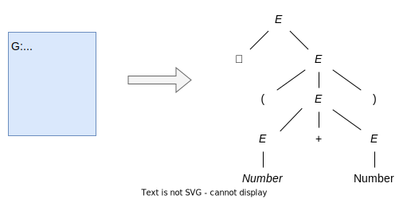
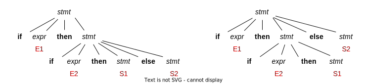

## 编译原理 (二) - 文法和分析 
第一部分讲过编译的前端部分的工作是`分析`，即分析词法、分析语法和分析语义，然后生成中间形式。本篇将介绍如何分析它们。

### 文法

文法是描述语言的语法结构的形式规则。在计算机科学中经常采用`上下文无关文法` (Context-Free Grammar, CFG) 来表示，它是一个种形式化的文法，用于描述一类语言。文法解决了语言无穷句子的有穷表示。

> 尽管`语法` (syntax) 和`文法` (grammar) 都涉及规则和结构，但`语法`通常更广泛地用于`自然语言学`，而`文法`通常更多地用于`形式语言理论`和`计算机科学`。`文法`可以被视为一种形式化的语法描述，用于定义特定语言的结构和规则。

例如下面是 Java 的 if-else 语句形式：

``` java
if (expression) statement else statement
```

如果用变量 stmt 表示语句，expr 表示表达式，那么这个构造规则可以表示为：

``` java
stmt -> if ( expr ) stmt else stmt
```

* 这样的`规则`被叫做`产生式` (production)；
* 像关键字 `if` 和 `()` 词素称为`终结符` (terminal symbol)；
* 像 `expr` 和 `stmt` 这样的`变量`称为`非终结符` (nonterminal symbol)。

> 终结符有时也被称为 token。

#### 文法定义

一个上下文无关文法由四个元素组成：

1. 一个`终结符`集合，它们有时也称为`词法单元`，第一篇文章介绍过对词法单元的描述。终结符是该文法所定义的语言的基本符号的集合；
2. 一个`非终结符`集合，它们有时也被称为`语法变量`。每个`非终结符`表示一个`终结符串集合`；
3. 一个`产生式`集合，其中每个产生式包括一个称为`产生式头`或`左部的非终结符号`，`一个箭头`，和一个称为`产生式体`或`右部的由终结符号及非终结符号组成的序列`。**产生式主要用来表示某个构造的某种书写形式**；
4. 指定一个`非终结符号`为`开始符号` (start symbol)。

#### 文法的形式化定义

为了方便后续对文法理解，我们使用 4 元组来形式化定义文法，它表示如下：

$ G = (V_T,\ V_N,\ P,\ S) $

* $V_T$：表示终结符集合(非空)
* $V_N$：表示非终结符集合(非空)，且 $V_T ∩ V_N = \varnothing$
* $P$：表示产生式集合(有限)
* $S$：表示开始符号

下面是一个简化版的用于表示算术表达式的文法：

$G=(\\{\text{Number},+,*,(,)\\} ,\\ \\{E\\},\\ P,\\ E)$

$\begin{align}
P=\\{&E → E+E,\newline
&E → E*E,\newline
&E → (E),\newline
&E → \text{Number} \\}\end{align}$

对于有相同产生式头部的可以简写如下：

$P\enspace  →\enspace  E+E \enspace|\enspace  E*E \enspace|\enspace  E \enspace|\enspace  \text{Number}$

右边部分称为 $P$ 的`候选式` (candidate)。

> 在书写产生式时，通常用`斜体`来表示`非终结符`。

#### 文法推导

文法`推导` (derivation) 是根据给定的`文法规则`，将一个起始符号（通常是语法分析的起点）推导为一个或多个`终结符号`的过程。

这个过程涉及到使用文法的`产生式`规则来逐步`展开或替换非终结符号`，直到得到一个由`终结符号组成的字符串`。



**推导**是编程语言解释和编译器中的**重要概念**。

##### 例子

下面是一个简化版本的英文文法：

1. <句子> -> <名词短语> <动词短语>
2. <名词短语> -> <形容词> <名词短语>
3. <名词短语> -> <名词>
4. <动词短语> -> <动词> <名词短语>
5. <形容词> -> little
6. <名词> -> boy
7. <名词> -> apple
8. <动词> -> eat

其中 `little`、`boy`、`apple`、`eat` 为终结符，而尖括号内容表示非终结符。

那么如果我们要验证 `little boy eats apple` 句子的语法是否正确，要如何推导的呢？

1.首先从开始符号 `<句子>` 出发，通过`产生式 2` 的 `<形容词> <名词短语>` 替换`产生式 1` 的 `<名词短语>` 得到：

``` html
<句子> => <形容词> <名词短语> <动词短语>
```

2.通过`产生式 5` 中的 `little` 替换 `<形容词>` 得到：

``` html
<句子> => little <名词短语> <动词短语>
```

3.通过`产生式 3` 中的 `<名词>` 替换 `<名词短语>` 得到：

``` html
<句子> => little <名词> <动词短语>
```

4.通过`产生式 6` 中的 `boy` 替换 `<名词>` 得到：

``` html
<句子> => little boy <动词短语>
```

5.通过`产生式 4` 中的 `<动词> <名词短语>` 替换 `<动词短语>` 得到：

``` html
<句子> => little boy <动词> <名词短语>
```

6.通过`产生式 8` 中的 `eat` 替换 `<动词>` 得到：

``` html
<句子> => little boy eats <名词短语>
```

这里我们把 eat 和 eats 当做同一个符号来看待。

7.通过`产生式 3` 中的 `<名词>` 替换 `<名词短语>` 得到：

``` html
<句子> => little boy eats <名词>
```

8.最后通过`产生式 7` 中的 `apple` 替换 `<名词>` 得到：

``` html
<句子> => little boy eats apple
```

这样我们便完成了从`开始符号`起，`非终结符`到`终结符串`的推导。从而说明了 `little boy eats apple` 符合文法规则，即语法正确。

而与之相反的由`终结符串`到`非终结符`的过程被叫做`规约`。



有了文法 (语言规则)，我们就可以从两个角度来**判定**`某一词串`是否是该语言的句子。

* 句子的`推导` (派生) - 从`生成`语言的角度
* 句子的`规约` - 从`识别`语言的角度

目前这种简单的句子，我们可以通过肉眼选择产生式来推导其文法是否正确。而在实际应用时，选择产生式的过程是由`语法分析器`根据`文法规则`使用`分析算法`来处理。

### 语法分析树

`语法分析树` (parse tree，也简称为语法树或分析树) 提供了更为直观的图形化方式展现了文法推导的过程。

我们来看下面的产生式及其分析树：



上下文无关文法的分析树有下面几个性质：

* `根结点`的标号 (label) 为文法的`开始符号`。结点可以带标号，通常是文法符号；
* `内部节点`的标号为一个`非终结符`。拥有`一个或多个子结点`的结点称为`内部结点`。当前内部结点为`产生式头`，而其子结点`从左到右`构成了`产生式体`；
* `叶子节点`的标号是一个`终结符`或 $ε$。

一颗分析树叶子结点从左向右构成了树的结果 (yield)，也就是从这颗树根结点开始`推导`得到 (或者说生成) 的字符串。所以上面分析树的结果是：$-(Number + Number)$

这里只是简单的介绍下分析树的特性。分析树的构建通常由`语法分析器`匹配并应用`文法规则`来构建的。

#### 文法二义性

`文法二义性`（grammar Ambiguity）指的是在上下文无关文法（Context-Free Grammar，CFG）中存在多个不同的推导方式（解析树或推导序列）来解释同一输入串的语法结构。换句话说，存在多个解释或解析路径，使得文法在某些情况下不确定如何解析特定的输入。

下面是一个具有二义性的文法：

$\begin{align}
stmt →&\ \text{if}\ expr\ \text{then}\ stmt \newline
|&\ \text{if}\ expr\ \text{then}\ stmt\ \text{else}\ stmt \newline
|&\ \text{other}  
\end{align}$

> $E$ 和 $S$ 的下标仅用于区分同一非终结符的不同出现，并不代表不同的非终结符。

上面的文法对于输出串： $\text{if}\ E_1\ \text{then if}\ E_2\ \text{then}\ S_1\ \text{else}\ S_2$ 具有两个分析树：



文法二义性是`编程语言设计`和`编译器开发`中`需要避免`的问题，因为它会导致解析过程的不明确性，使编译器无法准确地理解源代码，可能导致意想不到的行为或错误。

### 构建语法分析树

上面我们了解到分析树的结果 (yield) 可以用来验证一个字符串是否语法正确。而构建分析树的过程也是文法推导的过程。

每一步推导中，都需要做两个选择：

* 替换当前句型 (产生体) 中的`哪个非终结符`
* 用该非终结符的`哪个候选式`进行替换

因此，有`最左推导`和`最右推导`两种选择。

#### 最左推导

`最左推导` (left-most derivation) 总是选择每个句型的`最左非终结符`进行替换。与之相反的过程称为`最右规约`。



#### 最右推导

`最右推导` (right-most derivation) 总是选择每个句型的`最右非终结符`进行替换。与之相反的过程称为`最左规约`。


> 文法 $G$ 存在[左递归](/blog/complilers-2-basics/#左递归)的情况，在下面将会介绍如何处理左递归。

#### 自顶向下分析和自底向上分析

大多数语法分析方法都可以归入以下两类：`自顶向下分析` (top-down parsing) 和`自底向上分析` (bottom-up parsing)。其中，自顶向下分析是`较为受欢迎`的方法，因为它可以比较容易地手工构造出高效的语法分析。

自顶向下分析：从分析树的顶部 (`根结点`) 向底部 (`叶子结点`) 方向构建分析树。

自底向上分析：从分析树的底部 (`叶子结点`) 向顶部 (`根结点`) 方向构建分析树。

##### 推导方式选择

`自顶向下分析`和`最右推导`不是常见的组合，因为它们的目标和方法不太匹配。

`自顶向下分析`更适合使用`最左推导`，而`自底向上分析`更适合使用`最右推导`。选择分析方法取决于语法和分析需求。


### 语法分析

这里我们使用常见的自顶向下分析方式，来阐述如何实现语法分析器。

一般来说，为一个非终结符号`选择产生式`是一个“`尝试并犯错`”的过程。也就是说，我们首先选择一个产生式，并在这个产生式`不合适时`进行`回湖` (backtracking)，再尝试另一个产生式。一个产生式“`不合适`”是指使用了该产生式之后，我们无法构造得到一棵与当前输人串相匹配的语法分析树。

#### 递归下降分析法

所以，对于每个输入的终结符，每个非终结符都对应一个`递归函数`来尝试选择产生式进行试错，这些函数可以相互调用，直到达到文法规则的终结符 (叶子节点)。这种`自顶向下分析`采用`递归方式`的方法称为`递归下降分析` (recursive-descent parsing)。

下面是伪代码形式的选择一条产生式 A 的过程。

``` java
void A() {
  // 选择一个 A 产生式，A -> X₁X₂...Xₙ;
  for (i = 1 to k) {
    if (Xᵢ 是一个非终结符)
      调用过程 Xᵢ();
    else if (Xᵢ == 当前的输入的符号 a)
      读书下一个输入符号;
    else /* 发生了一个错误 */
  }
}
```

`每个过程`对应`一个非终结符`。$A$ 表示一个产生式的`过程`，$X$ 表示终结符，其中下标表示不同终结符。$A → X₁X₂...Xₙ$ 是一个产生式的一般表示。

> `过程`、`函数`和`方法`表达意思都较为类似，但在不同的领域都表示各自的常用术语。在编译理论里通常使用`过程`一词。

通常递归下降分析的算法复杂度是指数级的，所以为了提高语法分析性能，通常会对文法`进行预测`，来`避免回溯`，这种分析方式称为`预测分析法` (predictive parsing)。

`预测分析`是一种更一般的概念，它涵盖了一组技术，这些技术用于在语法分析中预测下一个分析动作（例如：移进、规约等）。`递归下降分析`是`预测分析的一个子集`，因为它使用预测方法来决定应该调用哪个分析函数来匹配输入。

#### 预测分析法

预测分析的目的是尽可能的避免回溯，以提高语法解析性能。下面是一个 C 或 Java 语句的一个子集。

$\begin{align}stmt →& \ \text{expr}\ ; \newline
|&\ \text{if}\ (\ \text{expr}\ )\ stmt\ \newline
|&\ \text{for}\ (\ optexpr\ ;\ optexpr\ ;\ optexpr\ )\ stmt \newline
|&\ \text{other} \end{align}$

$\begin{align}
optexpr →&\ ε \newline
|&\ \text{expr}
\end{align}$

文法中，终结符 `expr` 表示表达式，`stmt` 和 `optexpr` 为非终结符。当没有其他产生式可用时，将 $optexpr → ε$ 作为`默认产生式`使用。

对分析器输入中`当前`被扫描的`终结符`通常称为`向前看 (lookahead) 符号`。

下面是该语法的一个预测分析器的伪代码：

``` c
void stmt() {
   switch ( lookahead ) {
      case expr:
         match (expr); match(';'); 
         break;
      case if:
         match(if); match('('); match(expr); match(')'); stmt();
         break;
      case for:
         match(for); match('(');
         optexpr(); match(';'); optexpr(); match(';'); optexpr(); match(')'); stmt(); 
         break;
      case other:
         match(other); 
         break;
      default:
         report("syntax error");
   }
}
void optexpr() {
   if (lookahead == expr ) match(expr);
}

void match(terminal t) {
   if (lookahead == t) lookahead = nextTerminal;
   else report("syntax error");
}
```

假如我们有一条输入语句：`for ( ; expr ; expr) other`，那么对应上面代码的分析流程如下。

1. 分析开始时，首先调用文法`开始非终结符` $stmt$ 对应的过程。在处理输入时，`lookahead` 初始化为第一个终结符 `for`。
2. 执行产生式 $\text{for}\ (\ optexpr\ ;\ optexpr\ ;\ optexpr\ )\ stmt$ 对应过程的代码：

   ``` c
   match(for); match('(');
   optexpr(); match(';'); optexpr(); match(';'); optexpr(); 
   match(')'); stmt(); 
   ```

3. 分析器提供了一个过程 `match`，它将`参数`和`向前看符号` (lookahead) 比较，如果匹配就前进到下一个输入终结符。因此，match 改变了`全局变量` lookahead 的值。

#### 分析中可能的问题

##### 左递归

递归下降分析中可能会进入无限递归循环，比如出现`左递归` (left recursive) 的产生式时：$expr → expr + term$。

当进行最左推导时，每次替换都应用该产生式本身，而无法结束推导。这种含有 $A → Aα$ 形式的文法称为是`直接左递归` (immediate left recursive) 的。

`左递归`产生式的`一般形式`：$A → Aα\ |\ β$。

其中，$A$ 是非终结符，$α$ 和 $β$ 是不以 $A$ 开头的终结符/非终结符序列。

通过对左递归进行`推导`可以得到一个正则表达式的[克林闭包](/articles/regular-language/#kleene-星)：$r = βα^*$。

**Q：如何消除左递归？**

**A：左递归转换右递归。**

通常把`左递归`文法转换`右递归`形式的文法，简化语法分析的过程，它的一般表示形式：

$$A → βA'$$
$$A' → αA'\ |\ ε$$

> ` ' ` `单引号`标记的符号，用于指代产生式的`递归部分`。

左递归和右递归虽然在文法结构形式上不同，但它们可以`等效地`表示相同的语言。通过推导，右递归也可以用正则表达式：$r = βα^*$ 表示。

`左递归`每次`递归调用`发生在`未解析`的部分上。而`右递归`每次`递归调用`会在`已解析`的部分上进行，每一次调用都可以向前推进。所以直到输入空串递归就结束了，而不会无限循环。

##### 文法二义性

文法 $G$：$A\ →\ \text{α}β_1\ |\ \text{α}β_2$。

若输入的开头是从 $\text{α}$ 得到的一个`非空串`，那么我们将不知道将 $A$ 展开为 $\text{α}β_1$ 和 $\text{α}β_2$ 中的哪一个，因此产生了二义性。

**Q：如何解决文法二义性？**

**A：提取左公因子。**

`提取左公因子` (left factoring) 也是一种`文法转换`方法，它的解决思路是`推迟决定`，直到读入足够多的输入再做出正确的选择。

转换后文法 $G$：

$$\begin{align}
A& → \text{α}A' \newline
A&' → β_1\ |\ β_2
\end{align}$$

通过把公共前缀 $\text{α}$ 提取，用一个新的非终结符 $A'$ 来替换。从而将做出决定的时间往后延迟。在读入了从 $α$ `推导得到的输入后`，再决定将 $A'$ 展开为 $β_1$ 或 $β_2$。

#### FIRST 集和 FOLLOW 集

FIRST 集和 FOLLOW 集可以用来`构建语法分析表`，帮助`消除文法二义性`和`错误恢复`。

##### FIRST 集定义

对于文法中的一个`符号串` (可以是终结符、非终结符或二者的组合)，$FIRST(α)$ 是一个`终结符集合`。该集合由 $α$ 推导出的`终结符串`的`第一个符号`组成。

* 若 $α$ 是以`终结符开头`，那么 $FIRST(α)$ 就是只有这一个终结符的集合。
  
  例：$FIRST(\ \text{expr}\ ;\ ) = \lbrace \text{expr} \rbrace$

* 若 $α$ 是以`非终结符开头`并且该非终结符的所有`产生式体`都以某个终结符开头，那么  $FIRST(α)$ 就是这些开头的终结符的集合。

  例：$FIRST(\ stmt\ ) = \lbrace \text{expr},\ \text{if},\ \text{for},\ \text{other} \rbrace$

FIRST 集的`形式化定义`如下：

$FIRST(α) = \lbrace\  t\ |\ α\overset{\*}{\Rightarrow}tβ,\ t ∈ V_T,\ β ∈ (V_T ∪ V_N)^\*\ \rbrace$

其中 $\Rightarrow$ 表示文法中的`推导关系`，`*` 表示`零个或多个`。`t` 表示`输入的一个终结符`，$V_T$ 表示`终结符集合`。$V_N$ 表示`非终结符集合`。

##### FIRST 集计算

例：

$\begin{align}
&{\color{red}{①}} \ E → TE'           &FIRST(E) =&\ \\{ {\color{red}{\text{ (  id }}} \\} \newline
&{\color{green}{②}}\ E' → +TE'\ |\ ε   &FIRST(E') =&\ \\{ {\color{green}{\text{ +  ε }}} \\} \newline
&{\color{red}{③}}\ T → FT'           &FIRST(T) =&\ \\{ {\color{red}{\text{ (  id }}} \\} \newline
&{\color{green}{④}}\ T' → \*FT'\ |\ ε  &FIRST(T') =&\ \\{ {\color{green}{\text{ *  ε }}} \\} \newline
&{\color{green}{⑤}}\ F' → (E)\|\ \text{id}    &FIRST(F) =&\ \\{ {\color{green}{\text{ (  id }}} \\} \newline
\end{align}$

如果产生式右侧以`终结符`开头，那么直接把该`首字终结符`加入 FIRST 集中，例如：$\color{green}{②④⑤}$。

如果产生式右侧是 `ε` 空串，那么把 `ε` 加入到 FIRST 集中去，例如：$\color{green}{②④}$。

如果产生式右侧以`非终结符`开头，那么对把该非终结符对应的 FIRST 集的元素加入到当前 FIRST 集中去。如果依赖的 FIRST 集无元素，那么继续查下一个依赖的 FIRST 集直到找到包含元素的 FIRST 集。

所以它是一个不断应用产生式右侧的过程，直到没有新的`终结符`或 `ε` 可以被加入到任何 FIRST 集中为止。像 $\color{red}{①}$ 的 FIRST 集结果的计算关系是：⑤ → ③ → ①。

##### FOLLOW 集定义

FOLLOW 集描述了在语法分析过程中跟随（紧跟在）每个`非终结符`后面的符号，以指导语法分析器的`移进`、`规约`和`错误处理`操作。

FOLLOW(X)：对于文法 G 中的一个`非终结符` X，FOLLOW(X) 包含了可能`直接跟随` X 的`终结符`集合。形式化定义如下：

$ FOLLOW(A) = \\{\ \text{a}\ |\ S \overset{\*}{\Rightarrow}\ αA{\color{green}{\text{a}}}β,\ \text{a} ∈ V_T,\ α,β ∈ (V_T ∪ V_N)^*\ \\} $

其中，`S` 表示`开始符号`，$\color{green}{\text{a}}$ 表示`终结符`，$V_T$ 表示`终结符集合`，$V_N$ 表示`非终结符集`。

如果 $A$ 是产生式右侧`最右符号`，则将结束符 `$` 添加到 FOLLOW(A) 集里。

##### FOLLOW 集计算

参考资料

\> [https://www.bilibili.com/video/BV1dL4y1H7T8?p=8&vd_source=af39da37b48042b538f2e6f4b7b2e7c8](https://www.bilibili.com/video/BV1dL4y1H7T8?p=8&vd_source=af39da37b48042b538f2e6f4b7b2e7c8)

\> [https://www.csie.ntu.edu.tw/~b91066/slide3.pdf](https://www.csie.ntu.edu.tw/~b91066/slide3.pdf)
