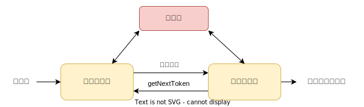

## 编译原理 
### 为什么要了解编译器

编译器涉及了计算机科学领域的很多方面：

* 高级和低级的编程范式；
* 上下文无关文法；
* 栈 (Stack)，链表，hash 表，图和树这些动态数据结构的应用；
* 计算机内存的访问和管理；
* 处理器架构包括 RISC (精简指令集)和 CISC (复杂指令集)，以及 CPU 寄存器寻址模式等等；
* 开发属于自己的高级编程语言以及配套的编译器；

### 编译阶段概述

`编译`指的是将程序员用某种`高级语言编写的源代码`转换成`目标代码`，即计算机能够认识的`可执行机器代码`。

下面是编译的几个阶段：

#### 词法分析

词法分析是编译的第一阶段。词法分析器的主要任务是读人源程序的输人字符、将它们组成`词素`，生成并输出一个`词法单元`序列，词法单元和词素`一一对应`。

这个词法单元序列被输出到语法分析器进行语法分析。`词法分析器`通常还要和`符号表`进行交互。

当词法分析器`发现`了一个`标识符`的词素时，它要将这个词素`添加`到符号表中。在某些情况下，词法分析器会从符号表中`读取`有关标识符种类的信息，以确定向语法分析器传送哪个词法单元。

##### 词法分析的其它任务是什么呢？

* `过滤`掉源程序中的`注释`和`空白` (空格、换行符、制表符以及在输人中用于分隔词法单元的其他字符)；
* 将编泽器生成的`错误消息`与`源程序的位置`联系起来。例如，词法分析器可以负责记录遇到的换行符的个数，以便给每个`出错消息赋子一个行号`。在某些编译器中，词法分析器会建立源程序的一个拷贝，并将出错消息插人到适当位置。

| 词法单元 | 非正式描述| 词素示例
|--|--|--|
| if | 字符 i,f | if
| else | 字符 e, l, s,e | else
| comparison | ＜ 或 > 或 <= 或 = 或 == 或 != | <=, !=
| id | 字母开头的字母/数字串 | Pi, score, | D2
| number | 任何数字常量 | 3.14159, 0, 6.02023
| literal | 在两个 "之间，除" 以外的任何字符 | "core dumped"

\> [https://www.bilibili.com/video/BV15J411M7j7?p=1&vd_source=af39da37b48042b538f2e6f4b7b2e7c8](https://www.bilibili.com/video/BV15J411M7j7?p=1&vd_source=af39da37b48042b538f2e6f4b7b2e7c8)
