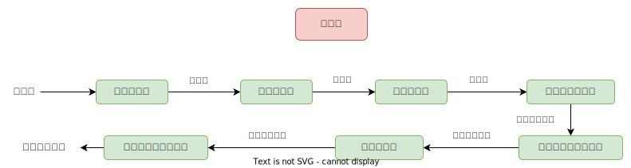

## 编译原理概述 
### 编译器

编译器将程序从一种语言翻译成另一种语言，或从一种形式翻译成另一种形式。

一些编译器生成`机器语言`，一些生成`汇编语言`，一些生成`更可移植的代码`，如 C 代码，一些生成`抽象机器代码`。

有些只是生成程序其他部分使用的数据结构，这就是你将开发的编译器类型。

### 为什么要研究编译器？

出于多种原因，研究编译器设计很有用。

1. 任何进行软件开发的人都需要使用编译器。了解使用的工具`内部发生的事情`是个好主意；
2. 编译器是`复杂的文本处理器`。大多数程序需要进行一些文本处理，即使只是读取配置文件的内容；
3. 对需要开发一种专用语言的大型项目是有用的软件设计技术，使项目易于实施；

   与用通用语言编写软件相比，花时间开发和实现一种小型专用语言并用该语言编写软件可以花费更少的时间和精力并获得更高质量的产品。

   一个例子是语言 `Erlang`，它是为编写控制数据开关的软件而设计的。`埃里克森`创建了一个数据交换机，其所有软件都是用 Erlang 编写的。他们声称每年每台交换机因软件错误而导致的停机时间在毫秒范围内。

   领域特定语言的发展有所增长。学习编译器可以让你设计和实现你自己的`领域特定语言`；
4. 编译器从对问题的仔细分析和执行该分析的工具中获益匪浅。对编译器设计的研究可以很好地了解如何以非临时方式分解和解决大问题；
5. 编译器设计使用了在其他地方很少见到的`形式化方法`。编译器的研究对`形式化方法`提供了一个温和的介绍；
6. 编译器学习提供了一个很好的机会来获得开发大型软件的经验。

### 编译阶段概述

`编译`指的是将程序员用某种`高级语言编写的源代码`转换成`目标代码`，即计算机能够认识的`可执行机器代码`。

下面是编译的几个阶段：

#### 词法分析

词法分析是编译的第一阶段。词法分析器的主要任务是读人源程序的输人字符、将它们组成`词素`，生成并输出一个`词法单元`序列，词法单元和词素`一一对应`。

这个词法单元序列被输出到语法分析器进行语法分析。`词法分析器`通常还要和`符号表`进行交互。

当词法分析器`发现`了一个`标识符`的词素时，它要将这个词素`添加`到符号表中。在某些情况下，词法分析器会从符号表中`读取`有关标识符种类的信息，以确定向语法分析器传送哪个词法单元。

##### 词法分析的其它任务是什么呢？

* `过滤`掉源程序中的`注释`和`空白` (空格、换行符、制表符以及在输人中用于分隔词法单元的其他字符)；
* 将编泽器生成的`错误消息`与`源程序的位置`联系起来。例如，词法分析器可以负责记录遇到的换行符的个数，以便给每个`出错消息赋子一个行号`。在某些编译器中，词法分析器会建立源程序的一个拷贝，并将出错消息插人到适当位置。

| 词法单元 | 非正式描述| 词素示例
|--|--|--|
| if | 字符 i,f | if
| else | 字符 e, l, s,e | else
| comparison | ＜ 或 > 或 <= 或 = 或 == 或 != | <=, !=
| id | 字母开头的字母/数字串 | Pi, score, | D2
| number | 任何数字常量 | 3.14159, 0, 6.02023
| literal | 在两个 "之间，除" 以外的任何字符 | "core dumped"

\> [https://www.bilibili.com/video/BV15J411M7j7?p=1&vd_source=af39da37b48042b538f2e6f4b7b2e7c8](https://www.bilibili.com/video/BV15J411M7j7?p=1&vd_source=af39da37b48042b538f2e6f4b7b2e7c8)

\> [http://www.cs.ecu.edu/karl/5220/spr16/Notes/Intro/compiler.html](http://www.cs.ecu.edu/karl/5220/spr16/Notes/Intro/compiler.html)
