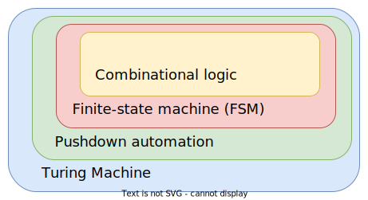

## 自动机理论 (Automata Theory) 基础 
### 简介

自动机理论是对抽象机 (abstract machines) 和自动机 (automata) 的研究，以及可以使用它们解决的计算问题。它是`理论计算机科学`中的一个理论。

自动机一词来自希腊语 αὐτόματος，意思是“自我行动、任性、自我行动”。自动机（复数自动机）是一种抽象的`自行式计算设备`，它自动遵循`预定`的操作顺序。状态数有限的自动机称为`有限自动机` (FA) 或`有限状态机` (FSM)。自动机系列可以用层次形式来解释，其中`有限状态机`是`最简单的`自动机，`图灵机`是`最复杂的`。

下图说明了有限状态机，这是一种众所周知的自动机类型。这个自动机包括`状态`（图中用圆圈表示）和`转换`（用箭头表示）。当自动机看到一个输入符号时，它会根据其`转换函数`转换（或跳转）到另一个状态，该函数将先前的状态和当前输入符号作为其参数。

`自动机理论`与`形式语言理论`密切相关。在这种情况下，自动机被用作可能是无限的形式语言的有限表示。自动机通常按它们可以识别的形式语言类别进行分类，如`乔姆斯基层次结构`，它描述了自动机主要类别之间的嵌套关系。自动机在`计算理论`、`编译器构造`、`人工智能`、`语法分析`和`形式验证`方面发挥着重要作用。

自动机 (Automata) 是机器的`抽象模型`，它通过`移动`一系列`状态`或`配置`来对输入 (inputs) 执行计算。在计算的每个状态，`转换函数`根据当前配置的`有限部分`确定下一个配置。因此，一旦计算达到`可接受的配置`，它就会接受该输入。最通用和最强大的自动机是`图灵机`。

### 形式定义

#### 自动机

一个自动机 (Automaton) 可以形式化地表示为一个 5-[元组](https://en.wikipedia.org/wiki/Tuple)(Tuple) ${\displaystyle M=\langle \Sigma ,\Gamma ,Q,\delta ,\lambda \rangle }$， 当：

* ${\displaystyle \Sigma}$ 是一个`有限的符号集合`，称为自动机的`输入字母表`；
* ${\displaystyle \Gamma }$ 是另一个`有限的符号集合`，称为自动机的`输出字母表`；
* ${\displaystyle Q}$ 是一个`状态集合`；
* ${\displaystyle \delta }$ 是`下一个状态函数`或`转移函数` ${\displaystyle \delta :Q\times \Sigma \to Q}$ 将`状态输入`对映射到`后继状态`，
* ${\displaystyle \lambda}$ 是`下一个输出函数` ${\displaystyle \lambda :Q\times \Sigma \to \Gamma }$ 将`状态输入`对映射到`输出`。
  
如果 ${\displaystyle Q}$ 是`有限的`，那么 ${\displaystyle M}$ 是一个`有限自动机`。

> 符号对应的英文译音：$\Sigma$ (Sigma)，$\Gamma$ (Gamma)，$\delta$ (delta)，$\lambda$ (lambda)。

#### 输入词

一个自动机读取`有限`符号 ${\displaystyle a_{1}a_{2}...a_{n}}$ 组成的字符串，当 ${\displaystyle a_{i}\in \Sigma }$，则这个字符串称为`输入词` (Input word)。所有`输入词`的`集合`用 ${\displaystyle \Sigma ^{*}}$ 表示。

#### 运行

一个状态序列 ${\displaystyle q_{0},q_{1},...,q_{n}}$，当 ${\displaystyle q_{i}\in Q}$ 并且 ${\displaystyle q_{i}=\delta (q_{i-1},a_{i})}$，其中 ${\displaystyle 0<i\leq n}$，则一个从状态 ${\displaystyle q_{0}}$ 开始的输入 ${\displaystyle a_{1}a_{2}...a_{n}\in \Sigma ^{*}}$ 为自动机的一次运行 (Run)。

换句话说，一开始自动机在初始状态 ${\displaystyle q_{0}}$，并接收输入 ${\displaystyle a_{1}}$。为了 ${\displaystyle a_{1}}$ 和每个接下来的 ${\displaystyle a_{i}}$ 处于输入字符串中，自动机会选择下一个状态 ${\displaystyle q_{i}}$ (根据`转移函数` ${\displaystyle \delta (q_{i-1},a_{i})}$ 获取)，直到最后一个符号 ${\displaystyle a_{n}}$ 被读取，使机器处于运行的最终状态 ${\displaystyle q_{n}}$。

类似地，每一步，自动机会根据`输出函数`发出一个`输出符号` ${\displaystyle \lambda (q_{i-1},a_{i})}$。

#### 接受器

为了用形式语言理论来研究自动机，可以将自动机看作一个`接受器` (Acceptor)，代替输出`字母表`和`函数` ${\displaystyle \Gamma }$ 和 ${\displaystyle \lambda }$：

* ${\displaystyle q_{0}\in Q}$, 一个指定的开始状态，和
* ${\displaystyle F}$，一个 ${\displaystyle Q}$ (i.e. ${\displaystyle F\subseteq Q}$) 的状态集合称为`接受状态`。

这允许定义以下内容：

#### 接受词

对于自动机的输入单词 ${\displaystyle w=a_{1}a_{2}...a_{n}\in \Sigma ^{*}}$，如果 ${\displaystyle {\overline {\delta }}(q_{0},w)\in F}$，换句话说，如果在消耗了整个字符串 ${\displaystyle w}$ 之后该机器仍然处于`可接受状态`，那么 $w$ 是一个接受词 (Accepting word)。

#### 已识别语言

语言 ${\displaystyle L\subseteq \Sigma ^{*}}$ 能被自动机识别，则由所有已被自动机接受的单词组成的集合被叫做已识别语言 (Recognized language)。

#### 可识别语言

可识别语言 (Recognizable languages) 是一些自动机识别的语言集合。对于`有限自动机`，可识别的语言是`正则语言` (Regular languages)。对于不同类型的自动机，可识别的语言是不同的。

### 确定性和非确定性

* 确定性：对于给定的当前状态和输入符号，如果自动机**只能**跳转到`一个`且只有一个状态，则它是`确定性自动机` (Deterministic Automaton)。
* 非确定性：一种自动机，在读取输入符号后，可能会跳转到`许多状态`中的`任何一个`，如其转换关系所许可的那样。请注意，术语`转换函数`被`转换关系`取代：自动机不确定地决定跳入允许的选择之一。这样的自动机称为`非确定性自动机` (Nondeterministic Automata)。

### 有限自动机

`有限自动机`如何成为`计算机科学的一个分支`的激动人心的历史说明了它的广泛应用。最早考虑有限状态机概念的人包括一组生物学家、心理学家、数学家、工程师和一些最早的计算机科学家。他们都有一个共同的兴趣：`模拟人类的思维过程`，无论是在大脑中还是在计算机中。

1943 年，两位神经生理学家 `Warren McCulloch` 和 `Walter Pitts` 率先提出了有限自动机的描述。自动机、计算理论和控制论。后来，两位计算机科学家 `GH Mealy` 和 `EF Moore`，在 1955-56 年发表的单独论文中将该理论推广到更强大的机器。有限状态机、Mealy 机和 Moore 机的命名是为了表彰他们的工作。Mealy 机通过当前状态和输入确定其输出，而 Moore 机的输出仅基于当前状态。

`有限自动机`在软件开发领域内通常被称作`有限状态机`（Finite State Machine），是一种应用非常广泛的`软件设计`模式。

有限自动机有`三种功能`：

* `序列转换器`：将输入序列变换为输出序列；
* `序列识别器`：识别输入的序列是否具有某种性质；
* `序列生成器`：生成具有所要求性质的序列。

#### 状态转换图

状态转换图 (State Transition Diagram) 是一个`有向图`，可以用它来表示有限自动机。图的`节点`表示`状态`，`边`表示`转换关系`。

下面是一张有限自动机的状态转换图：

其中`环形圆圈`表示为`接受状态` (accepting state)，$qº$ 是`起始状态`，`0` 和 `1` 表示自动机读取的`输入符号`。

### 应用

自动机理论中的每个模型都在几个应用领域中发挥着重要作用。`有限自动机`用于`文本处理`、`编译器`和`硬件设计`。`上下文无关文法`(CFG) 用于`编程语言`和`人工智能`。

最初，CFG 用于人类语言的研究。`元胞自动机`被用于`人工生命领域`，最著名的例子是`约翰康威的生命游戏`。其他一些可以用生物学中的自动机理论解释的例子包括软体动物和松果的生长和色素沉着模式。更进一步，一些科学家提倡一种理论，认为整个宇宙是由某种`离散自动机`计算的。这个想法起源于 Konrad Zuse 的作品，并由 Edward Fredkin 在美国推广。

自动机也出现在有限域理论中：`不可约多项式的集合`，可以写成二次多项式的组合，实际上是一种正则语言。可以使用自动机解决的另一个问题是`正则言的归纳`。

### 自动机模拟器

自动机模拟器是用于教授、学习和研究自动机理论的教学工具。自动机模拟器将自动机的描述作为输入，然后`模拟`其对`任意输入字符串`的工作。可以通过多种方式输入自动机的描述。自动机可以用`符号语言`定义， 或者可以以预先设计的形式输入其规格，或者可以通过单击和拖动鼠标来绘制其`转换图`。众所周知的自动机模拟器包括 Turing's World、JFLAP、VAS、TAGS 和 SimStudio。

参考资料：

\> [https://cs.stanford.edu/people/eroberts/courses/soco/projects/2004-05/automata-theory/basics.html](https://cs.stanford.edu/people/eroberts/courses/soco/projects/2004-05/automata-theory/basics.html)

\> [https://en.wikipedia.org/wiki/Automata_theory](https://en.wikipedia.org/wiki/Automata_theory)
