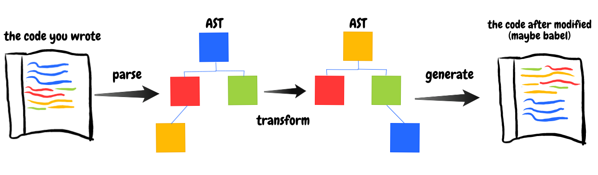
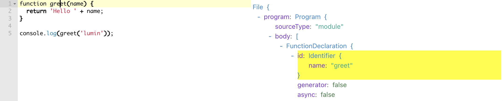
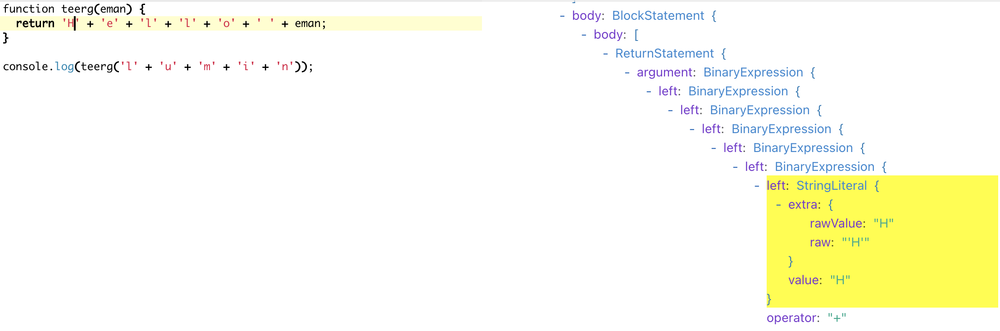
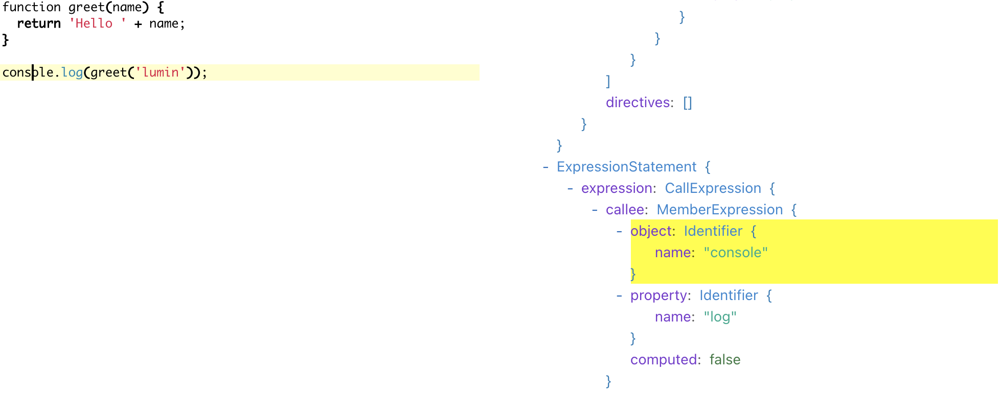

## 让我们一步一步得自定义 Babel 插件 
### 简介

Babel 是一款 javascript 的编译器，其主要工作是把 ECMAScript 2015+ 标准以上的代码向下兼容到当前的浏览器或环境。这直接带来的好处是可以采用更高版本的标准语法去编写代码，而无需考虑过多的环境兼容因素。

Babel 提供了[插件系统](https://babeljs.io/docs/en/plugins)，任何人都可以基于 babel 编写插件来实现自定义语法转换，这对于开发者来说是个福音。

而这一切的基础需要了解的一个概念：`语法树 (Abstract Syntax Tree)`，简称：`AST` 。

AST 表示的你的代码，对于 AST 的编辑等同于对代码的编辑，传统的编译器也有做同样工作的结构被叫做`具体语法解析树 (CST)`，而 AST 是 CST 的简化版本。

### 如何使用 Babel 转换代码

下面是个简单的转换例子：

``` javascript
import { parse } from '@babel/parser';
import traverse from '@babel/traverse';
import generate from '@babel/generator';

const code = 'const n = 1';

// parse the code -> ast
const ast = parse(code);

// transform the ast
traverse(ast, {
  enter(path) {
    // in this example change all the variable `n` to `x` 
    if (path.isIdentifier({ name: 'n' })) {
      path.node.name = 'x';
    }
  },
});

// generate code <- ast
const output = generate(ast, code);
console.log(output.code); // 'const x = 1;'
```

`解析 (parse)`-> `转换 (transform)`-> `生成(generate)`，三个明确的步骤完成代码转换操作。



> 你可以直接安装[@babel/core](https://www.npmjs.com/package/@babel/core)完成以上操作，*@babel/parser*、*@babel/traverse*、*@babel/generator* 都是 @babel/core 的依赖，所以直接安装 @babel/core 即可。

### 通过插件来实现转换

除了上面的方式，更为通用的做法是通过插件来实现：

``` javascript
import babel from '@babel/core';

const code = 'const n = 1';

const output = babel.transformSync(code, {
  plugins: [
    // your first babel plugin 😎😎
    function myCustomPlugin() {
      return {
        visitor: {
          Identifier(path) {
            // in this example change all the variable `n` to `x` 
            if (path.isIdentifier({ name: 'n' })) {
              path.node.name = 'x';
            }
          },
        },
      };
    },
  ],
});

console.log(output.code); // 'const x = 1;'
```

提取 `myCustomPlugin 函数` 到单独的文件，然后导出它作为[npm 包发布](/articles/npm/)，你就可以很自豪得说我发布一个 Babel 插件了，😁。

### Babel的AST如何工作的？

**1. 想做一些转换的任务**

我们做一次 code 的混淆转换，把变量名和函数名倒转，并把字符串做拆解相加，目的是降低代码可读性。

同时要求保持原有的功能，源码如下：

``` javascript
function greet(name) {
  return 'Hello ' + name;
}

console.log(greet('lumin'));
```

转换成：

``` javascript
function teerg(eman) {
  return 'H' + 'e' + 'l' + 'l' + 'o' + ' ' + eman;
}

console.log(teerg('l' + 'u' + 'm' + 'i' + 'n'));
```

这里我们依然需要保持 `console.log` 函数不变，因为要保持功能正常。

**2. 源码是如何表示成 AST**

你可以使用[babel-ast-explorer](https://www.lumin.tech/tools/babel-ast-explorer/#?eyJiYWJlbFNldHRpbmdzIjp7InZlcnNpb24iOiI3LjYuMCJ9LCJ0cmVlU2V0dGluZ3MiOnsiaGlkZUVtcHR5Ijp0cnVlLCJoaWRlTG9jYXRpb24iOnRydWUsImhpZGVUeXBlIjp0cnVlLCJoaWRlQ29tbWVudHMiOnRydWV9LCJjb2RlIjoiZnVuY3Rpb24gZ3JlZXQobmFtZSkge1xuICByZXR1cm4gJ0hlbGxvICcgKyBuYW1lO1xufVxuXG5jb25zb2xlLmxvZyhncmVldCgnbHVtaW4nKSk7In0=)工具来查看 AST 树，它表示成下面这样：



现在我们需要知道两个关键词：

* `Identifier` 用于记录`函数名`和`变量名`；
* `StringLiteral` 用于记录`字符串`；

**3. 转换后的 AST 又是如何呢**

通过[babel-ast-explorer](https://www.lumin.tech/tools/babel-ast-explorer/#?eyJiYWJlbFNldHRpbmdzIjp7InZlcnNpb24iOiI3LjYuMCJ9LCJ0cmVlU2V0dGluZ3MiOnsiaGlkZUVtcHR5Ijp0cnVlLCJoaWRlTG9jYXRpb24iOnRydWUsImhpZGVUeXBlIjp0cnVlLCJoaWRlQ29tbWVudHMiOnRydWV9LCJjb2RlIjoiZnVuY3Rpb24gdGVlcmcoZW1hbikge1xuICByZXR1cm4gJ0gnICsgJ2UnICsgJ2wnICsgJ2wnICsgJ28nICsgJyAnICsgZW1hbjtcbn1cblxuY29uc29sZS5sb2codGVlcmcoJ2wnICsgJ3UnICsgJ20nICsgJ2knICsgJ24nKSk7In0=)工具，我们可以看到转换后的 AST 结构：



**4. coding now !**

我们的代码会是长这样：

``` javascript {hl_lines=["3-6"]}
function myCustomPlugin() {
  return {
    visitor: {
      Identifier(path) {
        // ...
      },
    },
  };
}
```

AST 遍历方式使用的是[访问者模式](https://zh.wikipedia.org/wiki/%E8%AE%BF%E9%97%AE%E8%80%85%E6%A8%A1%E5%BC%8F)。

在遍历阶段，babel 会采用[深度优先搜索](https://zh.wikipedia.org/wiki/%E6%B7%B1%E5%BA%A6%E4%BC%98%E5%85%88%E6%90%9C%E7%B4%A2)来访问每个 AST 的节点 (node) ，你可以在 `visitor` 里上指定一个回调方法，当遍历到当前节点时会调用该回调方法。

在 `visitor` 对象上，指定一个 node 名来得到你想要的回调：

``` javascript
function myCustomPlugin() {
  return {
    visitor: {
      Identifier(path) {
        console.log('identifier');
      },
      StringLiteral(path) {
        console.log('string literal');
      },
    },
  };
}
```

运行之后，我们会得到一下日志输出：

``` bash
identifier
identifier
string literal
identifier
identifier
identifier
identifier
string literal
```

继续往下前，我们先了解 `Identifer(path) {}` 的参数 `path` 。

 `path` 表示两个节点之间连接的对象，包含了域 (scope) 、上下文 (context) 等属性，也提供了 `insertBefore`、`replaceWith`、`remove` 等方法来添加、更新、移动和删除节点。

**5. 转换变量名**

参考[babel-ast-explorer](https://www.lumin.tech/tools/babel-ast-explorer/#?eyJiYWJlbFNldHRpbmdzIjp7InZlcnNpb24iOiI3LjYuMCJ9LCJ0cmVlU2V0dGluZ3MiOnsiaGlkZUVtcHR5Ijp0cnVlLCJoaWRlTG9jYXRpb24iOnRydWUsImhpZGVUeXBlIjp0cnVlLCJoaWRlQ29tbWVudHMiOnRydWV9LCJjb2RlIjoiZnVuY3Rpb24gZ3JlZXQobmFtZSkge1xuICByZXR1cm4gJ0hlbGxvICcgKyBuYW1lO1xufVxuXG5jb25zb2xlLmxvZyhncmVldCgnbHVtaW4nKSk7In0=)工具，我们可以发现变量名存储在 `Identifer` 的 `name` 的里，所以我们可以直接反转 name 并重新赋值：

``` javascript
Identifier(path) {
  path.node.name = path.node.name.split('').reverse().join('');
}
```

运行之后，我们得到以下代码：

``` javascript
function teerg(eman) {
  return 'Hello ' + eman;
}

elosnoc.gol(teerg('lumin'));
```

显然我们不希望 `console.log` 发生改变，那如何保持它不变呢？

我们再次回到源码中 console 的 AST 表示方式：



可以看到 `console.log` 是 `MemberExpression` 的一部分，console 为对象 (object) ，而 log 为属性 (property) 。

于是我们做一些前置校验：

``` javascript
Identifier(path) {
  if (!(
      path.parentPath.isMemberExpression() &&
      path.parentPath.get('object').isIdentifier({ name: 'console' }) &&
      path.parentPath.get('property').isIdentifier({ name: 'log' })
    )
  ) { path.node.name = path.node.name.split('').reverse().join('');
 }
}
```

结果：

``` javascript
function teerg(eman) {
  return 'Hello ' + eman;
}

console.log(teerg('lumin'));
```

ok，看起来还不错。

**Q&A**

Q：我们如何知道一个方法是 `isMemberExpression` 或 `isIdentifier` 呢？

A：OK，Babel 的所有节点类型定义在被`@babel/types`里，通过 `isXxxx` 验证函数来匹配。例如：anyTypeAnnotation 函数会有对应的 `isAnyTypeAnnotation` 验证器，如果你想查看更多详细的验证器，可以查看[babel 源码部分](https://github.com/babel/babel/blob/master/packages/babel-types/src/validators/generated/index.js)。

**6. 转换字符串**

接下来做的是从 `StringLiteral` 里生成嵌套的`二元表达式` (BinaryExpression) 。

创建 AST 节点，你可以使用[@babel/types](https://babeljs.io/docs/en/babel-types)里的通用函数，`@babel/core`里的 `babel.types` 也可以是一样的：

``` javascript
// ❌代码尚不完整
StringLiteral(path) {
  const newNode = path.node.value
    .split('')
    .map(c => babel.types.stringLiteral(c))
    .reduce((prev, curr) => {
      return babel.types.binaryExpression('+', prev, curr);
    });

  path.replaceWith(newNode);
}
```

上面我们把节点的值 (path.node.value) 拆分成字节数组，并遍历创建 `StringLiteral`，然后通过二元表达式 (BinaryExpression) 串联 `StringLiteral`，最后把当前 `StringLiteral` 替换成新的我们建立的 AST 节点。

一切视乎没问题，但是我们却得到一个错误：

``` bash
RangeError: Maximum call stack size exceeded
```

为什么🤷‍？

A：因为我们创建 `StringLiteral` 之后，Babel 会去访问 (visit) 它，最后无限循环的执行导致栈溢出 (stack overflow) 。

我们可以通过 `path.skip()` 来告诉 babel 跳过对当前节点子节点的遍历：

``` javascript {hl_lines=[10]}
// ✅修改后的代码
StringLiteral(path) {
  const newNode = path.node.value
    .split('')
    .map(c => babel.types.stringLiteral(c))
    .reduce((prev, curr) => {
      return babel.types.binaryExpression('+', prev, curr);
    });
  path.replaceWith(newNode);
  path.skip();
}
```

**7. 最后完整代码**

``` javascript
const babel = require('@babel/core');
const code = `
function greet(name) {
  return 'Hello ' + name;
}
console.log(greet('lumin'));
`;
const output = babel.transformSync(code, {
  plugins: [
    function myCustomPlugin() {
      return {
        visitor: {
          StringLiteral(path) {
            const concat = path.node.value
              .split('')
              .map(c => babel.types.stringLiteral(c))
              .reduce((prev, curr) => {
                return babel.types.binaryExpression('+', prev, curr);
              });
            path.replaceWith(concat);
            path.skip();
          },
          Identifier(path) {
            if (
              !(
                path.parentPath.isMemberExpression() &&
                path.parentPath.get('object').isIdentifier({ name: 'console' }) &&
                path.parentPath.get('property').isIdentifier({ name: 'log' })
              )
            ) {
              path.node.name = path.node.name.split('').reverse().join('');
            }
          },
        },
      };
    },
  ],
});
console.log(output.code);
```

ok，这就是全部了！

### 深入的探索

如果你意犹未尽，[Babel 仓库](https://github.com/babel/babel/tree/master/packages)提供了更多转换代码的例子，它会是个好地方。

查找[https://github.com/babel/babel](https://github.com/babel/babel)里的 `babel-plugin-transform-*` 或 `babel-plugin-proposal-*` 目录，可以看到`空值合并运算符` (Nullish coalescing operator:??) 和`可选链操作符 (Optional chaining operator:?.)` 等提议阶段的转换源码。

还有一个[babel 的插件手册](https://github.com/jamiebuilds/babel-handbook/tree/master/translations/zh-Hans)，强烈建议大家去看看。

参考资料：

\> [https://github.com/jamiebuilds/babel-handbook/blob/master/translations/zh-Hans/plugin-handbook.md](https://github.com/jamiebuilds/babel-handbook/blob/master/translations/zh-Hans/plugin-handbook.md)

\> [https://lihautan.com/step-by-step-guide-for-writing-a-babel-transformation/](https://lihautan.com/step-by-step-guide-for-writing-a-babel-transformation)

\> [https://zh.wikipedia.org/wiki/访问者模式](https://zh.wikipedia.org/wiki/%E8%AE%BF%E9%97%AE%E8%80%85%E6%A8%A1%E5%BC%8F)

\> [https://zh.wikipedia.org/wiki/深度优先搜索](https://zh.wikipedia.org/wiki/%E6%B7%B1%E5%BA%A6%E4%BC%98%E5%85%88%E6%90%9C%E7%B4%A2)

\> [https://babeljs.io/docs/en/](https://babeljs.io/docs/en/)
