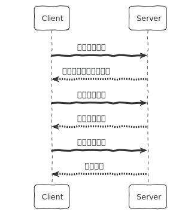

## 软件更新系统设计 
下面所说都将基于软件本身的更新设计，由软件开发者自行控制。这种设计通常会应用在`桌面端`、`移动原生端`、`小程序`或一些`混合应用` (Hybrid App)上，混合应用包括 `React Native`、`Cordova` 等等。而对于应用市场的更新机制不会涉及，因其更新控制权在操作系统或 App 商城软件上。

软件的更新是一个`基础应用`模块，因此它可以作为独立的功能模块而使用，意味着提供客户端的一个或多个(多个平台) `SDK` 和对应的一个 `Server` 便可以满足所有业务需求。

### 基本流程

下面是应用更新流程的基本时序图：

总体分为三个步骤：

1. 客户端请求服务器是否有可用更新。若存在可用更新，返回更新信息。通常包含当前版本号、提示用户更新的内容等等信息；否则，无需继续更新。
2. 下载更新文件。更新功能模块的文件可以是`全量文件`或`局部文件`。如果是局部文件，需要和本地的上一个版本文件进行`差异比对`来获取全量文件。
3. 告知服务器端已接收到文件，服务器端完成更新任务。

上面是整体的基本流程。除此之外，细节部分会包含更多的客户端和服务器端的通信过程。

### 更新方式

在更新方式上有`自动更新`和`手动更新`两种，它们在有以下一些特点：

1. **手动更新**：
   - 用户需要`手动触发更新`过程，通常通过在应用程序中查找更新选项来进行操作。
   - 用户有更多的控制权和选择权，可以`选择何时`进行更新以及`是否安装`特定的更新。
   - 通常需要用户的参与和操作，可能需要用户在更新过程中执行一些步骤，如确认更新、接受许可协议等。
   - 用户可以更灵活地管理更新，根据自己的需要和偏好来安排更新时间，避免在不方便的时间自动中断工作或使用。

2. **自动更新**：
   - 应用程序会在`后台自动检查`并`下载`可用的更新，并在适当的时候(通常在下次重启时)`自动安装`更新，不需要用户干预或手动触发。
   - 更新过程对用户来说更为便利，用户无需花费时间去查找和安装更新，系统会自动处理这些工作。
   - 自动更新可以确保用户及时获得最新的补丁和功能改进。

在移动应用中，自动更新次数要远多于手动更新。但手动更新也依然需要，因为业务在提及优势功能或者有重大更新时，更期望明确告知用户。

还有一种基本情况是当`更新体积过大`也需要及时提醒用户，以便用户有时间切换到 wifi 环境进行更新。相信任何一个用户都不期望昂贵流量被意外消耗。
