## 闭包 (Closure) 
### 定义

闭包在 MDN 上定义如下：

[闭包](https://developer.mozilla.org/zh-CN/docs/Web/JavaScript/Closures) (closure) 是一个函数以及其捆绑的周边环境状态（lexical environment，词法环境）的引用的组合。换而言之，闭包让开发者可以从`内部函数`访问`外部函数`的作用域。在 JavaScript 中，闭包会随着函数的创建而被同时创建。

emmmm.... what? 一般来说很难理解这种定义，因为有些术语是`编程语言理论`的一部分。所以下面会介绍一些其它内容来补全字面意思背后的定义。

当我们在讨论闭包时，它不仅仅是 JavaScript 这门语言里的独有实现，而是所有把函数作为`头等公民`的语言使用闭包这一技术的概念。这类语言有：`JavaScript`、`Python`、`Ruby`、`Haskell`、`Rust`、`Kotlin`、`Groovy`、`Swift` 等等。

值得一提的是 Java 语言本身不支持闭包的概念，但自 `Java 8` 以来，通过引入 `lambda 表达式`和`函数式接口`，Java 提供了类似闭包的功能。Lambda 表达式可以捕获并使用其定义时的环境变量，类似于其他编程语言中的闭包。

### 术语

在介绍闭包之前，先介绍有关`编程语言理论`里有关的术语：

* `标识符` (Identifier)：命名的`实体`的唯一`符号`。`实体`指的是`变量`、`数据类型`、`函数`和`模块`等等。

  ``` ts
  let a = 10;  // "a" 是一个标识符。
  function add() {}  // "add" 是一个标识符。
  class MyClass {}  // "MyClass" 是一个标识符。
  ```

* `声明` (Declaration)：声明用于定义一个`标识符`，并分配一个`存储位置`。
  
  ``` ts
  let a; // 声明了一个变量 a。即给 a 标识符指定一个内存位置。
  ```

* `名称绑定 (name binding)`：`实体`和`标识符`的关联。`程序运行之前`进行的绑定称为`静态绑定`，在程序运行时执行的名称绑定称为`动态绑定`。

* `词法作用域` (lexical scope)：也称为`静态作用域` (static scope)，在进行`静态名称绑`定时就确定的作用域。而程序运行时确定的作用域则称为`动态作用域` (dynamic scope)。

### 自由变量

`自由变量` (free variables) 在某个函数或表达式中被引用，但在该函数或表达式内部`未被绑定的变量`。换句话说，自由变量是在某个作用域内部引用但未在该作用域内定义的变量。

**特点**：

1. **未绑定**：自由变量在当前作用域内未被声明或定义。
2. **依赖于外部作用域**：自由变量的值取决于其被定义的外部作用域。
3. **可以是函数参数或外部变量**：自由变量可以是`函数参数`，也可以是`外部作用域`中的`变量`。

**示例**：

考虑下面的 Python 代码：

```python
def outer_function():
    x = 10
    def inner_function(y):
        return x + y
    return inner_function

closure = outer_function()
print(closure(5))
```

在这个例子中，`x` 是 `inner_function` 的自由变量。虽然 `x` 在 `outer_function` 中定义，但它在 `inner_function` 中被引用，且没有在 `inner_function` 内部定义。

因此，`x` 被视为自由变量，其值在 `inner_function` 被调用时由 `outer_function` 提供。

自由变量与绑定变量的区别：

* **自由变量**：在当前作用域内被引用但未在该作用域内定义的变量。
* **绑定变量**：在当前作用域内定义并且可以在该作用域内被引用的变量。

在某些上下文中，自由变量和绑定变量也被称为**自由标识符**和**绑定标识符**。

### 作用域规则和块语句

大部分语言 (例：C 和 Java) 使用静态作用域，也就是编译器在`编译期`就决定了实体环境。

作用域规则是基于程序结构的，一个`声明`的`作用域`由该声明出现的位置`隐含地`决定的，有些语言也通过 `public`、`private` 和 `protected` 等关键字`显式`控制。

#### 块语句

块 (block) 是一种语句，一个块包含一个`声明的序列`，然后再跟着一个`语句序列`。通常用花括号 `{}` 包围这些声明和语句。

块语法允许嵌套，这种嵌套特性称为`块结构` (block structure)。



``` ts
let a = 1;
let b = 1;
{
  let b = 2;
  {
    let a = 3;
    console.log('A:',a,b); // A: 3 2
  }
  {
    let b = 4;
    console.log('B:',a,b); // B: 1 4
  }
  console.log('C:',a,b); // C: 1 2
}
console.log('D:', a,b); // D: 1 1
```

### 词法环境

通常词法环境的极简定义是将其定义为`作用域中`所有`变量绑定`的集合，这也是任何语言中的闭包都必须捕获的内容。

在命令式语言中，变量绑定到内存中可以存储值的相对位置。尽管绑定的相对位置在运行时不会更改，但绑定位置中的值可以更改。在此类语言中，由于闭包捕获绑定，因此对变量的任何操作，无论是否从闭包完成，都在同一相对内存位置上执行。这通常称为“通过引用”捕获变量。

### 什么是闭包？

闭包也有时被叫做`词法闭包` (lexical closure) 或`函数闭包` (function close)，首先是闭包是在`编译期`对语言做`语义分析`时使用的`名称绑定`技术，再者该技术是`应用于函数`上的。

数据存储结构上闭包是将`函数`与声明该函数的`词法环境` (lexical environment) 一起存储的记录 (record)。

闭包的概念是在 `1960` 年代开发的，用于对 `λ 演算`中的表达式进行`机械计算`，并于 `1970` 年首次作为 `PAL` 编程语言中的`语言功能`全面实现，以支持`词法作用域`的`头等函数` (first-class function)。

### 支持闭包的编程语言

闭包是一种特性，使得函数能够捕获并存储其定义时的环境，从而在函数外部也能访问这些环境变量。许多现代编程语言都支持闭包，以下是一些主要的支持闭包的编程语言及其示例：

1. **JavaScript**：JavaScript 中的函数可以访问其定义时的环境，即使在函数外部调用时也能访问这些变量。

   ```javascript
   function outerFunction(x) {
       return function innerFunction(y) {
           return x + y;
       };
   }

   const closure = outerFunction(10);
   console.log(closure(5));  // 输出: 15
   ```

2. **Swift**：Swift 的闭包可以捕获和存储其定义时的变量。

   ```swift
   func outerFunction(x: Int) -> (Int) -> Int {
       return { y in
           return x + y
       }
   }

   let closure = outerFunction(x: 10)
   print(closure(5))  // 输出: 15
   ```

3. **Kotlin**：Kotlin 支持闭包，通过 lambda 表达式和匿名函数实现。

   ```kotlin
   fun outerFunction(x: Int): (Int) -> Int {
       return { y: Int -> x + y }
   }

   val closure = outerFunction(10)
   println(closure(5))  // 输出: 15
   ```

4. **Rust**：Rust 支持闭包，通过匿名函数和捕获环境变量实现。
  
   ```rust
   fn outer_function(x: i32) -> impl Fn(i32) -> i32 {
       move |y| x + y
   }

   let closure = outer_function(10);
   println!("{}", closure(5));  // 输出: 15
   ```

5. **Haskell**：Haskell 是一种纯函数式编程语言，闭包是其核心特性之一。

   ```haskell
   outerFunction :: Int -> (Int -> Int)
   outerFunction x = \y -> x + y

   main = do
       let closure = outerFunction 10
       print (closure 5)  -- 输出: 15
   ```

这些语言中的闭包具有以下`共同特性`：

1. **环境捕获**：闭包可以`捕获定义时`的`环境变量`，并在函数外部访问这些变量。
2. **持久化环境**：即使在定义闭包的作用域外，闭包仍然保持对环境变量的引用。
3. **高阶函数**：支持`高阶函数`，即`函数作为参数`传递给其他函数，或从其他函数返回。

闭包使得编程更加灵活，尤其在处理回调、事件处理、异步编程和函数式编程时，能够简化代码并提高代码复用性和可读性。

参考资料：

\> [https://en.wikipedia.org/wiki/Closure_(computer_programming)](https://en.wikipedia.org/wiki/Closure_(computer_programming))
