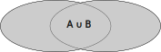
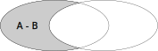
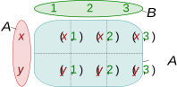

## 集合论 (Set Theory) 概念 
### 集合关系

| 关系类型  | 定义                                                       | 公式                                      | 示例                                           |
| -------- | ------------------------------------------------------------ | ---------------------------------------- | -------------------------------------------- |
| **子集**  |  | $ A \subseteq B $                      | $ \\{1, 2\\} \subseteq \\{1, 2, 3\\} $ or $ \\{1, 2,3\\} \subseteq \\{1, 2, 3\\} $        |
| **真子集**| 如果 $A$ 是 $B$ 的子集，且 $A$ 不等于 $B$           | $ A \subset B $                        | $ \\{1, 2\\} \subset \\{1, 2, 3\\} $          |
| **超集**  |   | $ A \supseteq B $                      | $ \\{1, 2, 3\\} \supseteq \\{1, 2\\} $        |
| **真超集**| 如果 $A$ 是 $B$ 的超集，且 $A$ 不等于 $B$           | $ A \supset B $                        | $ \\{1, 2, 3\\} \supset \\{1, 2\\} $ or $ \\{1, 2,3\\} \supseteq \\{1, 2, 3\\} $         |
| **交集**  |                     | $ A \cap B = \\{x \mid x \in A \text{ 且 } x \in B\\} $ | $ \\{1, 2, 3\\} \cap \\{2, 3, 4\\} = \\{2, 3\\} $ |
| **并集**  |                         | $ A \cup B = \\{x \mid x \in A \text{ 或 } x \in B\\} $ | $ \\{1, 2, 3\\} \cup \\{2, 3, 4\\} = \\{1, 2, 3, 4\\} $ |
| **差集**  |                   | $ A - B = \\{x \mid x \in A \text{ 且 } x \notin B\\} $ | $ \\{1, 2, 3\\} - \\{2, 3, 4\\} = \\{1\\} $     |
| **补集**  |                | $ A^c = \\{x \mid x \in U \text{ 且 } x \notin A\\} $ | $ \\{1, 2\\}^c = \\{3, 4\\} $                 |
| **笛卡尔积** | | $ A \times B = \\{(a, b) \mid a \in A \text{ 且 } b \in B\\} $ | $ \\{x, y\\} \\times \\{1, 2, 3\\} = \\{(x, 1), (x, 2), (x, 3), (y, 1), (y, 2), (y, 3)\\} $ |

#### 子集和超集 (Subset and Superset)

- **子集**：如果集合 $A$ 的所有元素都属于集合 $B$，则称集合 $A$ 是集合 $B$ 的子集，记作 $ A \subseteq B $。
- **真子集**：如果 $A$ 是 $B$ 的子集，且 $A$ 不等于 $B$，则称 $A$ 是 $B$ 的真子集，记作 $ A \subset B $。
- **超集**：如果 $A$ 包含集合 $B$ 的所有元素，则称 $A$ 是 $B$ 的超集，记作 $ A \supseteq B $。
- **真超集**：如果 $A$ 是 $B$ 的超集，且 $A$ 不等于 $B$，则称 $A$ 是 $B$ 的真超集，记作 $ A \supset B $。

**示例**：如果 $ A = \\{1, 2\\} $ 且 $ B = \\{1, 2, 3\\} $，则 $ A \subset B $ 和 $ B \supset A $。

#### 交集 (Intersection)

两个集合 $A$ 和 $B$ 的交集是指`同时属于` $A$ 和 $B$ 的元素组成的集合，记作 $ A \cap B $。

**公式**：$ A \cap B = \\{x \mid x \in A \text{ 且 } x \in B\\} $

**示例**：如果 $ A = \\{1, 2, 3\\} $ 且 $ B = \\{2, 3, 4\\} $，则 $ A \cap B = \\{2, 3\\} $。

#### 并集 (Union)

两个集合 $A$ 和 $B$ 的并集是指属于 $A$ 或 $B$ 的元素组成的集合，记作 $ A \cup B $。

**公式**：$ A \cup B = \\{x \mid x \in A \text{ 或 } x \in B\\} $

**示例**：如果 $ A = \\{1, 2, 3\\} $ 且 $ B = \\{2, 3, 4\\} $，则 $ A \cup B = \\{1, 2, 3, 4\\} $。

#### 差集 (Difference)

两个集合 $A$ 和 $B$ 的差集是指`属于` $A$ 但`不属于` $B$ 的元素组成的集合，记作 $ A - B $ 或 $ A \setminus B $。

**公式**：$ A - B = \\{x \mid x \in A \text{ 且 } x \notin B\\} $

**示例**：如果 $ A = \\{1, 2, 3\\} $ 且 $ B = \\{2, 3, 4\\} $，则 $ A - B = \\{1\\} $。

#### 补集 (Complement)

集合 $A$ 在全集 $U$ 中的补集是指`不属于` $A$ 而`属于` $U$ 的元素组成的集合，记作 $ A^c $ 或 $ \overline{A} $。

**公式**：$ A^c = \\{x \mid x \in U \text{ 且 } x \notin A\\} $

**示例**：如果 $ U = \\{1, 2, 3, 4\\} $ 且 $ A = \\{1, 2\\} $，则 $ A^c = \\{3, 4\\} $。

#### 笛卡尔积 (Cartesian Product)

两个集合 $A$ 和 $B$ 的笛卡尔积是指所有有序对 $(a, b)$ 的集合，其中 $a \in A$ 且 $b \in B$，记作 $ A \times B $。

**公式**：$ A \times B = \\{(a, b) \mid a \in A \text{ 且 } b \in B\\} $

**示例**：如果 $ A = \\{1, 2\\} $ 且 $ B = \\{x, y\\} $，则 $ A \times B = \\{(1, x), (1, y), (2, x), (2, y)\\} $。
